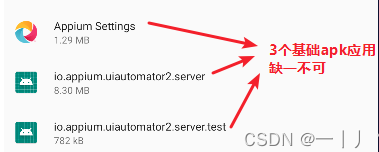
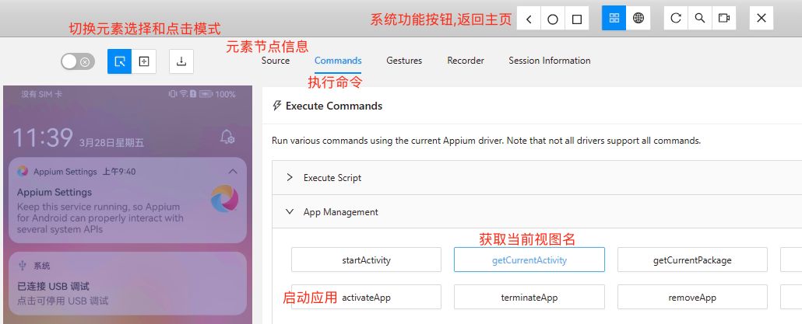

## 介绍

- [官网](http://appium.io/)
- 文档
    - [Appium文档](https://appium.io/docs/zh/latest/)
    - [Appium-Python-Client文档](https://appium.github.io/python-client-sphinx)
- Appium支持移动端、浏览器端、桌面端、电视端等的UI自动化
- Appium 的核心一个是暴露 REST API 的 WEB 服务器。它接受来自客户端的连接，监听命令并在移动设备（支持Android，iOS，H5）上执行，答复 HTTP 响应来描述执行结果
- 生态
    - 驱动: 不同的平台，需要不同的[驱动](https://appium.io/docs/zh/latest/ecosystem/drivers/)，如安卓使用 uiautomator2，IOS使用 xcuitest，MacOS使用 safari
    - 客户端: 用于编写和运行Appium脚本，如python客户端`pip install Appium-Python-Client`
    - 插件: 如`images`插件用于图像匹配和比较功能
    - 相关工具: `Appium inspector`用于手机元素定位，`Appium Doctor`用于环境检测
- 原理: Client(python代码) -> Appium服务端(Node程序) -> 设备端(与服务端通过USB调试或WIFI调试进行连接)

## 安装

- 需要安装Java JDK、Android SDK
- appium服务端安装(基于v2.17)

```bash
# v2.17.1，需要 node ^14.17.0 || ^16.13.0 || >=18.0.0
npm install -g appium

# 安装appium-doctor，用于检查环境是否满足appium运行要求
npm install appium-doctor -g
appium-doctor

# 安装 UiAutomator2 驱动(针对Android，其他平台安装对应驱动即可)
appium driver install uiautomator2

# 启动 appium 服务端
appium
```
- 手机界面元素定位工具
    - [Appium inspector](https://github.com/appium/appium-inspector)
    - ~~[Appium Desktop](https://github.com/appium/appium-desktop)~~ 已不再维护
    - uiautomatorviewer: Android SDK自带的工具，在`%ANDROID_HOME%\tools`目录下

## Appium-inspector获取软件及节点信息

- **连接设备**: 需要保证`adb devices`可以展示出设备信息，且状态为device
    - USB连接，多击系统版本号(如华为手机在关于手机中)跳出开启开发者选项，开启USB调试(如华为手机在系统和更新-开发人员选项-USB调试中开启)
    - 或者安装[夜神模拟器 v6.6.1.2](https://www.yeshen.com/)进行测试
        - `adb connect 127.0.0.1:62001` 连接夜神安卓模拟器监听端口
        - 一般需要保证模拟器版本和Android SDK的adb.exe版本一致，可将模拟器的adb.exe覆盖掉Android SDK的
- **启动Appium服务端**: 运行`appium`命令
- 使用 Appium inspector 连接设备
    - 设置 Capability Builder(如下)

    ```json
    {
        "platformName": "Android", // 必填, platformName定义为 Android | IOS
        "appium:automationName": "uiautomator2" // 必填
    }
    ```
    - 然后 Start Seesion 即可在 Appium inspector 中显示手机实时画面
        - 如果报错`appium-uiautomator2-server-debug-androidTest.apk' timed out after`：可进行手动安装，需要保证手机上成功安装3个应用（正常会自动安装，安装过就不会再自动安装），手动安装方法`adb install C:\Users\demo\.appium\node_modules\appium-uiautomator2-driver\node_modules\appium-uiautomator2-server\apks\appium-uiautomator2-server-debug-androidTest.apk`

        
- **Appium inspector使用**
    
    
- 获取deviceName设备名称
    - 如果是真机，在'设置->关于手机->设备名称'里查看，或者`adb devices -l`中model的值
    - 如果是模拟器，夜神模拟器为`127.0.0.1:62001`
- 获取appPackage和appActivity
    - 可在Appium inspector的 Commands - App Management - getCurrentActivity 获取
    - 对于apk包还可通过命令

```bash
#（%ANDROID_HOME%/platform-tools下运行）获取appPackage名（package: name=的值）和appActivity（launchable activity name=的值）
aapt dump badging D:/apk/com.youdao.calculator-2.0.0.apk # com.youdao.calculator 和 com.youdao.calculator.activities.MainActivity
```

## 案例

### 打开系统设置

- 连接设备参考上文(无需启动Appium服务端)
- 自动打开手机设置界面

```py
import uiautomator2 as u2

'''
1.手机USB调试连接上后, adb devices 可以查询到手机编号
2.启动后可自动打开手机设置界面
'''
devices = u2.connect('C7Y6R20221005753') # 手机编号, 或模拟器 127.0.0.1:62001
devices.app_start("com.android.settings")
devices.app_start("com.android.settings" , "com.android.settings.Settings")
```

### 打开系统设置的WLAN选项

- 连接设备参及启动Appium服务端考上文

```py
from appium import webdriver
from selenium.webdriver.common.by import By
from appium.options.android import UiAutomator2Options

# 定义desired_caps 字典，初始化app的配置信息
desired_caps = {
    "platformName": "android",  # 表示的是android
    "deviceName": "C7Y6R20221005753",  # 表示的是设备的ID名称
    "newCommandTimeout": 100000,
    "noReset": True,  # 用来记住app的session，如果有登陆或做过初始化的操作，为True时，后面不需要再操作
    "resetKeyboard": True,  # 重置设备的输入键盘
    "unicodeKeyboard": True  # 采用unicode编码输入
}
# 创建 Appium 驱动实例
driver = webdriver.Remote("http://localhost:4723", options=UiAutomator2Options().load_capabilities(desired_caps))

# 启动应用程序. 相当于执行了`mobile: activateApp`Mobile命令, 更多命令参考: https://appium.github.io/python-client-sphinx/webdriver.html#webdriver.mobilecommand.MobileCommand
driver.activate_app('com.android.settings')
# 等待5s直到app的界面名显示
driver.wait_activity('.Settings', 5)

# 点击WLAN选项
ele = driver.find_element(by=By.XPATH,
                              value='//android.widget.TextView[@resource-id="android:id/title" and @text="WLAN"]')
ele.click()

# 关闭驱动
driver.quit()
```

### 其他案例

- 案例：实现APP自动化测试，并生成测试报告。参考：https://blog.csdn.net/u013314786/article/details/105768650
- 在模拟器上安装测试[apk](https://github.com/lixk/apptest/blob/master/%E6%B5%8B%E8%AF%95apk/com.youdao.calculator-2.0.0.apk)
- 测试脚本参考[github](https://github.com/oldinaction/smpython/tree/master/D03TestAppium/test_appium)
  - 启动测试脚本也会连接模拟器，然后生成测试报告

## 语法

```py
## Mobile命令, 更多命令参考: https://appium.github.io/python-client-sphinx/webdriver.html#webdriver.mobilecommand.MobileCommand
# 获取手机分辨率
print(driver.get_window_size()) # {'width': 1080, 'height': 2340}

# 获取当前手机的网络类型. 1:飞行模式/2:WiFi/4:数据流量/6:全部网络
print(f"当前手机的网络类型是：{driver.network_connection}")

# 模拟键盘操作. 常用的三个键值 3:HOME键/4:返回键/66:回车键
driver.press_keycode(3)

# 打开手机通知栏
driver.open_notifications()

## 其他
# 获取手机截图. 路径必须手动创建, 文件名称必须是以PNG结尾
driver.get_screenshot_as_file("D:/tmp/appium/screenshot_" + str(time.time()) + ".png")
```

