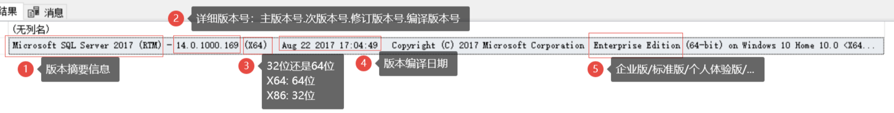

## 安装

### 版本介绍

- SQL Server数据库版本参考: https://blog.csdn.net/duanbeibei/article/details/128268149
- 查看已安装的版本`SELECT @@VERSION;`



```sql
-- 产品版本(常见如:2012,2016,2019,2022): 15.0.2000.5, 产品级别: RTM, 版本: Enterprise Edition(企业版本), 64位
-- v10=2008, v12=2014, v13=2016, v14=2017, v15=2019
Microsoft SQL Server 2019 (RTM) - 15.0.2000.5 (X64) 
    Sep 24 2019 13:48:23 
    Copyright (C) 2019 Microsoft Corporation
    Enterprise Edition (64-bit) on Windows Server 2019 Datacenter 10.0 <X64> (Build 17763: )
```
- 版本类型
    - 企业版 Enterprise Edition
    - 评估版 Evaluation Edition
    - 开发者版 Developer Edition
    - 标准版 Standard Edition
    - 体验版 Express Edition
    - 数据中心版 Data Center Edition
- 版本限制
    - 32位程序最多只能使用4GB内存
    - 企业版无限制(需购买证书)，评估版包含180天许可(功能同企业版)，开发版不能用于生产环境(功能同企业版)，体验版最多使用10GB磁盘空间
        - 通过虚拟机技术实现评估版本长期有效: https://blog.51cto.com/u_16175438/11941783
- 许可类型限制
    - 基于服务器+客户端访问许可证(CAL)的许可: 最多使用20核CPU
    - 基于内核的服务器许可: CPU使用无限制
        - 版本描述中包含`Core-based Licensing`的即是，其他为CAL许可
        - CAL许可的网上有升级步骤

### SQL Server 2019安装

- SQL Server 2019介绍
    - https://learn.microsoft.com/zh-cn/sql/sql-server/editions-and-components-of-sql-server-2019
    - https://www.microsoft.com/en-us/evalcenter/evaluate-sql-server-2019
- 2019下载安装包: https://www.cnblogs.com/mq0036/p/13500880.html
- 2019安装参考: https://www.jb51.net/database/3270133ua.htm
- 安装

```bash
# 下载安装包, 如: cn_sql_server_2019_enterprise_x64_dvd_2bfe815a.iso
# 右键 - 打开方式 - Windows资源管理器, 或者直接以zip包的模式进行解压
# 管理员方式运行 setup.exe
# 选择: 安装 - 全新SQL Server独立安装或向现有安装添加功能
# 选择: Developer版本, 具体参考上文
# 勾选: 数据库引擎服务、SQL Server复制、全文和语义提取搜索、Data Quality Services、Analysis Services、SQL 客户端连接SDK
# 选择: 身份验证模式 - 混合模式 - 输入sa账号密码如sa123456 - 添加当前用户
    # 如果有"SQLserver 和windows 身份验证模式"则勾选，没有则需要通过SSMS之后进行设置
# 安装成功后会注册一个服务 MSSQLSERVER

# 之后可在应用中搜索"SQL Server 2019 配置管理器"，打开后设置运行IP连接: SQL Server网络配置 - MSSQLSERVER的协议 - TCP/IP - 右键启用 - 重启服务 - Navicat即可使用`127.0.0.1,1433`进行连接
# 之后可在应用中搜索"SQL Server 2019 安装中心"，打开后可重新进入安装页面进行后续安装修改
```

### SSMS安装(SQL Server Management Studio)

- SSMS是SQL Server客户端；简单的增删改查也可使用Navicat等
- 连接使用
    - 服务器名称: 填写服务器电脑名称即可

## 常用操作

- 创建数据库
    - 排序规则如`Chinese_PRC_90_CI_AS`, 恢复模式`FULL`, 兼容级别`100`

## 管理员

### 连接数

```sql
-- 获取当前连接数
SELECT * FROM sys.dm_exec_sessions 
    WHERE is_user_process = 1 -- 仅统计用户进程
    and program_name = 'Microsoft JDBC Driver for SQL Server'; -- Java链接

-- 查看允许的客户端(如一个Java实例)最大连接数, 为0则表示不限制(可为服务器最大连接数)
select name, value, value_in_use from  sys.configurations where name = 'user connections';

-- 设置最大连接数
exec sp_configure 'user connections', 500; -- 设置为 500
reconfigure;

-- 查看SqlServer允许的最大连接数, 默认 32767
SELECT @@MAX_CONNECTIONS;
```

### 锁相关

- 参考
    - https://www.cnblogs.com/michaelshen/p/17079650.html

```sql
-- 查看锁表
select request_session_id "锁表进程", OBJECT_NAME(resource_associated_entity_id) "表名" 
from sys.dm_tran_locks where resource_type = 'OBJECT';

-- 解锁(不能在原来上锁的窗口操作，需重开一个窗口)
kill 57;

-- SQL Server在执行查询语句时会锁表，在锁表期间禁止增删改操作
-- 进行行级锁(需要有索引?)
select id from dbo.t_table with(rowlock) where id = 1;
-- 不加锁, 可能出现脏数据
select id from dbo.t_table with(nolock) where id = 1;
```

- transaction 手动事物

```sql
-- 当前会话开启 transaction
begin transaction;
-- with (rowlock)
select * from sys_company t where t.full_name is null;
-- 执行update前不会进行锁表
update sys_company set valid = '0' where full_name is null;
-- 如果执行了update, 一直不提交则会锁表; 此时基于普通字段无法查询, 基于id还是可以查询
commit transaction;
rollback transaction;
```

## 备份与恢复

- 参考: https://www.cnblogs.com/pandora2050/p/18285689

### SSMS备份与恢复

- 备份: 数据库 - 选择需要备份的数据库名称 - 右键"任务" - 备份 - 备份类型(完整)
- 还原: 数据库 - 右键"还原数据库" - 常规 - 确定即可
    - 常规
        - 源选择"设备 - 文件 - 添加BAK备份文件"
        - 目标选择已有数据库(会进行覆盖)或输入新的数据库名
    - 选项: 可能需要勾选"覆盖现有数据库"

