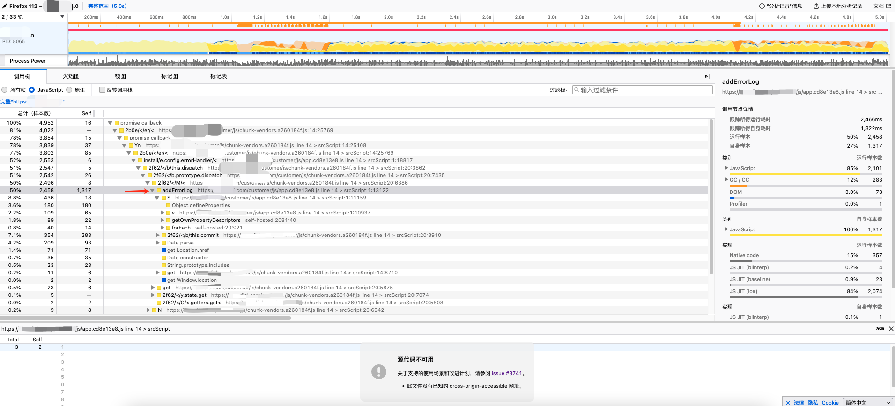
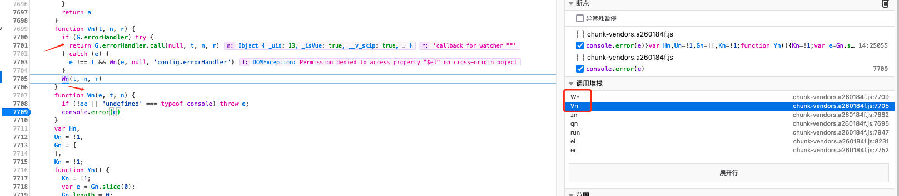

## 浏览器版本介绍

- 浏览器控制台执行`navigator`，或者访问`http://www.w3school.com.cn/tiy/t.asp?f=jseg_browserdetails`可查看浏览器版本信息(js获取示例)
- `Windows NT 10.0; WOW64` win10 64位系统； `Windows NT 6.3` 为win8； `Windows NT 5.1` 为win xp
- `Chrome/67.0.3396.10`为谷歌浏览器版本；`Firefox/60.0` 为火狐版本；`rv:11.0`为IE更新版本
- 常见浏览器版本举例
    - 谷歌 `Mozilla/5.0 (Windows NT 10.0; WOW64) AppleWebKit/537.36 (KHTML, like Gecko) Chrome/67.0.3396.10 Safari/537.36`
    - 火狐 `Mozilla/5.0 (Windows NT 6.3; Win64; x64; rv:60.0) Gecko/20100101 Firefox/60.0`
    - IE `Mozilla/5.0 (Windows NT 10.0; WOW64; Trident/7.0; .NET4.0C; .NET4.0E; .NET CLR 2.0.50727; .NET CLR 3.0.30729; .NET CLR 3.5.30729; rv:11.0) like Gecko`
- 谷歌已于2016年4月15日停止支持WindowsXP、WindowsVista，对应最后版本`v49.0.2623.112`

## chrome插件收集

- 插件导入导出
    - 插件安装位置
        - Mac: `cd ~/Library/Application\ Support/Google/Chrome/Default/Extensions/`
        - Windows: `C:\Users\用户名\AppData\Local\Google\Chrome\User Data\Default\Extensions`
    - 导出: 开发者模式下点击打包扩展程序，选择某插件(根据插件ID到安装位置查找)的对应版本。打包成功后，会将生成的文件放到与版本号一致的同级目录
    - 导入: 导入之前打包的插件
- 插件网站
    - https://www.crxsoso.com/
- 必备
    - `谷歌访问助手`
    - `AdBlock` 广告拦截
    - `Tampermonkey` 油猴脚本。相关脚本：https://greasyfork.org/zh-CN/scripts
    - `IDM Integration Module` IDM下载
    - `OneTab`
    - `WeTab` 标签管理
    - `有道词典Chrome划词插件`
    - `JSONView` 将Http请求获取的json字符串格式化(可收缩)
    - `Vue.js devtools` Vue.js调试工具
    - `Console Importer` 在调试模式中快速导入js库到当前页面
    - `ModHeader` 网页资源代理插件，如将网页中的js资源代理成本地的某个js，可用于js库开发调试(如lowcode-engine)
- 推荐
    - `Evernote Web Clipper` 印象笔记·剪藏
    - `新浪微博图床`
    - `Secure Shell` ssh客户端
    - `Postman` Http请求客户端
    - `Selenium IDE` 自动化测试录制
    - `Axure RP Extension for Chrome` Axure设计
    - `Set Character Encoding` 解决chrome查看源码乱码问题
    - `OCR - Image Reader` 图片识别
    - `Downloads Overwrite Already Existing Files` 重名文件下载提示是否覆盖(默认是创建一个带序号的文件)，文件另存为
- Github相关
    - `SourceGraph` 基于目录显示文件，类之间的跳转，代码搜索等功能
    - `Octotree` 展现源码目录
    - `GitHub加速`
    - `Enhanced GitHub` 显示每个文件大小，并提供单独下载链接
    - `GitZip` 下载文件夹：双击文件空白区域选中，点击页面右下角下载图标
    - `Awesome Autocomplete for GitHub` github实时搜索
    - `OctoLinker` 实现类名点击跳转
    - `GitHub Hovercard` 鼠标停留在 GitHub 网站的用户头像或者仓库链接地址上时，会自动弹出一个悬浮框，带你提前预览基本信息
    - `Remu` 收藏项目管理，项目备注/标签管理
- 其他
    - `Super Dark Mode` 网页暗黑模式切换(部分网页不是完全兼容)
    - `Talend API Tester` POST测试工具

## 调试技巧

### F12开发者工具

- `ctrl + shift + i`/`F12` 打开开发者工具
- 主面板介绍
    - `Elements` html文件显示，Css样式调试
    - `Console` js代码打印面板
    - `Sources` 静态文件(html、css、js、images等)
        -  `{}`/`Pretty Print`可对压缩文件进行格式化
    - `NetWork` 网络显示面板：记录所有请求加载(XHR/JS/CSS/Img等)
        - `Initiator` 可查看此执行此请求的运行栈(如：某按钮被点击 - 发起XHR请求)
        - 点击某个请求可查看请求头(Headers)、响应结果等
    - `Application` 查看网址的Cookies、Storage等
    - `更多按钮`
        - `Search all files` 基于此url地址请求的所有静态文件进行查询。多用于js函数搜索
        - `More tools`
            - `JavaScript profiler` 可分析CPU运行情况（但是对应页面卡死，无法暂停记录的情况暂不知如何解决）。参考：http://t.zoukankan.com/mengfangchao-p-7838808.html
- VM文件查看
    - VM文件是V8引擎计算出的临时代码，VM文件出现情况，如
        - 直接在console控制台运行js代码
        - 使用eval函数计算js代码(如果一些函数通过eval定义)
        - js添加的`<script>`标签产生的
    - 查看VM函数
        - `debugger` 相应代码。如某些函数通过eval定义，在调用此函数的地方debugger，运行到该行后，点击此行数就会出VM文件
- 打开新标签自动debug
    - Setting - DevTools - Auto-open DevTools for popups
- 每次重新打开无痕模式，缓存会清空
- Setting
    - Preferences
        - Enable JavaScript source maps 开启源代码跟踪
            - 对于只有xxx.min.js的没有源代码map的，可以去掉勾选，从而更方便的调试xxx.min.js

### console

```js
// 打印颜色
const name = 'smalle';
console.log(
    `%c before load %c ${name} %c`, // %c分别对应后面几个样式
    'background: #66b1ff; padding: 1px; border-radius: 3px 0 0 3px; color: #fff',
    'background: #444df7; padding: 1px; border-radius: 0 3px 3px 0; color: #fff',
    'background: transparent',
    'hello world......'
);

// 分组打印(不能换行)
console.group("站点信息");console.log("Name: Hello World");console.log("Author: smalle");console.groupEnd();
```

### chrome://inspect调试总入口

- `chrome://inspect/`可进入调试总入口
    - Devices 设备调试，如uniapp调试App页面

## 性能分析(CPU飙升)

- 谷歌浏览器的Devtool Performance
    - 参考：https://zhuanlan.zhihu.com/p/29879682
- 基于火狐浏览器排查CPU飙升问题
    - 访问地址发现当前页面导致CPU飙升问题，且页面无法正常渲染完成
    - 打开火狐浏览器：功能 - 更多工具 - 进程管理器，选择对应页面项，点击左侧的仪表盘图标(分析此进程所有线程5s)，会产生一个分析结果，并自动打开 https://profiler.firefox.com 地址进行显示，如下图
    
    
    - 从上图调用树的样本数可看出，大部分样本为调用addErrorLog

    
    - 在源码中搜索此代码发现此为当前Vue项目自定义的错误收集插件中的函数，如下图
        - 从图中也印证了此调用关系，进而发现项目中原来addErrorLog的实现有问题（把后台的调用函数给注释掉了，导致函数名无效），从而当Vue触发错误进入addErrorLog方法，而addErrorLog方法也只需出错，从而导致死循环

    ```js
    import store from '@/store'
    export default {
        install (Vue, options) {
            if (options.developmentOff && process.env.NODE_ENV === 'development') return

            // 此处定义了errorHandler，当Vue发生错误，则调用此函数，从而调用addErrorLog
            Vue.config.errorHandler = (error, vm, mes) => {
                let info = {
                    type: 'script',
                    code: 0,
                    mes: error.message,
                    url: window.location.href
                }
                Vue.nextTick(() => {
                    store.dispatch('addErrorLog', info)
                })
            }
        }
    }
    ```
    - 解决办法：修复addErrorLog函数，此处选择注释此插件（当Vue出错后，会打印在控制台）
    - 寻找问题源：重新打开页面可正常渲染，而且控制台报错`DOMException: Permission denied to access property "$el" on cross-origin object`
    - 猜测：本项目嵌入了一个iframe页面，iframe页面基于Vue完成，上述报错就是来自此iframe页面，而且主子页面不同源，从cross-origin可知子项目可能去获取了父项目的DOM元素，从而导致报错
    - Debug此错误，发现报错页面，查看报错页面源码，搜索`$el`发现

    ```js
    getFormAutoColNum() {
      let ele = this.$parent
      if (ele.$refs && ele.$refs.modalBox) {
        ele = ele.$refs.modalBox
      } else {
        // 报错根源，从上下文可知，此处应该使用 ele.$el，由于写成了 parent.$el，而 parent 代表父页面，从而此处在子页面中去获取了父页面的 $el 属性导致报错
        ele = parent.$el
      }
      // ...
    }
    ```

## 生成桌面系统

- `更多工具 - 添加到桌面 - 在窗口中打开`
- 调试模式，更改窗口大小可跳转分辨率。如设置成`1366*715`

## chrome命令

- [chrome命令参数](https://peter.sh/experiments/chromium-command-line-switches/)
- chrome://浏览器命令
    - chrome://about 查看所有列表，常见如下
    - chrome://version 显示当前版本
    - chrome://flags 实验项目，加“#项目名称”锚点可以直接定位到项目
    - chrome://settings 设置，下图是设置定位
    - chrome://extensions 查看扩展程序
    - chrome://net-internals 显示网络事件信息
    - chrome://components 查看组件信息
    - chrome://memory-redirect 浏览器内存使用的统计信息，也可以这样进入：工具\任务管理器\详细统计信息
    - chrome://downloads 直接访问 Chrome 浏览器网页下载的文件
    - chrome://history 直接访问 Chrome 浏览器访问的历史记录
    - chrome://apps 访问 Chrome 浏览器中安装的应用的界面，可以对应用进行删除管理
    - chrome://bookmarks 直接访问 Chrome 浏览器中我们收藏的标签
    - chrome://dns 显示浏览器预抓取的主机名列表，让用户随时了解 DNS 状态
    - chrome://devices 查看连接电脑的设备，比如传统打印机中，可设置添加打印机到 Google 云打印的入口

## chrome插件开发

- 中文文档：[http://open.chrome.360.cn/extension_dev/overview.html](http://open.chrome.360.cn/extension_dev/overview.html)
- 参考文章：https://github.com/sxei/chrome-plugin-demo

### 说明

- manifest.json文件介绍

```json
// http://open.chrome.360.cn/extension_dev/manifest.html
{
	// 清单文件的版本，这个必须写，而且必须是2
	"manifest_version": 2,
	"name": "demo",
	"version": "1.0.0",
	"description": "简单的Chrome扩展demo",
	// 插件图标
	"icons":
	{
		"16": "img/icon.png",
		"48": "img/icon.png",
		"128": "img/icon.png"
	},
	// 是一个常驻的页面，它的生命周期是插件中所有类型页面中最长的，它随着浏览器的打开而打开，随着浏览器的关闭而关闭，所以通常把需要一直运行的、启动就运行的、全局的代码放在background里面。background的权限非常高，几乎可以调用所有的Chrome扩展API（除了devtools），而且它可以无限制跨域，也就是可以跨域访问任何网站而无需要求对方设置CORS
	"background":
	{
		// 2种指定方式，如果指定JS，那么会自动生成一个背景页
		"page": "background.html"
		//"scripts": ["js/background.js"]
	},
    // 浏览器右上角图标设置，browser_action、page_action、app必须三选一。一个browser_action可以拥有一个图标，一个tooltip，一个badge和一个popup
    // 点击`browser_action`或者`page_action`图标时，可打开的一个小窗口网页(popup)
	"browser_action": 
	{
		"default_icon": "img/icon.png",
		// 图标悬停时的标题，可选
		"default_title": "这是一个示例Chrome插件",
		"default_popup": "popup.html"
	},
	// 当某些特定页面打开才显示的图标
	/*"page_action":
	{
		"default_icon": "img/icon.png",
		"default_title": "我是pageAction",
		"default_popup": "popup.html"
	},*/
	// 需要直接注入页面的JS。所谓content-scripts，其实就是Chrome插件中向页面注入脚本的一种形式（虽然名为script，其实还可以包括css的），借助content-scripts我们可以实现通过配置的方式轻松向指定页面注入JS和CSS（也可动态注入）
	"content_scripts": 
	[
		{
			//"matches": ["http://*/*", "https://*/*"],
			// "<all_urls>" 表示匹配所有地址
			"matches": ["<all_urls>"],
			// 多个JS按顺序注入
			"js": ["js/jquery-1.8.3.js", "js/content-script.js"],
			// JS的注入可以随便一点，但是CSS的注意就要千万小心了，因为一不小心就可能影响全局样式
			"css": ["css/custom.css"],
			// 代码注入的时间，可选值： "document_start", "document_end", or "document_idle"，最后一个表示页面空闲时，默认document_idle
			"run_at": "document_start"
		},
		// 这里仅仅是为了演示content-script可以配置多个规则
		{
			"matches": ["*://*/*.png", "*://*/*.jpg", "*://*/*.gif", "*://*/*.bmp"],
			"js": ["js/show-image-content-size.js"]
		}
	],
	// 权限申请
	"permissions":
	[
		"contextMenus", // 右键菜单
		"tabs", // 标签
		"notifications", // 通知
		"webRequest", // web请求
		"webRequestBlocking",
		"storage", // 插件本地存储
		"http://*/*", // 可以通过executeScript或者insertCSS访问的网站
		"https://*/*" // 可以通过executeScript或者insertCSS访问的网站
	],
	// 普通页面能够直接访问的插件资源列表，如果不设置是无法直接访问的
	"web_accessible_resources": ["js/inject.js"],
	// 插件主页，这个很重要，不要浪费了这个免费广告位
	"homepage_url": "https://www.baidu.com",
	// 覆盖浏览器默认页面
	"chrome_url_overrides":
	{
		// 覆盖浏览器默认的新标签页
		"newtab": "newtab.html"
	},
	// Chrome40以前的插件配置页写法
	"options_page": "options.html",
	// Chrome40以后的插件配置页写法，如果2个都写，新版Chrome只认后面这一个
	"options_ui":
	{
		"page": "options.html",
		// 添加一些默认的样式，推荐使用
		"chrome_style": true
	},
	// 向地址栏注册一个关键字以提供搜索建议，只能设置一个关键字
	"omnibox": { "keyword" : "go" },
	// 默认语言
	"default_locale": "zh_CN",
	// devtools页面入口，注意只能指向一个HTML文件，不能是JS文件
	"devtools_page": "devtools.html"
}
```

### 案例: 改变网页背景颜色

- chrome官网例子getstarted，下载地址`https://developer.chrome.com/extensions/examples/tutorials/getstarted.zip`
- 效果展示

    

    
- 插件文件结构

    ```bash
    ├─manifest.json     # 必须。主配置文件，必须放在根目录
    ├─icon.png          # 插件在浏览器工具栏中显示的图标
    ├─popup.html        # 点击插件图标显示插件的弹框功能界面，可命名为其他
    ├─popup.js          # 弹框功能界面所需js
    ```
- manifest.json

    ```json
    {
        "manifest_version": 2,

        "name": "Getting started example",
        "description": "This extension allows the user to change the background color of the current page.",
        "version": "1.0",

        "browser_action": {
            "default_icon": "icon.png",
            "default_popup": "popup.html"
        },
        "permissions": [
            "activeTab",
            "storage"
        ]
    }
    ```
- popup.html

    ```html
    <!doctype html>
    <html>
    <head>
        <title>Getting Started Extension's Popup</title>
        <style type="text/css">
        body {
            margin: 10px;
            white-space: nowrap;
        }

        h1 {
            font-size: 15px;
        }

        #container {
            align-items: center;
            display: flex;
            justify-content: space-between;
        }
        </style>
        <script src="popup.js"></script>
    </head>

    <body>
        <h1>Background Color Changer</h1>
        <div id="container">
        <span>Choose a color</span>
        <select id="dropdown">
            <option selected disabled hidden value=''></option>
            <option value="white">White</option>
            <option value="pink">Pink</option>
            <option value="green">Green</option>
            <option value="yellow">Yellow</option>
        </select>
        </div>
    </body>
    </html>
    ```
- popup.js

    ```js
    function getCurrentTabUrl(callback) {
        // Query filter to be passed to chrome.tabs.query - see
        // https://developer.chrome.com/extensions/tabs#method-query
        var queryInfo = {
            active: true,
            currentWindow: true
        };

        chrome.tabs.query(queryInfo, (tabs) => {
            // chrome.tabs.query invokes the callback with a list of tabs that match the
            // query. When the popup is opened, there is certainly a window and at least
            // one tab, so we can safely assume that |tabs| is a non-empty array.
            // A window can only have one active tab at a time, so the array consists of
            // exactly one tab.
            var tab = tabs[0];

            // A tab is a plain object that provides information about the tab.
            // See https://developer.chrome.com/extensions/tabs#type-Tab
            var url = tab.url;

            // tab.url is only available if the "activeTab" permission is declared.
            // If you want to see the URL of other tabs (e.g. after removing active:true
            // from |queryInfo|), then the "tabs" permission is required to see their
            // "url" properties.
            console.assert(typeof url == 'string', 'tab.url should be a string');

            callback(url);
        });

        // Most methods of the Chrome extension APIs are asynchronous. This means that
        // you CANNOT do something like this:
        //
        // var url;
        // chrome.tabs.query(queryInfo, (tabs) => {
        //   url = tabs[0].url;
        // });
        // alert(url); // Shows "undefined", because chrome.tabs.query is async.
    }

    function changeBackgroundColor(color) {
        var script = 'document.body.style.backgroundColor="' + color + '";';
        // See https://developer.chrome.com/extensions/tabs#method-executeScript.
        // chrome.tabs.executeScript allows us to programmatically inject JavaScript
        // into a page. Since we omit the optional first argument "tabId", the script
        // is inserted into the active tab of the current window, which serves as the
        // default.
        chrome.tabs.executeScript({
            code: script
        });
    }

    function getSavedBackgroundColor(url, callback) {
        // See https://developer.chrome.com/apps/storage#type-StorageArea. We check
        // for chrome.runtime.lastError to ensure correctness even when the API call
        // fails.
        chrome.storage.sync.get(url, (items) => {
            callback(chrome.runtime.lastError ? null : items[url]);
        });
    }

    function saveBackgroundColor(url, color) {
        var items = {};
        items[url] = color;
        // See https://developer.chrome.com/apps/storage#type-StorageArea. We omit the
        // optional callback since we don't need to perform any action once the
        // background color is saved.
        chrome.storage.sync.set(items);
    }

    // This extension loads the saved background color for the current tab if one
    // exists. The user can select a new background color from the dropdown for the
    // current page, and it will be saved as part of the extension's isolated
    // storage. The chrome.storage API is used for this purpose. This is different
    // from the window.localStorage API, which is synchronous and stores data bound
    // to a document's origin. Also, using chrome.storage.sync instead of
    // chrome.storage.local allows the extension data to be synced across multiple
    // user devices.
    document.addEventListener('DOMContentLoaded', () => {
        getCurrentTabUrl((url) => {
            var dropdown = document.getElementById('dropdown');

            // Load the saved background color for this page and modify the dropdown
            // value, if needed.
            getSavedBackgroundColor(url, (savedColor) => {
                if (savedColor) {
                    changeBackgroundColor(savedColor);
                    dropdown.value = savedColor;
                }
            });

            // Ensure the background color is changed and saved when the dropdown
            // selection changes.
            dropdown.addEventListener('change', () => {
                changeBackgroundColor(dropdown.value);
                saveBackgroundColor(url, dropdown.value);
            });
        });
    });
    ```

### 安装/打包/发布

- 开启Chrome开发者模式
- 本地测试安装：插件管理页 - 加载已解压的的扩展程序
    - 如果修改了代码需要点击插件刷新按钮，或重新加载
    - popup部分调试：需要右键插件图标 - 审查弹出内容
- 打包为crx文件发布
    - 在chrome安装目录运行 `chrome.exe --pack-extension="D:\chromeplugins\helloword"`
        - `helloword`为插件源码根目录
        - 会生成`helloword.crx`(扩展文件)和`helloword.pem`(密钥)
- 上传zip到chrome发布：https://chrome.google.com/webstore/developer/dashboard
- 本地插件源码查看：`C:/Users/smalle/AppData/Local/Google/Chrome/User Data/Default/Extensions/hjljaklopfcidbbglpbehlgmelokabcp`
