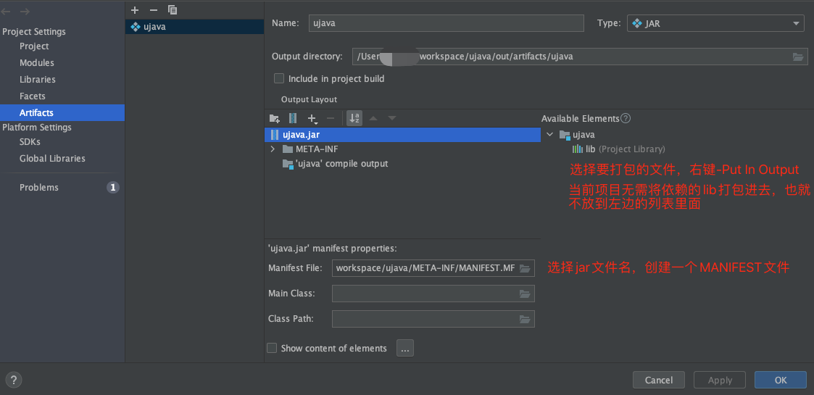

## 说明

- IDEA使用久了比较占磁盘，可把`C:\Users\smalle\.IntelliJIdea2018.1\system\index`目录下的索引文件全部删掉释放磁盘空间；如果做了C盘搬家，也可删除目标存储目录，如`D:\FileHistory\smalle\AEZO-E480\Data\C\Users\smalle\.IntelliJIdea2018.1\system\index`
- 配置同步：在File菜单中设置setting的repository为git@xxx仓库，设置.ssh认证即可同步仓库
- 插件同步：复制idea配置目录(USER/AppData/Roaming/jetbrains)下的config/plugins目录到新的环境下
- Mac相关配置文件，完全卸载需要删除
    - `~/Library/Application Support/Jetbrains`
    - `~/Library/Caches/Jetbrains`
    - `~/Library/Logs/Jetbrains`
    - `~/Library/Preferences/Jetbrains`

## jetbrains相关编辑器破解

- [大神博客](https://zhile.io/)
- 2021.3 使用 https://zhile.io/2021/11/29/ja-netfilter-javaagent-lib.html

```bash
# 参考 https://www.cnblogs.com/yanglang/p/16818245.html
# 参考 https://baijiahao.baidu.com/s?id=1741360284635038076&wfr=spider&for=pc

# 安装IDE
# 下载ja-netfilter.jar: https://gitee.com/ja-netfilter/ja-netfilter/releases
# 找到 .vmoptions 文件: idea安装目录/bin目录下(mac可在应用程序文件夹选择程序-右键显示包内容查看)
# 加入如下内容(补丁不能包含中文路径; 最新版本需要添加后面两行，否则会报 key valid)
-javaagent:/Users/smalle/data/others/ja-netfilter/ja-netfilter.jar
--add-opens=java.base/jdk.internal.org.objectweb.asm=ALL-UNNAMED
--add-opens=java.base/jdk.internal.org.objectweb.asm.tree=ALL-UNNAMED
# 访问 https://3.jetbra.in/ 找到一个较快的节点点击进去，找到对应IDE，复制秘钥
# 启动IDE，通过秘钥激活即可

# 激活码案例
# IDEA
6G5NXCPJZB-eyJsaWNlbnNlSWQiOiI2RzVOWENQSlpCIiwibGljZW5zZWVOYW1lIjoic2lnbnVwIHNjb290ZXIiLCJhc3NpZ25lZU5hbWUiOiIiLCJhc3NpZ25lZUVtYWlsIjoiIiwibGljZW5zZVJlc3RyaWN0aW9uIjoiIiwiY2hlY2tDb25jdXJyZW50VXNlIjpmYWxzZSwicHJvZHVjdHMiOlt7ImNvZGUiOiJQU0kiLCJmYWxsYmFja0RhdGUiOiIyMDI1LTA4LTAxIiwicGFpZFVwVG8iOiIyMDI1LTA4LTAxIiwiZXh0ZW5kZWQiOnRydWV9LHsiY29kZSI6IlBEQiIsImZhbGxiYWNrRGF0ZSI6IjIwMjUtMDgtMDEiLCJwYWlkVXBUbyI6IjIwMjUtMDgtMDEiLCJleHRlbmRlZCI6dHJ1ZX0seyJjb2RlIjoiSUkiLCJmYWxsYmFja0RhdGUiOiIyMDI1LTA4LTAxIiwicGFpZFVwVG8iOiIyMDI1LTA4LTAxIiwiZXh0ZW5kZWQiOmZhbHNlfSx7ImNvZGUiOiJQUEMiLCJmYWxsYmFja0RhdGUiOiIyMDI1LTA4LTAxIiwicGFpZFVwVG8iOiIyMDI1LTA4LTAxIiwiZXh0ZW5kZWQiOnRydWV9LHsiY29kZSI6IlBHTyIsImZhbGxiYWNrRGF0ZSI6IjIwMjUtMDgtMDEiLCJwYWlkVXBUbyI6IjIwMjUtMDgtMDEiLCJleHRlbmRlZCI6dHJ1ZX0seyJjb2RlIjoiUFNXIiwiZmFsbGJhY2tEYXRlIjoiMjAyNS0wOC0wMSIsInBhaWRVcFRvIjoiMjAyNS0wOC0wMSIsImV4dGVuZGVkIjp0cnVlfSx7ImNvZGUiOiJQV1MiLCJmYWxsYmFja0RhdGUiOiIyMDI1LTA4LTAxIiwicGFpZFVwVG8iOiIyMDI1LTA4LTAxIiwiZXh0ZW5kZWQiOnRydWV9LHsiY29kZSI6IlBQUyIsImZhbGxiYWNrRGF0ZSI6IjIwMjUtMDgtMDEiLCJwYWlkVXBUbyI6IjIwMjUtMDgtMDEiLCJleHRlbmRlZCI6dHJ1ZX0seyJjb2RlIjoiUFJCIiwiZmFsbGJhY2tEYXRlIjoiMjAyNS0wOC0wMSIsInBhaWRVcFRvIjoiMjAyNS0wOC0wMSIsImV4dGVuZGVkIjp0cnVlfSx7ImNvZGUiOiJQQ1dNUCIsImZhbGxiYWNrRGF0ZSI6IjIwMjUtMDgtMDEiLCJwYWlkVXBUbyI6IjIwMjUtMDgtMDEiLCJleHRlbmRlZCI6dHJ1ZX1dLCJtZXRhZGF0YSI6IjAxMjAyMjA5MDJQU0FOMDAwMDA1IiwiaGFzaCI6IlRSSUFMOi0xMDc4MzkwNTY4IiwiZ3JhY2VQZXJpb2REYXlzIjo3LCJhdXRvUHJvbG9uZ2F0ZWQiOmZhbHNlLCJpc0F1dG9Qcm9sb25nYXRlZCI6ZmFsc2V9-SnRVlQQR1/9nxZ2AXsQ0seYwU5OjaiUMXrnQIIdNRvykzqQ0Q+vjXlmO7iAUwhwlsyfoMrLuvmLYwoD7fV8Mpz9Gs2gsTR8DfSHuAdvZlFENlIuFoIqyO8BneM9paD0yLxiqxy/WWuOqW6c1v9ubbfdT6z9UnzSUjPKlsjXfq9J2gcDALrv9E0RPTOZqKfnsg7PF0wNQ0/d00dy1k3zI+zJyTRpDxkCaGgijlY/LZ/wqd/kRfcbQuRzdJ/JXa3nj26rACqykKXaBH5thuvkTyySOpZwZMJVJyW7B7ro/hkFCljZug3K+bTw5VwySzJtDcQ9tDYuu0zSAeXrcv2qrOg==-MIIETDCCAjSgAwIBAgIBDTANBgkqhkiG9w0BAQsFADAYMRYwFAYDVQQDDA1KZXRQcm9maWxlIENBMB4XDTIwMTAxOTA5MDU1M1oXDTIyMTAyMTA5MDU1M1owHzEdMBsGA1UEAwwUcHJvZDJ5LWZyb20tMjAyMDEwMTkwggEiMA0GCSqGSIb3DQEBAQUAA4IBDwAwggEKAoIBAQCUlaUFc1wf+CfY9wzFWEL2euKQ5nswqb57V8QZG7d7RoR6rwYUIXseTOAFq210oMEe++LCjzKDuqwDfsyhgDNTgZBPAaC4vUU2oy+XR+Fq8nBixWIsH668HeOnRK6RRhsr0rJzRB95aZ3EAPzBuQ2qPaNGm17pAX0Rd6MPRgjp75IWwI9eA6aMEdPQEVN7uyOtM5zSsjoj79Lbu1fjShOnQZuJcsV8tqnayeFkNzv2LTOlofU/Tbx502Ro073gGjoeRzNvrynAP03pL486P3KCAyiNPhDs2z8/COMrxRlZW5mfzo0xsK0dQGNH3UoG/9RVwHG4eS8LFpMTR9oetHZBAgMBAAGjgZkwgZYwCQYDVR0TBAIwADAdBgNVHQ4EFgQUJNoRIpb1hUHAk0foMSNM9MCEAv8wSAYDVR0jBEEwP4AUo562SGdCEjZBvW3gubSgUouX8bOhHKQaMBgxFjAUBgNVBAMMDUpldFByb2ZpbGUgQ0GCCQDSbLGDsoN54TATBgNVHSUEDDAKBggrBgEFBQcDATALBgNVHQ8EBAMCBaAwDQYJKoZIhvcNAQELBQADggIBABqRoNGxAQct9dQUFK8xqhiZaYPd30TlmCmSAaGJ0eBpvkVeqA2jGYhAQRqFiAlFC63JKvWvRZO1iRuWCEfUMkdqQ9VQPXziE/BlsOIgrL6RlJfuFcEZ8TK3syIfIGQZNCxYhLLUuet2HE6LJYPQ5c0jH4kDooRpcVZ4rBxNwddpctUO2te9UU5/FjhioZQsPvd92qOTsV+8Cyl2fvNhNKD1Uu9ff5AkVIQn4JU23ozdB/R5oUlebwaTE6WZNBs+TA/qPj+5/we9NH71WRB0hqUoLI2AKKyiPw++FtN4Su1vsdDlrAzDj9ILjpjJKA1ImuVcG329/WTYIKysZ1CWK3zATg9BeCUPAV1pQy8ToXOq+RSYen6winZ2OO93eyHv2Iw5kbn1dqfBw1BuTE29V2FJKicJSu8iEOpfoafwJISXmz1wnnWL3V/0NxTulfWsXugOoLfv0ZIBP1xH9kmf22jjQ2JiHhQZP7ZDsreRrOeIQ/c4yR8IQvMLfC0WKQqrHu5ZzXTH4NO3CwGWSlTY74kE91zXB5mwWAx1jig+UXYc2w4RkVhy0//lOmVya/PEepuuTTI4+UJwC7qbVlh5zfhj8oTNUXgN0AOc+Q0/WFPl1aw5VV/VrO8FCoB15lFVlpKaQ1Yh+DVU8ke+rt9Th0BCHXe0uZOEmH0nOnH/0onD
# PhpStorm
DXHN0R5Z4F-eyJsaWNlbnNlSWQiOiJEWEhOMFI1WjRGIiwibGljZW5zZWVOYW1lIjoic2lnbnVwIHNjb290ZXIiLCJhc3NpZ25lZU5hbWUiOiIiLCJhc3NpZ25lZUVtYWlsIjoiIiwibGljZW5zZVJlc3RyaWN0aW9uIjoiIiwiY2hlY2tDb25jdXJyZW50VXNlIjpmYWxzZSwicHJvZHVjdHMiOlt7ImNvZGUiOiJQU0kiLCJmYWxsYmFja0RhdGUiOiIyMDI1LTA4LTAxIiwicGFpZFVwVG8iOiIyMDI1LTA4LTAxIiwiZXh0ZW5kZWQiOnRydWV9LHsiY29kZSI6IlBTIiwiZmFsbGJhY2tEYXRlIjoiMjAyNS0wOC0wMSIsInBhaWRVcFRvIjoiMjAyNS0wOC0wMSIsImV4dGVuZGVkIjpmYWxzZX0seyJjb2RlIjoiUFdTIiwiZmFsbGJhY2tEYXRlIjoiMjAyNS0wOC0wMSIsInBhaWRVcFRvIjoiMjAyNS0wOC0wMSIsImV4dGVuZGVkIjp0cnVlfSx7ImNvZGUiOiJQUFMiLCJmYWxsYmFja0RhdGUiOiIyMDI1LTA4LTAxIiwicGFpZFVwVG8iOiIyMDI1LTA4LTAxIiwiZXh0ZW5kZWQiOnRydWV9LHsiY29kZSI6IlBDV01QIiwiZmFsbGJhY2tEYXRlIjoiMjAyNS0wOC0wMSIsInBhaWRVcFRvIjoiMjAyNS0wOC0wMSIsImV4dGVuZGVkIjp0cnVlfV0sIm1ldGFkYXRhIjoiMDEyMDIyMDkwMlBTQU4wMDAwMDUiLCJoYXNoIjoiVFJJQUw6LTE2MDY1NjU0NzQiLCJncmFjZVBlcmlvZERheXMiOjcsImF1dG9Qcm9sb25nYXRlZCI6ZmFsc2UsImlzQXV0b1Byb2xvbmdhdGVkIjpmYWxzZX0=-PXxjbi2g20tUcfzptAnY/ZIKQbXW3FwXJ3P5scBMkXrya0Wg0YviqciwEWJe5laYfWevv8RzEEwrAcxz5ug1RYrg4bjZ7mJiQoOatsKahqGT1TDfU5YGpZPfbtjlKHAlYSszioJ0pka6go2qBa5AaPj4HmKfB4jkeGX4inRxPrIxc8PyAo0wyWWEaZ7R4pLC4ZDqIAYJ/IzXIf1V84+p5hGYd6QD6ze1BCEGxI/E8LjloaIvv0oNdkV2qTyDCH9IF3E42iheOwazyrlOWYivYyn/ew0kvjGwwSdbrbIJH7SSbaz2nxlBWnR04yJaI4txnnS1eUbiUNQtEhKJ3uD6oQ==-MIIETDCCAjSgAwIBAgIBDTANBgkqhkiG9w0BAQsFADAYMRYwFAYDVQQDDA1KZXRQcm9maWxlIENBMB4XDTIwMTAxOTA5MDU1M1oXDTIyMTAyMTA5MDU1M1owHzEdMBsGA1UEAwwUcHJvZDJ5LWZyb20tMjAyMDEwMTkwggEiMA0GCSqGSIb3DQEBAQUAA4IBDwAwggEKAoIBAQCUlaUFc1wf+CfY9wzFWEL2euKQ5nswqb57V8QZG7d7RoR6rwYUIXseTOAFq210oMEe++LCjzKDuqwDfsyhgDNTgZBPAaC4vUU2oy+XR+Fq8nBixWIsH668HeOnRK6RRhsr0rJzRB95aZ3EAPzBuQ2qPaNGm17pAX0Rd6MPRgjp75IWwI9eA6aMEdPQEVN7uyOtM5zSsjoj79Lbu1fjShOnQZuJcsV8tqnayeFkNzv2LTOlofU/Tbx502Ro073gGjoeRzNvrynAP03pL486P3KCAyiNPhDs2z8/COMrxRlZW5mfzo0xsK0dQGNH3UoG/9RVwHG4eS8LFpMTR9oetHZBAgMBAAGjgZkwgZYwCQYDVR0TBAIwADAdBgNVHQ4EFgQUJNoRIpb1hUHAk0foMSNM9MCEAv8wSAYDVR0jBEEwP4AUo562SGdCEjZBvW3gubSgUouX8bOhHKQaMBgxFjAUBgNVBAMMDUpldFByb2ZpbGUgQ0GCCQDSbLGDsoN54TATBgNVHSUEDDAKBggrBgEFBQcDATALBgNVHQ8EBAMCBaAwDQYJKoZIhvcNAQELBQADggIBABqRoNGxAQct9dQUFK8xqhiZaYPd30TlmCmSAaGJ0eBpvkVeqA2jGYhAQRqFiAlFC63JKvWvRZO1iRuWCEfUMkdqQ9VQPXziE/BlsOIgrL6RlJfuFcEZ8TK3syIfIGQZNCxYhLLUuet2HE6LJYPQ5c0jH4kDooRpcVZ4rBxNwddpctUO2te9UU5/FjhioZQsPvd92qOTsV+8Cyl2fvNhNKD1Uu9ff5AkVIQn4JU23ozdB/R5oUlebwaTE6WZNBs+TA/qPj+5/we9NH71WRB0hqUoLI2AKKyiPw++FtN4Su1vsdDlrAzDj9ILjpjJKA1ImuVcG329/WTYIKysZ1CWK3zATg9BeCUPAV1pQy8ToXOq+RSYen6winZ2OO93eyHv2Iw5kbn1dqfBw1BuTE29V2FJKicJSu8iEOpfoafwJISXmz1wnnWL3V/0NxTulfWsXugOoLfv0ZIBP1xH9kmf22jjQ2JiHhQZP7ZDsreRrOeIQ/c4yR8IQvMLfC0WKQqrHu5ZzXTH4NO3CwGWSlTY74kE91zXB5mwWAx1jig+UXYc2w4RkVhy0//lOmVya/PEepuuTTI4+UJwC7qbVlh5zfhj8oTNUXgN0AOc+Q0/WFPl1aw5VV/VrO8FCoB15lFVlpKaQ1Yh+DVU8ke+rt9Th0BCHXe0uZOEmH0nOnH/0onD
# PyCharm
EUWT4EE9X2-eyJsaWNlbnNlSWQiOiJFVVdUNEVFOVgyIiwibGljZW5zZWVOYW1lIjoic2lnbnVwIHNjb290ZXIiLCJhc3NpZ25lZU5hbWUiOiIiLCJhc3NpZ25lZUVtYWlsIjoiIiwibGljZW5zZVJlc3RyaWN0aW9uIjoiIiwiY2hlY2tDb25jdXJyZW50VXNlIjpmYWxzZSwicHJvZHVjdHMiOlt7ImNvZGUiOiJQU0kiLCJmYWxsYmFja0RhdGUiOiIyMDI1LTA4LTAxIiwicGFpZFVwVG8iOiIyMDI1LTA4LTAxIiwiZXh0ZW5kZWQiOnRydWV9LHsiY29kZSI6IlBDIiwiZmFsbGJhY2tEYXRlIjoiMjAyNS0wOC0wMSIsInBhaWRVcFRvIjoiMjAyNS0wOC0wMSIsImV4dGVuZGVkIjpmYWxzZX0seyJjb2RlIjoiUFBDIiwiZmFsbGJhY2tEYXRlIjoiMjAyNS0wOC0wMSIsInBhaWRVcFRvIjoiMjAyNS0wOC0wMSIsImV4dGVuZGVkIjp0cnVlfSx7ImNvZGUiOiJQV1MiLCJmYWxsYmFja0RhdGUiOiIyMDI1LTA4LTAxIiwicGFpZFVwVG8iOiIyMDI1LTA4LTAxIiwiZXh0ZW5kZWQiOnRydWV9LHsiY29kZSI6IlBDV01QIiwiZmFsbGJhY2tEYXRlIjoiMjAyNS0wOC0wMSIsInBhaWRVcFRvIjoiMjAyNS0wOC0wMSIsImV4dGVuZGVkIjp0cnVlfV0sIm1ldGFkYXRhIjoiMDEyMDIyMDkwMlBTQU4wMDAwMDUiLCJoYXNoIjoiVFJJQUw6MzUzOTQ0NTE3IiwiZ3JhY2VQZXJpb2REYXlzIjo3LCJhdXRvUHJvbG9uZ2F0ZWQiOmZhbHNlLCJpc0F1dG9Qcm9sb25nYXRlZCI6ZmFsc2V9-FT9l1nyyF9EyNmlelrLP9rGtugZ6sEs3CkYIKqGgSi608LIamge623nLLjI8f6O4EdbCfjJcPXLxklUe1O/5ASO3JnbPFUBYUEebCWZPgPfIdjw7hfA1PsGUdw1SBvh4BEWCMVVJWVtc9ktE+gQ8ldugYjXs0s34xaWjjfolJn2V4f4lnnCv0pikF7Ig/Bsyd/8bsySBJ54Uy9dkEsBUFJzqYSfR7Z/xsrACGFgq96ZsifnAnnOvfGbRX8Q8IIu0zDbNh7smxOwrz2odmL72UaU51A5YaOcPSXRM9uyqCnSp/ENLzkQa/B9RNO+VA7kCsj3MlJWJp5Sotn5spyV+gA==-MIIETDCCAjSgAwIBAgIBDTANBgkqhkiG9w0BAQsFADAYMRYwFAYDVQQDDA1KZXRQcm9maWxlIENBMB4XDTIwMTAxOTA5MDU1M1oXDTIyMTAyMTA5MDU1M1owHzEdMBsGA1UEAwwUcHJvZDJ5LWZyb20tMjAyMDEwMTkwggEiMA0GCSqGSIb3DQEBAQUAA4IBDwAwggEKAoIBAQCUlaUFc1wf+CfY9wzFWEL2euKQ5nswqb57V8QZG7d7RoR6rwYUIXseTOAFq210oMEe++LCjzKDuqwDfsyhgDNTgZBPAaC4vUU2oy+XR+Fq8nBixWIsH668HeOnRK6RRhsr0rJzRB95aZ3EAPzBuQ2qPaNGm17pAX0Rd6MPRgjp75IWwI9eA6aMEdPQEVN7uyOtM5zSsjoj79Lbu1fjShOnQZuJcsV8tqnayeFkNzv2LTOlofU/Tbx502Ro073gGjoeRzNvrynAP03pL486P3KCAyiNPhDs2z8/COMrxRlZW5mfzo0xsK0dQGNH3UoG/9RVwHG4eS8LFpMTR9oetHZBAgMBAAGjgZkwgZYwCQYDVR0TBAIwADAdBgNVHQ4EFgQUJNoRIpb1hUHAk0foMSNM9MCEAv8wSAYDVR0jBEEwP4AUo562SGdCEjZBvW3gubSgUouX8bOhHKQaMBgxFjAUBgNVBAMMDUpldFByb2ZpbGUgQ0GCCQDSbLGDsoN54TATBgNVHSUEDDAKBggrBgEFBQcDATALBgNVHQ8EBAMCBaAwDQYJKoZIhvcNAQELBQADggIBABqRoNGxAQct9dQUFK8xqhiZaYPd30TlmCmSAaGJ0eBpvkVeqA2jGYhAQRqFiAlFC63JKvWvRZO1iRuWCEfUMkdqQ9VQPXziE/BlsOIgrL6RlJfuFcEZ8TK3syIfIGQZNCxYhLLUuet2HE6LJYPQ5c0jH4kDooRpcVZ4rBxNwddpctUO2te9UU5/FjhioZQsPvd92qOTsV+8Cyl2fvNhNKD1Uu9ff5AkVIQn4JU23ozdB/R5oUlebwaTE6WZNBs+TA/qPj+5/we9NH71WRB0hqUoLI2AKKyiPw++FtN4Su1vsdDlrAzDj9ILjpjJKA1ImuVcG329/WTYIKysZ1CWK3zATg9BeCUPAV1pQy8ToXOq+RSYen6winZ2OO93eyHv2Iw5kbn1dqfBw1BuTE29V2FJKicJSu8iEOpfoafwJISXmz1wnnWL3V/0NxTulfWsXugOoLfv0ZIBP1xH9kmf22jjQ2JiHhQZP7ZDsreRrOeIQ/c4yR8IQvMLfC0WKQqrHu5ZzXTH4NO3CwGWSlTY74kE91zXB5mwWAx1jig+UXYc2w4RkVhy0//lOmVya/PEepuuTTI4+UJwC7qbVlh5zfhj8oTNUXgN0AOc+Q0/WFPl1aw5VV/VrO8FCoB15lFVlpKaQ1Yh+DVU8ke+rt9Th0BCHXe0uZOEmH0nOnH/0onD
```
- 2021.2.2及以下
    - 下载插件ide-eval-resetter后本地安装: https://plugins.zhile.io/files/ide-eval-resetter-2.1.6.zip
    - 通过无限重置30天试用达到永久使用（如果过期没来得及重置，可以先进入然后马上在Tools菜单中进行重置）
- 2018.1
    - 在 hosts 文件里面添加如下配置`0.0.0.0 account.jetbrains.com`、`0.0.0.0 www.jetbrains.com``
    - 基于激活码破解：http://idea.lanyus.com/getkey
    - 基于破解补丁进行破解
        - 下载破解补丁：http://idea.lanyus.com/jar/JetbrainsIdesCrack-4.2-release-sha1-3323d5d0b82e716609808090d3dc7cb3198b8c4b.jar
        - 在`bin/idea64.exe.vmoptions`和`bin/idea64.exe.vmoptions`文件中加入`-javaagent:D:\software\JetbrainsIdesCrack-4.2-release-sha1-3323d5d0b82e716609808090d3dc7cb3198b8c4b.jar`，两个都需要加入
        - 启动idea输入以下注册码

    ```js
    ThisCrackLicenseId-{
    "licenseId":"ThisCrackLicenseId",
    "licenseeName":"Rover12421",
    "assigneeName":"",
    "assigneeEmail":"rover12421@163.com",
    "licenseRestriction":"For Rover12421 Crack, Only Test! Please support genuine!!!",
    "checkConcurrentUse":false,
    "products":[
    {"code":"II","paidUpTo":"2099-12-31"},
    {"code":"DM","paidUpTo":"2099-12-31"},
    {"code":"AC","paidUpTo":"2099-12-31"},
    {"code":"RS0","paidUpTo":"2099-12-31"},
    {"code":"WS","paidUpTo":"2099-12-31"},
    {"code":"DPN","paidUpTo":"2099-12-31"},
    {"code":"RC","paidUpTo":"2099-12-31"},
    {"code":"PS","paidUpTo":"2099-12-31"},
    {"code":"DC","paidUpTo":"2099-12-31"},
    {"code":"RM","paidUpTo":"2099-12-31"},
    {"code":"CL","paidUpTo":"2099-12-31"},
    {"code":"PC","paidUpTo":"2099-12-31"}
    ],
    "hash":"2911276/0",
    "gracePeriodDays":7,
    "autoProlongated":false}
    ```

## 常用设置

- 新建包文件夹，一定要一层一层的建，或者创建`cn/aezo`的文件夹，不能创建一个`cn.aezo`(不会自动生成两个文件夹)
- for快捷键使用：`list.for`、`arr.for`. **可以在`File`-`Setting`-`Editor`-`General`-`Postfix Completion`中查看**

### 项目配置

- 进入到Project Structure：`File - Project Structure` [^1]
- java-web(springmvc)配置步骤
    - `Project` 项目级别
        - 主要是project compiler output的位置(src的编译位置)：如`D:/myproject/classes`(使用默认即可)，为对应WEB-INF下的classes目录
    - `Modules` 模块级别，项目可能包含多个模块，不同的模块可设置对应的编译输入路径和依赖。一般项目就一个模块
        - `Sources` 将src目录标记成Sources目录 **（如果是maven项目则标记java、test目录，即包名的上级目录）**
        - `Paths` 使用modules compiler output path，设置路径为`D:/myproject/mymodule/target/classes`。主要解决idea自身编译(使用默认的即可)
        - `Dependencies` 加入jdk、tomcat、其他依赖jar(如`/WEB-INF/lib`中的jar，如果是maven依赖则不需要加入)。主要解决idea自身编译(语法检查)
    - `Libraries` 如将`/WEB-INF/lib`中的所有jar定义一个目录，直接加入到`Dependencies`中
    - `Facets`
        - 点击`+` - `web`
        - `Web Module Deployment Descriptor`为`/myproject/WebRoot/WEB-INF/web.xml`
        - `Web Resource`为`/myproject/WebRoot`
        - 勾选`Source Roots`
    - `Artifacts` 根据上面的配置，最终打包成一个war包部署到tomcat中。(Artifacts是maven中的一个概念，表示项目modules如何打包，比如jar,war,war exploded,ear等打包形式，一个项目或者说module有了artifacts就可以部署到web应用服务器上了，注意artifact的前提是已经配置好module)
        - 点击`+` - `Web Application: Exploded` - `From Modules`
            - `Output directory`为`/testStruts2/WebRoot`
                - WEB-INFO/lib下的jar都要显示在此目录
        - 点击`+` - `Web Application: Archive` - `For "XXX: Exploded"` (主要用于打包)
            - `Output directory`为`D:/myproject/war`
        - `web application exploded` 是以文件夹形式（War Exploded）发布项目，选择这个，发布项目时就会自动生成文件夹在指定的output directory
        - `web application archive` 是war包形式，每次都会重新打包全部的,将项目打成一个war包在指定位置
        - 如果是maven项目：选中Available Elements中的依赖，将需要的依赖加入到WEB-INF/lib中(右键，put into WEB-INF/lib. tomcat相关依赖无需加入，因为最终Artifacts会部署到tomcat容器)。否则像struts2会报错`java.lang.ClassNotFoundException: org.apache.struts2.dispatcher.ng.filter.StrutsPrepareAndExecuteFilter`
    - `Run configuration`启动配置。如使用tomcat启动
        - `+` - `tomcat server` - `local`
        - `Application Server`: 本地tomcat路径
        - `VM`：添加`-Dfile.encoding=UTF-8`防止出现乱码
        - `JRE`填写jdk路径
        - `Deployment`中将刚刚的war配置进入，可修改某个war包的根路径
        - 在`Before launch`中加入Build这个war包
    - 打包：Build - Build Artifacts - xxx:war - build (在上述Output directory中可看到war包等输出文件)
- 普通SDK打包配置

    
    - 创建一个JAR类型的Artifacts
    - 将右侧可用的文件加入(Put into Output Root)到左侧的Output Layout里面(最终打包文件的结构)，如过不需要将依赖的第三方SDK打包进去，则不要放到左侧
    - 选择打包的xxx.jar输出文件，创建(自动生成一个文件)或选择一个MANIFEST文件
    - 执行打包: Build - Build Artifacts - xxx:jar - build
- idea报错：Error：java不支持发行版本5的解决方法：https://www.cnblogs.com/wqy0314/p/11726107.html
    - File-Setting-Java Compiler

### 其他

- 打开新项目默认的项目名称为目录名称，可修改项目名称(关闭项目后生效)，只会修改.iml文件
- 配置同步到远程
    - File - Settings Repository - 输入远程地址，如保存到github(输入ssh验证的项目地址) - Overwrite Remote同步到远程
- 自动收缩空包文件夹
    - Project浏览Tab - 设置 - Hide Empty Middle Packages
- 管理书签
    - Cmd + F3即可调整书签排序(自动排序只能基于助记符+文件+行排序，或者手动排序)

## 插件使用

### 实用

- `jrebel` java热部署(会自动热部署新代码。如果不使用jrebel，springboot-devtools可修改代码后使用`Ctrl+Shif+F9`进行热部署)
    - **jrebel破解参考**：http://www.cicoding.cn/other/jrebel-activation/
        - 访问`http://jrebel.cicoding.cn/guid` 生成GUID
        - 监听配置格式`http://jrebel.cicoding.cn/MY_GUID`，邮箱随便填写
    - 无法热部署场景
        - 修改了Entity，涉及到mybatis的操作无法生效(mybatis缓存了数据类型?)
        - 修改了mybatis mapper和对应文件一般无法生效
        - 修改了方法声明
- `CamelCase` 使用`Alt + Shift + U`将字符串在下划线/中划线/大小驼峰中切换，可重复按快捷键进行切换
    - `String Manipulation` 字符串转换(包括下划线/中划线/驼峰等)。鼠标右键会有对应的选项，缺点：无快捷键
- `CodeGlance` 显示代码地图
- `Alibaba Java Coding Guidelines` 阿里巴巴代码规范
- `Translation` 翻译插件(https://github.com/YiiGuxing/TranslationPlugin)
- `Maven Helper` 可显示冲突的maven依赖
    - 此插件依赖`Maven Intergration`，在安装后也要启用
    - 点击pom.xml文件，右下角会出现`Dependency Analyzer`
    - `Dependency Analyzer` - `Conflicts`中显示的即为冲突的依赖
        - 点击其中任何一个依赖，会在右侧显示重复引用的来源(基于版本降序) 
        - 点击右侧某个引用来源，右键可查看引用源码，也可以将低版本从pom中exclude掉来解决冲突
- `MybatisX`
    - 支持生成mybatis-plus代码
        - 选择表 - Mybatis-X Generator
        - module path=maven多模块的时候选择一个模块目录
        - base package=cn.aezo.share.rtadmin.app
        - annotation=Mybatis-Plus3, options=Comment,Lombox,Model, template=mybatis-plus3
        - 修改entity代码，增加id配置:`@TableId(value = "id", type = IdType.ASSIGN_ID)`
- `MyBatisCodeHelperPro (Marketplace Edition)` 实体/表双向生成(支持实体生成建表语句)
    - 破解: https://cnblogs.com/equals/p/15391453.html
    - [使用说明](https://gejun123456.github.io/MyBatisCodeHelper-Pro/)
    - 支持实体生成建表语句
    - (只支持mybatis)支持基于表生成实体/Mapper/服务等
        - 类似插件: `MybatisX`、`Free MyBatis plugin` 可自动识别mapper实现(mybatis标识)，集成了MyBatis Generator GUI
    - 支持生成Mybatis执行日志(自动拼接参数)
        - 类似插件: `MyBatis Log Plugin` 将mybatis日志中的?转换为真实值。在Tools菜单中可打开对应面板。破解版地址: https://github.com/Link-Kou/intellij-mybaitslog
    - 支持预执行SQL(基于Mapper XML执行，弹框输入参数执行)
- `Grep Console` 日志过滤
    - 高亮: 如表达式`Expression=.*Demo.*`则表示显示有Demo字样的那些行
    - 日志窗口 - 右键 - Grep: 基于当前日志进行过滤(只显示符合条件的日志，如输入Demo则只匹配有Demo字样的行)
- `Java Bytecode Decompiler` 查看class反编译代码

### 部分场景

- `PlantUML integration` 基于PlantUML语法画UML图
- `SequenceDiagram` 根据源码生成时序图
- `jclasslib Bytecode viewer` 查看java class字节代码。安装后在View - Show Bytecode With jclasslib(打开一个类可进行查看)
- `RestfulToolkit` 使用`Ctrl + Alt + N`基于路径搜索controller对应的位置
- `leetcode` 算法刷题，参考：https://github.com/shuzijun/leetcode-editor/blob/master/doc/CustomCode_ZH.md
- `Adapter for Eclipse Code Formatter` 代码格式化
    - Setting - Other Settings - Adapter for Eclipse Code Formatter - 勾选Use Eclipse's Code Formatter - 设置Eclipse workspace/project folder or config file。如：`https://github.com/sofastack/sofa-boot/blob/master/tools/Formatter.xml`
    - 执行代码格式化快捷键 Ctrl+Alt+Shift+L
- `CheckStyle-IDEA` 检查代码格式
    - Setting - Tools - CheckStyle - Configuration File - 新增一个本地的样式校验规则配置
    - 参考：https://blog.csdn.net/u011943534/article/details/83037496
- `PMDPlugin` 主要用于检查java源文件中的潜在问题，如未使用的变量等
    - Setting - Other Settings - PMD - RuleSets - 新增PMD校验规则配置。如：https://github.com/sofastack/sofa-boot/blob/master/tools/pmd-ruleset.xml
- `SpotBugs` 类似findbugs，主要检查.class文件中的潜在问题，如空指针等

### 其他

- `JMH plugin` Java基准测插件
- `JMeter plugin`
- `Jindent-Source Code Formatter` (收费，无法破解) 自定义javadoc注释
- `Key Promoter X` 快捷键提示和统计快捷使用频率
- `Rainbow Brackets` 彩虹圆/尖括号颜色，会把代码中所有括号变色，有点花里胡哨
- `HighlightBracketPair` (Idea v2021 不支持) 彩虹大括号，选中高亮，有点花里胡哨
- `Codota` Codota AI Autocomplete 代码示例，基于类或方法查找网上流行的使用方式。类似的如Aixcode
    - 推荐结合`tabnine`进行代码补全
- `Lombox` (新版IDEA已内置) 简化代码工具(maven项目中需要加入对应的依赖) [https://projectlombok.org/](https://projectlombok.org/)。写法参考[java-tools.md#Lombox](/_posts/java/java-tools.md#Lombox)


### 未使用

- `FindBugs-IDEA` 检测代码中可能的bug及不规范的位置，检测的模式相比P3GC更多
- `GsonFormat` 一键根据json文本生成java类
- `MyBatisCodeHelperPro` mybatis代码自动生成插件，大部分单表操作的代码可自动生成

## 快捷键

- 类似参考[vscode.md#快捷键](/_posts/extend/vscode.md#快捷键)
- 待记忆
    - `F8` 断点调试下一步
    - `Double Shift` 全局文件名查找
    - `Alt + Shift + 上下` 上下移动当前行
    - `Ctrl + Shift + Space` 智能补全(可多次按键扩大搜索范围)
    - `Ctrl + P` 查看方法参数
    - `Ctrl + Q` 查看方法说明
    - `Ctrl + Shift + N` 搜索文件(可选中文件路径后再按键)
    - `Alt + Insert` 自动生成(Getter/Setter等)
    - `Ctrl + Alt + T` 对选中代码生成try...catch/if等包裹语句
    - `Alt + F7` 查询方法的使用关系
    - `Ctrl + ALT + H` 查询方法的调用关系（可以选择引用和被引用）
    - `Ctrl + B` 跳转到声明
    - `Ctrl + E` 最近访问文件
    - `Ctrl + W` 单词语句感知选择，多次点击会扩大选中范围；`Ctrl + Shift + W` 相反
    - `Ctrl + Shift + Entry` 完成整句
    - `Ctrl + Shift + F7` 高亮所用之处：把光标放在某元素上，类似与快速查找此文件此元素出现处
    - `Ctrl + H` 类似Navigate - Call Hierarchy 命令查看一个Java类的继承管理
    - `Ctrl + D` 复制行
    - `Ctrl + Y` 删除行
    - `Ctrl shift +` 展开所有方法
    - `Ctrl shift -` 收缩所有方法
- 批量选择
    - `Alt + Shift + 左键` 跨行需要每行单点，可以让光标在多个位置出现
    - `Ctrl + Alt + Shift + 鼠标拖选` 可选择多个矩形
    - `Alt + Shift + Insert` 然后按住鼠标左键拖动选中多行，此时可选择空白区域。开启鼠标插入选择模式(鼠标右键 - 选中columu select module进行开启)
    - vscode相关
        - `Alt + 左键` 跨行需要每行单点
        - `Alt + Shift + 鼠标拖动` 可选择多个矩形(或移动上下键)
        - `Ctrl + Alt + Up/Down` 选中/取消当前行的多行编辑 
        - `Ctrl + Shift + L` 选择所有找到的查找匹配项，此时所有的匹配项都有光标
        - 选中多行后，可结合`Ctrl + 左右键`进行跨单词移动光标
        - 选中多行复制后，并再新的地方选择多行，然后粘贴即可粘贴多行
- 特殊场景
    - SQL控制台界面
        - `Ctrl + Enter` 执行SQL
        - `Ctrl + Alt + E` 查看最近执行SQL
        - `Ctrl + F12` 查看列定义；选择某一列再点击时，会跳到指定列定义
- 常用快捷键
    - `Ctrl + N` 跳转到类
    - `Ctrl + Shift + F9` 热部署
    - `Ctrl + Shift + F/R` 全局查找/替换(jar包只有下载了源码才可检索)。搜狗输入法快捷键简繁体切换可能会占用`Ctrl+Shift+F`
    - `Ctrl + Shift + Backspace` 回到上次编辑位置
    - `Ctrl + Alt + 左右` 回退(退到上次浏览位置)/前进
    - `Alt + Enter` 提示
        - 复制是去除字符串连接符: `Copy string concatenation text to the clipboard` (注意: 选中字符串后鼠标不要点击到字符串中间)
- Mac
    - `Cmd + Shift + U` 大小写转换
    - `Alt + Shift + U` 驼峰下划线转换(基于插件)
- 快捷键图片


## javadoc配置与生成

### 配置

- 方式一：使用`Jindent`插件(收费，无法破解)
- 方式二 [^4]
    - 类注释: Editor - File and Code Templates
    - 方法注释：Editor - Live Templates。无法解决 @return 和 @throws

### 生成

- https://blog.csdn.net/vbirdbest/article/details/80296136
- Tools - Generate Javadoc
    - Locale：`zh_CN`
    - other command line arguments：`-encoding UTF-8 -charset UTF-8`
    - 如果有自定义的javadoc标签，则需要在other command line arguments框中增加输入定义`-tag XX:a:YY`，例如：`-tag date:a:日期 -tag description:a:"功能描述"`

### javadoc标签

| 标签          | 描述                                                   | 示例                                                         |
| ------------- | ------------------------------------------------------ | ------------------------------------------------------------ |
| @author       | 标识一个类的作者                                       | @author description                                          |
| @deprecated   | 指名一个过期的类或成员                                 | @deprecated description                                      |
| {@docRoot}    | 指明当前文档根目录的路径                               | Directory Path                                               |
| @exception    | 标志一个类抛出的异常                                   | @exception exception-name explanation                        |
| {@inheritDoc} | 从直接父类继承的注释                                   | Inherits a comment from the immediate surperclass.           |
| {@link}       | 插入一个到另一个主题的链接                             | {@link name text}                                            |
| {@linkplain}  | 插入一个到另一个主题的链接，但是该链接显示纯文本字体   | Inserts an in-line link to another topic.                    |
| @param        | 说明一个方法的参数                                     | @param parameter-name explanation                            |
| @return       | 说明返回值类型                                         | @return explanation                                          |
| @see          | 指定一个到另一个主题的链接                             | @see anchor                                                  |
| @serial       | 说明一个序列化属性                                     | @serial description                                          |
| @serialData   | 说明通过writeObject( ) 和 writeExternal( )方法写的数据 | @serialData description                                      |
| @serialField  | 说明一个ObjectStreamField组件                          | @serialField name type description                           |
| @since        | 标记当引入一个特定的变化时                             | @since release                                               |
| @throws       | 和 @exception标签一样.                                 | The @throws tag has the same meaning as the @exception tag.  |
| {@value}      | 显示常量的值，该常量必须是static属性。                 | Displays the value of a constant, which must be a static field. |
| @version      | 指定类的版本                                           | @version info                                                |
| `<pre></pre>` | 可按格式显示文本，如显示代码块                           |                                                             |

## 常用技巧

### 正则查找和替换

- 查找如`to_char\(((?:(?!FROM).)*?)\,(.*?(?:yy\-|yy\/|mm\-|mm\/|hh24).*?)\)`查询所有同to_char格式化日期的SQL，但是不包含`to_char(FROM`
    - 替换如`to_char(FROM_TZ(CAST($1 AS TIMESTAMP), 'Asia/Shanghai') AT TIME ZONE '"+ Util.getTimeZone() +"', $2)`

### Debug调试技巧

- 回退断点：删除掉某个Frame即可，Frame显示的是执行过的和当前执行的帧，如果删除了，则会从上一帧重新调用 [^3]
- 中断Debug/强制返回：右键帧 - Force Return - 填写返回值
- 远程Debug，参考[JVM参数使用](/_posts/java/jvm.md#JVM参数使用)
- 如果一个对象集成了Map接口，则在IDEA中debugger的时候只会显示Map中的属性，如果需要类的其他属性，可右键对象 - View as - Object(此处默认选中的是Map)

### 查看并搜索/调试/编辑jar包源码

- 点击maven视图 - Dependencies - 右键需要下载源码的依赖 - 下载源码 - 之后点击该依赖的类会自动显示源码文件(无源码则显示class反编译文件)。此方法的源码无法修改
- **下载源码并支持全局搜索。**如打印日志，在class文件中是无法全局搜索的，只有下载源码才能进行全局搜索
- 下载源码并调试：class文件是可以通过idea反编译进行调试，但是部分场景很麻烦，如

    ```java
    // 源码如下
    this.foo();
    return this.bar();

    // class文件反编译如下。假设this.bar()执行报错，则在debug class文件时，行显示直接跳过了`var1 = this.bar();`便报错了
    this.foo();
    var1 = this.bar();
    return var1;
    ```
- 下载源码并支持修改
    - 先下载对应源码到某目录，如dir
    - 点击项目管理视图 - Libraries - 点击相关依赖 - 选择Sources - Add添加源码文件 - 选择刚刚目录下的源码(如果源码为maven结构，则选择改源码的src目录)
    - 点击该依赖类 - 编辑 - idea提示此文件不为本项目文件，是否需要修改 - 选择是即可

### 开启Run DashBoard配置

- 当项目存在多个可执行模块时，Run DashBoard配置会自动跳出，如果不跳出可以手动配置，在项目的`.idea/workspace.xml`中找到`<component name="RunDashboard">`节点，在此节点中加入下列配置

```xml
<option name="configurationTypes">
    <set>
        <option value="SpringBootApplicationConfigurationType" />
    </set>
</option>
```

### 使用.http文件的快捷请求脚本

- https://www.cnblogs.com/crazymakercircle/p/14317222.html
- 支持环境变量，如创建`http-client.env.json`

### Git

- **设置git的Local Changes窗口显示**
    - File –> Settings –> Version Control –> commit -> 取消勾选 Use non-modal commit interface -> apply
- 在一个项目中管理多个git
    - setting - Version Control - 编辑Directory
- 暂存功能(Shelve搁置)。类似[git stash](/_posts/arch/git.md#暂存工作区)
    - Local Changes - 右键 - Shelve Changes - 命名一下此搁置 ==> 此变更会被暂存(暂存不会产生commit记录，主分支会被还原成未修改的状态)
    - Shelf - 右键 - UnShelve ==> 还原此暂存到主分支

### Maven

- 移除maven模块
    - 在项目目录中选中模块 - 右键 - Remove Module；然后再Maven依赖窗口中 - 右键 - Unlink Maven Projects
- maven模块是否按分组展示
    - maven窗口 - setting - Group Modules 分组展示(默认为展开模式进行展示)
- 项目之前正常，突然有一天打开通过maven可以正常编译，但是项目中的类在idea中引入失败(报红，像找不到这个类一样)
    - 多清理缓存重启几次
    - https://cloud.tencent.com/developer/article/1706964

### JDK及Maven版本

- jdk版本
    - 点击IDEA启动按钮：读取的是项目的project sdk
    - 点击maven窗口的compile等命令：优先读取此命令的reconfiguration配置；其次读取项目project sdk
- maven版本
    - 点击IDEA启动按钮：读取的是setting - build - maven中的配置
    - 点击maven窗口的compile等命令：优先读取此命令的reconfiguration - general - 是否勾选use project settings；其次读取idea的maven配置
- Language level版本
    - 主要是IDEA语法校验的版本
- 编译的字节码版本
    - idea为setting - build - compiler - java compiler - target bytecode version
    - maven为java.version/maven.compiler.source/maven.compiler.target等参数
- 编译
    - IDEA启动前编译
        - 会先判断此类是否已经完成编译(存在class文件)
        - 如果已完成编译则跳过此类的编译(如可能提前通过maven命令完成了编译或打包产生了对应的class文件)
        - 未编译则走IDEA编译(Build)，此时会使用项目的project sdk版本执行编译，但是将java源码编译成目标版本的class文件是按照setting - build - compiler - java compiler - target bytecode version来的(project bytecode version只是当前项目的缺省值)，java的启动版本和class目标版本可以不一致(一般设置成一致)
    - Maven编译(Maven打包前编译)
        - 执行mvn命令的jdk版本参考上文说明
        - 对应bytecode版本读取: java.version/maven.compiler.source/maven.compiler.target等参数
        - maven项目会读取build节点配置(如build.resources配置)

## IDEA开发PHP程序

### 安装php插件 [^2]

- setting -> plugins -> browse repositories -> 输入php
- 没看到的话，往下翻几页看看，找到PHP(LANGUAGES)，安装次数较多的那个

### xdebug使用

- 找到php.ini，搜索xdebug
- 下载xdebug的dll文件，并在php.ini中设置。wamp已经含有这个功能
- 替换下面代码

    ```conf
    [xdebug]
    zend_extension=D:\software\wamp\php\ext\php_xdebug.dll
    xdebug.remote_enable=on  
    xdebug.remote_host=localhost  
    xdebug.remote_port=9000  
    ;下面两项和Intellij idea里的对应  
    xdebug.idekey=idekey  
    xdebug.remote_handler=dbgp  
    xdebug.remote_mode=req  
    ;下面这句很关键，不设置intellij idea无法调试  
    xdebug.remote_autostart=1  
    ;调试配置，详细的可以参考phpinfo页面进行配置  
    xdebug.auto_trace=on  
    xdebug.collect_params=on  
    xdebug.collect_return=on  
    xdebug.trace_output_dir="../xdebug"  
    xdebug.profiler_enable=on  
    xdebug.profiler_enable_trigger = on
    xdebug.profiler_output_name = cachegrind.out.%t.%p
    xdebug.profiler_output_dir="../xdebug"  
    xdebug.collect_vars=on  
    xdebug.cli_color=on
    ```

- 在idea中设置php的安装路径

    添加php interpreters指向php的主目录，点击这边的show info按钮，在Loaded extensions里应该可以看到xDebug

    

- 启动xdebug调试
    - 点击intellij idea工具栏里的 start listen php debug connections.开启调试模式。
    - 点击工具栏里向下的小三角->edit configuration->add new configuartion->php web Application Server里选aezo.cn

    

- 打断点，运行程序即可进行调试

## jetbrains相关IDE

### PhpStorm

- 使用前需配置php可执行程序路径(Languages - PHP). 如果使用xampp，则可使用xampp中配置的xdebug
- 进行debug时，创建一个`PHP Web Page`启动配置，此时host和port需要填Apache服务器的host和port（PhpStorm中的启动配置并不会启动服务器，因此需要另外启动Apache等服务器）
- PHPStorm使用Xdebug进行调试时，没打断点也一直进入到代码第一行：去掉勾选Run - Break at first line in PHP Scripts


---

参考文章

[^1]: [java-web项目配置](https://github.com/judasn/IntelliJ-IDEA-Tutorial/blob/newMaster/eclipse-java-web-project-introduce.md)
[^2]: [intellij-idea12-搭建php开发环境](http://blog.csdn.net/ysjjovo/article/details/13292787)
[^3]: https://blog.csdn.net/boss2967/article/details/82864044
[^4]: https://nanyiniu.github.io/2020/09/01/%E4%BB%A3%E7%A0%81%E6%B3%A8%E9%87%8A%E8%A7%84%E8%8C%83/

