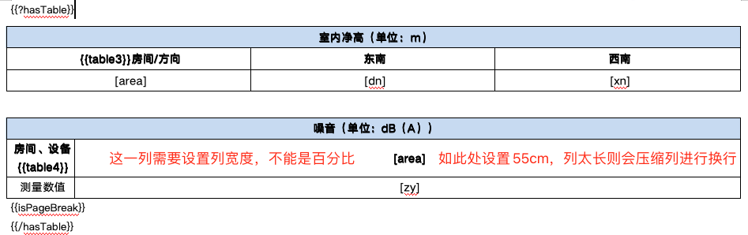
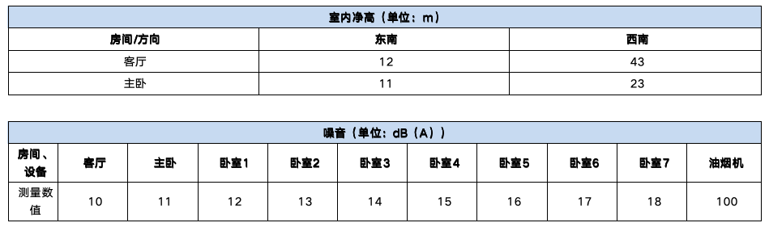

## 在线工具

- https://nowjava.com/jar/ 根据jar包名称，查看jar包中文件名信息，如查看druid-1.1.17.jar

## Hutool

> https://hutool.cn/docs/

### Bean/JSON操作

- Bean/Map/JSON相互转化

```java
// 注意：Hutool在处理JSON时对Null做了处理
JSONNull jsonNull = new JSONNull(); // null会包装成JSONNull
System.out.println(jsonNull == null); // false
System.out.println(jsonNull.equals(null)); // true

// ### Bean/Map <==> JSON; 深度拷贝
String str = JSONUtil.toJsonStr(person); // Bean => JSON字符串. 生成的字符串字段无顺序(尽管格式化LinkHashMap这种有顺序的对象)，有些加密场景可能不适用
Person person = JSONUtil.toBean(str, Person.class); // JSON字符串 => Bean
Person newPerson = JSONUtil.toBean(JSONUtil.toJsonStr(person), Person.class); // 实现深度拷贝。使用 BeanUtil.copyProperties 为浅拷贝
Map map = JSONUtil.toBean(str, Map.class);

// ### Bean <==> Map。具体参考[类型转换](#类型转换)
BeanUtil.copyProperties(map, person); // Map => Bean(会过滤掉map中多余的参数。从而可将controller接受参数设为@RequestBody Map<String, Object> params，保存时再进行转换)

// 基于json路径获取json节点只
// order=true时, 如果 respMap 为有序(LinkedHashMap)，则取出来的值也有序，否则有序会变成无序
JSONObject json = JSONUtil.createObj(JSONConfig.create().setOrder(true));
json.putAll(respMap);
JSONUtil.getByPath(json, "data.user");
// 有可使用BeanUtil.getProperty进行获取(基于BeanPath)bean、map等
BeanUtil.getProperty()
```

- 复制Bean

```java
// 忽略NULL值(即NULL值不会覆盖目标对象，但不会忽略空值)，和忽略部分属性。痛点：像 org.springframework.beans.BeanUtils.copyProperties 则无法忽略NULL值
BeanUtil.copyProperties(source, target, CopyOptions.create().ignoreNullValue().setIgnoreProperties("id", "inputer", "inputTm"));
BeanUtil.copyProperties(source, Map.class); // 会直接返回一个新Map，传入Bean的class亦可。有写场景不行，需要先new HashMap

// 仅拷贝部分属性，暂未找到相应方法，可重新定义一个仅有部分字段的Bean进行接收
```
- JSON

```java
// 根据路径获取值. 更强大的工具类：https://github.com/json-path/JsonPath 类似xpath获取json值
JSONUtil.getByPath(JSONUtil.parse(map), "users[0].classInfo.name");
```

### 集合

- 快速组装Map

```java
Dict dict = Dict.create().set("key1", 1).set("key2", 1000L); // Dict继承HashMap，其key为String类型，value为Object类型
Long v2 = dict.getLong("key2");
```
- 交/并/差等

```java
// ## 做减法，如：[1, 2] - [2, 3] = [1]。不建议使用 CollUtil.subtract(偶尔会报Null)
List<String> oldCodes = new ArrayList<>();
List<String> newCodes = new ArrayList<>(Arrays.asList(menuIds)); // 类型为 ArrayList。如果 List<String> newCodes = Arrays.asList(menuIds); // 类型为 Array$ArrayList
List<String> codes = CollUtil.subtractToList(newCodes, oldCodes); // 返回新对象。此时两个对象类型必须一致，如其中一个为Array$ArrayList，则会报错

// 去重、去空字符串(此时传入集合元素必须是字符串，如果去NULL则元素可为任意对象)
List<String> list = CollUtil.distinct(CollUtil.removeBlank(Convert.toList(String.class, this.row))); // 对Excel中读取的数据进行处理
```

- 分组
    - **暂未找到基于字段值分组成数组的方法，可参考MiscU.groupByMapKey和MiscU.groupByBeanKey**

```java
// 但是被分组的集合只能是对象集合，不能是Map集合，可使用 MiscU.fieldValueMap 代替
Map<Long, Person> feeRuleMap = CollUtil.fieldValueMap(personList, "id");
```

### 类型转化

```java
// ==> List转成数组
List<String> oldCodes = new ArrayList<>();
Object[] objArr = oldCodes.toArray;
String[] strArr = Convert.toStrArray(list.toArray); // 将list转成 String[]

// ==> List中元素类型转换
Long id = Convert.toLong(params.get("id"));
List<Long> ids = Convert.toList(Long.class, params.get("ids")); // 痛点：controller中通过map接受参数时(@RequestBody Map<String, Object> params)，小值数据会被转成Integer，而ID一般设置成了Long

// ==> 转Int
Integer.valueOf("2.0"); // NumberFormatException
NumberUtil.parseInt("2.0"); // 会自动去掉小数点及之后字符
```

### 验证

- 断言

```java
// 不满足会抛出 IllegalArgumentException 异常
Assert.notNull(a); // 是否不为NULL
Assert.notEmpty(a); // 是否非空
Assert.notBlank(a); // 是否非空白符
Assert.assertEquals("value", val);
// 不满足会抛出 IllegalStateException 异常
Assert.state(false);
```
- 字段验证器

```java
// 判断验证
boolean flag = Validator.isEmpty(str); // **不好用，只能验证null和空字符串，不能验证集合为空**
boolean flag = Validator.isNotEmpty(str);
boolean flag = Validator.isEmail("demo@example.com");
// 异常验证，失败会抛出 ValidateException 异常
Validator.validateChinese("我是一段zhongwen", "内容中包含非中文");
```

### 字符串

```java
// （成对）剥掉前后字符
StrUtil.strip("'abc'", "'"); // abc
StrUtil.strip("[abc]", "[", "]"); // abc
System.out.println(StrUtil.strip(StrUtil.strip("'1''2\"3'", "\""), "'")); // '1''2"3' => (去掉前后的 ") '1''2"3'  => (去掉前后的 ') 1''2"3

// 连接字符串
StrUtil.join(":", 1, "2", null, "4", 5.00); // 1:2:null:4:5.0
```

### 构建树结构

```java
List<SysRouter> sysRouters = queryAll();

TreeNodeConfig treeNodeConfig = new TreeNodeConfig();
// 自定义参数，也可全部使用默认
treeNodeConfig.setIdKey("id");
treeNodeConfig.setChildrenKey("children");
treeNodeConfig.setWeightKey("orderNum"); // 设置排序字段
treeNodeConfig.setDeep(10); // 配置树深度

//转换器
List<Tree<String>> treeList = TreeUtil.build(sysRouters, "0", treeNodeConfig, (treeNode, tree) -> {
    tree.setId(treeNode.getId().toString());
    tree.setParentId(treeNode.getParentId().toString());
    tree.setWeight(treeNode.getOrderNum());
    tree.setName(treeNode.getName());

    // 扩展属性
    tree.putExtra("path", treeNode.getPath());
    tree.putExtra("hasClassify", treeNode.getHasClassify());
});
```

### 数字操作

```java
// NumberUtil会将double转为BigDecimal后计算，解决float和double类型无法进行精确计算的问题；BigDecimal并不能解决小数点问题
/* 痛点：
new BigDecimal(0.1).add(new BigDecimal(1)); // 1.1000000000000000055511151231257827021181583404541015625
new BigDecimal("0.1").add(new BigDecimal("1")); // 1.1
*/
NumberUtil.add(0.1, 1); // 1.1
NumberUtil.div(10, 1, 2); // 7
NumberUtil.mul(0.55, 1.27); // 0.6985 返回类型为double
NumberUtil.round(NumberUtil.mul(0.55, 1.27), 2); // 0.70 返回类型为BigDecimal，默认为四舍五入
NumberUtil.div(12, 2, 3); // 6.0
```

### 日期操作

```java
DateUtil.isIn(thisDate, DateUtil.offsetDay(new Date(), -10), new Date()); // 判断 thisDate 是否为最近10天的时间

// 获取当前小时
int nowHour = DateUtil.thisHour(true);
// 获取天级别的开始时间，即当天的0点
DateUtil.beginOfDay(new Date());
// 获取秒级别的开始时间，即将当前时间的毫秒设置成0(秒还是当前时间)
DateUtil.beginOfSecond(new Date());
```

### 加解密

```java
// ################# AES 对称加密
AES aes = new AES(Mode.CBC, Padding.PKCS5Padding, "ShengQiTech@AEZO".getBytes(), "ShengQiTech@AEZO".getBytes());
String username = aes.decryptStr(HexUtil.decodeHex("ec251f39e74c3fa672edd6208c74efa7".toCharArray())); // admin
// 这种默认的解密方式会报错 v5.5.1
SymmetricCrypto sc = SecureUtil
    .aes(sqAuthConfig.getTransEncKey().getBytes())
    .setIv(sqAuthConfig.getTransEncKey().getBytes())
    .decryptStr(HexUtil.decodeHex("ec251f39e74c3fa672edd6208c74efa7".toCharArray()));
```

### 文件工具类-FileUtil

```java
// 获取类同级目录下文件
File file = new ClassPathResource("templates").getFile(); // 在当前类所在目录获取文件，cn/aezo/test/templates，如果运行在idea中则可以放在resource目录即可
// 获取classpath下文件
// File file = ResourceUtils.getFile("classpath:templates"); // org.springframework.util. 如果是maven多模块，可能获取失败
File file = new File(FileU.class.getClassLoader().getResource("templates")); // 也可传入 cn/test 等路径

ResourceUtil.getResource("templates"); // 返回 URL

// 如果路径不存在则创建路径
if (!FileUtil.exist(path)) {
    // 会自动创建多级路径，也可不用上面的判断
    FileUtil.mkdir(path);
}
```

### Excel工具-ExcelUtil

```java
// 读取Excel
ExcelReader reader = ExcelUtil.getReader("D:/temp/test.xls");
List<List<Object>> readAll = reader.read(); // 读取所有数据
List<Object> row = readAll.get(0); // 获取一行数据。合并单元格的会复制合并组的第一列数据
List<String> list = CollUtil.distinct(CollUtil.removeBlank(Convert.toList(String.class, this.row))); // 去重、去空字符串

// 写出Excel.
ExcelWriter writer = ExcelUtil.getWriter("D:/temp/test.xls");
// 基于数组写出 List<List<Object>>
writer.write(userArr, true);
// 此时基于Bean/Map写出
writer.addHeaderAlias("no", "编号"); // 设置字段顺序
writer.addHeaderAlias("name", "姓名");
writer.write(userList, true);
// 写出数据，关闭资源(此步骤才会写入文件，会自动创建文件)
writer.close();
```

### Http请求-HttpRequest

```java
String apiResult = HttpRequest.post("http://api.test.com/hello")
                .header("token", "123456")
                .body(bodyStr, "application/json;charset=UTF-8")
                // Hutool默认没有设置超时时间，需要手动设置一下，否则容易出现卡死(如Tomcat卡死，或定时线程卡死)
                .timeout(30000)
                .execute()
                .body();
```

### FTP客户端封装-Ftp

```java
// 一次定时操作：创建新的FTP客户端 - 获取文件 - 关闭客户端
Ftp ftp = null;
try {
    ftp = new Ftp(...);

    FTPFile[] ftpFiles = ftp.lsFiles("/in");
    if(ValidU.isNotEmpty(ftpFiles)) {
        for (FTPFile ftpFile : ftpFiles) {
            if(!ftpFile.isFile()) {
                continue;
            }

            parseEdi(...);
        }
    }
} finally {
    if(ftp != null) {
        ftp.close();
    }
}

// 上传
ftp.upload("/tmp/", file);
// 移动文件
FTPClient client = ftp.getClient();
client.rename("/tmp/" + file.getName(), "/dest/" + file.getName());
```

### 线程工具

- 线程工具-ThreadUtil
    - Hutool使用`GlobalThreadPool`持有一个全局的线程池，默认所有异步方法在这个线程池中执行
    - 基于`SynchronousQueue`实现: 这是一个没有容量的阻塞队列。每个插入操作都必须等待另一个线程的对应移除操作，因此此队列维持着零元素

```java
// 使用GlobalThreadPool执行(无队列概念), 无返回值
ThreadUtil.execute
// 使用GlobalThreadPool异步执行(无队列概念), 有返回对象
ThreadUtil.execAsync
// 获得一个新的线程池(也是基于SynchronousQueue，只不过和GlobalThreadPool区分开)
ThreadUtil.newExecutor()
```
- 自定义线程池-ExecutorBuilder

```java
ExecutorService executor = ExecutorBuilder.create()
    .setCorePoolSize(5)
    .setMaxPoolSize(10)
    .setWorkQueue(new LinkedBlockingQueue<>(100))
    .build();
```

### 模板引擎封装-TemplateUtil

- 可以操作Beetl、Enjoy、Rythm、FreeMarker、Velocity、Thymeleaf，只需引入相应的jar包
- 模板规则参考[Velocity](/_posts/java/velocity.md)、[FreeMarker](/_posts/java/freemarker.md)、[Thymeleaf](/_posts/java/thymeleaf.md)
- 使用

```java
// 此处从classpath查找模板渲染（也可通过字符串模板、本地文件等方式渲染内容）
// 此处有可设置路径如templates,但是只能是一级目录，且engine.getTemplate必须直接是文件，不能为文件夹
// 如果设置成空，engine.getTemplate写全路径即可
TemplateConfig templateConfig = new TemplateConfig("", TemplateConfig.ResourceMode.CLASSPATH);
if(customEngine != null) {
    templateConfig.setCustomEngine(customEngine); // 默认为第一个可用的引擎，即导入对应引擎包即可；此处可进行自定义引擎类，如 VelocityEngine.class
}
TemplateEngine engine = TemplateUtil.createEngine(templateConfig);
Template template = engine.getTemplate("templates/email/velocity_test.vtl");
String result = template.render(Dict.create().set("name", "Hutool"));
```

## Sa-Token

- 官网：https://sa-token.cc/
- 默认将数据保存在内存中，分布式环境可设置成保存到Redis；和JWT集成支持Stateless无状态模式

## Spring工具类

```java
// 处理url字符串(必须完整路径)：提取参数
UriComponents uriComponents = UriComponentsBuilder.fromHttpUrl(url).build();
uriComponents.getQueryParams().get("name"); // 返回List
```

## Excel/Word/Pdf操作

### poi

- 其他基本都是基于此衍生而来
- Excel基本使用

```java
// 合并单元格：将第2行的第1-2列合并
sheet.addMergedRegion(new CellRangeAddress(1, 1, 0, 1));
sheet.getRow(1).getCell(0).setCellValue('合并单元格设值，只需要针对左上角的单元格设值');


// 移动行
// startRow 要移动的开始行
// endRow 要移动的结束行, 必须 >= startRow
// n 要移动的行数，n为负数代表向上移动
// copyRowHeight 是否复制行高
// resetOriginalRowHeight 是否重置行高
sheet.shiftRows(int startRow, int endRow, int n, boolean copyRowHeight, boolean resetOriginalRowHeight)


// 设置单元格背景颜色: 灰色
headStyle.setFillForegroundColor(IndexedColors.GREY_25_PERCENT.getIndex());
headStyle.setFillPattern(FillPatternType.SOLID_FOREGROUND);
// 设置单元格边框: 黑色细框
headStyle.setBorderTop(BorderStyle.THIN);
headStyle.setBorderBottom(BorderStyle.THIN);
headStyle.setBorderLeft(BorderStyle.THIN);
headStyle.setBorderRight(BorderStyle.THIN);
headStyle.setTopBorderColor(IndexedColors.BLACK.index);
headStyle.setBottomBorderColor(IndexedColors.BLACK.index);
headStyle.setLeftBorderColor(IndexedColors.BLACK.index);
headStyle.setRightBorderColor(IndexedColors.BLACK.index);
```
- Word基本使用(poi 5.2.2)

```java
// 表格操作 org.apache.poi.xwpf.usermodel.XWPFTable
XWPFTableRow curRow = table.insertNewTableRow(1); // 在表格的第二行创建 
XWPFTableCell cell = curRow.getCell(0); // 获取第一个单元格
XWPFParagraph paragraph = cell.getParagraphs().get(0); // 获取第一个单元格的段落(第一段)
paragraph.setAlignment(ParagraphAlignment.LEFT); // 设置段落左对齐
XWPFRun xwpfRun = paragraph.getRuns().get(0); // 获取段落文本
xwpfRun.setFontSize(9); // 设置文本字体大小和颜色
xwpfRun.setColor("ed4014"); // hex值
```

### poi-tl基于模板生成Word

- [github](https://github.com/Sayi/poi-tl)、[文档](http://deepoove.com/poi-tl/)
- **基于模板操作Word**
- 技巧
    - 区块支持内嵌子区块(原代码貌似会有问题，修复一下NumberingContinue.java即可)
    - 对于图片引用，WPS无法修改文字，可将图片文件名改成对于模板变量在拖到WPS，如`{{itemImage}}.png`
    - 对于部分排版场景可考虑无边框表格，循环渲染更方便
    - 貌似如果`builder.useSpringEL();`开启SpringEL，则都必须使用这种模式，则不支持自带的表格`{{井号table}}`(实际是#table，由于hexo编译会报错，改成"井号table")等写法
- 表格行循环和表格列循环

```java
LoopRowTableRenderPolicy rowPolicy = new LoopRowTableRenderPolicy();
LoopColumnTableRenderPolicy colPolicy = new LoopColumnTableRenderPolicy();

Configure config = Configure.builder()
        .bind("table3", rowPolicy)
        .bind("table4", colPolicy)
        .build();

data.put("table3", table3);
data.put("table4", table4);
```




- 动态增加换页符(参考上文案例图)

```java
// 参考：https://blog.csdn.net/wzw114/article/details/127545483
Configure config = Configure.builder()
        .bind("isPageBreak", new AbstractRenderPolicy<Boolean>() {
            @Override
            public void doRender(RenderContext<Boolean> context) throws Exception {
                XWPFRun where = context.getWhere();
                boolean thing = context.getThing();
                where.setText("", 0);
                if (thing) {
                    where.addBreak(BreakType.PAGE);
                }
            }
        })
        .build();

// 模板中使用 {{isPageBreak}}
XWPFTemplate template = XWPFTemplate.compile("src/test/resources/poitl/tpl/template3.docx", config);

data.put("isPageBreak", true);
template.render(data);
```

### Easypoi基于模板生成Excel

- [Easypoi](https://gitee.com/wupaas/easypoi)、[文档(已关闭)](http://www.wupaas.com/open/easypoi.html)
- 优点
    - **基于变量模板导出**
    - excel和html互转。html转excel需要导入org.jsoup#jsoup包，支持将多个table生成到多个sheet中，每个table标签设置一个sheetName属性
- 缺点
    - BUG较多
    - pdf导出文档不详
    - 测试demo运行不完整
    - excel转html不灵活，无法设置转出的页面样式，如宽度
    - html转excel不完善，仅支持table转换，其他html标签不支持，且有些样式会丢失
- 使用(v4.2.0)

```java
// ==> 简单的列表循环
// 列表模板格式如: {{$fe:dataList t.one     t.two       t.three}}
// 单独取值格式如: {{othDataMap.hello}}
TemplateExportParams exportParams = new TemplateExportParams(tplPath, true);
Map<String, Object> dataMap = new HashMap<>();
dataMap.put("dataList", dataList);
dataMap.put("othDataMap", othDataMap);
Workbook workbook = ExcelExportUtil.exportExcel(exportParams, dataMap);
// 返回文件路径
String filePath = DateUtil.format(new Date(), "/yyyy/MMdd/") + "导出数据.xlsx";
String outFilePath = prefix + filePath;
FileUtil.mkParentDirs(outFilePath);
FileOutputStream fos = new FileOutputStream(outFilePath);
try {
    workbook.write(fos);
} finally {
    workbook.close();
    fos.close();
}

// ==> 导出图片
// 宽度通过调节模板列宽度实现(如20cm)，此处200设置无效，高度可在此处设置
// 每个单元格只能导出一张图片，如果需要导出多张图片，可设置字段成img1、img2、img3等每个占一列
ImageEntity imageEntity = new ImageEntity(byte[] | imgUrl, 200, 2000);
list.get(0).put("img1", imageEntity);
```
- 说明
    - 常量在Excel中为`'常量值'`，由于可能存在转义，所有需要设置成`''常量值'`
    - 解决EasyPoi通过`]]`换行报错的问题，[参考](https://gitee.com/lemur/easypoi/issues/I1FQRM)
        - 修改源码`ExcelExportOfTemplateUtil.java`的setForeachRowCellValue方法

            ```java
            // 修改前
            row = row.getSheet().getRow(row.getRowNum() - rowspan + 1);
            
            // 修改后
            Row tmpRow = row;
            row = row.getSheet().getRow(row.getRowNum() - rowspan + 1);
            if(row == null || row.getRowNum() < tmpRow.getRowNum()) {
                row = tmpRow;
            }

            // 使用如
            // 第一列                    // 第二列
            {{$fe: list t.username      ]]
            t.password	                }}
            ```

### Excel转PDF

- [Aspose](https://www.aspose.com/) 需要收费，有水印文字。破解参考下文[Aspose](#Aspose)
    - 转换后字体、样式、打印边距都可以达到和Excel基本一致
- [spire](https://www.e-iceblue.cn/) 需要收费(国产)，使用 Free Spire 对应的依赖 class文件也加密了
- jacob: 需要jacob.jar以及jacob.dll(未测试)
    - 需要jacob.jar来调用activex控件，本机需安装Office/WPS/pdfcreator(wps有linux版，office到现在为止还没有linux版)
- poi+itext 效果可能不太好
    - https://www.cxybb.com/article/littlebrain4solving/40430653

### Aspose

- 组件介绍
    - [Aspose.Cells](https://reference.aspose.com/cells/zh/) 操作Excel
        - 如果需要将Excel转成PDF也只需要引入Cells，无需引入Aspose.PDF
    - [Aspose.Words](https://reference.aspose.com/words/zh/) 操作Word
        - 如果需要将Word转成PDF也只需要引入Words，无需引入Aspose.PDF
    - [Aspose.PDF](https://reference.aspose.com/pdf/zh/) 操作PDF
    - Aspose.Slides
    - ...
- Linux上默认没有微软雅黑等中文字体，可将Windows中的字体复制过去然后进行安装
    - Windows字体目录：C:\Windows\Fonts，simsun.ttc(宋体)，msyf.ttc(微软雅黑)
    - 安装参考 https://zhuanlan.zhihu.com/p/360014306

#### Excel转成PDF案例

- 配置

```xml
<!-- 操作Excel -->
<dependency>
    <groupId>com.aspose</groupId>
    <artifactId>aspose-cells</artifactId>
    <version>21.11</version>
</dependency>

<repository>
    <id>AsposeJavaAPI</id>
    <name>Aspose Java API</name>
    <url>https://repository.aspose.com/repo/</url>
</repository>

<!-- aspose-license.xml 此为过期的license -->
<License>
    <Data>
        <Products>
            <Product>Aspose.Total for Java</Product>
            <Product>Aspose.Words for Java</Product>
        </Products>
        <EditionType>Enterprise</EditionType>
        <SubscriptionExpiry>29991231</SubscriptionExpiry>
        <LicenseExpiry>29991231</LicenseExpiry>
        <SerialNumber>8bfe198c-7f0c-4ef8-8ff0-acc3237bf0d7</SerialNumber>
    </Data>
    <Signature>
        sNLLKGMUdF0r8O1kKilWAGdgfs2BvJb/2Xp8p5iuDVfZXmhppo+d0Ran1P9TKdjV4ABwAgKXxJ3jcQTqE/2IRfqwnPf8itN8aFZlV3TJPYeD3yWE7IT55Gz6EijUpC7aKeoohTb4w2fpox58wWoF3SNp6sK6jDfiAUGEHYJ9pjU=
    </Signature>
</License>

```
- 使用

```java
import com.aspose.cells.License;
import com.aspose.cells.SaveFormat;
import com.aspose.cells.Workbook;

public class AsposeU {

    static {
        License license = new License();
        license.setLicense(AsposeU.class.getClassLoader().getResourceAsStream("/license/aspose-license.xml"));
    }

    public static void excelToPdf(InputStream stream, String pdfPath) {
        FileOutputStream fileOS = null;
        try {
            // 读入Excel文件流
            Workbook wb = new Workbook(stream);
            // 转换成的pdf文件保存路径
            fileOS = new FileOutputStream(pdfPath);
            wb.save(fileOS, SaveFormat.PDF);
        } catch (Exception e) {
            e.printStackTrace();
        } finally {
            if(fileOS != null) {
                try {
                    fileOS.close();
                } catch (IOException e) {
                    e.printStackTrace();
                }
            }
        }
    }
}
```

#### Word转PDF案例

- Linux上默认没有微软雅黑等中文字体，可将Windows中的字体复制过去然后进行安装
    - Windows字体目录：C:\Windows\Fonts，simsun.ttc(宋体)，msyf.ttc(微软雅黑)
    - 安装参考 https://zhuanlan.zhihu.com/p/360014306

```java
// 参考Excel转成PDF案例
public class AsposeU {
    private static final boolean LicenseReady;

    static {
        License license = new License();
        try {
            license.setLicense(ResourceUtil.getStream("license/aspose-license.xml"));
            LicenseReady = true;
        } catch (Exception e) {
            throw new RuntimeException("初始化aspose-license出错", e);
        }
    }

    public static void wordToPdf(InputStream inputStream, String pdfPath) {
        if(!LicenseReady) {
            throw new IllegalStateException("转换文件失败");
        }

        //if (SystemUtil.getOsInfo().isMac()) {
        //    FontSettings.getDefaultInstance().setFontsFolder("/System/Library/Fonts", true);
        //}
        FileOutputStream fileOS = null;
        try {
            fileOS = new FileOutputStream(pdfPath);
            Document document = new Document(inputStream);
            // 全面支持DOC, DOCX, OOXML, RTF HTML, OpenDocument, PDF, EPUB, XPS, SWF 相互转换
            //document.save(fileOS, SaveFormat.PDF);

            // https://reference.aspose.com/words/zh/java/com.aspose.words/pdfsaveoptions/
            PdfSaveOptions pdfSaveOptions = new PdfSaveOptions();
            pdfSaveOptions.setImageCompression(PdfImageCompression.JPEG); // 图片全部转成JPG，不支持透明PNG
            pdfSaveOptions.setJpegQuality(60);
            pdfSaveOptions.setOptimizeOutput(true);
            document.save(fileOS, pdfSaveOptions);
        } catch (Exception e) {
            throw new RuntimeException("转换文件出错", e);
        } finally {
            IoUtil.close(fileOS);
        }
    }
}
```

#### 破解(仅供学习)

- 网上较多结合org.apache.pdfbox去除水印，但是测试下来效果不好
- 直接破解源码参考(Word/Excel/Pdf)
    - https://juejin.cn/post/7034405665376321567 (测试通过)
    - https://gitee.com/evilrule/crack-aspose
- 原理
    - 使用 javassist 修改 aspose-cells-21.11.jar 源码
    - License#setLicense 最终会进入 `this.a` 方法，而此方法大部分都是校验逻辑，如果通过都会进入`zblc.a`方法，因此修改`this.a` 方法即可
- 破解之后还是正常导入License，只是破解之后就不会校验License正确性，从而不会生成水印

## 数据库

### liquibase数据库版本管理

- 数据库版本管理 https://www.liquibase.org/

### jsqlparser

- 官网: https://jsqlparser.sourceforge.net/
- SQL解析: net.sf.jsqlparser.parser

## 语言

### Yaml解析(基于jyaml)

- json-yaml互转工具：https://www.bejson.com/json/json2yaml
- 依赖

```xml
<dependency>
    <groupId>org.jyaml</groupId>
    <artifactId>jyaml</artifactId>
    <version>1.3</version>
</dependency>
```
- yaml

```yml
name: smale
age: 18
child:
  # 需要有空格，否则解析报错
  - name: aezo
    age: 10
```
- 代码

```java
// model
@Data
public class Person {
    private String name;
    private String age;
    private Person[] child; // 不能使用数组接受，否则解析失败
}

// 解析
File dataFile = new File(System.getProperty("user.dir") + "/src/gen/data.yaml");
Person person = (Person) Yaml.loadType(dataFile, Person.class);

// 生成Map
Map map = (Map) Yaml.load(yamlStr);
```

### jackson

- 其他说明
    - 像fastjson、jackson等工具类，将对象转成json字符串时，如果继承了Map即可，则默认会忽略其他属性，仅会序列化Map的值，貌似可以显示指定
- Jackson 的 1.x 版本的包名是 org.codehaus.jackson ，当升级到 2.x 版本时，包名变为 com.fasterxml.jackson
- 依赖(jackson-databind 依赖 jackson-core 和 jackson-annotations)

```xml
<dependency>
    <groupId>com.fasterxml.jackson.core</groupId>
    <artifactId>jackson-databind</artifactId>
    <version>2.9.1</version>
</dependency>
```
- 示例

```java
// 使用
ObjectMapper objectMapper = new ObjectMapper();
String str = objectMapper.writeValueAsString(obj); // 序列化
Map<String, Object> map = objectMapper.readValue(jsonStr, Map.class); // 反序列化，得到的Map为LinkedHashMap(有序)
Class obj = objectMapper.readValue(jsonStr, clazz); // 反序列化

// 扩展配置-序列化
// 配置参数参考：com.fasterxml.jackson.databind.SerializationFeature
            // 忽略空对象
objectMapper.setSerializationInclusion(JsonInclude.Include.NON_NULL);
            // 遇到空对象是否失败(默认true)
            .configure(SerializationFeature.FAIL_ON_EMPTY_BEANS, false);
// INDENT_OUTPUT 是否缩放排列输出，默认false，有些场合为了便于排版阅读则需要对输出做缩放排列

// 扩展配置-反序列化
// 反序列化时忽略对象中不存在的json字段, 防止报错
objectMapper.configure(DeserializationFeature.FAIL_ON_UNKNOWN_PROPERTIES, false);

// 模块
// 定制化 Schema 序列化方式
public class UserSerializer extends JsonSerializer<Schema> {
    @Override
    public void serialize(User value, JsonGenerator jgen, SerializerProvider provider) throws IOException {
        jgen.writeString(value.getFullName()); //直接输出当前 User 对象的全限类名
    }
}
// 给 ObjectMapper 加上定制的序列化器
SimpleModule simpleModule = new SimpleModule("SimpleModule", Version.unknownVersion());
simpleModule.addSerializer(User.class, new UserSerializer());
objectMapper.registerModule(simpleModule);

// 过滤器
// 忽略某些参数名
FilterProvider filterProvider = new SimpleFilterProvider()
    .addFilter("fieldFilter", SimpleBeanPropertyFilter.serializeAllExcept("name"));
objectMapper.setFilters(filterProvider);

// Mixin（混入）: 可将model类动态混入一些其他注解，相当于把Model类需要过滤的属性配置在其他类或接口上
// https://yanbin.blog/jackson-ignore-specified-field-type/
// 1.定义混入类
@JsonIgnoreType // 可以混入类的注解
@JsonFilter("userFilter")
public @interface UserMixIn {
    @JsonIgnore long id; // 也可以混入字段注解
}
// 配合上文 @JsonFilter("userFilter")
FilterProvider nameFilterProvider = new SimpleFilterProvider()
    .addFilter("userFilter", SimpleBeanPropertyFilter.filterOutAllExcept(new String[]{"name"}));
objectMapper.setFilters(nameFilterProvider);
// 2.将混入类关联到目标对象上
objectMapper.addMixIn(User.class, UserMixIn.class);
// 或者
objectMapper.getSerializationConfig().addMixInAnnotations(User.class, UserMixIn.class);

// 构建objectMapper
objectMapper = new Jackson2ObjectMapperBuilder()
                .createXmlMapper(false)
                .serializerByType(LocalDate.class, new LocalDateSerializer(DateTimeFormatter.ofPattern("yyyy-MM-dd")))
                .serializerByType(LocalDateTime.class, new LocalDateTimeSerializer(DateTimeFormatter.ofPattern("yyyy-MM-dd HH:mm:ss")))
                .build();
```

### fastjson

- [官网](https://github.com/alibaba/fastjson)
- [文档](https://github.com/alibaba/fastjson/wiki/Quick-Start-CN)
    - [fastjson最佳实践](http://i.kimmking.cn/2017/06/06/json-best-practice/)
- 自定义序列化之过滤器，参考上述文档，案例参考下文
    - 可以在每次JSON.toJSONString的时候单独传入过滤器
- 其他说明
    - 像fastjson、jackson等工具类，将对象转成json字符串时，如果继承了Map即可，则默认会忽略其他属性，仅会序列化Map的值，貌似可以显示指定
- 全局配置(序列化/反序列化)案例

```java
@Configuration
public class CustomFastjsonConfig {

    @PostConstruct
    public void init() {
        // 序列化拦截器(自定义序列化)：解决部分对象在反射时会附加DefaultListableBeanFactory(无法序列化)，全局去除
        PropertyPreFilter filter = (jsonSerializer, source, name) -> false;
        SerializeConfig.getGlobalInstance().addFilter(DefaultListableBeanFactory.class, filter);

        // 自定义反序列化：解决将""解析成List报错问题，增加此配置后返回null
        ObjectDeserializer deserializer = new CollectionCodec() {
            @Override
            public <T> T deserialze(DefaultJSONParser parser, Type type, Object fieldName) {
                String val = parser.getInput();
                if (val == null || "".equals(val)) {
                    return null;
                }
                return super.deserialze(parser, type, fieldName);
            }

            @Override
            public int getFastMatchToken() {
                return JSONToken.LBRACE;
            }
        };
        ParserConfig.getGlobalInstance().putDeserializer(List.class, deserializer);
    }
}
```

## 其他

### 字节码操作

- ASM、Javassist、Byte-buddy以及JavaAgent
- https://blog.csdn.net/luanlouis/article/details/24589193
- https://www.cnblogs.com/rickiyang/p/11336268.html
- https://blog.csdn.net/chosen0ne/article/details/50790372

### JEXL执行字符串JAVA代码

- Java Expression Language (JEXL)：是一个表达式语法解析引擎
    - 旨在促进在用Java编写的应用程序和框架中，实现动态和脚本功能
    - JEXL实现了 JSTL 中 EL 的延伸版本，不过也采用了一些 Velocity 的概念
    - 支持shell脚本或ECMAScript(js)中的大多数构造
- **更推荐使用ScriptEngineManager进行java-js的交互**，参考[javax.script](/_posts/java/java-release.md#javax.script(js-java))
- [commons-jexl官网](https://commons.apache.org/proper/commons-jexl/)
- [语法文档](https://commons.apache.org/proper/commons-jexl/reference/syntax.html)
- [案例](https://commons.apache.org/proper/commons-jexl/apidocs/org/apache/commons/jexl3/package-summary.html#usage)
- 依赖

```xml
<!-- https://mvnrepository.com/artifact/org.apache.commons/commons-jexl3 -->
<dependency>
    <groupId>org.apache.commons</groupId>
    <artifactId>commons-jexl3</artifactId>
    <version>3.2.1</version>
</dependency>
```
- 简单案例

```java
//创建或者取回一个引擎。线程安全，虽然每次create的对象不一样(但是内部创建对象时会进行copy)
JexlEngine jexl = new JexlBuilder().create();

// 创建一个表达式。必须 innerFoo 和 bar 必须是可被访问到的(public)的才能得出结果，否则返回null
String jexlExp = "foo.innerFoo.bar()";
JexlExpression e = jexl.createExpression(jexlExp);

//创建上下文并添加数据
JexlContext jc = new MapContext();
jc.set("foo", new Foo());

//现在评估表达式，得到结果，结果为最后一个表达式的运算值
Object o = e.evaluate(jc);
```
- 其他案例

```java
// ==> Jexl引擎能够创建两种解析器：脚本和表达式，其中JexlExpression不能使用 if、for、while 语句块。
JexlScript jexlScript = jexlEngine.createScript("if(age>=25){good=1;}else{good=0;}"); // 正确
JexlExpression jexlExpression = jexlEngine.createExpression("if(age>=25){good=1;}else{good=0;}"); // 错误

// ==> 可以从字符串、文件或 URL 中读取脚本
// ==> 函数定义：var fun = function(x, y) { x + y } 还支持以下语法 var fun = (x, y) -> { x + y } 如果函数只有一个参数，则可以省略括号 var fun = x -> { x * x }
String exp = "var t = 2; var s = function(x, y) {x + y + t}; t = 3; s(1, 1)"; 
JexlScript script = jexl.createScript("var t = 2; var s = function(x, y) {x + y + t}; t = 3; s(1, 1)");
Object evaluate = script.execute(null); // 4

// JxltEngine 中的 Expression 类似 JSP-EL 的基本模板功能。如果多行也可使用 JxltEngine.Template
JexlEngine jexl = new JexlBuilder().create();
JxltEngine jxlt = jexl.createJxltEngine();
JxltEngine.Expression expr = jxlt.createExpression("Hello ${user}");
String hello = expr.evaluate(context).toString();

// ==> 上下文命名空间
Map<String, Object> funcNamespace = new HashMap<>();
funcNamespace.put("math", Math.class);
JexlEngine jexl = new JexlBuilder().namespaces(funcNamespace).create();
JexlExpression je = jexl.createExpression("math:max(1, 2)");
Object evaluate = je.evaluate(null); // 此处没有传入任何上下文，但是可以使用math引用
System.out.println("evaluate = " + evaluate); // evaluate = 2
```

### Ureport报表

- [ureport](https://github.com/youseries/ureport)、[ureport文档](https://www.w3cschool.cn/ureport/ureport-jaod2h8k.html)
- 参考文档
    - ureport2整合到springboot: https://www.cnblogs.com/Jimc/p/12101035.html
    - ureport2数据源及自定义存储器(如数据库存储): https://www.cnblogs.com/Jimc/category/1621054.html
    - https://www.cnblogs.com/niceyoo/p/14311257.html
- ureport2整合到springboot

```xml
<!-- 目前maven最新为2.2.9. gitee(https://gitee.com/youseries_admin/ureport)上有最新的2.3.0-SNAPSHOT, 但是需要自行编译打包 -->
<dependency>
    <groupId>com.bstek.ureport</groupId>
    <artifactId>ureport2-console</artifactId>
    <version>2.2.9</version>
</dependency>
```
配置

```java
@Configuration
// 使用 @ImportResource 导入bean配置
// 说明: @ImportResource 会导致 @Value("${a:}") 的写法失效(无法使用:)，此时使用 @Value("${a}") 或者 SpringU.getEnv 代替
@ImportResource("classpath:ureport-console-context.xml") // 也可以对 ureport-console-context.xml 进行扩展配置, 参考SqBiz
public class UReportConfig {
    @Value("${spring.profiles.active}")
    private String profiles;

    @Value("${ureport.fileStoreDir}") // 貌似打包后无法获取到yml中配置的值，获取的仍然是jar中xml的配置值 /WEB-INF/ureportfiles
    private String fileStoreDir;

    @Resource
    private FileReportProvider fileReportProvider;

    @PostConstruct
    public void init() {
        // 支持开发环境共享报表配置
        String fileStoreDir = this.fileStoreDir;
        if(profiles.contains("dev")) {
            fileStoreDir = System.getProperty("user.dir") + "/data/ureport";
        }
        if(ValidU.isEmpty(fileStoreDir)) {
            throw new IllegalStateException("请配置 ureport.fileStoreDir 参数");
        }
        FileUtil.mkdir(fileStoreDir);
        fileReportProvider.setFileStoreDir(fileStoreDir);
    }

    /**
     * 增加映射路径
     */
    @Bean
    public ServletRegistrationBean<UReportServlet> registrationBean() {
        // 配置servlet映射
        ServletRegistrationBean<UReportServlet> bean = new ServletRegistrationBean<>(new UReportServlet());
        // 此处值必须为"/ureport/*"(不包含context path) 的 url-pattern 映射，否则系统将无法运行
        bean.addUrlMappings("/ureport/*");
        return bean;
    }
}
```
- 存在问题
  - UReport2部分功能不可用，包括导出及多条件表达式SQL查询(错误信息会直接暴露)
  - Ureport2支持打印报表，不过存在bug，数据会显示不全，导出为Word文档同样存在问题，数据不全且当有合并单元格时数据会混乱展示
  - 不支持邮件发送
  - 本身不支持权限控制
- 路径
  - 设计器路径 `http://localhost:8800/api/ureport/designer`
  - 预览路径 `http://localhost:8800/api/ureport/preview?_u=file:test.ureport.xml`
    - 注意需要带上`file:`，且文件名不要出现`#[]`等特殊字符串(`.`是可以的)
    - 参数`_u=file:xxx` 指定报表配置资源名
    - 参数`_i=1` 表示分页预览第一页
    - 参数`_t=0` 表示不显示导航条(顶部打印导出等按钮)
- 数据源和数据集
    - 配置数据源和数据集
        - 每个报表需要配置各自的数据源和数据集
        - 内置数据源只需要在创建报表的时候添加到当前报表即可使用
    - 带动态参数的SQL
        - `${}`会作为表单时解析，但是不能和纯SQL语句联合使用(如下文案例中相同部分SQL不能写到`${}`外部)
        - 字符串拼接SQL时注意空格
        - 参数不支持动态默认值；日期区间需要定义两个参数，且必须通过`param("tk_create_time_start")`方式取值(字符串中有单引号时必须转义)

    ```js
    ${
        " select ttu.user_id, ttu.tbk_nickname, tto.*"+
        " from tk_taoke_order tto"+
        " left join tk_taoke_user ttu on ttu.tbk_special_id = tto.special_id"+
        " where 1=1" +
        (param("user_id") != null && param("user_id") != '' ? " and ttu.user_id=:user_id" : "")+
        (param("tk_create_time_start") != null && param("tk_create_time_start") != '' ? " and tto.tk_create_time >= str_to_date(\'"+ param("tk_create_time_start") +" 00:00:00.000\', \'%Y-%m-%d %H:%i:%s.%f\')" : "") +
        (param("tk_create_time_end") != null && param("tk_create_time_end") != '' ? " and tto.tk_create_time <= str_to_date(\'"+ param("tk_create_time_end") +" 23:59:59.999\', \'%Y-%m-%d %H:%i:%s.%f\')" : "") +
        " order by tto.tk_create_time desc"
    }
    ```
- 列属性
    - 链接配置
        - 支持表达式，如`${'https:' + order.select(item_img)}`(order为数据集，item_img为字段)
    - 单元格类型为图片
    - 图片来源为路径时支持`http(s)://`的网络图片
    - 图片来源为表达式支持从数据集中读取后再获取图片数据
        - 如`'https:' + order.select(item_img)`(order为数据集，item_img为字段，返回格式为`//example.com/demo.png`)
        - 注意：此时显示获取图片路径字符串，然后通过服务器获取图片数据转成base64到前台显示(此时图片流量全部会经过服务器)
- 过滤条件：符合条件时，当前列才显示，否则当前列显示空白


## 开发工具

### Lombok

- [Lombox](https://projectlombok.org/) 简化代码工具
- 引入
    - maven项目中需要加入对应的依赖，从而打包时生成相应代码
    - idea需要安装Lombox插件，从而编译时生成相应代码，不会报错

- `@SneakyThrows` 修饰方法，捕获方法中的Throwable异常，并抛出一个RuntimeException
    - @SneakyThrows(UnsupportedEncodingException.class) 捕获方法中的UnsupportedEncodingException异常，并抛出RuntimeException
- `@NoArgsConstructor`、`@AllArgsConstructor`、`@RequiredArgsConstructor` 结合Spring注入
    - @AllArgsConstructor 会将所有的成员放到构造函数中，Spring会自动注入所有的字段(部分场景会出现无法注入，此时可通过@RequiredArgsConstructor完成)
    - @RequiredArgsConstructor 生成该类下被final修饰或者non-null修饰(@NonNull)字段生成一个构造方法

        ```java
        @Component
        @RequiredArgsConstructor
        public class ConstructorDemo {
            // Spring 会自动注入(final修饰)
            private final BeanTest1 beanTest1;

            // Spring 会自动注入(non-null修饰)；@NonNull 生成的代码会判空，为空则报空指针异常
            @NonNull
            private BeanTest2 beanTest2;

            // Spring 不会自动注入(没有final或者no-null修饰)
            private BeanTest3 beanTest3;

            // Spring 不会自动注入(如果用 @AllArgsConstructor 则会报错找不到这个类型的bean)
            private Integer sex = 1;

            // Spring 不会自动注入(如果用 @AllArgsConstructor 则会报错找不到这个类型的bean)
            @Value("${constructor.name:hello}")
            private String name;
        }
        ```
- 使用Builder构造器模式
    - **添加`@Builder`，需要额外添加以下注解`@NoArgsConstructor`、`@AllArgsConstructor`，缺一不可**。否则子类继承报错"无法将类中的构造器应用到给定类型"
    - 在父类和子类中同时使用`@SuperBuilder`(v1.18.4)解决子类在链式赋值时无法设置父类的字段问题 [^1]
    - `@Builder(toBuilder = true)`表示相应对象会附带`toBuilder`方法，将其转换成功Builder对象继续进行链式赋值。默认只能通过MyClass.builder()获取链式调用入口
    - **无法设置默认值，如实体类属性设置的值无效**
- `@Accessors(fluent = true, chain = true, prefix = "p")`
    - fluent属性表示生成getId/setId方法均省略前缀(get/set)，最终的方法名为id
    - chain属性表示setter方法返回当前对象
    - prefix属性表示生成的get/set方法会忽略前缀。即字段名为pId时，会生成为getId的方法
    - 如果作用在entity上，会导致mybatis的xml中resultMap字段无法识别

### sdkman

- [官网](https://sdkman.io/)
- sdkman 包管理工具
    - sdkman可以更方便的按照、更改sdk(如jdk)版本

### ProGuard

- 源码优化、混淆器
- [源码](https://github.com/Guardsquare/proguard)、[ProGuard官网手册](https://www.guardsquare.com/manual/home)


---

参考文章

[^1]: https://blog.csdn.net/qq_20021569/article/details/102471373
