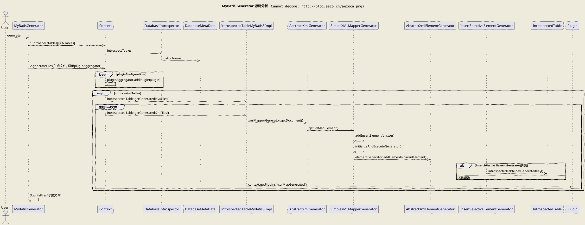

## 简介

- [MyBatis3中文文档](http://www.mybatis.org/mybatis-3/zh/index.html)
- `MyBatis Generator`：mybatis代码生成(model/dao/mapper)，[文档](http://www.mybatis.org/generator/)

### 简单使用

```java
String resource = "SqlMapConfig.xml";
InputStream in = Resources.getResourceAsStream(resource);
SqlSessionFactory factory = new SqlSessionFactoryBuilder().build(in);
SqlSession sqlSession = factory.openSession();
OrdersMapper mapper = sqlSession.getMapper(OrdersMapper.class);

List<Orders> list = mapper.findAll();
for (Orders order : list) {
    System.out.println(order);
}
```

## 整合mybatis(SpringBoot)

- 引入依赖(mybatis-spring-boot-starter为mybatis提供的自动配置插件) [^1]

	```xml
	<!-- 自动配置 https://github.com/mybatis/spring-boot-starter -->
	<dependency>
		<groupId>org.mybatis.spring.boot</groupId>
		<artifactId>mybatis-spring-boot-starter</artifactId>
		<!-- <version>1.3.1</version> -->
	</dependency>
	<!--mybatis分页插件: https://github.com/pagehelper/Mybatis-PageHelper-->
	<dependency>
		<groupId>com.github.pagehelper</groupId>
		<artifactId>pagehelper</artifactId>
		<version>5.0.4</version>
	</dependency>

	<!-- 方式二：会包含mybatis依赖，并且无需再mybatis配置文件中配置此插件。如果使用mybatis-plus插件则不需要此分页插件
        自动装配时，会获取初始化后的SqlSessionFactory，然后获取其Configuration，再将插件添加进去(而非在SqlSessionFactory初始化前进行配置的)
    -->
	<dependency>
		<groupId>com.github.pagehelper</groupId>
		<artifactId>pagehelper-spring-boot-starter</artifactId>
		<version>1.0.0</version>
	</dependency>

    <!-- 方式三：使用mybatis-plus(推荐)，使用内置自定义的分页插件 -->
	```
- 扫描配置(二者缺一不可)
    - 启动类中加 **`@MapperScan({"cn.aezo.springboot.mybatis.mapperxml", "cn.aezo.springboot.module.*.mapper"})`** 进行接口扫描
        - 此处一层包通配符为`.*.`，多次包为`.**.`，和mybatis.mapper-locations通配符配合使用进行多模块管理
        - mybatis-plus注解方式也是使用此类
    - 还需要加mybatis.mapper-locations的配置，进行xml映射文件扫描
        - mybatis-plus复写了此配置，对应`mybatis-plus.mapper-locations`，其默认值为`classpath*:/mapper/**/*.xml`，因此一般可不用配置此参数
- Springboot配置

```bash
# 基于xml配置时需指明映射文件扫描位置；设置多个路径可用","分割，如："classpath:mapper/*.xml(无法扫描其子目录),classpath:mapper2/*.xml"
# classpath只会扫描当前module的class, 而改为classpath*则会扫描所有jar
mybatis.mapper-locations=classpath:mapper/*.xml,classpath:mapper/**/*.xml
# mybatis配置文件位置(mybatis.config-location和mybatis.configuration...不能同时使用), 由于自动配置对插件支持不够暂时使用xml配置，可用于自定义插件
mybatis.config-location=classpath:mybatis-config.xml

## 不设置mybatis配置文件时
# mybatis.configuration.map-underscore-to-camel-case=true # 字段格式对应关系：数据库字段为下划线, model字段为驼峰标识(不设定则需要通过resultMap进行转换)
# mybatis.configuration.log-impl=org.apache.ibatis.logging.stdout.StdOutImpl # 声明打印日志到控制台。如果打印到日志需要到logback.xml中增加配置，或者配置logging.level.cn.aezo.mapper=DEBUG
# mybatis.type-aliases-package=cn.aezo.springboot.mybatis.model # 类型别名定义扫描的包(可结合@Alias使用, 默认是类名首字母小写)
```
- mybatis配置文件: `mybatis-config.xml`

	```xml
	<?xml version="1.0" encoding="UTF-8" ?>
	<!DOCTYPE configuration PUBLIC "-//mybatis.org//DTD Config 3.0//EN" "http://mybatis.org/dtd/mybatis-3-config.dtd">
	<!--在application.properties中使用了mybatis.configuration进行配置，无需此文件(传统配置)-->
	<configuration>
		<settings>
			<!--字段格式对应关系：数据库字段为下划线, model字段为驼峰标识(不设定则需要通过resultMap进行转换)-->
			<setting name="mapUnderscoreToCamelCase" value="true"/>

			<!--打印mybatis运行的sql语句到控制台。STDOUT表示调用System.out。-->
			<!-- 打印到日志，则需要在如logback.xml中加 <logger name="cn.aezo.video.dao" level="debug"/> 定义打印级别 -->
			<setting name="logImpl" value="STDOUT_LOGGING" />
		</settings>

		<!--类型别名定义-->
		<typeAliases>
			<!--定义需要扫描的包-->
			<package name="cn.aezo.springboot.mybatis.model"/>

			<!--定义后可在映射文件中间的parameterType等字段中使用userInfo代替cn.aezo.springboot.mybatis.model.UserInfo-->
			<!--<typeAlias alias="userInfo" type="cn.aezo.springboot.mybatis.model.UserInfo" />-->
		</typeAliases>

		<plugins>
			<!-- 分页插件 -->
			<!-- 5.0.0以后使用com.github.pagehelper.PageInterceptor作为拦截器 -->
			<plugin interceptor="com.github.pagehelper.PageInterceptor">
				<!--更多参数配置：https://github.com/pagehelper/Mybatis-PageHelper/blob/master/wikis/zh/HowToUse.md-->
				<!--<property name="pageSizeZero" value="true"/>-->
			</plugin>
		</plugins>

        <!-- 基于databaseId实现数据库兼容. DB_VENDOR为mybatis内置别名，对应VendorDatabaseIdProvider -->
        <databaseIdProvider type="DB_VENDOR">
            <property name="MySQL" value="mysql"/>        
            <property name="Oracle" value="oracle" />
        </databaseIdProvider>
	</configuration>
	```
- Model：**UserInfo/ClassInfo等无需任何注解.**(其中HobbyEnum是一个枚举类)

## annotation版本(适合简单业务)

- `annotation版本(适合简单业务)`
	- Dao层：UserMapper.java

		```java
		// @Mapper // 在启动类中定义需要扫描mapper的包：@MapperScan("cn.aezo.springboot.mybatis.mapper"), 则此处无需声明@Mapper
		public interface UserMapper {
			// 1. 此处注入变量可以使用#或者$
			// 2. 一个参数可以省略@Param，多个需要进行指定(反射机制)
			// 3. 当未获取到数据时，返回 null
			// 4. (使用配置<setting name="mapUnderscoreToCamelCase" value="true"/>因此无需转换) 数据库字段名和model字段名或javaType不一致的均需要@Result转换
				// @Results({
				//         @Result(property = "hobby",  column = "hobby", javaType = HobbyEnum.class),
				//         @Result(property = "nickName", column = "nick_name"),
				//         @Result(property = "groupId", column = "group_Id")
				// })
			@Select("select * from user_info where nick_name = #{nickName}")
			UserInfo findByNickName(@Param("nickName") String nickName);

			@Select("select * from user_info")
			List<UserInfo> findAll();

			@Insert("insert into user_info(nick_name, group_id, hobby) values(#{nickName}, #{groupId}, #{hobby})")
			void insert(UserInfo userInfo);

			@Update("update user_info set nick_name = #{nickName}, hobby = #{hobby} where id = #{id}")
			void update(UserInfo userInfo);

			@Delete("delete from user_info where id = #{id}")
			void delete(Long id);
		}
		```
	- 分页

		```java
		// 分页查询：http://localhost:9526/api/users
		@RequestMapping(value = "/users")
		public PageInfo showAllUser(
				@RequestParam(defaultValue = "1") Integer pageNum,
				@RequestParam(defaultValue = "5") Integer pageSize) {
			PageHelper.startPage(pageNum, pageSize); // 默认查询第一页，显示5条数据（必须在实例化PageInfo之前）
			// ... // 此处如果发起了其他sql则此处的sql会被分页，而下面的sql则不会被分页
			List<UserInfo> users = userMapper.findAll(); // 第一条执行的SQL语句会被分页，实际上输出users是page对象
			PageInfo<UserInfo> pageUser = new PageInfo<UserInfo>(users); // 将users对象绑定到pageInfo

			return pageUser;
		}
		```

		- 分页查询结果

		```js
		{
			pageNum: 1,
			pageSize: 5,
			size: 2,
			startRow: 1,
			endRow: 2,
			total: 2,
			pages: 1,
			list: [
				{
					id: 1,
					groupId: 1,
					nickName: "smalle",
					hobby: "GAME"
				},
				{
					id: 2,
					groupId: 1,
					nickName: "aezo",
					hobby: "CODE"
				}
			],
			prePage: 0,
			nextPage: 0,
			isFirstPage: true,
			isLastPage: true,
			hasPreviousPage: false,
			hasNextPage: false,
			navigatePages: 8,
			navigatepageNums: [
				1
			],
			navigateFirstPage: 1,
			navigateLastPage: 1,
			firstPage: 1,
			lastPage: 1
		}
		```
	- 测试

		```java
		@Test
		public void testFindByNickName() {
			UserInfo userInfo = userMapper.findByNickName("smalle");
			System.out.println("userInfo = " + userInfo);
		}

		@Test
		public void testInsert() throws Exception {
			userMapper.insert(new UserInfo("test", 1L, HobbyEnum.READ));
		}
		```

- 基于注解的sql示例(用于简单的查询) [^2]

    - 用script标签包围，然后像xml语法一样书写
        
        ```java
        // Dao层，mybatis会基于此注解完成对应的实现
        // 可以理解为查询sql语句返回的是一个List<Map<String, Object>>(List里面必须为Map或其子类)。如果用Map<String, Object>接受返回值则默认取第一条数据
        // 使用双引号重命名字段解决返回数据字段全变大写
        @Select({ "<script>",
            "select h.help_id as \"help_id\", h.apply_money, h.create_time, h.creator, h.description, h.is_comfort, h.is_valid, h.title, h.update_time, h.updater ",
            "   , e.name",
            " from th_help as h ",
            "   left join th_event e on e.event_id = h.event_id",
			"   left join th_group g on g.group_id = h.group_id ",
            " where 1=1 ",
			// 此时可以使用<if>或<when>
			" <if test='plans != null and plans.size() > 0'>", // 其中大于号也可以使用`&gt;`来表示
            "   and g.plan_id in ",
			// in 的使用。item为当前元素，index为下标变量
            "   <foreach item='plan' index='index' collection='plans' open='(' separator=',' close=')'>",
            "       #{plan.planId}",
            "   </foreach>",
            " </if>",
			// like 的使用。此处必须使用concat进行字符串连接. oracle则需要使用 h.title like concat(concat('%',#{roleName}),'%')
            " <if test='help.title != null and help.title != \"\"'> AND h.title like concat('%', #{help.title}, '%')</if>",
            " <if test='event.name != null'> AND e.name = #{event.name}", "</if>",
			// or 的使用(1 != 1 or .. or ..)
			" <if test='help.title != null and help.desc != null or help.start != null and help.end != null'> and (",
			"  <if test='help.title != null and help.desc != null>",
			"    help.title = #{help.title}",
			"  </if>",
			"  <if test='help.start != null and help.end != null>",
			"    or help.start = #{help.start} and help.end = #{help.end}",
			"  </if>",
			" ) </if>",
            "</script>" })
        List<Map<String, Object>> findHelps(@Param("help") Help help, @Param("event") Event event, @Param("plans") List<Plan> plans);
		// 还是使用上面script，如果提供对应的HelpPojo对象，mybatis会自动将字段的下划线转成驼峰，并去寻找HelpPojo相应的属性
		// List<HelpPojo> findHelps(@Param("help") Help help, @Param("event") Event event, @Param("plans") List<Plan> plans);

		// 此方法也可以再xml中实现（即部分可以通过 @Select 声明，部分可以在xml中实现）
		List<HelpPojo> findHelps(@Param("help") HelpPojo helpPojo); // 此时xml中必须通过help对象获取属性.如果不写@Param("help")则可直接获取属性值
        
        // 配合分页插件使用
        public Object findHelps(Help help, Event event,
                @RequestParam(defaultValue = "1") Integer pageNum,
                @RequestParam(defaultValue = "10") Integer pageSize) {
            PageHelper.startPage(pageNum, pageSize);
			// PageHelper要在目标查询的最近开启. 如果此处在查询一下其他数据则容易出现分页无效的情形
            List users = helpMapper.findHelps(help, event);
            PageInfo pageUser = new PageInfo(users);

            return pageUser;
        }
	    ```
    - 用Provider去实现SQL拼接(适用于复杂sql)

        ```java
        public class OrderProvider {
            private final String TBL_ORDER = "tbl_order";

            public String queryOrderByParam(OrderPara param) {
                SQL sql = new SQL().SELECT("*").FROM(TBL_ORDER);
                String room = param.getRoom();
                if (StringUtils.hasText(room)) {
                    sql.WHERE("room LIKE #{room}");
                }
                Date myDate = param.getMyDate();
                if (myDate != null) {
                    sql.WHERE("mydate LIKE #{mydate}");
                }
                return sql.toString();
            }
        }

        public interface OrderDAO {
            @SelectProvider(type = OrderProvider.class, method = "queryOrderByParam")
            List<Order> queryOrderByParam(OrderParam param);
        }
        ```

## xml版本(适合复杂操作)

- `xml版本(适合复杂操作)`
	- Dao层：UserMapperXml.java

		```java
		public interface UserMapperXml {
			List<UserInfo> findAll();

			UserInfo getOne(Long id);

            // 如果此处加了@Param别名，则xml中不能直接使用对象属性，而要使用别名.属性
			int insert(UserInfo user); // 成功返回1

			int update(UserInfo user); // jdbc url参数中需要加 &useAffectedRows=true

			int delete(Long id);

            // mybatis-plus：带有分页查询的mapper
            // 再传入Map参数，如果直接通过 #{param.xxx} 取值会报错，需要加 @Param 注解。https://github.com/baomidou/mybatis-plus/issues/894
            // 如果为其他引用类，则可直接使用参数名
            IPage<Map> queryByProjectId(Page page, @Param("param") Map<String,Object> param);
		}
		```
	- Dao实现(映射文件): UserMapper.xml(放在resources/mapper目录下)

		```xml
		<?xml version="1.0" encoding="UTF-8" ?>
		<!DOCTYPE mapper PUBLIC "-//mybatis.org//DTD Mapper 3.0//EN" "http://mybatis.org/dtd/mybatis-3-mapper.dtd">
		<!--http://www.mybatis.org/mybatis-3/zh/sqlmap-xml.html#-->
		<!--sql映射文件: 
			namespace必须为实现接口名；每个sql是一个statement 
			使用include关键字调用其他xml文件的sql时，则需要在refid前加上该文件的命名空间
		-->
		<mapper namespace="cn.aezo.springboot.mybatis.mapperxml.UserMapperXml">
			<!-- 
				1.resultMap结果集映射定义(用来描述如何从数据库结果集中来加载对象). 
				2.resultType 与 resultMap 不能并用. 
				3.type也可以为java.util.HashMap,则返回结果中放的是Map
				4.子标签有先后顺序。(constructor?,id*,result*,association*,collection*, discriminator?)
			-->
			<resultMap id="UserInfoResultMap" type="cn.aezo.springboot.mybatis.model.UserInfo">
				<!--设置mybatis.configuration.map-underscore-to-camel-case=true则会自动对格式进行转换, 无需下面转换-->
				<!--<result column="group_id" property="groupId" jdbcType="BIGINT"/>-->
				<!--<result column="nick_name" property="nickName" jdbcType="VARCHAR"/>-->
                <result column="desc" property="desc" jdbcType="BLOB"/><!-- BLOB/CLOB 类型必须转换 -->
			</resultMap>

			<!--sql:可被其他语句引用的可重用语句块. id:唯一的标识符，可被其它语句引用-->
			<sql id="UserInfoColumns">id, group_id, nick_name, hobby</sql>
			<sql id="userColumns">${alias}.id, ${alias}.username, ${alias}.password</sql><!-- alias不能通过bind在此sql内部设值 -->

			<!-- 
                id对应接口的方法名
                resultType (类全称或别名, 如内置别名map) 与 resultMap(自定义数据库字段与实体字段转换关系map) 不能并用
                statementType: STATEMENT(statement)、PREPARED(preparedstatement, 默认)、CALLABLE(callablestatement)
                resultSetType: FORWARD_ONLY(游标向前滑动)，SCROLL_SENSITIVE(滚动敏感)，SCROLL_INSENSITIVE(不区分大小写的滚动)
            -->
			<select id="findAll" resultMap="UserInfoResultMap">
				select
				<!-- 如果引用在同一命名空间则可省略命名空间。但是 findAll 如果被其他命名空间引用则容易找到不 UserInfoColumns。因此建议一直加上命名空间 -->
				<include refid="cn.aezo.springboot.mybatis.mapperxml.UserMapperXml.UserInfoColumns"/>,
				<include refid="userColumns">
                    <property name="alias" value="t1"/>
                </include>
				from user_info
				where 1=1
                <!-- 注意：如误写成了 `test='name = "smalle"'` 则会把smalle赋值给name字段，可能会覆盖原始参数；常见的为 `test='name == "smalle"'` -->
				<if test='name != null and name != ""'>
					<!-- 
                        1.bind 相当于自定义变量。元素可以从 OGNL 表达式中创建一个变量并将其绑定到上下文；如果在foreach里面使用bind，#使用变量时值永远是最后一个，如果使用$则可动态让变量值改变
                        2.案例(还可以同foreach等一起使用)
                        <bind name="index" value="1+1" />
                        <bind name="index" value="index+2" />
                        select ${index} "结果index=4" from dual;
                    -->
					<!-- 
                        _parameter为传入的User对象。如果传入参数为Map，则为_parameter.get('name')
                        _parameter 为 DynamicContext 中的属性，类似的还有_databaseId=oracle|mysql
                    -->
					<bind name="nameUpper" value="'%' + _parameter.getName().toUpperCase() + '%'" />
                    <!-- <bind name="nameUpper" value="'%' + _parameter.userInfo.get('name').toUpperCase() + '%'" /> --> 
                    <!-- 定义了参数名 @Param("userInfo") -->
					and upper(name) like #{nameUpper} <!-- 不能写成 #{nameUpper.toUpperCase()} -->
				</if>
                and hobby in
                <!-- index默认从0开始；separator也可使用变量，但是只能使用#，不能使用$，也可以省略此属性 -->
                <foreach item="item" index="index" collection="hobbyList" separator="," open="(" close=")">
                    #{item.hobby, jdbcType=VARCHAR}
                </foreach>
                <if test="birthdate != null">
                    <![CDATA[ and DATE_FORMAT(birthdate, '%Y/%m/%d') >= DATE_FORMAT(#{birthdate}, '%Y/%m/%d') ]]>
                </if>
			</select>

			<!-- property参数使用 -->
			<sql id="sometable">
				${prefix}Table where 1=1
                <!-- 此时 #{username} 可以拿到selectMain的上下文 -->
                <if test='username != null and username != ""'>
                    and username = #{username}
                </if>
                <!-- 此时 #{${field}} 可以拿到selectMain上下文中nickName的值 -->
                <if test='${field} != null and ${field} != ""'>
                    and remark = #{${field}}
                </if>
                
                <!-- 零散片段. 此处在test语句中使用OGNL表达式`params.${item}`会报错，只能通过get方法动态获取属性值 -->
                <if test="params.get(item) != null">
                    and ${item} = #{params.${item}}
                </if>
			</sql>
            <!-- 只支持property参数值(不支持外部传入参数)，且property的value属性值不支持EL表达式 -->
			<sql id="someinclude">from <include refid="${include_target}"/></sql>
            <!-- 返回 List<Map> 对象 -->
			<select id="selectMain" resultType="map">
				select *
				<include refid="someinclude">
					<property name="include_target" value="sometable"/>
					<property name="prefix" value="Some"/>
                    <property name="field" value="nickName"/>
				</include>
			</select>

			<!--
				1.parameterType传入参数类型(可选，不填则可以通过 TypeHandler 推导出类型). 
					1.1 使用typeAliases进行类型别名映射后可写成resultType="userInfo"(自动扫描包mybatis.type-aliases-package, 默认该包下的类名首字母小写为别名).
					1.2 传入parameterType="java.util.HashMap"(可省略)，也可使用 #{myKey} 获取传入参数map中的值
				2.如果返回结果使用resultType="cn.aezo.springboot.mybatis.model.UserInfo", 则nickName，groupId则为null(数据库中下划线对应实体驼峰转换失败，解决办法：设置mybatis.configuration.map-underscore-to-camel-case=true). 此处使用resultMap指明字段对应关系
			-->
			<select id="getOne" parameterType="java.lang.Long" resultType="userInfo">
				select
				<include refid="UserInfoColumns"/>
				from user_info
				where id = #{id}
			</select>

            <!-- 动态order by。此处传入orderBy参数即可，注意需要使用$(此时用#会报错) -->
            <select id="findList">
				select name from user_info order by ${orderBy}
			</select>

			<!-- insert/update返回主键(默认返回修改的数据执行状态/影响行数)
			1.定义方式
				方式一：基于JDBC(Mysql/SqlServer都适用，Oracle不适用)
					keyProperty(主键对应Model的属性名)和useGeneratedKeys(是否使用JDBC来获取内部自增主键，默认false)联合使用返回自增的主键(可用于insert和update语句)。
				方式二：基于方言，每个数据库提供的内部函数(order表示执行selectKey和insert的先后顺序，默认AFTER)
					1.Mysql: <selectKey keyProperty="id" resultType="long">select LAST_INSERT_ID()</selectKey>
					2.SqlServer: <selectKey resultType="java.lang.Long" order="AFTER" keyProperty="id">SELECT IDENT_CURRENT('my_table')</selectKey>
					3.Oracle: <selectKey keyProperty="id" order="BEFORE" resultType="java.lang.Long">select SEQ_MY_TABLE.nextval as id from dual</selectKey> 需要先创建好序列SEQ_MY_TABLE
			2.获取方式：userMapper.insert(userInfo); userInfo.getUserId();
			 -->
			<insert id="insert" parameterType="cn.aezo.springboot.mybatis.model.UserInfo" keyProperty="userId" useGeneratedKeys="true">
                <!-- 
                    <selectKey keyProperty="id" order="BEFORE" resultType="java.lang.Long">select SEQ_MY_TABLE.nextval as id from dual</selectKey>
                -->
				insert into user_info
                <!-- trim 可以在自己包含的内容前加上某些前缀，也可以在其后加上某些后缀 -->
                <trim prefix="(" suffix=")">
                    nick_name, group_id, hobby
                </trim> 
                values (#{nickName}, #{groupId}, #{hobby})
			</insert>

			<update id="update" parameterType="cn.aezo.springboot.mybatis.model.UserInfo">
				update user_info set
				<!--动态sql, 标签：if、choose (when, otherwise)、trim (where, set)、foreach-->
				<if test="nickName != null">nick_name = #{nickName},</if>
				hobby = #{hobby}
				where id = #{id}
			</update>
            <update id="update" parameterType="cn.aezo.springboot.mybatis.model.UserInfo">
				update user_info
                <!-- set 在更新操作的时候，在包含的语句前输出一个set。注意后面的单引号  -->
                <set>
				    <if test="nickName != null">nick_name = #{nickName},</if>
				    <if test="hobby != null">hobby = #{hobby},</if>
                </set>
				where id = #{id}
			</update>

			<delete id="delete" parameterType="java.lang.Long">
				delete from user_info where id = #{id}
			</delete>

			<!-- 此时也可执行成功，但是如果传入参数为空，容易报错（java.sql.SQLException: 无效的列类型: 1111） -->
			<delete id="delete2">
				delete from user_info where id = #{id}
			</delete>
            
            <!-- if else写法，和Boolean类型判断 -->
            <choose>
                <when test="boolField">
                </when>
                <otherwise>
                </otherwise>
            </choose>
            <!-- null 认为是 false -->
            <if test='boolField'></if>
            <if test='!boolField'></if>
            <if test='not boolField'></if>
            <if test='boolField != null'></if><!-- 存在问题：true/false都满足 -->

            <!-- 执行DDL语句可使用update标签 -->
            <update id="changeTriggerStatus">
                ALTER TRIGGER T_TEST ENABLE
            </update>
		</mapper>
		```

- xml联表查询举例

	```xml
    <select id="getClass" parameterType="int" resultMap="ClassResultMap">
        select * from class c, teacher t, student s 
		where c.teacher_id = t.t_id and c.c_id = s.class_id 
			and c.c_id = #{id} and s.name = #{name}
    </select>

	<!--此处Classes类中仍然需要保存一个Teacher teacher的引用和一个List<Student> students的引用-->
    <resultMap type="cn.aezo.demo.Classes" id="ClassResultMap">
		<!--一个 ID 结果;标记结果作为 ID 可以帮助提高整体效能。association、collection中都最好加上 -->
        <id property="id" column="c_id"/>
		<!--注入到字段或 JavaBean 属性的普通结果-->
        <result property="name" column="c_name"/>
		<!-- 
		association字面意思关联，这里只专门做一对一关联； 
			1.property表示是cn.aezo.demo.Classes中的属性(setter)名称； 
			2.javaType表示该属性是什么类型对象 
			3.columnPrefix="out_/in_" 字段前缀。如查询主表(Ycross_Storage)中关联某一张表(如Ycross_In_Out_Regist)关联了两次，但是表Ycross_In_Out_Regist的映射只有一个(property和column的对应关系只有一套)。可以再取出Ycross_In_Out_Regist中的字段的时候通过`as out_xxx`对某字段进行别名处理。此时映射的时候会将字段的名称去掉columnPrefix前缀去找对应的property
		-->
        <association 
			property="teacher" 
			javaType="cn.aezo.demo.Teacher">
            <id property="id" column="t_id"/>
            <result property="name" column="t_name"/>
        </association>
        <!-- 
			1.ofType指定students集合中的对象类型。这样查询出来的集合条数和数据出来的一致(子表导致主表查询的条数增多) 
			2.javaType="ArrayList"可以省略
		-->
        <collection property="students" ofType="cn.aezo.demo.Student">
            <id property="id" column="s_id"/>
            <result property="name" column="s_name"/>
        </collection>

		<!-- 
		此时返回的集合是主表的条数，然后基于每一条再重新查询数据获取子表数据并放入到Classes对象的students中。
			1.select指查询Student的接口. 如果为当前mapper文件则可省略命名空间(namespace)直接写成 getStudent。(select和column只有在嵌套查询的时候才用得到)
			2.column是传入到getStudent查询中的参数，id是传入参数名称，s_id获取获取字段值的字段名(就是先从主表查询的结果中获取s_id字段的值，传入到id中，发起getStudent子查询)。如果一个参数也可以直接写成column="s_id" (getStudent的接口中也声明接受一个此类型的参数即可)
			3.columnPrefix="xx_"同上
			4.会产生1+N问题。主表有多少此就会发起多少次查询，无法根据条件判断是否需要发起子查询。导出报表最好不要使用
		-->
		<collection 
			property="students" 
			ofType="cn.aezo.demo.Student" 
			column="{id = s_id, name = s_name}" 
			select="cn.aezo.demo.Student.getStudent">
		</collection>
    </resultMap>
	```
- @MapKey使用

    ```java
    // 如果name唯一则正常；如果同一name可能存在多个，则不会报错，该name对应的值为最后一条记录
    @MapKey("NAME") // 由于返回类型是Map，此处为Oracle的情况下返回字段类型为大写，所有为NAME；如果返回对象为实体则可以为name
    Map<String, Map<String, Object>> findUserMap();

    // 正常返回，和没有@MapKey一样
    @MapKey("NAME")
    List<Map<String, Object>> findUserMap();

    // 假设name不唯一，原意图是想返回所有name的值放到List中，但实际返回的对象类型为Map<String, Map<String, Object>>，相同name只会取最后一个
    @MapKey("NAME")
    Map<String, List<Map<String, Object>>> findUserMap();
    ```
    - xml
    
    ```xml
    <select id="findUserMap" resultType="java.util.Map">
        select u.id, u.name from user u
    </select>
    ```

## mybatis常见问题

- `#` 和 `$` 区别
    - `#` 创建的是一个prepared statement语句, `$` 符创建的是一个inlined statement语句
    - `#{}`是实现的是PrepareStatement，`${}`实现的是普通Statement。使用`$`时，如字符串值就需要手动增加单引号，如果需要实现动态字段，则需要使用`$`；`#`则会自动给字符串值增加单引号
    - 字段使用变量代替时需要使用 `$`；foreach.separator 参数如需使用变量，需用 `#`
- **关于`<`、`>`转义字符**(在annotation中需要转义，在xml的sql语句中则不需要转义)
	- `<` 转成 `&lt;`，`>=` 转成 `&gt;=`等
	- 使用**CDATA** `<![CDATA[ when min(starttime) <= '12:00' and max(endtime) <= '12:00' ]]>`
- 双引号转义：`<if test='help.title != null and type = \"MY_TYPE\"'>`
- select等xml语句后不要加`;`
- mybatis类型转换问题
	- mybatis会对Integer转换成字符串时，如果Integer类型值为0，则转换为空字符串。(js也是这样转换的)

		```xml
		<!-- 此时Integer status = 0;时，下列语句返回false. 所有Integer类型的不要加status != '' -->
        <!-- 前台尽量不要传递 '0' 的字符串，可能导致生成的sql为 status = '0'，则存在隐式转换 -->
		<if test="status != null and status != ''">and status = #{status}</if>  
		```
	- 多个字符则认为是字符串，单个字符则认为是Character字符.(如mybatis认为：test="validStatus == 'Y'"中的Y是字符，test="validStatus == 'YY'"中的YY则是字符串)

		```xml
		<!-- 错误写法。传入参数validStatus='Y', 此时会报错NumberFormatException；mybatis认为传入参数是字符串对象Y，比较值是字符'Y'，经过几个判断都不相等，再转成数值时则报错了 -->
		<if test="validStatus == 'Y'">and validStatus = 1</if>
		<!-- 正确写法 -->
		<if test='validStatus == "Y"'>and validStatus = 1</if>
		<if test="validStatus == 'Y'.toString()">and validStatus = 1</if>
		```
    - **查询结果返回 1 和 0 的数值时可自动注入到`private Boolean hasChildren;`的属性中**
- 处理数组
    - dao中可以使用`submitTm[0]`获取值; xml中不行，其处理数组(如时间段)的方式如下
    - xml参数中可使用`${list.size}`获取长度，不能使用#(否则报错UnsupportOperationException)

	```xml
    <!-- （1）xml方式 -->
	<!-- <if test='dataSourceList != null and dataSourceList.size() >= 1'> -->
    <!-- （2）@Select方式 -->
	<if test='submitTm != null and submitTm.length >= 1'>
        <foreach collection="submitTm" index="i" item="item">
            <if test='i == 0 and item != null'>and v.submit_tm &gt;= #{item}</if>
            <if test='i == 1 and item != null'>and v.submit_tm &lt;= #{item}</if>
        </foreach>
	</if>
    <!-- 或者 -->
    <if test='planTmSection != null and planTmSection.size() > 0
            and planTmSection.get(0) != null and planTmSection.get(0) != ""
            and planTmSection.get(1) != null and planTmSection.get(1) != ""'>
        and date_format(wl.plan_tm,'%Y-%m-%d') between
        <foreach item="item" collection="planTmSection" separator="and">
            #{item}
        </foreach>
    </if>
	```
- 日期说明
    - mysql当前时间获取`now()`，oracle为sysdate
    - mysql数据库日期型可和前台时间字符串进行比较
    - 当传入Date类型的日期参数时，虽然打印出来的sql仍然是 input_tm > '2000-01-01 00:00:00.0'，但是根据传入参数类型可知`2000-01-01 00:00:00.0(Timestamp)`此时会基于时间进行比较
    - 如果是字符串参数则为`2000-01-01 00:00:00(String)`，且需要将字段日期值转成字符串
- 数据库字段类型根据mybatis映射转换，`count(*)`转换成`Long`
- `<when>`/`<if>` 可进行嵌套使用，其子属性test可以使用双引号或单引号
- 支持`choose (when, otherwise)`语句
- xml文件修改无需重新部署，立即生效?
- `Cause: java.sql.SQLException: 无法转换为内部表示` 可能是由于类型转换导致，如强制将数据库中字符串类型字段映射某个对象的Long类型属性上
- mybatis中用Map接收oracle的结果集，返回的数据key为大写。解决：sql可写成`select name as "name" from user`
- xml中传入常量
    - 格式`${@path$subClass@Attr.getValueMethod}`，[ognl表达式参考](https://commons.apache.org/proper/commons-ognl/language-guide.html)
    - 如 `AND type = ${@cn.aezo.test.Const@Type}` 或者 `AND type = ${@cn.aezo.test.Const$TypeEnum@Test.getValue()}`(枚举)
- 注入全局变量/动态解析全局变量: https://blog.csdn.net/mashangzhifu/article/details/122845644
    - 参考下文[拦截器(插件)](#拦截器(插件))

## 主键问题

- 控制主键自增
    - mybatis使用
        - mysql使用useGeneratedKeys属性
        - oracle使用selectKey标签
    - mybatis-plus使用
        - mysql基于数据自增`@TableId(type = IdType.AUTO)`
        - oracle基于序列，`@KeySequence`结合内置自增策略
    - mybatis-plus时，主键如何兼容mysql和oracle生成策略
        - 使用 id 雪花生成算法(长度为19位，**因此为了方便之后兼容，不建议将主键设置成Integer**)
        - 基于spring 提供 DataFieldMaxValueIncrementer 接口实现主键生成: https://blog.csdn.net/huang007guo/article/details/104641660
- 获取自增主键(mysql为例，需要数据库设置主键自增) [^3]
	- 方式一：keyProperty(主键对应Model的属性名)和useGeneratedKeys(是否使用JDBC来获取内部自增主键，默认false)联合使用返回自增的主键(可用于insert和update语句)
	- 方式二：`<selectKey keyProperty="id" resultType="long">select LAST_INSERT_ID()</selectKey>`
	- 获取方式：`userMapper.insert(userInfo); userInfo.getUserId();`

## 批量执行语句

- 性能比较，同个表插入一万条数据时间近似值
  - JDBC BATCH 1.1秒左右 > Mybatis BATCH 2.2秒左右 > Mybatis foreach 4.5秒左右
  - 有测试说 Mybatis foreach > Mybatis BATCH
- **jdbc batch**
    - 参考[java-base.md#JDBC](/_posts/java/java-base.md#JDBC)
    - 采用PreparedStatement.addBatch()方式实现
    - Mysql需要在jdbc连接url上追加 **`rewriteBatchedStatements=true`**，否则不起作用；**Oracle无需**
- **[jdbcTemplate.batchUpdate](/_posts/java/springboot.md#JdbcTemplate访问数据)**
- **mybatis batch**
    - Mybatis内置的ExecutorType有3种，默认的是simple，该模式下它为每个语句的执行创建一个新的预处理语句，单条提交sql；而batch模式重复使用已经预处理的语句，并且批量执行所有更新语句
    - Mysql使用batch模式需要在jdbc连接url上追加 **`rewriteBatchedStatements=true`**，否则不起作用；**Oracle无需**
    - 案例

        ```java
        @Autowired
        SqlSessionTemplate sqlSessionTemplate; // 或者注入SqlSessionFactory

        @Test
        public void testInsertBatch2() {
            User user;
            SqlSession sqlSession = sqlSessionTemplate.getSqlSessionFactory().openSession(ExecutorType.BATCH, false);
            try {
                UserDao mapper = sqlSession.getMapper(UserDao.class);
                
                int count = 0;
                int total = 500;
                for (int i = 0; i < total; i++) {
                    user = new User();
                    user.setId(i+1);
                    user.setName("name" + i);
                    mapper.insert(user);

                    count++;
                    if (count % 100 == 0 || count == total) {
                        sqlSession.commit();
                        sqlSession.clearCache();
                        count = 0;
                    }
                }
            } catch (Exception e) {
                e.printStackTrace();
                sqlSession.rollback();
            } finally {
                sqlSession.close();
            }
        }
        ```
- **mybatis-plus** 服务中的saveBatch(新增)/updateBatchById(更新)/removeByIds(删除)/saveOrUpdateBatch(新增或基于ID修改)访问，见下文。基于mybatis的`openSession(ExecutorType.BATCH)`，默认每1000条提交一次
- mybatis foreach

    ```xml
    <!-- 
        mysql版本试用
        1.mysql默认接受sql的大小是1048576(1M)，即第三种方式若数据量超过1M会报`com.mysql.jdbc.PacketTooBigException: Packet for query is too large`异常：（可通过调整MySQL安装目录下的my.ini文件中[mysqld]段的"max_allowed_packet = 1M"） 
        2.如果报错，需要在jdbc url上增加 allowMultiQueries=true
    -->
    <insert id="insertbatch">
        insert into t_user(id, name) values
        <foreach collection="list" item="user" separator=",">
            (#{user.id}, #{user.name})
        </foreach >
    </insert>

    <!-- **oracle版本适用**，或者使用 INSERT ALL INTO, 参考：https://www.cnblogs.com/nemowang1996/p/12519018.html -->
    <!-- 序列不能直接和select union一起使用，如果把seq_user.nextval写到foreach循环里面会报错 -->
    <insert id="insertbatch">
        insert into t_user(id, name) (
            select seq_user.nextval, a.name, a.sex from (
                <foreach collection="list" item="user" separator ="UNION ALL">
                    select #{user.name} name, #{user.sex} sex from dual
                </foreach >
            ) a
        )
    </insert>
    ```

## Mybatis缓存

- [聊聊MyBatis缓存机制](https://tech.meituan.com/2018/01/19/mybatis-cache.html)
- 一级缓存
    - 配置`<setting name="localCacheScope" value="SESSION"/>`
        - 共有两个选项，SESSION或者STATEMENT，默认是SESSION级别，即在一个MyBatis会话(同一个sqlSession对象)中执行的所有语句，都会共享这一个缓存。一种是STATEMENT级别，可以理解为缓存只对当前执行的这一个Statement有效(相当于关闭一级缓存)
    - 现象
        - 同一个sqlSession对象，执行多次查询，只有第一次会查询数据库，后续则返回缓存数据(不考虑缓存过期的情况)
        - 在修改操作后执行的相同查询，一级缓存失效
        - 一级缓存只在数据库会话内部共享。如果会话1先读取一次数据，然后会话2修改了该数据(只会让会话2的查询缓存失效)，会话1重新读取此数据获取的任然是修改前数据
    - 总结
        - MyBatis一级缓存的生命周期和SqlSession一致
        - MyBatis一级缓存内部设计简单，只是一个没有容量限定的HashMap，在缓存的功能性上有所欠缺
        - MyBatis的一级缓存最大范围是SqlSession内部，有多个SqlSession（简单的Spring项目一般只有一个此对象）或者分布式的环境下，数据库写操作会引起脏数据，建议设定缓存级别为Statement
- 二级缓存
    - mybatis-plus默认开启了二级缓存，关闭可设置`mybatis-plus.configuration.cacheEnabled=false`
    - 配置
        - 在MyBatis的配置文件中开启二级缓存`<setting name="cacheEnabled" value="true"/>`
        - 然后在MyBatis的映射XML中配置`<cache />`或者`<cache-ref namespace="mapper.DemoMapper"/>`；其中cache标签支持属性
            - type：cache使用的类型，默认是PerpetualCache，这在一级缓存中提到过。
            - eviction： 定义回收的策略，常见的有FIFO，LRU。
            - flushInterval： 配置一定时间自动刷新缓存，单位是毫秒。
            - size： 最多缓存对象的个数。
            - readOnly： 是否只读，若配置可读写，则需要对应的实体类能够序列化。
            - blocking： 若缓存中找不到对应的key，是否会一直blocking，直到有对应的数据进入缓存
    - 现象
        - 当开启缓存后，数据的查询执行的流程就是 二级缓存 -> 一级缓存 -> 数据库
        - 执行更新等语句后，缓存失效
    - 总结
        - MyBatis的二级缓存相对于一级缓存来说，实现了SqlSession之间缓存数据的共享，同时粒度更加的细，能够到namespace级别，通过Cache接口实现类不同的组合，对Cache的可控性也更强
        - MyBatis在多表查询时，极大可能会出现脏数据，有设计上的缺陷，安全使用二级缓存的条件比较苛刻(可使用cache-ref让两个namespace使用同一个缓存)
        - 在分布式环境下，由于默认的MyBatis Cache实现都是基于本地的，分布式环境下必然会出现读取到脏数据，需要使用集中式缓存将MyBatis的Cache接口实现，有一定的开发成本，直接使用Redis、Memcached等分布式缓存可能成本更低，安全性也更高

## 基于databaseId实现数据库兼容

- mybatis
    - mybatis-config.xml增加上文所述配置
- mybatis-plus

```java
@Bean
public DatabaseIdProvider databaseIdProvider() {
    VendorDatabaseIdProvider databaseIdProvider = new VendorDatabaseIdProvider();
    Properties properties = new Properties();
    properties.put("Oracle", "oracle");
    properties.put("MySQL", "mysql");
    databaseIdProvider.setProperties(properties);
    return databaseIdProvider;
}
```
- 使用(会根据数据源自动判断使用那种类型的sql)

```xml
<select id="getNextSeqDemo" resultType="java.lang.Object" databaseId="mysql">
    select next_no+1 from t_seq_no where table_name = 't_demo'
</select>
<select id="getNextSeqDemo" resultType="java.lang.Object" databaseId="oracle">
    select seq_demo.nextval from dual
</select>
```

## 拦截器(插件)

- mybatis 拦截器 Interceptor 可拦截的目标对象有四个（前面是可被拦截的对象，后面括号中是对象中可被拦截的方法）
    - Executor (update, query, flushStatements, commit, rollback, getTransaction, close, isClosed)
    - ParameterHandler (getParameterObject, setParameters)
    - StatementHandler (prepare, parameterize, batch, update, query)
    - ResultSetHandler (handleResultSets, handleOutputParameters)
- 拦截器执行顺序
    - 不同拦截对象执行顺序，如下：`Executor` -> `StatementHandler` -> `ParameterHandler` -> `ResultSetHandler
    - 拦截相同对象执行顺序，取决于 mybatis-config.xml 中 plugin 配置顺序，越靠后，优先级越高
- mybatis 拦截器使用
    - 实现`Interceptor`接口；`@Intercepts`注解用于配置需要拦截的对象和方法
    - 配置mybatis拦截器: 基于xml或者注解成Bean
- mybatis-plus 拦截器
    - v3.4.0及以上: 其 `InnerInterceptor` 机制是基于 mybatis 的 `Interceptor` 实现的，具体参考 mybatis-plus 类 `MybatisPlusInterceptor`(v3.4.0)
    - v3.4.0以下同 mybatis 拦截器使用，只需注册配置成Bean即可
- 案例
    - Mybatis拦截器失效(引入了分页插件导致)，参考下文案例：https://blog.csdn.net/weixin_44032384/article/details/116381837
        - http://xtong.tech/2018/08/01/MyBatis%E6%8B%A6%E6%88%AA%E5%99%A8%E5%9B%A0pagehelper%E8%80%8C%E5%A4%B1%E6%95%88%E7%9A%84%E9%97%AE%E9%A2%98%E8%A7%A3%E5%86%B3/
        - https://blog.csdn.net/weixin_37672801/article/details/125055660
    - 结合 ThreadLocal 参考：https://blog.csdn.net/iteye_19045/article/details/100024506
    - 基于查询：https://juejin.cn/post/6965441270277734430
    - 基于修改：https://www.zhihu.com/question/375124631/answer/2357163072
- 主要代码

```java
// 可只拦截某个方法类型
@Intercepts({
    @Signature(method = "update", args = { MappedStatement.class, Object.class }, type = Executor.class),
    @Signature(method = "query", args = { MappedStatement.class, Object.class, RowBounds.class, ResultHandler.class }, type = Executor.class),
})
public class TestInterceptor implements Interceptor {
    @Override
    public Object intercept(Invocation invocation) throws Throwable {
        Object target = invocation. getTarget(); //被代理对象
        Method method = invocation. getMethod(); //代理方法
        Object[] args = invocation. getArgs(); // 方法参数[MappedStatement, Object(parameter), RowBounds, ResultHandler]
        // do something . . . . . .  方法拦截前执行代码块
        Object result = invocation. proceed();
        // do something . . . . . . . 方法拦截后执行代码块
        return result;
    }

    @Override
    public Object plugin(Object target) {
        return Plugin. wrap(target, this);
    }

    // 插件初始化的时候调用，也只调用一次，插件配置的属性从这里设置进来
    @Override
    public void setProperties(Properties properties) {
    }
}

// mybatis模式注册插件；mybatis-plus v3.4.0以下直接注册成Bean即可，v3.4.0以上基于MybatisPlusInterceptor注册
@Configuration
public class PluginsConfig {

    @Autowired
    private List<SqlSessionFactory> sqlSessionFactoryList;

    @PostConstruct
    public void addPageInterceptor() {
        DefaultInterceptor interceptor = new TestInterceptor();
        // 此处往 SqlSessionFactory 中添加
        for (SqlSessionFactory sqlSessionFactory : sqlSessionFactoryList) {
            sqlSessionFactory.getConfiguration().addInterceptor(interceptor);
        }
    }
}
```
- 注入全局动态参数(引入pagehelper插件的情况下)
    - 参考[spring.md#加载优先级](/_posts/java/spring.md#加载优先级)

```java
// 插件逻辑(全局动态参数)
@Slf4j
@Intercepts({
    @Signature(method = "update", args = { MappedStatement.class, Object.class }, type = Executor.class),
    @Signature(method = "query", args = { MappedStatement.class, Object.class, RowBounds.class,
            ResultHandler.class }, type = Executor.class),
    // 如果使用pagehelper分页插件可能需要同时拦截此方法
    @Signature(method = "query", args = { MappedStatement.class, Object.class, RowBounds.class,
            ResultHandler.class, CacheKey.class, BoundSql.class}, type = Executor.class)
})
public class GlobalParametersInterceptor implements Interceptor {
    private Set<Integer> sourceStorage = new HashSet<Integer>();

    @Override
    public Object intercept(Invocation invocation) throws Throwable {
        Object[] args = invocation.getArgs();
        MappedStatement mappedStatement = (MappedStatement) args[0];
        SqlSource sqlSource = mappedStatement.getSqlSource();
        // 只拦截动态sql
        if (sqlSource instanceof DynamicSqlSource) {
            Field field = DynamicSqlSource.class.getDeclaredField("rootSqlNode");
            field.setAccessible(true);
            SqlNode sqlnode = (SqlNode) field.get(sqlSource);
            if (!sourceStorage.contains(sqlSource.hashCode())) {
                // 获取动态代理对象
                SqlNode proxyNode = proxyNode(sqlnode);
                field.set(sqlSource, proxyNode);
                sourceStorage.add(sqlSource.hashCode());
            }
        }
        return invocation.proceed();
    }

    private SqlNode proxyNode(SqlNode sqlnode) {
        SqlNode proxyNode = (SqlNode) Proxy.newProxyInstance(sqlnode.getClass().getClassLoader(),
                new Class[]{SqlNode.class}, new SqlNodeInvocationHandler(sqlnode));
        return proxyNode;
    }

    @Override
    public Object plugin(Object target) {
        return Plugin.wrap(target, this);
    }

    @Override
    public void setProperties(Properties properties) {
    }

    private class SqlNodeInvocationHandler implements InvocationHandler {
        private final SqlNode target;
        public SqlNodeInvocationHandler(SqlNode target) {
            super();
            this.target = target;
        }

        @Override
        public Object invoke(Object proxy, Method method, Object[] args) throws Throwable {
            DynamicContext context = (DynamicContext) args[0];
            // 手动添加全局动态参数
            context.getBindings().put("_gvUsername", ShiroUtils.getUsername());
            return method.invoke(target, args);
        }

    }
}

// 自动配置类(必须让动态注入的全局参数在PageHelperAutoConfiguration之后实例化bean，使用@AutoConfigureAfter到达目的)；注意不能加@Configurable等类，否则@AutoConfigureAfter会失效
@AutoConfigureAfter({PageHelperAutoConfiguration.class})
public class GlobalParametersConfig {
    @Autowired
    private SqlSessionFactory sqlSessionFactory;

    @PostConstruct
    public void addPageInterceptor() {
        GlobalParametersInterceptor interceptor = new GlobalParametersInterceptor();
        this.sqlSessionFactory.getConfiguration().addInterceptor(interceptor);
    }
}

// 必须此配置，从而@AutoConfigureAfter注解才会生效
// META-INFO/spring.factories
org.springframework.boot.autoconfigure.EnableAutoConfiguration=\
cn.aezo.test.mybatis.GlobalParametersConfig

// (可选)全局静态动态(项目启动就回替换)
// application.yml
mybatis-plus:
  configuration:
    variables:
      _gvFuncTest: true

// xml文件写法
<select id="getTestList" resultType="map">
    select t.id, t.saas_code 
    from t_test t where 1=1
    <include refid="existsTest">
        <property name="prefix" value="t"/>
    </include>
</select>
<sql id="existsTest">
    <if test='${_gvFuncTest} != null and ${_gvFuncTest} and _gvUsername != null and _gvUsername != ""'>
        and exists(select 1 from t_user u
        where u.username = #{_gvUsername} and (u.saas_code is null or u.saas_code = ${prefix}.saas_code))
    </if>
</sql>
```

## 数据类型对应关系

- JDBC数据类型转换

| JDBC      | Java(Mybatis) | Mysql    | Oracle        |
| --------- | ------------- | -------- | ------------- |
| Boolean   | Boolean       | bit      |               |
| Integer   | Integer       | tinyint  |               |
| Integer   | Integer       | smallint |               |
| Integer   | Integer       | mediumint|               |
| Integer   | Integer       | int      | Number(11)    |
| Bigint    | Long          | bigint   | Number(20)    |
| Numeric   | Long          |          | Number        |
| Timestamp | Date          | datetime | Date          |
| Date      | Date          | date     | Date          |
| Decimal   | BigDecimal    | decimal  | Number(12, 3) |
| Char      |               | char     | Char          |
| Blob      | byte[]/Object | blob     | Blob          |
| Clob      | String        | text     | Clob          |

- **BLOB为二进制大对象**，可存储图片(转成二进制，实际用的很少)；**CLOB文本大对象**，可用来存储博客文章等；Mybatis对CLOB可直接解析成字符串，而BLOB则需要些对应关系

## MyBatis Generator

- 使用`MyBatis Generator`自动生成model/dao/mapper
- 官方文档：[http://www.mybatis.org/generator/index.html](http://www.mybatis.org/generator/index.html)
- 生成方式有多种(此处介绍maven插件的方式)
	- maven配置

		```xml
		<build>
			<plugins>
				<!-- mybatis(mapper等)自动生成 -->
				<plugin>
					<groupId>org.mybatis.generator</groupId>
					<artifactId>mybatis-generator-maven-plugin</artifactId>
					<version>1.3.5</version>
					<!--maven可执行命令-->
					<executions>
						<execution>
							<id>Generate MyBatis Artifacts</id>
							<goals>
								<goal>generate</goal>
							</goals>
						</execution>
					</executions>
				</plugin>
			</plugins>
		</build>
		```
	- resources目录添加文件：`generatorConfig.xml`

		```xml
		<?xml version="1.0" encoding="UTF-8"?>
		<!DOCTYPE generatorConfiguration
				PUBLIC "-//mybatis.org//DTD MyBatis Generator Configuration 1.0//EN"
				"http://mybatis.org/dtd/mybatis-generator-config_1_0.dtd">
		<generatorConfiguration>
			<!--数据库驱动 -->
			<!-- <classPathEntry location="C:\soft\oracle\product\11.2.0\dbhome_1\jdbc\lib\ojdbc6.jar"/> -->
			<classPathEntry location="C:\Users\smalle\.m2\repository\mysql\mysql-connector-java\5.1.43\mysql-connector-java-5.1.43.jar" />
			<context id="MySQLTables" targetRuntime="MyBatis3" defaultModelType="flat">
				<plugin type="cn.aezo.mybatis.generator.plugins.MyPluginTableRename"/> <!--自定义插件，可继承 PluginAdapter-->

				<!-- 为了防止生成的代码中有很多注释，比较难看 -->
				<!-- 可自定义方法/字段注释，通过实现 CommentGenerator。参考 https://www.cnblogs.com/NieXiaoHui/p/6094144.html -->
				<commentGenerator>
					<property name="suppressDate" value="true" />
					<property name="suppressAllComments" value="true" />
				</commentGenerator>

				<!--数据库链接地址账号密码 -->
				<!-- driverClass="oracle.jdbc.driver.OracleDriver" connectionURL="jdbc:oracle:thin:@//localhost:1521/orcl" -->
				<jdbcConnection
						driverClass="com.mysql.jdbc.Driver"
						connectionURL="jdbc:mysql://localhost:3306/springboot"
						userId="root"
						password="root">
				</jdbcConnection>

				<javaTypeResolver>
					<property name="forceBigDecimals" value="false" />
				</javaTypeResolver>

				<!--生成Model类存放位置：targetPackage为model对应的包名；targetProject为项目根目录，此处相对当前项目，还可写成D:/mydemo/src/main/java -->
				<javaModelGenerator
						targetPackage="cn.aezo.springboot.mybatis.generator.model"
						targetProject="src/main/java">
					<!-- 是否对类CHAR类型的列的数据进行trim操作 -->  
					<property name="trimStrings" value="true" />
					<!-- 开启enableSubPackages后，会基于targetPackage目录添加数据库表的Catalog和Schema配置(table标签属性) -->
					<!-- <property name="enableSubPackages" value="true" /> -->
				</javaModelGenerator>

				<!--生成映射文件存放位置，会存放在src/main/resources/mapper目录下(自动创建mapper目录) -->
				<sqlMapGenerator
						targetPackage="mapper"
						targetProject="src/main/resources">
					<!-- <property name="enableSubPackages" value="true" /> -->
				</sqlMapGenerator>

				<!--生成Dao类存放位置 -->
				<javaClientGenerator
						type="XMLMAPPER"
						targetPackage="cn.aezo.springboot.mybatis.generator.dao"
						targetProject="src/main/java">
					<!-- <property name="enableSubPackages" value="true" /> -->
				</javaClientGenerator>

				<!-- 读取所有的table标签，有几个table标签就解析几个 -->
				<!-- %标识根据表名生成，tableName="t_%"表示只生成t_开头的表名 -->
				<table tableName="%">
					<!-- 
						1、生成selectKey语句，为mybatis生成获取自增主键值语句(必须数据库字段设置成自增)
						2、column表的字段名(不支持通配符，因此为了方便可将所有表的主键名设置为id)
						3、sqlStatement="MySql/DB2/SqlServer等"
							3-1、SqlServer会生成`SELECT SCOPE_IDENTITY()`，测试无法返回主键，可使用JDBC解决
						4、identity：true表示column代表的是主键，会在插入记录之后获取自增值替换对应model的id值(自增需要由数据库提供)，实际的insert语句将不含有主键字段; false表示非主键，会在插入记录获取自增值并替换model的id(如从序列中获取), 此时insert语句含有主键字段
						5、最终生成的语句如
						<selectKey keyProperty="userId" order="AFTER" resultType="java.lang.Long">
							SELECT LAST_INSERT_ID()
						</selectKey>
					-->
					<generatedKey column="id" sqlStatement="MySql" identity="true" />

					<!-- 
						sqlStatement="JDBC"会生成如下代码来获取主键，适用于MySql/SqlServer
						<insert id="insert" parameterType="cn.aezo.demo.MyTable" keyColumn="id" keyProperty="id" useGeneratedKeys="true">
					 -->
					<!-- <generatedKey column="id" sqlStatement="JDBC" identity="true" /> -->
				</table>

				<!-- 去掉表前缀：生成之后的文件名字User.java等。enableCountByExample标识是否使用Example -->
				<!-- 如oracle此时的schema相当于用户名，如果不定义则会获取到多个t_user表，但是只会基于其中某个一个生成代码. 但是此时生成的mapper中表名带有前缀`smalle.` -->
				<table schema="smalle" tableName="t_user" domainObjectName="User"
					enableCountByExample="false" enableUpdateByExample="false"
					enableDeleteByExample="false" enableSelectByExample="false">
					<!-- 去掉字段前缀 `t_` -->
					<property name="useActualColumnNames" value="false"/>
					<columnRenamingRule searchString="^t_" replaceString=""/>
				</table>
			</context>
		</generatorConfiguration>
		```
	- MyPluginTableRename 自定义插件。配置文件的table节点在自定义了schema后，生成的mapper表名会包含schema信息，此插件主要是为了去除此schema信息
		
		```java
		import org.mybatis.generator.api.PluginAdapter;
		// ...

		// 插件的生命周期：http://www.mybatis.org/generator/reference/pluggingIn.html
		// 官方内置的插件：http://www.mybatis.org/generator/reference/plugins.html
		public class MyPluginTableRename extends PluginAdapter {
			// 验证此插件是否可以开启
			@Override
			public boolean validate(List<String> warnings) {
				return true;
			}

			// 循环每个table时，执行对应初始化
			@Override
			public void initialized(IntrospectedTable introspectedTable) {
				String schema = introspectedTable.getTableConfiguration().getSchema();
				if(schema != null && !"".equals(schema)) {
					String tableName = introspectedTable.getTableConfiguration().getTableName();
					introspectedTable.setSqlMapFullyQualifiedRuntimeTableName(tableName);
					introspectedTable.setSqlMapAliasedFullyQualifiedRuntimeTableName(tableName);
				}
			}
		}
		```
	- 进入到pom.xml目录，cmd执行命令生成文件：`mvn mybatis-generator:generate`
	- 生成Mapper中Example的使用：http://www.mybatis.org/generator/generatedobjects/exampleClassUsage.html

		```java
		UserExample userExample = new UserExample();
        userExample.createCriteria().andUsernameEqualTo("smalle")
					.andSexEqualTo(1);
		userExample.setOrderByClause("username asc");

        List<User> users =  userMapper.selectByExample(userExample); // 未查询到数据时返回一个大小为0的数组

		// generator生成的mapper
		userMapper.insert(user); // 完全基于user创建(新增记录时不考虑数据库的默认值)
		userMapper.insertSelective(user); // 不为 null 才会拼接此字段(新增记录时考虑数据库的默认值)
		```
- 通过java代码调用mybatis-generator生成
	- 引入依赖

		```xml
		<dependency>
			<groupId>org.mybatis.generator</groupId>
			<artifactId>mybatis-generator-core</artifactId>
			<version>1.3.5</version>
		</dependency>
		```
	- 关键代码

		```java
		List<String> warnings = new ArrayList<>();
        boolean overwrite = true;
        File configFile = new File("generatorConfig.xml");
        ConfigurationParser cp = new ConfigurationParser(warnings);
        try {
            Configuration config = cp.parseConfiguration(configFile);
            DefaultShellCallback callback = new DefaultShellCallback(overwrite);
            MyBatisGenerator myBatisGenerator = new MyBatisGenerator(config, callback, warnings);
            myBatisGenerator.generate(null);
        } catch (Exception e) {
            e.printStackTrace();
        }
		```
- 使用oracle数据库
	- 配置文件设置成`<generatedKey column="id" sqlStatement="MySql" identity="false" />`中identity="false"为了生成id的insert语句（oracle需要通过序列来完成）
	- 修改生成的`<selectKey>`语句为根据序列获取主键
	- 将oracle表转成mysql数据表，可参考[《mysql-dba.md》](/_posts/db/mysql-dba.md#Oracle表结构与Mysql表结构转换)
- plugin插件使用
	- 内部通过PluginAggregator来保证plugin的生命周期
	- 使用参考上述示例 `MyPluginTableRename`

### 源码解析



## mybatis-plus

- [mybatis-plus](https://mp.baomidou.com/)、[github](https://github.com/baomidou/mybatis-plus)
- 返回结果集类型为List，当没有数据时返回大小为0的List，而不是null

#### springboot依赖及配置

```xml
<!-- 包含 mybatis、mybatis-plus、generator -->
<dependency>
	<groupId>com.baomidou</groupId>
	<artifactId>mybatis-plus-boot-starter</artifactId>
    <version>3.0.6</version>
</dependency>
```
- 配置类增加`@MapperScan({"cn.aezo.**.mapper"})`扫描Mapper(Java类)
    - 可能还需配置`mapper-locations`指定xml文件位置(默认值为classpath/mapper下的xml文件，如果在其子目录或其他目录则需配置)
- application.yaml配置(可省略)

```yml
# mybatis-plus 配置
mybatis-plus:
  # 默认为classpath*:/mapper/**/*.xml, 一般可以不用配置, 但是如果要扫描mapper文件根目录下的文件则需要修改如下(classpath*主要针对多模块, 可加载多个jar下的xml)
  mapper-locations: classpath*:/mapper/*.xml,classpath*:/mapper/**/*.xml

  global-config:
    # 逻辑删除配置(无需其他配置)
    db-config:
      logic-delete-field: valid_status # 逻辑删除字段，since 3.3.0可省略定义 `@TableLogic`(测试下来还是需要增加此注解). IService#remove则是修改逻辑字段(原本为硬删除)，IService的方法则全部加valid_status=1，但是手写的Mapper则需要手动加此条件
      logic-delete-value: 0 # 逻辑已删除值
      logic-not-delete-value: 1 # 逻辑未删除值
  
  # [原生配置](https://baomidou.com/pages/56bac0/#configuration-2)
  # 可通过xml文件或yml的形式配置
  # configLocation: classpath:mybatis-config.xml
  configuration:
    # 默认是true, 字段格式对应关系：数据库字段为下划线, model字段为驼峰标识(不设定则需要通过resultMap进行转换)
    # map-underscore-to-camel-case: true
    cache-enabled: false
    # 如果查询语句中某些字段值是null的，则这个字段就无法返回
    call-setters-on-nulls: true
    # mybatis-plus + oracle 不配置则会报错: 无效的列类型: 1111
    jdbc-type-for-null: 'null'
    # 声明打印日志到控制台。如果打印到日志需要到logback.xml中增加配置，或者配置logging.level.cn.aezo.mapper=DEBUG
    log-impl: org.apache.ibatis.logging.stdout.StdOutImpl

   # 配置别名扫描的包，如果查询结果resultType值填全类名，则可不需要配置. 别名如(cn.aezo.demo.party.entity.User类对应别名则可直接写类名User)
   # typeAliasesPackage: cn.aezo.demo.**.entity
```

#### 使用

- 注解说明
    - 如果Model主键名称不为`id`，则需要在对应主键字段上注解`@TableId`
    - 如果Model名称不为表名，则可通过`@TableName`进行注解真实名称
    - 如果Model的字段不为表字段，可通过`@TableField(exist = false)`注解
- API使用
  - 此处的`SubscribeService`继承了`ServiceImpl`，对应接口继承了`IService`
  - 使用mapper，如`SubscribeMapper`则会继承`BaseMapper`

```java
// ======== 基于 Mapper 进行访问
// 返回 List<Map<String, Object>>，此时LambdaQueryWrapper基于TemplateItem实体生成sql语句(sql语句驼峰会转成下划线，返回的Map中的key全为大写下划线)
List<Map<String, Object>> list = 
    templateItemMapper.selectMaps(
        new LambdaQueryWrapper<TemplateItem>() // 此处一定要加入泛型
            .eq(TemplateItem::getTemplateId, templateId)
            .ne(TemplateItem::getTemplateId, 1) // != 1
            .apply(StrUtil.isNotBlank(startDate),
                "date_format (optime,'%Y-%m-%d') >= date_format('" + startDate + "','%Y-%m-%d')")
            // {index} 为占位参数
            .apply(StrUtil.isNotBlank(endDate),
                "date_format (optime,'%Y-%m-%d') <= date_format({0},'%Y-%m-%d')", endDate)
            .select(TemplateItem::getTemplateId, TemplateItem::getTemplateName) // 仅获取部分字段
            // .select(TemplateItem.class, x -> selectProps.contains(x.getProperty()))
    );
List<Template> list2 = templateItemMapper.selectByMap(map); // 参数 map 中的字段即为数据库的字段(如：user_id)，且不能有非数据库字段

// ======== 基于 Service 进行访问
List<Subscribe> subscribes = subscribeService.list(new LambdaQueryWrapper<Subscribe>().eq(Subscribe::getFlowStatus, 1));
subscribeService.listByMap(map); // 参数 map 中的字段即为数据库的字段(如：user_id)，且不能有非数据库字段

// ======== 批量新增/更新/删除
// 假设提交3条数据，如果第二条报错了，此时第1条已经记录到缓存中。如果之后不回滚则第1条会正常保存，第2、3条不会保存；如果再次提交第1条，此时相当于保存了2次(如果主键不是自动生成的则可能报错唯一冲突，但是第一次任然正常提交)
subscribeService.saveBatch(List<Subscribe>);
subscribeService.updateBatchById(List<Subscribe>);
subscribeService.removeByIds(List<Subscribe>);
subscribeService.saveOrUpdateBatch(List<Subscribe>);

// ========= and/or
// select * from user where name = ? and ( pwd= ? or phone = ?)
QueryWrapper<User> userWrapper = new QueryWrapper<User>() // 必须加上<>泛型标识才能链式调用
    .eq("name", name)
    .and(wrapper -> wrapper.eq("pwd", pwd).or().eq("phone", phone));

List<User> userList = userService.list(new LambdaQueryWrapper<User>()
    .eq(User::getSex, 1)
    .and(wrapper -> {
        return wrapper.in(User::getHobby, MiscU.toList('games', 'book')).or().eq(ShipBill::getAge, 18)
    })
    .select(User::getUsername));
```

#### 分页

```java
// 1.启用分页插件
@Bean
public PaginationInterceptor paginationInterceptor() {
    PaginationInterceptor paginationInterceptor = new PaginationInterceptor();
    // paginationInterceptor.setLimit(500); // 最大单页限制数量，默认 500 条，小于 0 如 -1 不受限制
    return paginationInterceptor;
}

// 2.Controller 
@RequestMapping("/findList")
public Result findList(@RequestBody Map<String, Object> map) {
    Page<Map> page = new Page(
            Long.valueOf(ValidU.isEmpty(map.get("current")) ? "1" : map.get("current").toString()),
            Long.valueOf(ValidU.isEmpty(map.get("size")) ? "20" : map.get("size").toString()));
    IPage<Users> users = userMapper.findList(page, map);
    return Result.success(users);
}
// 2.1 基于Service Lambda查询进行分页
Page<Subscribe> subscribePage = new Page<>(0, 100);
LambdaQueryWrapper lambdaQueryWrapper = new LambdaQueryWrapper<Subscribe>()
		.eq(Subscribe::getFlowStatus, flowStatus)
		.eq(Subscribe::getValidStatus, 1)
		.and(date != null, obj -> obj.gt(Subscribe::getUpdateTm, date)) // **基于某个条件判断是否添加查询此查询条件**
		.orderByAsc(date != null, Subscribe::getClawCount); // 基于某个条件添加排序
subscribePage = (Page<Subscribe>) subscribeService.page(subscribePage, lambdaQueryWrapper);
List<Subscribe> subscribes =  subscribePage.getRecords();

// 3.Mapper
IPage<Users> findList(Page<?> page, @Param("ctx") Map<String, Object> context);

// 4.XML
<select id="findList" resultType="cn.aezo.demo.entity.Users">
    select username 
    from t_users u 
    where u.valid_status = 1
    <if test='ctx.username != null and ctx.username != ""'>
        and u.username = #{ctx.username}
    </if>
</select>
```
- 取前100条

```java
// mysql
new LambdaQueryWrapper<Subscribe>()
.eq(Subscribe::getFlowStatus, flowStatus)
.last("limit 100");

// oracle
new LambdaQueryWrapper<Subscribe>()
.eq(Subscribe::getFlowStatus, flowStatus)
.apply("rownum < {0}", 100);

// sqlserver手动写sql
```

#### Oracle序列

```java
// Entity增加注解
@KeySequence(value = "SEQ_ORACLE_LONG_KEY", clazz = Long.class) // 默认是Long类型
public class YourEntity {
    @TableId(value = "ID_LONG", type = IdType.INPUT) // 如果使用序列必须是 IdType.INPUT
    private Long idLong;
}

@KeySequence(value = "SEQ_ORACLE_STRING_KEY", clazz = String.class)
public class YourEntity {
    @TableId(value = "ID_STR", type = IdType.INPUT)
    private String idStr;
}

// 注入生成器
@Bean
public OracleKeyGenerator oracleKeyGenerator() {
    return new OracleKeyGenerator();
}
```

#### NULL空值处理

- mybatis-plus默认策略为`NOT_NULL`：在执行updateById(user)，如果user对象的属性为NULL，则不会更新(空字符串会更新)；也可以修改策略
- 如果需要进行NULL更新，则可通过设置字段策略或者通过UpdateWrapper进行（推荐）

```java
// https://baomidou.com/guide/faq.html#%E6%8F%92%E5%85%A5%E6%88%96%E6%9B%B4%E6%96%B0%E7%9A%84%E5%AD%97%E6%AE%B5%E6%9C%89-%E7%A9%BA%E5%AD%97%E7%AC%A6%E4%B8%B2-%E6%88%96%E8%80%85-null
mapper.update(
   new User().setName("mp").setAge(3),
   Wrappers.<User>lambdaUpdate()
           .set(User::getEmail, null) //把email设置成null
           .eq(User::getId, 2)
);
//也可以参考下面这种写法
mapper.update(
    null,
    Wrappers.<User>lambdaUpdate()
       .set(User::getAge, 3)
       .set(User::getName, "mp")
       .set(User::getEmail, null) //把email设置成null
       .eq(User::getId, 2)
);
```

#### 乐观锁插件

- https://mybatis.plus/guide/optimistic-locker-plugin.html

```java
// 1.启用乐观锁插件
@Bean
public OptimisticLockerInterceptor optimisticLockerInterceptor() {
	// com.baomidou.mybatisplus.extension.plugins.OptimisticLockerInterceptor
    return new OptimisticLockerInterceptor();
}

// 2.注解实体
@Version
private Integer version;

// 3.修改。仅支持 updateById(id) 与 update(entity, wrapper) 方法；在 update(entity, wrapper) 方法下, wrapper 不能复用
User user = userMapper.selectById(1);
user.setAge(18);
int res = userMapper.updateById(user); // 1成功。生成的sql类似: update t_user set age = 18,version = 2 where id = 1 and version = 1
```

#### 代码生成

```java
GlobalConfig gc = new GlobalConfig();
gc.setIdType(IdType.ASSIGN_ID); // ID使用字符串序列
gc.setDateType(DateType.SQL_PACK); // 时间使用数据库类型对应，否则生成 LocalDateTime 等

StrategyConfig strategy = new StrategyConfig();
strategy.setTablePrefix("f_"); // 此处可以修改表前缀
strategy.setColumnNaming(NamingStrategy.underline_to_camel); // 表名生成策略
strategy.setEntityLombokModel(true);
strategy.setRestControllerStyle(true);
strategy.setControllerMappingHyphenStyle(true);
strategy.setVersionFieldName("version"); // 设置乐观锁字段(表中无此字段则不会生成对应注解)
strategy.setLogicDeleteFieldName("valid_status"); // 生成逻辑删除(可配置成逻辑删除或逻辑有效)
strategy.setInclude(tableNameArr); // 需要生成的表名

// 逻辑删除需要注入
@Bean
public LogicSqlInjector logicSqlInjector () {
    return new LogicSqlInjector();
}
```

#### 常见问题

- entity继承注意项

    ```java
    public class Foo extend Bar {}
    // 当执行下列语句时，生成的sql会包含 Bar 的字段；因此Bar中的字段必须是foo表中的字段，否则执行报错
    fooMappler.selectOne(id);
    ```
- 数据库兼容
    - https://www.i4k.xyz/article/woyyazj/105111463
    - 自定义sql语句兼容: 基于 databaseId (mybatis功能): https://blog.csdn.net/zhaizhisheng/article/details/105834300
    - 主键如何兼容mysql和oracle生成策略: 参考上文[主键问题](#主键问题)
        - **建议主键为字符串雪花ID**
    - 字段为关键字的处理
        - 通过拦截器动态修改生成sql中字段名
        - **建议字段名不能为关键字**
    - Mybatis-Plus整合多数据源: https://juejin.cn/post/7020066406012026893
- 字段为mysql关键字处理
    - 如字段value在mysql中是关键字，不能直接使用，可在字段上加注解`@TableField(value = "`value`")`


---

参考文章

[^1]: http://blog.csdn.net/gebitan505/article/details/54929287 (整合mybatis)
[^2]: https://segmentfault.com/q/1010000006875476 (@Select注解中当参数为空则不添加该参数的判断)
[^3]: https://www.cnblogs.com/panie2015/p/5807683.html (Mybatis操作数据库的主键自增长)
