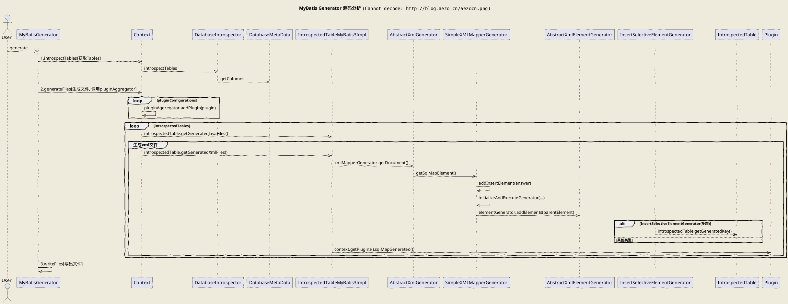

## 简介

- [MyBatis3中文文档](http://www.mybatis.org/mybatis-3/zh/index.html)
- `MyBatis Generator`：mybatis代码生成(model/dao/mapper)，[文档](http://www.mybatis.org/generator/)

## SpringBoot整合mybatis [^1]

### 基本配置

- 引入依赖(mybatis-spring-boot-starter为mybatis提供的自动配置插件)

	```xml
	<!-- 自动配置 https://github.com/mybatis/spring-boot-starter -->
	<dependency>
		<groupId>org.mybatis.spring.boot</groupId>
		<artifactId>mybatis-spring-boot-starter</artifactId>
		<version>1.3.1</version>
	</dependency>

	<!--mybatis分页插件: https://github.com/pagehelper/Mybatis-PageHelper-->
	<dependency>
		<groupId>com.github.pagehelper</groupId>
		<artifactId>pagehelper</artifactId>
		<version>5.0.4</version>
	</dependency>

	<!-- 方式二：会包含mybatis依赖，并且无需再mybatis配置文件中配置此插件 -->
	<dependency>
		<groupId>com.github.pagehelper</groupId>
		<artifactId>pagehelper-spring-boot-starter</artifactId>
		<version>1.0.0</version>
	</dependency>
	```
- 启动类中加：`@MapperScan({"cn.aezo.springboot.mybatis.mapper", "cn.aezo.springboot.mybatis.mapperxml"})` // 声明需要扫描mapper接口的路径
- 配置

	```bash
	# 基于xml配置时需指明映射文件扫描位置；设置多个路径可用","分割，如："classpath:mapper/*.xml, classpath:mapper2/*.xml"
	mybatis.mapper-locations=classpath:mapper/*.xml
	# mybatis配置文件位置(mybatis.config-location和mybatis.configuration...不能同时使用), 由于自动配置对插件支持不够暂时使用xml配置
	mybatis.config-location=classpath:mybatis-config.xml

	# 字段格式对应关系：数据库字段为下划线, model字段为驼峰标识(不设定则需要通过resultMap进行转换)
	#mybatis.configuration.map-underscore-to-camel-case=true
	# 类型别名定义扫描的包(可结合@Alias使用, 默认是类名首字母小写)
	#mybatis.type-aliases-package=cn.aezo.springboot.mybatis.model
	```
- mybatis配置文件: `mybatis-config.xml`

	```xml
	<?xml version="1.0" encoding="UTF-8" ?>
	<!DOCTYPE configuration PUBLIC "-//mybatis.org//DTD Config 3.0//EN" "http://mybatis.org/dtd/mybatis-3-config.dtd">
	<!--在application.properties中使用了mybatis.configuration进行配置，无需此文件(传统配置)-->
	<configuration>
		<settings>
			<!--字段格式对应关系：数据库字段为下划线, model字段为驼峰标识(不设定则需要通过resultMap进行转换)-->
			<setting name="mapUnderscoreToCamelCase" value="true"/>

			<!--打印mybatis运行的sql语句到控制台。STDOUT表示调用System.out。-->
			<!-- 打印到日志，则需要在如logback.xml中加 <logger name="cn.aezo.video.dao" level="debug"/> 定义打印级别 -->
			<setting name="logImpl" value="STDOUT_LOGGING" />
		</settings>

		<!--类型别名定义-->
		<typeAliases>
			<!--定义需要扫描的包-->
			<package name="cn.aezo.springboot.mybatis.model"/>

			<!--定义后可在映射文件中间的parameterType等字段中使用userInfo代替cn.aezo.springboot.mybatis.model.UserInfo-->
			<!--<typeAlias alias="userInfo" type="cn.aezo.springboot.mybatis.model.UserInfo" />-->
		</typeAliases>

		<plugins>
			<!-- 分页插件 -->
			<!-- 5.0.0以后使用com.github.pagehelper.PageInterceptor作为拦截器 -->
			<plugin interceptor="com.github.pagehelper.PageInterceptor">
				<!--更多参数配置：https://github.com/pagehelper/Mybatis-PageHelper/blob/master/wikis/zh/HowToUse.md-->
				<!--<property name="pageSizeZero" value="true"/>-->
			</plugin>
		</plugins>
	</configuration>
	```
- Model：**UserInfo/ClassInfo等无需任何注解.**(其中HobbyEnum是一个枚举类)

### annotation版本(适合简单业务)

- `annotation版本(适合简单业务)`
	- Dao层：UserMapper.java

		```java
		// @Mapper // 在启动类中定义需要扫码mapper的包：@MapperScan("cn.aezo.springboot.mybatis.mapper"), 则此处无需声明@Mapper
		public interface UserMapper {
			// 1. 此处注入变量可以使用#或者$, 区别：# 创建的是一个prepared statement语句, $ 符创建的是一个inlined statement语句
			// 2. 一个参数可以省略@Param，多个需要进行指定(反射机制)
			// 3. 当未获取到数据时，返回 null
			// 4. (使用配置<setting name="mapUnderscoreToCamelCase" value="true"/>因此无需转换) 数据库字段名和model字段名或javaType不一致的均需要@Result转换
				// @Results({
				//         @Result(property = "hobby",  column = "hobby", javaType = HobbyEnum.class),
				//         @Result(property = "nickName", column = "nick_name"),
				//         @Result(property = "groupId", column = "group_Id")
				// })
			@Select("select * from user_info where nick_name = #{nickName}")
			UserInfo findByNickName(@Param("nickName") String nickName);

			@Select("select * from user_info")
			List<UserInfo> findAll();

			@Insert("insert into user_info(nick_name, group_id, hobby) values(#{nickName}, #{groupId}, #{hobby})")
			void insert(UserInfo userInfo);

			@Update("update user_info set nick_name = #{nickName}, hobby = #{hobby} where id = #{id}")
			void update(UserInfo userInfo);

			@Delete("delete from user_info where id = #{id}")
			void delete(Long id);
		}
		```
	- 分页

		```java
		// 分页查询：http://localhost:9526/api/users
		@RequestMapping(value = "/users")
		public PageInfo showAllUser(
				@RequestParam(defaultValue = "1") Integer pageNum,
				@RequestParam(defaultValue = "5") Integer pageSize) {
			PageHelper.startPage(pageNum, pageSize); // 默认查询第一页，显示5条数据（必须在实例化PageInfo之前）
			// ... // 此处如果发起了其他sql则此处的sql会被分页，而下面的sql则不会被分页
			List<UserInfo> users = userMapper.findAll(); // 第一条执行的SQL语句会被分页，实际上输出users是page对象
			PageInfo<UserInfo> pageUser = new PageInfo<UserInfo>(users); // 将users对象绑定到pageInfo

			return pageUser;
		}
		```

		- 分页查询结果

		```js
		{
			pageNum: 1,
			pageSize: 5,
			size: 2,
			startRow: 1,
			endRow: 2,
			total: 2,
			pages: 1,
			list: [
				{
					id: 1,
					groupId: 1,
					nickName: "smalle",
					hobby: "GAME"
				},
				{
					id: 2,
					groupId: 1,
					nickName: "aezo",
					hobby: "CODE"
				}
			],
			prePage: 0,
			nextPage: 0,
			isFirstPage: true,
			isLastPage: true,
			hasPreviousPage: false,
			hasNextPage: false,
			navigatePages: 8,
			navigatepageNums: [
				1
			],
			navigateFirstPage: 1,
			navigateLastPage: 1,
			firstPage: 1,
			lastPage: 1
		}
		```
	- 测试

		```java
		@Test
		public void testFindByNickName() {
			UserInfo userInfo = userMapper.findByNickName("smalle");
			System.out.println("userInfo = " + userInfo);
		}

		@Test
		public void testInsert() throws Exception {
			userMapper.insert(new UserInfo("test", 1L, HobbyEnum.READ));
		}
		```

- 基于注解的sql示例(用于简单的查询) [^2]

    - 用script标签包围，然后像xml语法一样书写
        
        ```java
        // Dao层，mybatis会基于此注解完成对应的实现
        // 可以理解为查询sql语句返回的是一个List<Map<String, Object>>(List里面必须为Map或其子类)。如果用Map<String, Object>接受返回值则默认取第一条数据
        // 使用双引号重命名字段解决返回数据字段全变大写
        @Select({ "<script>",
            "select h.help_id as \"help_id\", h.apply_money, h.create_time, h.creator, h.description, h.is_comfort, h.is_valid, h.title, h.update_time, h.updater ",
            "   , e.name",
            " from th_help as h ",
            "   left join th_event e on e.event_id = h.event_id",
			"   left join th_group g on g.group_id = h.group_id ",
            " where 1=1 ",
			// 此时可以使用<if>或<when>
			" <if test='plans != null and plans.size() > 0'>", // 其中大于号也可以使用`&gt;`来表示
            "   and g.plan_id in ",
			// in 的使用。item为当前元素，index为下标变量
            "   <foreach item='plan' index='index' collection='plans' open='(' separator=',' close=')'>",
            "       #{plan.planId}",
            "   </foreach>",
            " </if>",
			// like 的使用。此处必须使用concat进行字符串连接. oracle则需要使用 h.title like concat(concat('%',#{roleName}),'%')
            " <if test='help.title != null and help.title != \"\"'> AND h.title like concat('%', #{help.title}, '%')</if>",
            " <if test='event.name != null'> AND e.name = #{event.name}", "</if>",
			// or 的使用(1 != 1 or .. or ..)
			" <if test='help.title != null and help.desc != null or help.start != null and help.end != null'> and (",
			"  <if test='help.title != null and help.desc != null>",
			"    help.title = #{help.title}",
			"  </if>",
			"  <if test='help.start != null and help.end != null>",
			"    or help.start = #{help.start} and help.end = #{help.end}",
			"  </if>",
			" ) </if>",
            "</script>" })
        List<Map<String, Object>> findHelps(@Param("help") Help help, @Param("event") Event event, @Param("plans") List<Plan> plans);
		// 还是使用上面script，如果提供对应的HelpPojo对象，mybatis会自动将字段的下划线转成驼峰，并去寻找HelpPojo相应的属性
		// List<HelpPojo> findHelps(@Param("help") Help help, @Param("event") Event event, @Param("plans") List<Plan> plans);

		// 此方法也可以再xml中实现（即部分可以通过 @Select 声明，部分可以在xml中实现）
		List<HelpPojo> findHelps(@Param("help") HelpPojo helpPojo); // 此时xml中必须通过help对象获取属性.如果不写@Param("help")则可直接获取属性值
        
        // 配合分页插件使用
        public Object findHelps(Help help, Event event,
                @RequestParam(defaultValue = "1") Integer pageNum,
                @RequestParam(defaultValue = "10") Integer pageSize) {
            PageHelper.startPage(pageNum, pageSize);
			// PageHelper要在目标查询的最近开启. 如果此处在查询一下其他数据则容易出现分页无效的情形
            List users = helpMapper.findHelps(help, event);
            PageInfo pageUser = new PageInfo(users);

            return pageUser;
        }
	    ```
    - 用Provider去实现SQL拼接(适用于复杂sql)

        ```java
        public class OrderProvider {
            private final String TBL_ORDER = "tbl_order";

            public String queryOrderByParam(OrderPara param) {
                SQL sql = new SQL().SELECT("*").FROM(TBL_ORDER);
                String room = param.getRoom();
                if (StringUtils.hasText(room)) {
                    sql.WHERE("room LIKE #{room}");
                }
                Date myDate = param.getMyDate();
                if (myDate != null) {
                    sql.WHERE("mydate LIKE #{mydate}");
                }
                return sql.toString();
            }
        }

        public interface OrderDAO {
            @SelectProvider(type = OrderProvider.class, method = "queryOrderByParam")
            List<Order> queryOrderByParam(OrderParam param);
        }
        ```

### xml版本(适合复杂操作)

- `xml版本(适合复杂操作)`
	- Dao层：UserMapperXml.java

		```java
		public interface UserMapperXml {
			List<UserInfo> findAll();

			UserInfo getOne(Long id);

			int insert(UserInfo user); // 成功返回1

			int update(UserInfo user);

			int delete(Long id);
		}
		```
	- Dao实现(映射文件): UserMapper.xml(放在resources/mapper目录下)

		```xml
		<?xml version="1.0" encoding="UTF-8" ?>
		<!DOCTYPE mapper PUBLIC "-//mybatis.org//DTD Mapper 3.0//EN" "http://mybatis.org/dtd/mybatis-3-mapper.dtd">
		<!--http://www.mybatis.org/mybatis-3/zh/sqlmap-xml.html#-->
		<!--sql映射文件: 
			namespace必须为实现接口名；每个sql是一个statement 
			使用include关键字调用其他xml文件的sql时，则需要在refid前加上该文件的命名空间
		-->
		<mapper namespace="cn.aezo.springboot.mybatis.mapperxml.UserMapperXml">
			<!-- 
				1.resultMap结果集映射定义(用来描述如何从数据库结果集中来加载对象). 
				2.resultType 与 resultMap 不能并用. 
				3.type也可以为java.util.HashMap,则返回结果中放的是Map
				4.子标签有先后顺序。(constructor?,id*,result*,association*,collection*, discriminator?)
			-->
			<resultMap id="UserInfoResultMap" type="cn.aezo.springboot.mybatis.model.UserInfo">
				<!--设置mybatis.configuration.map-underscore-to-camel-case=true则会自动对格式进行转换, 无需下面转换-->
				<!--<result column="group_id" property="groupId" jdbcType="BIGINT"/>-->
				<!--<result column="nick_name" property="nickName" jdbcType="VARCHAR"/>-->
                <result column="desc" property="desc" jdbcType="BLOB"/><!-- BLOB/CLOB 类型必须转换 -->
			</resultMap>

			<!--sql:可被其他语句引用的可重用语句块. id:唯一的标识符，可被其它语句引用-->
			<sql id="UserInfoColumns">id, group_id, nick_name, hobby</sql>
			<sql id="userColumns">${alias}.id, ${alias}.username, ${alias}.password</sql><!-- alias不能通过bind在此sql内部设值 -->

			<!--id对应接口的方法名; resultType(类全称或别名, 如内置别名map) 与 resultMap(自定义数据库字段与实体字段转换关系map) 不能并用; -->
			<!-- statementType: STATEMENT(statement)、PREPARED(preparedstatement, 默认)、CALLABLE(callablestatement)-->
			<!-- resultSetType: FORWARD_ONLY(游标向前滑动)，SCROLL_SENSITIVE(滚动敏感)，SCROLL_INSENSITIVE(不区分大小写的滚动)-->
			<select id="findAll" resultMap="UserInfoResultMap">
				select
				<!-- 如果引用在同一命名空间则可省略命名空间。但是 findAll 如果被其他命名空间引用则容易找到不 UserInfoColumns。因此建议一直加上命名空间 -->
				<include refid="cn.aezo.springboot.mybatis.mapperxml.UserMapperXml.UserInfoColumns"/>,
				<include refid="userColumns"><property name="alias" value="t1"/></include>
				from user_info
				where 1=1
				<if test='name != null and name != ""'>
					<!-- bind 元素可以从 OGNL 表达式中创建一个变量并将其绑定到上下文-->
					<!-- _parameter为传入的User对象。如果传入参数为Map，则为_parameter.get('name') -->
					<bind name="nameUpper" value="'%' + _parameter.getName().toUpperCase() + '%'" />
					and upper(name) like #{nameUpper}
				</if>
			</select>

			<!-- property参数使用. 此时#{username}可以拿到selectMain的上下文 -->
			<sql id="sometable">
				${prefix}Table where 1=1
				<if test="username != null and username != ''">username=#{username}</if>
			</sql>
			<sql id="someinclude">from <include refid="${include_target}"/></sql>
			<select id="selectMain" resultType="map">
				select *
				<include refid="someinclude">
					<property name="prefix" value="Some"/>
					<property name="include_target" value="sometable"/>
				</include>
			</select>

			<!--
				1.parameterType传入参数类型(可选，不填则可以通过 TypeHandler 推导出类型). 
					1.1 使用typeAliases进行类型别名映射后可写成resultType="userInfo"(自动扫描包mybatis.type-aliases-package, 默认该包下的类名首字母小写为别名).
					1.2 传入parameterType="java.util.HashMap"(可省略)，也可使用 #{myKey} 获取传入参数map中的值
				2.如果返回结果使用resultType="cn.aezo.springboot.mybatis.model.UserInfo", 则nickName，groupId则为null(数据库中下划线对应实体驼峰转换失败，解决办法：设置mybatis.configuration.map-underscore-to-camel-case=true). 此处使用resultMap指明字段对应关系
				3. #{}是实现的是PrepareStatement，${}实现的是普通Statement 
			-->
			<select id="getOne" parameterType="java.lang.Long" resultType="userInfo">
				select
				<include refid="UserInfoColumns"/>
				from user_info
				where id = #{id}
			</select>

			<!-- insert/update返回主键(默认返回修改的数据执行状态/影响行数)
			1.定义方式
				方式一：基于JDBC(Mysql/SqlServer都适用，Oracle不适用)
					keyProperty(主键对应Model的属性名)和useGeneratedKeys(是否使用JDBC来获取内部自增主键，默认false)联合使用返回自增的主键(可用于insert和update语句)。
				方式二：基于方言，每个数据库提供的内部函数
					1.Mysql: <selectKey keyProperty="id" resultType="long">select LAST_INSERT_ID()</selectKey>
					2.SqlServer: <selectKey resultType="java.lang.Long" order="AFTER" keyProperty="id">SELECT IDENT_CURRENT('my_table')</selectKey>
					3.Oracle: <selectKey keyProperty="id" order="BEFORE" resultType="java.lang.Long">select SEQ_MY_TABLE.nextval as id from dual</selectKey> 需要先创建好序列SEQ_MY_TABLE
			2.获取方式：userMapper.insert(userInfo); userInfo.getUserId();
			 -->
			<insert id="insert" parameterType="cn.aezo.springboot.mybatis.model.UserInfo" keyProperty="userId" useGeneratedKeys="true">
				insert into user_info (nick_name, group_id, hobby) values (#{nickName}, #{groupId}, #{hobby})
			</insert>

			<update id="update" parameterType="cn.aezo.springboot.mybatis.model.UserInfo">
				update user_info set
				<!--动态sql, 标签：if、choose (when, otherwise)、trim (where, set)、foreach-->
				<if test="nickName != null">nick_name = #{nickName},</if>
				hobby = #{hobby}
				where id = #{id}
			</update>

			<delete id="delete" parameterType="java.lang.Long">
				delete from user_info where id = #{id}
			</delete>

			<!-- 此时也可执行成功，但是如果传入参数为空，容易报错（java.sql.SQLException: 无效的列类型: 1111） -->
			<delete id="delete2">
				delete from user_info where id = #{id}
			</delete>
		</mapper>
		```

- xml联表查询举例

	```xml
    <select id="getClass" parameterType="int" resultMap="ClassResultMap">
        select * from class c, teacher t, student s 
		where c.teacher_id = t.t_id and c.c_id = s.class_id 
			and c.c_id = #{id} and s.name = #{name}
    </select>

	<!--此处Classes类中仍然需要保存一个Teacher teacher的引用和一个List<Student> students的引用-->
    <resultMap type="cn.aezo.demo.Classes" id="ClassResultMap">
		<!--一个 ID 结果;标记结果作为 ID 可以帮助提高整体效能。association、collection中都最好加上 -->
        <id property="id" column="c_id"/>
		<!--注入到字段或 JavaBean 属性的普通结果-->
        <result property="name" column="c_name"/>
		<!-- 
		association字面意思关联，这里只专门做一对一关联； 
			1.property表示是cn.aezo.demo.Classes中的属性(setter)名称； 
			2.javaType表示该属性是什么类型对象 
			3.columnPrefix="out_/in_" 字段前缀。如查询主表(Ycross_Storage)中关联某一张表(如Ycross_In_Out_Regist)关联了两次，但是表Ycross_In_Out_Regist的映射只有一个(property和column的对应关系只有一套)。可以再取出Ycross_In_Out_Regist中的字段的时候通过`as out_xxx`对某字段进行别名处理。此时映射的时候会将字段的名称去掉columnPrefix前缀去找对应的property
		-->
        <association 
			property="teacher" 
			javaType="cn.aezo.demo.Teacher">
            <id property="id" column="t_id"/>
            <result property="name" column="t_name"/>
        </association>
        <!-- 
			1.ofType指定students集合中的对象类型。这样查询出来的集合条数和数据出来的一致(子表导致主表查询的条数增多) 
			2.javaType="ArrayList"可以省略
		-->
        <collection property="students" ofType="cn.aezo.demo.Student">
            <id property="id" column="s_id"/>
            <result property="name" column="s_name"/>
        </collection>

		<!-- 
		此时返回的集合是主表的条数，然后基于每一条再重新查询数据获取子表数据并放入到Classes对象的students中。
			1.select指查询Student的接口. 如果为当前mapper文件则可省略命名空间(namespace)直接写成 getStudent。(select和column只有在嵌套查询的时候才用得到)
			2.column是传入到getStudent查询中的参数，id是传入参数名称，s_id获取获取字段值的字段名(就是先从主表查询的结果中获取s_id字段的值，传入到id中，发起getStudent子查询)。如果一个参数也可以直接写成column="s_id" (getStudent的接口中也声明接受一个此类型的参数即可)
			3.columnPrefix="xx_"同上
			4.会产生1+N问题。主表有多少此就会发起多少次查询，无法根据条件判断是否需要发起子查询。导出报表最好不要使用
		-->
		<collection 
			property="students" 
			ofType="cn.aezo.demo.Student" 
			column="{id = s_id, name = s_name}" 
			select="cn.aezo.demo.Student.getStudent">
		</collection>
    </resultMap>
	```

### 控制主键自增和获取自增主键值

- 获取自增主键(mysql为例，需要数据库设置主键自增) [^3]
	- 方式一：keyProperty(主键对应Model的属性名)和useGeneratedKeys(是否使用JDBC来获取内部自增主键，默认false)联合使用返回自增的主键(可用于insert和update语句)
	- 方式二：`<selectKey keyProperty="id" resultType="long">select LAST_INSERT_ID()</selectKey>`
	- 获取方式：`userMapper.insert(userInfo); userInfo.getUserId();`

### MyBatis、Java、Oracle、MySql数据类型对应关系

- Mybatis的数据类型用JDBC的数据类型
- JDBC数据类型转换

JDBC | Java | Mysql | Oracle
---------|----------|---------|---------
Integer | Integer | Int | 
Bigint  | Long | Bigint | Number
Numeric  | Long |  | Number
Timestamp| Date | Datetime | Date
Date | Date | Date | Date
Decimal | BigDecimal | Decimal | Number(20, 6) 
Char |  | Char | Char
 Blob |  | Blob | Blob
 Clob |  | Text | Clob

- **BLOB为二进制大对象**，可存储图片(转成二进制，实际用的很少)；**CLOB文本大对象**，可用来存储博客文章等；Mybatis对CLOB可直接解析成字符串，而BLOB则需要些对应关系

## mybatis常见问题

- **关于`<`、`>`转义字符**(在xml的sql语句中则不需要专业)
	- `<` 转成 `&lt;`，`>=` 转成 `&gt;=`等
	- 使用**CDATA** `<![CDATA[ when min(starttime) <= '12:00' and max(endtime) <= '12:00' ]]>`
- 双引号转义：`<if test='help.title != null and type = \"MY_TYPE\"'>`
- mybatis类型转换问题
	- mybatis会对Integer转换成字符串时，如果Integer类型值为0，则转换为空字符串。(js也是这样转换的)

		```xml
		<!-- 此时Integer status = 0;时，下列语句返回false. 所有Integer类型的不要加status != '' -->
		<if test="status != null and status != ''">and status = #{status}</if>  
		```
	- 多个字符则认为是字符串，单个字符则认为是Character字符.(如mybatis认为：test="validStatus == 'Y'"中的Y是字符，test="validStatus == 'YY'"中的YY则是字符串)

		```xml
		<!-- 传入参数validStatus="Y", 此时会报错NumberFormatException；mybatis认为传入参数是字符串对象Y，比较值是字符'Y'，经过几个判断都不相等，再转成数值时则报错了 -->
		<if test="validStatus == 'Y'">and validStatus = 1</if>
		<!-- 正确写法 -->
		<if test='validStatus == "Y"'>and validStatus = 1</if>
		<if test="validStatus=='Y'.toString()">and validStatus = 1</if>
		```

-  dao中可以使用`submitTm[0]`获取值; xml中不行，其处理数组(如时间段)的方式如下

	```xml
	<!-- <if test='dataSourceList != null and dataSourceList.size() > 0 and dataSourceList.get(0).dataSource != null'> -->
	<if test='submitTm != null and submitTm.length >= 1 and submitTm[0] != null'>
	<foreach collection="submitTm" index="i" item="item">
		<if test='i == 0 and item != null'>and v.submit_tm &gt;= #{item}</if>
		<if test='i == 1 and item != null'>and v.submit_tm &lt;= #{item}</if>
	</foreach>
	</if>
	```
- mysql当前时间获取`now()`，数据库日期型可和前台时间字符串进行比较
- 数据库字段类型根据mybatis映射转换，`count(*)`转换成`Long`
- `<when>`/`<if>` 可进行嵌套使用，其子属性test可以使用双引号或单引号
- 支持`choose (when, otherwise)`语句
- xml文件修改无需重新部署，立即生效
- `Cause: java.sql.SQLException: 无法转换为内部表示` 可能是由于类型转换导致，如强制将数据库中字符串类型字段映射某个对象的Long类型属性上

## MyBatis Generator

- 使用`MyBatis Generator`自动生成model/dao/mapper
- 官方文档：[http://www.mybatis.org/generator/index.html](http://www.mybatis.org/generator/index.html)
- 生成方式有多种(此处介绍maven插件的方式)
	- maven配置

		```xml
		<build>
			<plugins>
				<!-- mybatis(mapper等)自动生成 -->
				<plugin>
					<groupId>org.mybatis.generator</groupId>
					<artifactId>mybatis-generator-maven-plugin</artifactId>
					<version>1.3.5</version>
					<!--maven可执行命令-->
					<executions>
						<execution>
							<id>Generate MyBatis Artifacts</id>
							<goals>
								<goal>generate</goal>
							</goals>
						</execution>
					</executions>
				</plugin>
			</plugins>
		</build>
		```
	- resources目录添加文件：`generatorConfig.xml`

		```xml
		<?xml version="1.0" encoding="UTF-8"?>
		<!DOCTYPE generatorConfiguration
				PUBLIC "-//mybatis.org//DTD MyBatis Generator Configuration 1.0//EN"
				"http://mybatis.org/dtd/mybatis-generator-config_1_0.dtd">
		<generatorConfiguration>
			<!--数据库驱动 -->
			<!-- <classPathEntry location="C:\soft\oracle\product\11.2.0\dbhome_1\jdbc\lib\ojdbc6.jar"/> -->
			<classPathEntry location="C:\Users\smalle\.m2\repository\mysql\mysql-connector-java\5.1.43\mysql-connector-java-5.1.43.jar" />
			<context id="MySQLTables" targetRuntime="MyBatis3" defaultModelType="flat">
				<plugin type="cn.aezo.mybatis.generator.plugins.MyPluginTableRename"/> <!--自定义插件，可继承 PluginAdapter-->

				<!-- 为了防止生成的代码中有很多注释，比较难看 -->
				<!-- 可自定义方法/字段注释，通过实现 CommentGenerator。参考 https://www.cnblogs.com/NieXiaoHui/p/6094144.html -->
				<commentGenerator>
					<property name="suppressDate" value="true" />
					<property name="suppressAllComments" value="true" />
				</commentGenerator>

				<!--数据库链接地址账号密码 -->
				<!-- driverClass="oracle.jdbc.driver.OracleDriver" connectionURL="jdbc:oracle:thin:@//localhost:1521/orcl" -->
				<jdbcConnection
						driverClass="com.mysql.jdbc.Driver"
						connectionURL="jdbc:mysql://localhost:3306/springboot"
						userId="root"
						password="root">
				</jdbcConnection>

				<javaTypeResolver>
					<property name="forceBigDecimals" value="false" />
				</javaTypeResolver>

				<!--生成Model类存放位置：targetPackage为model对应的包名；targetProject为项目根目录，此处相对当前项目，还可写成D:/mydemo/src/main/java -->
				<javaModelGenerator
						targetPackage="cn.aezo.springboot.mybatis.generator.model"
						targetProject="src/main/java">
					<!-- 是否对类CHAR类型的列的数据进行trim操作 -->  
					<property name="trimStrings" value="true" />
					<!-- 开启enableSubPackages后，会基于targetPackage目录添加数据库表的Catalog和Schema配置(table标签属性) -->
					<!-- <property name="enableSubPackages" value="true" /> -->
				</javaModelGenerator>

				<!--生成映射文件存放位置，会存放在src/main/resources/mapper目录下(自动创建mapper目录) -->
				<sqlMapGenerator
						targetPackage="mapper"
						targetProject="src/main/resources">
					<!-- <property name="enableSubPackages" value="true" /> -->
				</sqlMapGenerator>

				<!--生成Dao类存放位置 -->
				<javaClientGenerator
						type="XMLMAPPER"
						targetPackage="cn.aezo.springboot.mybatis.generator.dao"
						targetProject="src/main/java">
					<!-- <property name="enableSubPackages" value="true" /> -->
				</javaClientGenerator>

				<!-- 读取所有的table标签，有几个table标签就解析几个 -->
				<!-- %标识根据表名生成，tableName="t_%"表示只生成t_开头的表名 -->
				<table tableName="%">
					<!-- 
						1、生成selectKey语句，为mybatis生成获取自增主键值语句(必须数据库字段设置成自增)
						2、column表的字段名(不支持通配符，因此为了方便可将所有表的主键名设置为id)
						3、sqlStatement="MySql/DB2/SqlServer等"
							3-1、SqlServer会生成`SELECT SCOPE_IDENTITY()`，测试无法返回主键，可使用JDBC解决
						4、identity：true表示column代表的是主键，会在插入记录之后获取自增值替换对应model的id值(自增需要由数据库提供)，实际的insert语句将不含有主键字段; false表示非主键，会在插入记录获取自增值并替换model的id(如从序列中获取), 此时insert语句含有主键字段
						5、最终生成的语句如
						<selectKey keyProperty="userId" order="AFTER" resultType="java.lang.Long">
							SELECT LAST_INSERT_ID()
						</selectKey>
					-->
					<generatedKey column="id" sqlStatement="MySql" identity="true" />

					<!-- 
						sqlStatement="JDBC"会生成如下代码来获取主键，适用于MySql/SqlServer
						<insert id="insert" parameterType="cn.aezo.demo.MyTable" keyColumn="id" keyProperty="id" useGeneratedKeys="true">
					 -->
					<!-- <generatedKey column="id" sqlStatement="JDBC" identity="true" /> -->
				</table>

				<!-- 去掉表前缀：生成之后的文件名字User.java等。enableCountByExample标识是否使用Example -->
				<!-- 如oracle此时的schema相当于用户名，如果不定义则会获取到多个t_user表，但是只会基于其中某个一个生成代码. 但是此时生成的mapper中表名带有前缀`smalle.` -->
				<table schema="smalle" tableName="t_user" domainObjectName="User"
					enableCountByExample="false" enableUpdateByExample="false"
					enableDeleteByExample="false" enableSelectByExample="false">
					<!-- 去掉字段前缀 `t_` -->
					<property name="useActualColumnNames" value="false"/>
					<columnRenamingRule searchString="^t_" replaceString=""/>
				</table>
			</context>
		</generatorConfiguration>
		```
	- MyPluginTableRename 自定义插件。配置文件的table节点在自定义了schema后，生成的mapper表名会包含schema信息，此插件主要是为了去除此schema信息
		
		```java
		import org.mybatis.generator.api.PluginAdapter;
		// ...

		// 插件的生命周期：http://www.mybatis.org/generator/reference/pluggingIn.html
		// 官方内置的插件：http://www.mybatis.org/generator/reference/plugins.html
		public class MyPluginTableRename extends PluginAdapter {
			// 验证此插件是否可以开启
			@Override
			public boolean validate(List<String> warnings) {
				return true;
			}

			// 循环每个table时，执行对应初始化
			@Override
			public void initialized(IntrospectedTable introspectedTable) {
				String schema = introspectedTable.getTableConfiguration().getSchema();
				if(schema != null && !"".equals(schema)) {
					String tableName = introspectedTable.getTableConfiguration().getTableName();
					introspectedTable.setSqlMapFullyQualifiedRuntimeTableName(tableName);
					introspectedTable.setSqlMapAliasedFullyQualifiedRuntimeTableName(tableName);
				}
			}
		}
		```
	- 进入到pom.xml目录，cmd执行命令生成文件：`mvn mybatis-generator:generate`
	- 生成Mapper中Example的使用：http://www.mybatis.org/generator/generatedobjects/exampleClassUsage.html

		```java
		UserExample userExample = new UserExample();
        userExample.createCriteria().andUsernameEqualTo("smalle")
					.andSexEqualTo(1);
		userExample.setOrderByClause("username asc");

        List<User> users =  userMapper.selectByExample(userExample); // 未查询到数据时返回一个大小为0的数组

		// generator生成的mapper
		userMapper.insert(user); // 完全基于user创建(新增记录时不考虑数据库的默认值)
		userMapper.insertSelective(user); // 不为 null 才会拼接此字段(新增记录时考虑数据库的默认值)
		```
- 通过java代码调用mybatis-generator生成
	- 引入依赖

		```xml
		<dependency>
			<groupId>org.mybatis.generator</groupId>
			<artifactId>mybatis-generator-core</artifactId>
			<version>1.3.5</version>
		</dependency>
		```
	- 关键代码

		```java
		List<String> warnings = new ArrayList<>();
        boolean overwrite = true;
        File configFile = new File("generatorConfig.xml");
        ConfigurationParser cp = new ConfigurationParser(warnings);
        try {
            Configuration config = cp.parseConfiguration(configFile);
            DefaultShellCallback callback = new DefaultShellCallback(overwrite);
            MyBatisGenerator myBatisGenerator = new MyBatisGenerator(config, callback, warnings);
            myBatisGenerator.generate(null);
        } catch (Exception e) {
            e.printStackTrace();
        }
		```
- 使用oracle数据库
	- 配置文件设置成`<generatedKey column="id" sqlStatement="MySql" identity="false" />`中identity="false"为了生成id的insert语句（oracle需要通过序列来完成）
	- 修改生成的`<selectKey>`语句为根据序列获取主键
	- 将oracle表转成mysql数据表，可参考[《mysql-dba.md》](/_posts/db/mysql-dba.md#Oracle表结构与Mysql表结构转换)
- plugin插件使用
	- 内部通过PluginAggregator来保证plugin的生命周期
	- 使用参考上述示例 `MyPluginTableRename`

### 源码解析



## mybatis-plus

- [mybatis-plus](https://mp.baomidou.com/)、[github](https://github.com/baomidou/mybatis-plus)
- springboot依赖

```xml
<!-- 包含 mybatis、mybatis-plus、generator -->
<dependency>
	<groupId>com.baomidou</groupId>
	<artifactId>mybatis-plus-boot-starter</artifactId>
    <version>3.0.6</version>
</dependency>
```
- 使用
    - 此处的`SubscribeService`继承了`ServiceImpl`，对应接口继承了`IService`
    - 使用mapper，如`SubscribeMapper`则会继承`BaseMapper`

```java
List<Subscribe> subscribes = subscribeService.list(
	new LambdaQueryWrapper<Subscribe>()
		.eq(Subscribe::getFlowStatus, 1));

// 返回 List<Map<String, Object>>，此时LambdaQueryWrapper基于TemplateItem实体生成sql语句(sql语句驼峰会转成下划线，返回的Map中的key全为大写下划线)
List<Map<String, Object>> list = templateItemDao.selectMaps(
                new LambdaQueryWrapper<TemplateItem>() // 此处一定要加入泛型
                    .eq(TemplateItem::getTemplateId, 1)
                    .eq(TemplateItem::getTemplateId, templateId));

// 分页
Page<Subscribe> subscribePage = new Page<>(0, 100);
LambdaQueryWrapper lambdaQueryWrapper = new LambdaQueryWrapper<Subscribe>()
		.eq(Subscribe::getFlowStatus, flowStatus)
		.eq(Subscribe::getValidStatus, 1)
		.and(date != null, obj -> obj.gt(Subscribe::getUpdateTm, date)) // 基于某个条件判断是否添加查询此查询条件
		.orderByAsc(date != null, Subscribe::getClawCount); // 基于某个条件添加排序
subscribePage = (Page<Subscribe>) subscribeService.page(subscribePage, lambdaQueryWrapper);
List<Subscribe> subscribes =  subscribePage.getRecords();
```
- 注解说明
    - 如果Model主键名称不为`id`，则需要在对应主键字段上注解`@TableId`
    - 如果Model名称不为表名，则可通过`@TableName`进行注解真实名称
    - 如果Model的字段不为表字段，可通过`@TableField(exist = false)`注解
- 乐观锁插件：https://mybatis.plus/guide/optimistic-locker-plugin.html

```java
// 1.启用插件
@Bean
public OptimisticLockerInterceptor optimisticLockerInterceptor() {
	// com.baomidou.mybatisplus.extension.plugins.OptimisticLockerInterceptor
    return new OptimisticLockerInterceptor();
}

// 2.注解实体
@Version
private Integer version;

// 3.修改。仅支持 updateById(id) 与 update(entity, wrapper) 方法；在 update(entity, wrapper) 方法下, wrapper 不能复用
User user = userMapper.selectById(1);
user.setAge(18);
int res = userMapper.updateById(user); // 1成功。生成的sql类似: update t_user set age = 18,version = 2 where id = 1 and version = 1
```
- 使用


---

参考文章

[^1]: http://blog.csdn.net/gebitan505/article/details/54929287 (整合mybatis)
[^2]: https://segmentfault.com/q/1010000006875476 (@Select注解中当参数为空则不添加该参数的判断)
[^3]: https://www.cnblogs.com/panie2015/p/5807683.html (Mybatis操作数据库的主键自增长)