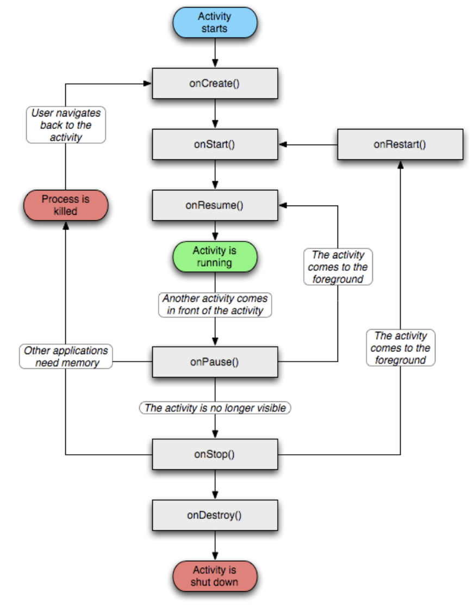

## 简介

## 安装

- 安装Android SDK(任意一种)
    - 直接安装Android Studio可内置安装Android SDK(仍需梯子才能下载)和Android模拟器(Tools菜单)
        - https://developer.android.google.cn/
        - 参考：https://blog.csdn.net/adminstate/article/details/130542368
    - 基于SDK Tools安装（参考https://zhuanlan.zhihu.com/p/37974829）
        - 国内在 https://www.androiddevtools.cn/ 下载 SDK Tools 进行 Android SDK 安装
            - 国外zip包下载地址：https://dl.google.com/android/android-sdk_r24.4.1-windows.zip?utm_source=androiddevtools&utm_medium=website
            - `API 24.x -> Android 7.x`; `API 29.x -> Android 10.x`
        - 启动SDK Manager，安装Tools、API、Extras（可使用代理下载）
        - 设置`ANDROID_HOME=D:\software\android-sdk`
        - 把`%ANDROID_HOME%\platform-tools;%ANDROID_HOME%\tools`添加到Path环境变量中
        - 命令行输入`adb`测试是否安装成功
- AVD(模拟器)
- Mac建议使用AS自带模拟器(字体看不清)；通过braw安装模拟器字体很清晰，但是可能部分应用无法安装，参考[mac.md#安卓模拟器](/_posts/linux/mac.md#安卓模拟器)
- [安卓模拟器](https://blog.csdn.net/csdnxia/article/details/120656206)
    - [夜神安卓模拟器(支持Mac/Windows)](https://www.yeshen.com/)
    - [网易MUMU](https://mumu.163.com/)

## Android Studio项目示例

- 控制台乱码：需要配置vmoption，参考：https://blog.csdn.net/jankingmeaning/article/details/104772104/

### 配置说明

- 项目结构举例

```bash
project
    lib
        - xxx.jar, xxx.aar
    src
        main
            assets
            java
                cn.aezo.android
                    activity # 视图层: 控制界面布局
                        LoginActivity.java
                    dao # 可以使用 android.database.sqlite.SQLiteDatabase 操作轻量级数据库，如保存一些配置信息
            java(generated) # 自动生成代码
                cn.aezo.android
                    R.java
            res # 资源文件
                layout # 界面布局(视图XML配置)
                    page_login.xml
                    page_index.xml
                values
                    colors.xml
                    strings.xml # 常量字符串
            AndroidManifest.xml
    build.gradle
```
- `build.gradle`举例

```js
buildscript {
    repositories {
        maven { url 'https://maven.aliyun.com/repository/google' }
        maven { url 'https://maven.aliyun.com/repository/jcenter' }
        maven { url 'http://maven.aliyun.com/nexus/content/groups/public' }
    }
    dependencies {
        classpath 'com.android.tools.build:gradle:4.2.0'
    }
}

apply plugin: 'com.android.application'

dependencies {
    implementation fileTree(dir: 'libs', include: '*.jar')
}

android {
    compileSdkVersion 19
    buildToolsVersion "24.0.3"

    compileOptions {
        sourceCompatibility JavaVersion.VERSION_1_7
        targetCompatibility JavaVersion.VERSION_1_7
    }

    sourceSets {
        main {
            manifest.srcFile 'AndroidManifest.xml'
            java.srcDirs = ['src','.apt_generated']
            resources.srcDirs = ['src','.apt_generated']
            aidl.srcDirs = ['src','.apt_generated']
            renderscript.srcDirs = ['src','.apt_generated']
            res.srcDirs = ['res']
            assets.srcDirs = ['assets']
        }

        // Move the tests to tests/java, tests/res, etc...
        androidTest.setRoot('tests')

        // Move the build types to build-types/<type>
        // For instance, build-types/debug/java, build-types/debug/AndroidManifest.xml, ...
        // This moves them out of them default location under src/<type>/... which would
        // conflict with src/ being used by the main source set.
        // Adding new build types or product flavors should be accompanied
        // by a similar customization.
        debug.setRoot('build-types/debug')
        release.setRoot('build-types/release')
    }
}

allprojects {
    repositories {
        maven { url 'https://maven.aliyun.com/repository/google' }
        maven { url 'https://maven.aliyun.com/repository/jcenter' }
        maven { url 'http://maven.aliyun.com/nexus/content/groups/public' }
    }
}
```

### 代码举例

- AndroidManifest.xml 清单文件，每个模块有一个固定此名称的清单文件

```xml
<?xml version="1.0" encoding="utf-8"?>
<manifest xmlns:android="http://schemas.android.com/apk/res/android"
    xmlns:tools="http://schemas.android.com/tools"
    package="cn.aezo.android"><!--项目包名-->

    <!-- 需要申请的权限 -->
    <uses-permission android:name="android.permission.CAMERA" />
    <uses-permission android:name="android.permission.WRITE_EXTERNAL_STORAGE" />

    <!-- 应用配置 -->
    <!--
        android:name: 为主入口 cn.aezo.android.DemoApplication
        icon: 图标
        label: 名称
        theme: 主题
    -->
    <application
        android:name=".DemoApplication"
        android:allowBackup="true"
        android:icon="@mipmap/ic_launcher"
        android:label="@string/app_name"
        android:supportsRtl="true"
        android:theme="@style/AppTheme"
        android:usesCleartextTraffic="true">

        <!-- 主视图. 此处"Activity标签/类"类似Controller, Layout/active_xxx.xml相当于View -->
        <activity android:name=".ui.LauncherActivity">
            <!-- 参考: https://www.cnblogs.com/SanguineBoy/p/9785585.html
                1.ACTION_MAIN 操作指示, 这是主要入口点，且不要求输入任何 Intent 数据. 当用户最初使用启动器图标启动应用时，该 Activity 将打开
                2.CATEGORY_LAUNCHER 类别指示, 此 Activity 的图标应放入系统的应用启动器
            -->
            <intent-filter>
                <action android:name="android.intent.action.MAIN" />
                <category android:name="android.intent.category.LAUNCHER" />
            </intent-filter>
        </activity>

        <!-- 对应一个视图. 可通过从其他视图跳转到当前视图 -->
        <activity
            android:name=".ui.MainActivity"
            android:launchMode="singleTask"
            android:screenOrientation="portrait">
        </activity>

        <service android:name=".DemoService" />
    </application>
</manifest>
```

- LoginActivity.java 视图元素绑定

```java
// android.app.Activity 可理解为视图类
public class LoginActivity extends extends Activity {
    // 登录按钮
	private Button loginBt; // import android.widget.Button;
    // 账号、密码
	private EditText loginUserId, loginUserPwd; // import android.widget.EditText;

    @Override
	protected void onCreate(Bundle savedInstanceState) {
		super.onCreate(savedInstanceState);

        // 绑定页面，对应下文的XML视图(layout/page_login.xml)
        // import cn.aezo.android.R; 这个类为自动生成 (资源索引类)
		setContentView(R.layout.page_login);
        
        // 绑定元素
		findViews();
	}

    // onResume

    private void findViews() {
		loginBt = (Button) findViewById(R.id.login_bt);
		loginBt.setOnClickListener(onClickListener);

        loginUserId = (EditText) findViewById(R.id.user_name);
		loginUserPwd = (EditText) findViewById(R.id.user_password);
	}

    // 点击事件
	private OnClickListener onClickListener = new OnClickListener() {
		@Override
		public void onClick(View v) {
			switch (v.getId()) {
			case R.id.login_bt:
				// 点击登陆
				userId = loginUserId.getText().toString().trim();
				userPwd = loginUserPwd.getText().toString().trim();

				// 检查用户名是否为空
				if (0 == userId.length()) {
					String msg = showToast(getResources().getString(R.string.login_error)); // 上文的"账号不能为空"
                    Toast.makeText(getApplicationContext(), msg, Toast.LENGTH_SHORT).show(); // import android.widget.Toast;
					return;
				}
                loginByAsyncHttpClientPost(userId, userPwd);
				break;
			default:
				break;
			}
		}
	};

    // 登录请求
    public void loginByAsyncHttpClientPost(String userName, String password) {
        // HttpClient做请求略，请求回调如下
        if(loginSuccess) {
            Intent intent = new Intent(LoginActivity.this, IndexActivity.class); // IndexActivity 为主页视图
            Bundle bundle = new Bundle();
            bundle.putString("main", "main");
            intent.putExtras(bundle);
            // 激活主页视图
            startActivity(intent);
        } else {
            Looper.prepare(); // android.os.Looper
            Toast.makeText(getApplicationContext(), "登录失败", Toast.LENGTH_SHORT).show();
            Looper.loop();
        }
    }
}
```
- page_login.xml 视图元素配置(Android Studio中可查看代码模式和设计模式，设计模式类似VB拖拽修改元素)

```xml
<!-- 使用线型布局 -->
<LinearLayout xmlns:android="http://schemas.android.com/apk/res/android"
    xmlns:tools="http://schemas.android.com/tools"
    android:layout_width="match_parent"
    android:layout_height="match_parent"
    android:orientation="vertical"
    android:paddingTop="10dp">
    <LinearLayout
        android:layout_width="fill_parent"
        android:layout_height="wrap_content"
        android:layout_margin="10dp"
        android:orientation="vertical" > 
        <LinearLayout
            android:layout_width="fill_parent"
            android:layout_height="wrap_content"
            android:layout_marginLeft="20dp"
            android:layout_marginTop="10dp"
            android:orientation="horizontal" >

            <TextView
                android:layout_width="wrap_content"
                android:layout_height="40dp"
                android:gravity="center_vertical|right"
                android:text="用户名："
                android:textColor="#000000"
			    android:textSize="@dimen/kp_M3_txt_textsize" />

            <EditText
                android:id="@+id/user_name"
                android:layout_width="fill_parent"
                android:layout_height="40dp"
                android:layout_marginLeft="8dp"
                android:gravity="left|center_vertical"
                android:background="#00000000"
                android:hint="请输入手机号码 "
                android:textColorHint="#C0C0C0" 
			    android:textSize="@dimen/kp_M3_txt_textsize"/>
        </LinearLayout>

        <LinearLayout
            android:layout_width="fill_parent"
            android:layout_height="wrap_content"
            android:layout_marginLeft="20dp"
            android:layout_gravity="right"
            android:orientation="horizontal" >

            <TextView
                android:layout_width="wrap_content"
                android:layout_height="40dp"
                android:gravity="center_vertical|right"
                android:text=" 密   码："
                android:textColor="#000000"
			    android:textSize="@dimen/kp_M3_txt_textsize" />
    </LinearLayout>

    <LinearLayout
        android:layout_width="fill_parent"
        android:layout_height="wrap_content"
        android:layout_marginTop="50dp"
        android:orientation="horizontal" >
        <Button
            android:id="@+id/login_bt"
            android:layout_width="wrap_content"
            android:layout_height="40dp"
            android:layout_margin="10dp"
            android:layout_weight="1"
			android:background="@color/red"
            android:text="登  录 "
            android:textColor="#FFFFFF"
            android:textSize="20sp" />
    </LinearLayout>

</LinearLayout>
```
- strings.xml

```xml
<?xml version="1.0" encoding="utf-8" standalone="no"?>
<resources>
    <string name="login_error">账号不能为空</string>
</resources>
```

## Activity生命周期

- 参考: https://blog.csdn.net/weixin_45828419/article/details/115302341
- Activity的生命周期
    - 运行状态：该Activity生命开始，Activity在前台展示，在屏幕上能获取焦点
    - 暂停状态：前台展示其他Activity，该Activity依然可见，在屏幕上不能获取焦点
    - 停止状态：该Activity不可见并且失去焦点
    - 销毁状态：该Activity结束生命，或此Activity所在进程被结束
- 相关方法
    - onCreate(Bundle savedInstanceState): 其在Activity中起到创建view的作用，创建Activity时会回调此方法并只调用一次。Bundle savedInstanceState一般用于初始化数据，savedInstanceState主要用于当Activity被异常杀死的时候，用于保存数据。
    - onStart(): 启动Activity时被回调，一般不进行任何操作。
    - onResume(): Activity变成可见前调用，获得焦点与用户进行交流，前台状态。在onStart()后一定要回调onResume（）。
    - onPause(): 暂停Activity时回调，此时Activity可见，但是没有获得焦点，属于暂停状态，不处于栈顶当时可以看见界面。
    - onRestart(): 重新启动Activity时被回调。
    - onStop(): 停止Activity时被回调，此时Activity变成完全不见，进入后台状态。
    - onDestory(): Activity被销毁的时候调用,该方法只会被调用一次。



## 命令

### adb

> https://developer.android.google.cn/studio/command-line/adb

- ADB (Android Debug Birdge 调试桥) 是一种功能多样的命令行工具，可让您与设备进行通信 [^1]
    - ADB 分为三部分：PC上的`adb client`、`adb server` 和 Android设备上的`adb daemon`(adbd)
    - `ADB client`：Client本质上就是Shell，用来发送命令给Server。发送命令时，首先检测PC上有没有启动Server，如果没有Server，则自动启动一个Server，然后将命令发送到Server，并不关心命令发送过去以后会怎样
    - `ADB server`：运行在PC上的后台程序，目的是检测USB接口何时连接或者移除设备
        - ADB Server对本地的TCP 5037端口进行监听，等待ADB Client的命令尝试连接5037端口
        - ADB Server维护着一个已连接的设备的链表，并且为每一个设备标记了一个状态：offline，bootloader，recovery或者online(devices)
        - Server一直在做一些循环和等待，以协调client和Server还有daemon之间的通信
    - `ADB Daemon`：运行在Android设备上的一个进程，作用是连接到adb server（通过usb或tcp-ip）。并且为client提供一些服务
- 命令（位于`%ANDROID_HOME%/platform-tools/`）

```bash
# 打开开发者模式：USB线连接手机和电脑，并且在开发者选项当中，开启USB调试
# 列举设备(会显示设备编号如：emulator-5555)
adb devices
# 连接成功(设备状态显示成devices)才能执行shell命令

# 进入设备命令行
# 目录说明. App安装目录(没有root无法进入): /data/user/0/包名  App数据目录: /storage/emulated/0/Android/data/包名
adb shell
# 进入设备 emulator-5555 系统命令行(linux命令行)
adb -s emulator-5555 shell

# 设备上执行ls命令
adb shell ls

# 给设备安装apk
adb install ./test.apk

# 将电脑文件复制到设备目录 /sdcard == /storage/emulated/0
adb push example.txt /sdcard/Download/

# 授权: 系统配置修改权限
adb shell pm grant com.example.demo android.permission.WRITE_SECURE_SETTINGS
```
- 无线连接Android设备

```bash
## WLAN 调试(貌似Android 10及以下需要借助一次USB，之后连接同一Wifi)
adb tcpip 5555
adb kill-server
adb connect 192.168.1.12:5555 # 手机的IP地址
adb disconnect 192.168.1.12:5555 # 断开设备连接

# 切换到USB模式 
adb usb
# 切换到WLAN 调试
adb tcpip 5555

## Wi-Fi 调试（Android 11 及更高版本，无需借助 USB）
# 手机电脑连接同一Wifi; adb --version ≥ 30.0.0; 手机启用开发者选项和无线调试模式
# 配对并连接
adb pair ip:port
adb connect ip:port
```

### sdkmanager

> https://developer.android.google.cn/studio/command-line/sdkmanager.html

- 位于`android_sdk/tools/bin/`
- 命令

```bash
# 查看版本列表
sdkmanager --list
# 安装最新的平台工具（包括 adb 和 fastboot）以及适用于 API 级别 30 的 SDK 工具
sdkmanager "platform-tools" "platforms;android-30"
```


---

参考文章

[^1]: https://www.jianshu.com/p/6769bfc3e2da
