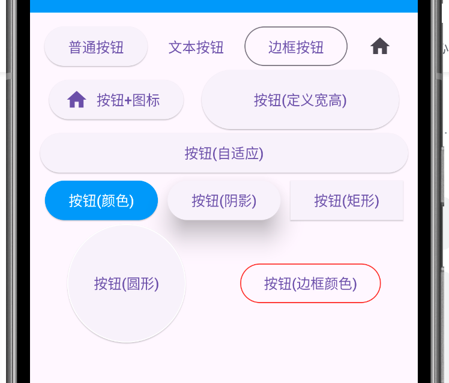

## 简介

- [Flutter](https://flutter.dev/)、[Flutter Package](https://pub.dev/)、[Dart](https://dart.dev/)、[Flutter中文网](https://flutter.cn/)、[Flutter 实战](https://book.flutterchina.club/)
- `Flutter` 是 `Google` 推出并开源的移动应用开发框架，主打跨平台、高保真、高性能。开发者可以通过 `Dart` 语言开发 App，一套代码同时运行在 iOS 和 Android 平台
- 移动开发中的跨平台技术
    
    
- AOT和JIT
    - 程序主要有两种运行方式：静态编译与动态解释
    - `静态编译`的程序在执行前全部被翻译为机器码，通常将这种类型称为`AOT`(Ahead of time)，即"提前编译"
    - `解释执行`的则是一句一句边翻译边运行，通常将这种类型称为`JIT`(Just-in-time)，即"即时编译"
    - AOT程序的典型代表是用C/C++开发的应用，它们必须在执行前编译成机器码；而JIT的代表则非常多，如JavaScript、python等，事实上，所有脚本语言都支持JIT模式
    - 一般认为只要需要编译，无论其编译产物是字节码还是机器码，都属于AOT。如Java、Python，它们可以在第一次执行时编译成中间字节码
- Flutter特性
    - 基于JIT的快速开发周期：Flutter在开发阶段采用，采用JIT模式
    - 基于AOT的发布包：Flutter在发布时可以通过AOT生成高效的ARM代码以保证应用性能
    - 类型安全：由于Dart是类型安全的语言，支持静态类型检测
- `Dart`的设计目标应该是同时借鉴了Java和JavaScript。Dart在静态语法方面和Java非常相似，如类型定义、函数声明、泛型等，而在动态特性方面又和JavaScript很像，如函数式特性、异步支持等
- 其他如 React-Native、Weex和uni-app

## 安装及运行

### 安装

- 配置环境变量
    
    ```bash
    export PUB_HOSTED_URL=https://pub.flutter-io.cn
    export FLUTTER_STORAGE_BASE_URL=https://storage.flutter-io.cn
    ```
- 安装git
- [下载Flutter SDK](https://github.com/flutter/flutter/releases)，解压，并将`%flutter_home%/bin`设置到环境变量，执行`flutter doctor`看是否成功安装(可运行即可)
- `Dart SDK`已经捆绑在Flutter SDK中，故无需在单独安装Dart SDK
- 安装Android SDK，参考[android.md#安装](/_posts/lang/android.md#安装)
- 配置编辑器(任意一种, 均需安装插件Flutter、Dart): Android Studio/IntelliJ IDEA/VS Code
    - vscode 还可安装 Awesome Flutter Snippets 和 Flutter Widget Snippets 的代码提示工具
    - AS一般直接打开项目即可，如果 gradle 编译失败可以考虑单独打开项目下的 android 目录，查看编译日志
- 修改`%flutter_home%\packages\flutter_tools\gradle\flutter.gradle`为国内镜像。否则编译项目报错`Error running Gradle`

    ```js
    repositories {
        // 替换 google() 为阿里云镜像
        maven { url = uri('https://maven.aliyun.com/repository/google') }
        // 替换 mavenCentral() 为阿里云镜像
        maven { url = uri('https://maven.aliyun.com/repository/central') }
        // 可选：添加阿里云的公共仓库（包含 jcenter 等镜像）
        maven { url = uri('https://maven.aliyun.com/repository/public') }
        maven { url = uri('https://maven.aliyun.com/repository/gradle-plugin') }
        // 保留官方仓库作为兜底
        google()
        mavenCentral()
        gradlePluginPortal()
    }
    ```
    - 如果仍然无法下载依赖，则修改项目目录的`android/build.gradle`文件，在`buildscript.repositories`和`allprojects.repositories`(建议也要配置一下)同上述一样修改。(出现于需要安装系统尚未安装的Android SDK版本)
- 真机调试
    - USB连接必须选择传输文件或者MTP(多媒体传输)
    - 手机设置开启USB调试
    - `flutter devices` 查看设备

### Mac安装

- 下载 SDK: https://docs.flutter.cn/install/archive
- 配置环境变量并生效 `source .bash_profile`

    ```bash
    export FLUTTER_ROOT=/Users/xxx/data/others/flutter-sdk/flutter-3.24.5
    export PATH=$PATH:$FLUTTER_ROOT/bin
    export PUB_HOSTED_URL=https://pub.flutter-io.cn
    export FLUTTER_STORAGE_BASE_URL=https://storage.flutter-io.cn
    ```
- 执行`flutter doctor` 提示需要适配 xcode

```bash
brew install cocoapods
pod setup
# 再次执行检查发现xcode已适配
flutter doctor
```

### 运行(vscode)

- `flutter create demo01` 创建项目
- `flutter run` 进入项目目录即可运行项目，修改代码后在命令行`R`热加载
- debug运行
    - 打开`lib/main.dart`，点击`运行-启动调试`，在底部选择`启动程序` - `Dart & Flutter`，此时会自动编译 (或者点击右上角启动按钮下拉 - Start Debugging)
      - 期间会提示安装Dart Devtools插件(会自动在浏览器打开类似Vue Devtools的展示页面)
      - 修改代码后立即 Cmd+S 会自动重新渲染, 或者点击 Debug 刷新按钮
    - 或者进入调试界面，点击下拉，选择项目添加配置，此时会在项目中产生`.vscode/launch.json`文件(或者手动创建)。如下可创建多个调试(可同时启动)

        ```json
        {
            "version": "0.2.0",
            "configurations": [
                {
                    "name": "simple_material_app", // 调试名称
                    "program": "flutter-examples/simple_material_app/lib/main.dart", // 相对项目根目录调试入口文件
                    "request": "launch",
                    "type": "dart"
                },
                {
                    "name": "using_theme",
                    "program": "flutter-examples/using_theme/lib/main.dart",
                    "request": "launch",
                    "type": "dart"
                }
            ]
        }
        ```

### flutter 命令

```bash
flutter -h
flutter --version # Flutter 3.24.5, Dart 3.5.4
# 检查flutter环境
flutter doctor

## 项目根目录执行
# 根据 pubspec.yaml 获取依赖包
flutter packages get
# 运行项目。r/R 重新加载(热加载)
flutter run
flutter run -d emulator-5554
```

## Flutter语法

### 路由

- 参考: main17

```java
// 普通的路由跳转
Navigator.push(context, MaterialPageRoute(builder: (context) => const HomePage()));
Navigator.push(context, MaterialPageRoute(builder: (context) => const UserPage(title: '个人中心')));
// 普通的路由跳转: 返回上一页
Navigator.pop(context);
// 返回到根路由, 并清空路由栈
Navigator.of(context).pushAndRemoveUntil(
    MaterialPageRoute(builder: (BuildContext context) {
        return const MyIndex();
    }),
    (route) => false
);

// 自定义路由跳转(需定义 routes 对象, 如果需要传递参数需结合 onGenerateRoute, 参考下文)
Navigator.pushNamed(context, "/user", arguments: {"name": "张三"});

// 替换路由: 把当前页面的路由替换为新的路由
Navigator.pushReplacementNamed(context, "/user");
```
- 自定义路由相关

```dart
final Map<String, Function> routes = {
  '/': (contxt) => const MyIndex(),
  '/home': (contxt) => const HomePage(),
  '/user': (context, {arguments = const {"name": "默认用户"}}) => UserPage(title: "用户页面", arguments: arguments),
};

var onGenerateRoute = (RouteSettings settings) {
  // 统一路由处理, 实现自定义路由参数传递, 权限验证等
  final String? name = settings.name;
  final Function? pageContentBuilder = routes[name];
  if (pageContentBuilder != null) {
    // MaterialPageRoute 默认的路由风格(遵循 android 和 ios 平台自己的风格); CupertinoPageRoute 按照ios的路由风格
    if (settings.arguments != null) {
      final Route route = CupertinoPageRoute(
          builder: (context) =>
              pageContentBuilder(context, arguments: settings.arguments));
      return route;
    } else {
      final Route route =
          CupertinoPageRoute(builder: (context) => pageContentBuilder(context));
      return route;
    }
  }
  return null;
};

MaterialApp(
    // home: const MyIndex(), // 定义了自定义路由则不能再定义home
    // routes: routes, // 定义了初始路由和拦截器则不用定义routes
    initialRoute: '/', // 初始路由
    onGenerateRoute: onGenerateRoute, // 路由拦截器
);
```

### Key

- 组件在更新的时候，其状态的保存主要是通过判断组件的类型或者 key 值是否一致
- Key分类
    - 局部键 LocalKey: ValueKey、ObjectKey、UniqueKey
    - 全局建 GlobalKey

```dart
// 类一般都要定义 key, 如:
MyBox({super.key, required this.color});

// ==> 局部键 LocalKey
ValueKey(1)
ObjectKey(MyBox(color: Colors.green))
UniqueKey() // 程序自动生成一个key

// ==> 全局建 GlobalKey
final GlobalKey _globalKey = GlobalKey();

// ==> 根据全局建获取子组件信息
// 获取子组件状态
var state = (_globalKey.currentState as _MyBoxState);
print(state._count); // 0
setState(() {
    state._count++;
});
state._run(); // run...

// 获取子组件Widget(属性)
var box = (_globalKey.currentWidget as MyBox);
print(box.color); // MaterialColor(primary value: Color(0xfff44336))

// 获取子组件渲染的属性
var renderBox = (_globalKey.currentContext!.findRenderObject() as RenderBox);
print(renderBox.size); // Size(100.0, 100.0)

// 在数组末尾插入元素/移除某个元素(基于动画)
_listGlobalKey.currentState!.insertItem(list.length - 1);
_listGlobalKey.currentState!.removeItem(index, (context, animation) {
    list.removeAt(index);
    // ...
});
```

### 动画

- 隐式动画: 组件内部自动处理动画, 如: RotationTransition, ScaleTransition, FadeTransition, SlideTransition 等
- 显式动画: 手动控制动画, 如: AnimationController, Animation, Tween 等
    - AnimationController: 动画控制器, 用于控制动画的播放, 暂停, 停止等操作
    - Animation: 动画对象, 用于定义动画的属性, 如: 动画的时间, 动画的曲线等
    - Tween: 动画插值器, 用于定义动画的起始值和结束值, 并根据动画的进度计算中间值
    - Curves: 动画曲线, 用于定义动画的变化速率, 如: Curves.linear, Curves.easeInOut, Curves.bounceInOut 等
- 组件自带动画: AnimatedList, AnimatedContainer, AnimatedPadding, AnimatedOpacity, AnimatedPositioned, AnimatedDefaultTextStyle 等
    - AnimatedList 和 ListView 的功能大体相似，不同的是， AnimatedList 可以在列表中插入或删除节点时执行一个动画来提高用户体验

```dart
// 隐式动画
AnimatedList(
    key: globalKey,
    initialItemCount: list.length,
    itemBuilder: (context, index, animation) {
    // FadeTransition 淡入淡出, ScaleTransition 缩放
    // return FadeTransition(
    //   opacity: animation,
    //   child: _buildItem(context, index),
    // );
    return ScaleTransition(
        scale: animation,
        child: _buildItem(context, index),
    );
})
AnimatedContainer(
    duration: const Duration(seconds: 1),
    width: flag ? 100 : 200,
    height: flag ? 100 : 200,
    transform: flag ? Matrix4.translationValues(0, 0, 0) : Matrix4.translationValues(-100, 0, 0),
    color: flag ? Colors.red : Colors.blue,
)

// 显式动画
// with SingleTickerProviderStateMixin
late AnimationController animationController;
animationController = AnimationController(
    vsync: this,
    duration: const Duration(seconds: 1),
    // lowerBound: 0.3, // 动画执行范围下限. 默认 0
    // upperBound: 0.4, // 动画执行范围上限. 默认 1.0 如 0-1 表示旋转一整圈
);
animationController.addListener(() {
    print("animationController.value: ${animationController.value}");
});

RotationTransition(
    turns: animationController,
    child: const FlutterLogo(size: 80),
),

animationController.repeat(); // 重复执行动画
animationController.forward(); // 正向执行一次动画
animationController.stop();
animationController.reset();
animationController.reverse();
```

## Dart语法

### 变量定义

```dart
List list = [];
List<Widget> list2 = [];
var list3 = []; // var 会自动推断类型

// late: 延迟初始化变量: 仅在变量首次使用时初始化‌; 空安全迁移‌: 在声明不可为空的变量时，确保后续会进行赋值操作
late String title;
```

### 对象类型

- list

```dart
list = List.generate(10, (index) {
    return index;
}).toList();
```

### 流程控制

## Flutter基础案例

### 目录结构&入口文件

- 目录结构
    - android/ios/macos/windows/linux/web 为不同平台的基础文件夹
    - lib 为项目 dart 代码夹
    - build 编译的临时文件夹
    - analysis_options.yaml 代码语法校验(可注释掉)
    - pubspec.yaml 依赖的库配置
- main01: lib/main.dart 入口文件

```dart
import 'package:flutter/material.dart';

// 入口函数
void main() {
  // 启动函数
  runApp(const Center(
    child: Text("你好 Flutter", textDirection: TextDirection.ltr,),
  ));
}
```

### MaterialApp和StatelessWidget

- 使用 MaterialApp 和 Scaffold 进行装饰
- StatelessWidget 无状态组件, StatefulWidget 有状态组件
- main03

```dart
// 代码块 importM
import 'package:flutter/material.dart';

// 入口函数: main
void main() {
  // 启动程序: runApp
  runApp(
    // 使用 MaterialApp 和 Scaffold 进行装饰
    MaterialApp(
      home: Scaffold(
        appBar: AppBar(title: const Text("Demo")),
        body: const MyApp(),
      ),
    ),
  );
}

// StatelessWidget 无状态组件, StatefulWidget 有状态组件
// 代码块 statelessW
class MyApp extends StatelessWidget {
  const MyApp({super.key});

  @override
  Widget build(BuildContext context) {
    return const Center(
      child: const Text(
        "你好 Flutter, 我是自定义组件",
        textDirection: TextDirection.ltr, // 文字从左到右排版
        style: TextStyle(color: Color.fromARGB(244, 244, 123, 1), fontSize: 20),
      ),
    );
  }
}
```

### Container容器和Text文本

- main04

```dart
import 'package:flutter/material.dart';

void main() {
  runApp(
    MaterialApp(
      home: Scaffold(
        appBar: AppBar(title: Text("Demo")),
        // Column 容器: 从上向下排列
        body: const Column(children: [MyApp(), MyButton(), MyText()]),
      ),
    ),
  );
}

class MyApp extends StatelessWidget {
  const MyApp({super.key});

  @override
  Widget build(BuildContext context) {
    return Center(
      // Container容器: 类似div
      child: Container(
        width: 200,
        height: 200,
        alignment: Alignment.center, // 内容的对齐方式
        // color: Colors.teal, // 背景颜色. 不能同时定义 color 和 decoration
        decoration: BoxDecoration(
          color: Colors.teal, // 背景颜色
          border: Border.all(color: Colors.blue, width: 2),
          borderRadius: BorderRadius.circular(10), // 配置圆角
          // 配置阴影
          boxShadow: [const BoxShadow(color: Colors.yellow, blurRadius: 20)],
          // 背景渐变
          gradient: LinearGradient(colors: [Colors.red, Colors.yellow]),
        ),
        transform: Matrix4.translationValues(40, 0, 0), // 正常是居中的, 此处为向右移动 40 距离
        // transform: Matrix4.rotationZ(0.2), // 旋转
        // transform: Matrix4.skewY(.2), // 倾斜
        child: const Text(
          "我在Container里",
          style: TextStyle(color: Colors.red, fontSize: 20),
        ),
      ),
    );
  }
}

class MyButton extends StatelessWidget {
  const MyButton({super.key});

  @override
  Widget build(BuildContext context) {
    return Container(
      width: 200,
      height: 40,
      // 外边距 margin, 内填充 padding
      // margin: const EdgeInsets.all(10),
      margin: const EdgeInsets.fromLTRB(0, 20, 0, 0),
      alignment: Alignment.center,
      decoration: BoxDecoration(
        color: Colors.blue,
        borderRadius: BorderRadius.circular(20),
      ),
      child: const Text(
        "按钮",
        style: TextStyle(color: Colors.white, fontSize: 20),
      ),
    );
  }
}

class MyText extends StatelessWidget {
  const MyText({super.key});

  @override
  Widget build(BuildContext context) {
    return Container(
      width: 200,
      height: 200,
      margin: const EdgeInsets.fromLTRB(0, 40, 0, 0),
      padding: const EdgeInsets.all(10),
      decoration: const BoxDecoration(
        color: Colors.yellow
      ),
      child: const Text(
        "Flutter 是 Google 推出并开源的移动应用开发框架，主打跨平台、高保真、高性能。开发者可以通过 Dart 语言开发 App，一套代码同时运行在 iOS 和 Android平台。 Flutter 提供了丰富的组件、接口，开发者可以很快地为 Flutter 添加 Native（即原生开发，指基于平台原生语言来开发应用，flutter可以和平台原生语言混合开发） 扩展。",
        textAlign: TextAlign.left,
        overflow: TextOverflow.ellipsis, // 溢出显示几个点
        maxLines: 5,
        style: TextStyle(
          color: Colors.red,
          fontSize: 20,
          fontWeight: FontWeight.bold,
          fontStyle: FontStyle.italic, // 斜体
          letterSpacing: 2, // 字体间距
          decoration: TextDecoration.underline, // 下划线
          decorationColor: Colors.blue, // 下划线颜色, 默认黑色
        ),
      ),
    );
  }
}
```

### Paddiing,SizedBox,AspectRatio组件

- Paddiing组件

```dart
// 如果只是简单的 padding 需求, 建议使用 Padding 组件代替 Container(消耗资源更大)
// const Container(padding: EdgeInsets.all(10), child: MyHomePage(),);
const Padding(padding: EdgeInsets.all(10), child: MyHomePage(),);
```
- SizedBox组件

```dart
// 如果只是简单的定义宽高需求, 建议使用 SizedBox 组件代替 Container(消耗资源更大)
// const Container(width: 80, height: 80, child: Icon(Icons.home));
const SizedBox(width: 80, height: 80, child: Icon(Icons.home));
```
- AspectRatio组件

```dart
Widget build(BuildContext context) {
    // 定义宽高比, 类似 GridView 的 childAspectRatio 属性
    return AspectRatio(
        aspectRatio: 2/1,
        child: Container(
            color: Colors.red,
        ),
    );
}
```

### Image图片使用

- main05

```dart
import 'package:flutter/material.dart';

void main() {
  runApp(
    MaterialApp(
      home: Scaffold(
        appBar: AppBar(title: const Text("Demo")),
        body: const Column(
          children: [
            MyApp(),
            SizedBox(height: 10,), // 内置边距组件
            MyCircularImg(), // Container 背景实现圆形图片
            SizedBox(height: 10,),
            MyCircularImg2(), // ClipOval 实现圆形图片
            SizedBox(height: 10,),
            MyCircularImg3(), // CircleAvatar 实现圆形图片
            SizedBox(height: 10,),
            MyLocalImg()
          ],
        ),
      ),
    ),
  );
}

class MyApp extends StatelessWidget {
  const MyApp({super.key});

  @override
  Widget build(BuildContext context) {
    return Container(
      width: 200,
      height: 200,
      decoration: const BoxDecoration(
        color: Colors.yellow
      ),
      child: Image.network(
        "https://s21.ax1x.com/2025/10/15/pVqQY5D.png",
        fit: BoxFit.cover, // 剪裁
        // alignment: Alignment.centerLeft, // 图片排版方式
        // scale: 2, // 图片缩小 1 倍
        // repeat: ImageRepeat.repeatX, // 平铺
      ),
    );
  }
}

// 圆形图片
class MyCircularImg extends StatelessWidget {
  const MyCircularImg({super.key});

  @override
  Widget build(BuildContext context) {
    return Container(
      width: 150,
      height: 150,
      // 基于背景 borderRadius 实现圆形图片
      decoration: BoxDecoration(
        color: Colors.yellow,
        borderRadius: BorderRadius.circular(75),
        image: const DecorationImage(
          image: NetworkImage("https://s21.ax1x.com/2025/10/15/pVqQY5D.png"),
          fit: BoxFit.cover
        )
      ),
    );
  }
}


// 圆形图片, 基于 ClipOval
class MyCircularImg2 extends StatelessWidget {
  const MyCircularImg2({super.key});

  @override
  Widget build(BuildContext context) {
    return ClipOval(
      child: Image.network(
        "https://s21.ax1x.com/2025/10/15/pVqQY5D.png",
        // 不指定宽高则默认是椭圆形的
        width: 150,
        height: 150,
        fit: BoxFit.cover,
      ),
    );
  }
}

// 圆形图片, 基于 CircleAvatar
class MyCircularImg3 extends StatelessWidget {
  const MyCircularImg3({super.key});

  @override
  Widget build(BuildContext context) {
    return const CircleAvatar(
      radius: 110,
      backgroundColor: Colors.red,
      child: CircleAvatar(
        radius: 100,
        backgroundImage: NetworkImage("https://s21.ax1x.com/2025/10/15/pVqQNPe.png"),
      )
    );
  }
}

// 本地图片
class MyLocalImg extends StatelessWidget {
  const MyLocalImg({super.key});

  @override
  Widget build(BuildContext context) {
    return Container(
      width: 150,
      height: 150,
      decoration: BoxDecoration(
        color: Colors.yellow
      ),
      // images/a.jpeg 需要在 pubspec.yaml 中配置在 flutter.assets 下的数组
      /**
        assets:
          # 一个图片要放3个地方, 2.0x是放大 2 倍, 3.0x 是放大 3 倍, 使用的时候直接使用 images/a.jpeg, 会自动根据设备分辨率选择
          - images/a.jpeg
          - images/2.0x/a.jpeg
          - images/3.0x/a.jpeg
          # - images/b.jpeg
       */
      child: Image.asset("images/a.jpeg", fit: BoxFit.cover)
    );
  }
}
```

### Icon图标使用及IconData自定义图标

- main06

```dart
// =====> lib/main.dart
import 'package:flutter/material.dart';
import './inc/myIcons.dart';

void main() {
  runApp(const MyApp());
}

class MyApp extends StatelessWidget {
  const MyApp({super.key});

  @override
  Widget build(BuildContext context) {
    return MaterialApp(
      theme: ThemeData(
        // primarySwatch 主要影响的是 AppBar 和某些 Material 组件（比如浮动按钮、按钮等）的默认背景颜色
        // 如果你想让其他组件（比如文字、图标等）也使用红色样式，需要进一步修改 textTheme 或其他相关的 ThemeData 属性
        primarySwatch: Colors.green,
        appBarTheme: const AppBarTheme(
          backgroundColor: Colors.blue, // 设置AppBar的背景颜色, v3.24.5 primarySwatch 无效
        ),
      ),
      home: Scaffold(
        appBar: AppBar(title: const Text("Demo")),
        body: const MyHomePage(),
      ),
    );
  }
}

class MyHomePage extends StatelessWidget {
  const MyHomePage({super.key});

  @override
  Widget build(BuildContext context) {
    return const Column(
      children: [
        Text("Material自带图标"),
        SizedBox(height: 10,),
        Icon(Icons.home),
        SizedBox(height: 10,),
        Icon(Icons.person, color: Colors.blue,),
        SizedBox(height: 10,),
        Icon(Icons.person, color: Colors.yellow, size: 40,),
        SizedBox(height: 10,),

        Text("Iconfont自定义图标"),
        SizedBox(height: 10,),
        Icon(MyIcons.money, color: Colors.yellow),
        SizedBox(height: 10,),
        Icon(MyIcons.func, size: 40),
        SizedBox(height: 10,),
        Icon(MyIcons.setting),
      ],
    );
  }
}

// =====> ./inc/myIcons.dart
import 'package:flutter/material.dart';

class MyIcons {
  // ignore: slash_for_doc_comments
  /**
    1. 下载 https://www.iconfont.cn/ 图片: 加入到购物车 - 下载代码, 将 iconfont.ttf 文件放到 fonts 目录
    2. 需要在 pubspec.yaml 中定义字体配置
    flutter:
      fonts:
        - family: myIcon
          fonts:
            - asset: fonts/iconfont.ttf
        - family: myIcon2
          fonts:
            - asset: fonts/iconfont-2.ttf
   */
  static const IconData money = IconData(
    0xe67a, // 16进制, 从下载代码的 iconfont.json 中取 unicode 的值
    fontFamily: 'myIcon',
    matchTextDirection: true
  );

  static const IconData func = IconData(
    0xe67b,
    fontFamily: 'myIcon',
    matchTextDirection: true
  );


  static const IconData setting = IconData(
    0xe670,
    fontFamily: 'myIcon2',
    matchTextDirection: true
  );
}
```

### ListView列表组件

- ListTile 可以在 ListView, Column 中
- main07


```dart
import 'package:flutter/material.dart';
import './res/listViewData.dart';

void main() {
  runApp(const MyApp());
}

class MyApp extends StatelessWidget {
  const MyApp({super.key});

  @override
  Widget build(BuildContext context) {
    return MaterialApp(
      theme: ThemeData(
        appBarTheme: const AppBarTheme(
          backgroundColor: Colors.blue,
        ),
      ),
      home: Scaffold(
        appBar: AppBar(title: const Text("Demo")),
        // body: const MyHomePage(), // 垂直列表
        // body: const MyListViewHorizontal(), // 水平列表
        // body: const MyListViewDynamic(), // 动态列表
        body: MyListViewDynamic2(), // 动态列表, 基于 ListView.builder
      ),
    );
  }
}

// 垂直列表
class MyHomePage extends StatelessWidget {
  const MyHomePage({super.key});

  @override
  Widget build(BuildContext context) {
    // Column 垂直排列如果超过屏幕高度会渲染异常, ListView 列表组件则会自动包含滚动条
    return ListView(
      padding: const EdgeInsets.fromLTRB(0, 10, 0, 0),
      children: [
        // ListTile 列表项
        const ListTile(
          leading: Icon(
            Icons.home,
            color: Colors.blue,
          ), // 前缀
          title: Text("主页"),
        ),
        const Divider(),
        const ListTile(
          leading: Icon(
            Icons.person,
            color: Colors.green,
          ),
          title: Text("个人中心"),
          trailing: Icon(Icons.chevron_right_sharp), // 后缀
        ),
        const Divider(),

        // 图文列表
        ListTile(
          leading: Image.network("https://s21.ax1x.com/2025/10/15/pVqQY5D.png"),
          title: const Text("前三季度外贸增速4%，怎么看？"),
          subtitle: const Text("整个前三季度我国货物贸易进出口达到33.61万亿元人民币，同比增长了4%"),
        ),
        ListTile(
          leading: Image.network("https://s21.ax1x.com/2025/10/15/pVqQY5D.png"),
          title: const Text("星火成炬｜宝塔山下新延安"),
          subtitle: const Text("延安精神熠熠闪耀……"),
          trailing:
              Image.network("https://s21.ax1x.com/2025/10/15/pVqQNPe.png"),
        ),

        // 图片列表 2
        Image.network("https://s21.ax1x.com/2025/10/15/pVqQNPe.png"),
        Container(
          height: 44,
          padding: const EdgeInsets.fromLTRB(0, 10, 0, 0),
          child: const Text(
            "我是标题11111",
            textAlign: TextAlign.center,
            style: TextStyle(fontSize: 18),
          ),
        ),
        Image.network("https://s21.ax1x.com/2025/10/15/pVqQY5D.png"),
        Container(
          height: 44,
          padding: const EdgeInsets.fromLTRB(0, 10, 0, 0),
          child: const Text(
            "我是标题22222",
            textAlign: TextAlign.center,
            style: TextStyle(fontSize: 18),
          ),
        ),

        // 垂直列表
        Container(
          width: 10, // 垂直列表设置 width 无效, 只能设置 height
          height: 50,
          color: Colors.red,
        ),
        Container(
          height: 100,
          color: Colors.blue,
        ),
      ],
    );
  }
}

// 水平列表
class MyListViewHorizontal extends StatelessWidget {
  const MyListViewHorizontal({super.key});

  @override
  Widget build(BuildContext context) {
    return SizedBox(
      height: 100,
      child: ListView(
        scrollDirection: Axis.horizontal, // 定义为水平(滚动)列表, 默认为垂直列表
        children: [
          Container(
            width: 100,
            height: 200, // 水平列表只能定义 width, 定义 height 无效
            color: Colors.red,
            child: Column(
              children: [
                Image.network("https://s21.ax1x.com/2025/10/15/pVqQGVK.png"),
                const Text('我是一个文本')
              ],
            ),
          ),
          Container(
            width: 100,
            color: Colors.blue,
          ),
          Container(
            width: 200,
            color: Colors.yellow,
          ),
          Container(
            width: 100,
            color: Colors.cyan,
          ),
          Container(
            width: 100,
            color: Colors.pink,
          ),
        ],
      ),
    );
  }
}

class MyListViewDynamic extends StatelessWidget {
  const MyListViewDynamic({super.key});

  // _ 开头的为私有函数
  // List<Widget> _initListView() {
  //   List<Widget> list = [];
  //   for (var i = 0; i < 15; i++) {
  //     list.add(Text("这是第 $i 行"));
  //   }
  //   return list;
  // }

  List<Widget> _initListView() {
    List<Widget> list = [];
    // listViewData 为 listViewData.dart 中的数据
    for (var i = 0; i < listViewData.length; i++) {
      list.add(ListTile(
        leading: Image.network("${listViewData[i]["img"]}"),
        title: Text("${listViewData[i]["title"]}"),
        subtitle: Text("${listViewData[i]["subtitle"]}"),
      ));
    }
    return list;
  }

  // List<Widget> _initListView() {
  //   var list = listViewData.map((item) {
  //     return ListTile(
  //       leading: Image.network("${item["img"]}"),
  //       title: Text("${item["title"]}"),
  //       subtitle: Text("${item["subtitle"]}"),
  //     );
  //   });
  //   // (1, 2, 3) --> [1, 2, 3]
  //   return list.toList();
  // }

  @override
  Widget build(BuildContext context) {
    return ListView(
      padding: const EdgeInsets.fromLTRB(0, 10, 0, 0),
      children: _initListView(),
    );
  }
}

class MyListViewDynamic2 extends StatelessWidget {
  final List list = [];

  // 如果构造方法使用 const 修饰, 则不能包含方法体, 此处去掉 const
  MyListViewDynamic2({super.key})  {
    for (var i = 0; i < 10; i++) {
      list.add("这是第 $i 行");
    }
  }

  @override
  Widget build(BuildContext context) {
    return ListView.builder(
      itemCount: list.length,  
      itemBuilder: (context, index) {
        return ListTile(
          title: Text("${list[index]}"),
        );
      });
  }
}
```

### GridView网格组件

- 可以通过 GridView.count(固定每行个数), GridView.extent(固定每行每元素的最大宽度进行自适应) 实现网格布局; 通过 GridView.builder 实现动态网格布局
- main08


```dart
import 'package:flutter/material.dart';
import './res/listViewData.dart';

void main() {
  runApp(const MyApp());
}

class MyApp extends StatelessWidget {
  const MyApp({super.key});

  @override
  Widget build(BuildContext context) {
    return MaterialApp(
      theme: ThemeData(
        appBarTheme: const AppBarTheme(
          backgroundColor: Colors.blue,
        ),
      ),
      home: Scaffold(
        appBar: AppBar(title: const Text("Demo")),
        // body: const Padding(padding: EdgeInsets.all(10), child: MyHomePage(),), // GridView.count
        // body: const Padding(padding: EdgeInsets.all(10), child: MyGridViewExtend(),), // GridView.extend
        body: const Padding(padding: EdgeInsets.all(10), child: MyGridViewBuilder(),), // GridView.builder
      ),
    );
  }
}

class MyHomePage extends StatelessWidget {
  const MyHomePage({super.key});

  @override
  Widget build(BuildContext context) {
    return GridView.count(
      crossAxisSpacing: 10, // 水平子Widget之间间距
      mainAxisSpacing: 20, // 垂直子Widget之间间距
      crossAxisCount: 2, // 一行的Widget数量(GridView.count适用)
      childAspectRatio: 0.8, // 子Widget宽高比例
      children: const <Widget> [
        MyIconBox(Icons.home),
        MyIconBox(Icons.search, color: Colors.yellow),
        MyIconBox(Icons.person, color: Colors.black),
      ],
    );
  }
}

class MyGridViewExtend extends StatelessWidget {
  const MyGridViewExtend({super.key});

  @override
  Widget build(BuildContext context) {
    return GridView.extent(
      crossAxisSpacing: 10, // 水平子Widget之间间距
      mainAxisSpacing: 20, // 垂直子Widget之间间距
      // maxCrossAxisExtent为子元素在横轴上的最大长度，之所以是“最大”长度，是因为横轴方向每个子元素的长度仍然是等分的
      // 举个例子，如果ViewPort的横轴长度是450，那么当maxCrossAxisExtent的值在区间 [450/4=112.5, 450/3=150) 内的话，子元素最终实际长度都为112.5
      // 此案例: 100可在一行显示3个, 300每行显示2个, 400每行显示1个
      maxCrossAxisExtent: 100, // 一行中每个Widget的最大宽度(会自适应调整每行显示的个数, GridView.extent适用)
      childAspectRatio: 0.8, // 子Widget宽高比例
      children: const <Widget> [
        MyIconBox(Icons.home),
        MyIconBox(Icons.search, color: Colors.yellow),
        MyIconBox(Icons.person, color: Colors.black),
      ],
    );
  }
}

class MyGridViewBuilder extends StatelessWidget {
  const MyGridViewBuilder({super.key});

  @override
  Widget build(BuildContext context) {
    return GridView.builder(
      // 必传. SliverGridDelegateWithFixedCrossAxisCount (实现GridView.count) | SliverGridDelegateWithMaxCrossAxisExtent (实现GridView.extent)
      gridDelegate: const SliverGridDelegateWithFixedCrossAxisCount(
        crossAxisSpacing: 10, // 水平子Widget之间间距
        crossAxisCount: 2,
      ),
      itemCount: listViewData.length,
      itemBuilder: (BuildContext context, int index) {
        return Column(
          children: [
            Image.network("${listViewData[index]["img"]}", fit: BoxFit.cover),
            Text("${listViewData[index]["title"]}")
          ],
        );
      },
    );
  }
}

class MyIconBox extends StatelessWidget {
  final IconData icon; // 如果存在额外非 final 的构造参数, 就需要去掉构造函数的 const
  final Color color;

  // 此处参数使用 this.icon 等同于在方法体里面进行 this.icon = icon 的赋值
  const MyIconBox(this.icon, {super.key, this.color = Colors.red});

  @override
  Widget build(BuildContext context) {
    return Container(
      width: 100,
      height: 100,
      color: Colors.blue,
      child: Icon(icon, color: color, size: 30,),
    );
  }
}
```

### Row,Column,Wrap线性布局

- Row(水平布局, 从左到右排列) 和 Column(垂直布局, 从上到下排列) 都继承自 Flex
- Wrap可以实现流布局(如横向不够则自动换行)，单行的Wrap跟Row表现几乎一致，单列的Wrap则跟Column表现几乎一致
- main09


```dart
import 'package:flutter/material.dart';

void main() {
  runApp(const MyApp());
}

class MyApp extends StatelessWidget {
  const MyApp({super.key});

  @override
  Widget build(BuildContext context) {
    return MaterialApp(
      theme: ThemeData(
        appBarTheme: const AppBarTheme(
          backgroundColor: Colors.blue,
        ),
      ),
      home: Scaffold(
        appBar: AppBar(title: const Text("Demo")),
        body: const Padding(padding: EdgeInsets.all(10), child: MyHomePage(),),
      ),
    );
  }
}

class MyHomePage extends StatelessWidget {
  const MyHomePage({super.key});

  @override
  Widget build(BuildContext context) {
    // Row(水平布局, 从左到右排列) 和 Column(垂直布局, 从上到下排列) 都继承自 Flex 
    return Column(
      crossAxisAlignment: CrossAxisAlignment.start, // 纵轴的对齐方式
      children: <Widget>[
        const Text("hi"),
        const Text("world"),
        const Divider(),
        const Row(
          mainAxisAlignment: MainAxisAlignment.spaceBetween, // 主轴的对齐方式
          children: <Widget>[
            Text("主页"),
            Icon(Icons.home, size: 30,),
          ],
        ),
        const Row(
          mainAxisAlignment: MainAxisAlignment.center, // 主轴的对齐方式
          children: <Widget>[
            Text("我的"),
            Icon(Icons.person, size: 30,),
          ],
        ),
        const Divider(),
        const Row(
          mainAxisAlignment: MainAxisAlignment.end, // 主轴的对齐方式 (在水平方向靠左, 居中, 靠右等对齐)
          crossAxisAlignment: CrossAxisAlignment.start, // 纵轴的对齐方式 (在垂直方向靠上, 中线, 靠下等对齐)
          // verticalDirection: VerticalDirection.down, // 默认, 表示Row纵轴(垂直)的对齐方向为从上到下; up则是反过来
          children: <Widget>[
            Text("hello world", style: TextStyle(fontSize: 30.0),),
            Text("I am Jack"),
          ],
        ),
        const Divider(),
        Container(
          // width: double.infinity, // double.infinity 或 double.maxFinite 表示占满父容器的宽高(可实现占满整个屏幕)
          height: 100, // 此处不定义高度则 CrossAxisAlignment.center 无效果
          color: Colors.black12,
          child: const Row(
            mainAxisAlignment: MainAxisAlignment.spaceBetween,
            crossAxisAlignment: CrossAxisAlignment.center, // 居中对齐(基于外层容器的高度)
            children: <Widget>[
              Icon(Icons.home, size: 30,),
              Icon(Icons.search, size: 30,),
              Icon(Icons.person, size: 30,),
            ],
          ),
        ),
        const Divider(),
        // Wrap可以实现流布局，单行的Wrap跟Row表现几乎一致，单列的Wrap则跟Column表现几乎一致
        // 但Row与Column都是单行单列的，Wrap则突破了这个限制，mainAxis上空间不足时，则向crossAxis上去扩展显示
        Wrap(
          // direction: Axis.horizontal, // 主轴的方向，默认水平
          alignment: WrapAlignment.start, // 主轴的对其方式
          spacing: 20, // 主轴方向上的间距
          runSpacing: 10, // 纵轴(垂直方向)上的间距
          // textDirection: TextDirection.ltr, // 文本方向
          // verticalDirection: VerticalDirection.down, // 定义了children摆放顺序，默认是down，见Flex相关属性介绍
          // runAlignment: WrapAlignment.start, // run的对齐方式。run可以理解为新的行或者列，如果是水平方向布局的话，run可以理解为新的一行
          children: [
            Container(width: 100, height: 20, color: Colors.red, child: const Text("文本 1"),),
            Container(width: 110, height: 20, color: Colors.yellow, child: const Text("文本 2"),),
            Container(width: 120, height: 20, color: Colors.blue,),
            Container(width: 200, height: 20, color: Colors.black,),
            Container(width: 100, height: 20, color: Colors.red,),
            Container(width: 120, height: 20, color: Colors.yellow,),
          ],
        )
      ],
    );
  }
}
```

### Flex和Expanded弹性布局

- Row(水平布局, 从左到右排列) 和 Column(垂直布局, 从上到下排列) 都继承自 Flex 
- Expanded 只能放到 Flex Row Column 内来实现弹性布局
- main10


```dart
import 'package:flutter/material.dart';

void main() {
  runApp(const MyApp());
}

class MyApp extends StatelessWidget {
  const MyApp({super.key});

  @override
  Widget build(BuildContext context) {
    return MaterialApp(
      theme: ThemeData(
        appBarTheme: const AppBarTheme(
          backgroundColor: Colors.blue,
        ),
      ),
      home: Scaffold(
        appBar: AppBar(title: const Text("Demo")),
        body: const Padding(padding: EdgeInsets.all(10), child: MyHomePage(),),
      ),
    );
  }
}

class MyHomePage extends StatelessWidget {
  const MyHomePage({super.key});

  @override
  Widget build(BuildContext context) {
    return Column(
      children: [
        // Row(水平布局, 从左到右排列) 和 Column(垂直布局, 从上到下排列) 都继承自 Flex 
        const Flex(
          direction: Axis.horizontal, // horizontal 水平布局 ｜ vertical 垂直布局
          children: [
            Text("hello world, "),
            Text("flutter"),
          ],
        ),
        // 结合 Expanded 实现弹性布局. flex实现整体左右比为2:1, 右侧的上下比为2:1, 需要配置子元素宽高
        Row(
          children: [
            // Expanded 只能放到 Flex Row Column 内来实现弹性布局
            Expanded(
              flex: 2, 
              child: SizedBox(height: 180, child: Image.network("https://s21.ax1x.com/2025/10/15/pVqQY5D.png", fit: BoxFit.cover),)
            ),
            const SizedBox(width: 10,),
            Expanded(
              flex: 1, 
              child: SizedBox(
                height: 180,
                child: Column(
                  children: [
                    Expanded(
                      flex: 2,
                      child: SizedBox(width: double.infinity, child: Image.network("https://s21.ax1x.com/2025/10/15/pVqQNPe.png", fit: BoxFit.cover),)
                    ),
                    const SizedBox(height: 10,),
                    Expanded(
                      flex: 1,
                      child: SizedBox(width: double.infinity, child: Image.network("https://s21.ax1x.com/2025/10/15/pVqQY5D.png", fit: BoxFit.cover),)
                    ),
                  ],
                ),
              )
            ),
          ],
        )
      ],
    );
  }
}
```

### Stack,Positioned,Align层叠布局

- Stack 层叠布局: 后面的默认会覆盖前面的(后面的在上面)
- Positioned 基于父容器进行定位, 如果父容器没有则基于主屏幕
- Center 为 Align 子组件, 也可以使用 Container.alignment 属性进行对齐
- main11


```dart
import 'package:flutter/material.dart';

void main() {
  runApp(const MyApp());
}

class MyApp extends StatelessWidget {
  const MyApp({super.key});

  @override
  Widget build(BuildContext context) {
    return MaterialApp(
      theme: ThemeData(
        appBarTheme: const AppBarTheme(
          backgroundColor: Colors.blue,
        ),
      ),
      home: Scaffold(
        appBar: AppBar(title: const Text("Demo")),
        body: const MyHomePage(),
      ),
    );
  }
}

class MyHomePage extends StatelessWidget {
  const MyHomePage({super.key});

  List<Widget> _initListView() {
    List<Widget> list = [];
    for (var i = 0; i < 15; i++) {
      list.add(ListTile(title: Text("这是第 $i 行"),));
      list.add(const Divider());
    }
    return list;
  }

  @override
  Widget build(BuildContext context) {
    // 在组件的build方法中可以通过 MediaQuery 获取屏幕宽高
    final size = MediaQuery.of(context).size;

    return Container(
      height: 300,
      color: Colors.red,
      // Stack 层叠布局: 后面的默认会覆盖前面的(后面的在上面)
      child: Stack(
        children: [
          ListView(
            padding: const EdgeInsets.only(top: 40),
            children: _initListView(),
          ),
          // 基于父容器进行定位, 如果父容器没有则基于主屏幕
          Positioned(
            left: 0,
            top: 0,
            // width: double.infinity, // 子组件的宽高(注意: 必须是固定值, 使用double.infinity报错)
            width: size.width,
            height: 40,
            child: Container(
              height: 10, // 此处会被 Positioned 覆盖
              // alignment: Alignment.center,
              color: Colors.yellow,
              // child: const Align(
              //   alignment: Alignment.center, // 也可使用 Alignment(0, 0) // 矩形中心点作为原点
              //   child: Text("Flutter1"),
              // )
              // Center 继承 Align
              child: const Center(child: Text("Flutter1")),
            )
          )
        ],
      ),
    );
  }
}
```

### Card卡片

- main12


```dart
import 'package:flutter/material.dart';

void main() {
  runApp(const MyApp());
}

class MyApp extends StatelessWidget {
  const MyApp({super.key});

  @override
  Widget build(BuildContext context) {
    return MaterialApp(
      theme: ThemeData(
        appBarTheme: const AppBarTheme(
          backgroundColor: Colors.blue,
        ),
      ),
      home: Scaffold(
        appBar: AppBar(title: const Text("Demo")),
        body: const MyHomePage(),
      ),
    );
  }
}

class MyHomePage extends StatelessWidget {
  const MyHomePage({super.key});

  @override
  Widget build(BuildContext context) {
    return ListView(
      children: [
        Card(
          // 卡片阴影值的深度
          elevation: 20,
          // 的阴影效果. 此时阴影效果为圆角的长方形边
          shape: RoundedRectangleBorder(
            borderRadius: BorderRadius.circular(10),
          ),
          margin: const EdgeInsets.all(10),
          child: Column(
            children: [
              AspectRatio(
                aspectRatio: 20 / 9,
                child: Image.network("https://s21.ax1x.com/2025/10/15/pVqQY5D.png", fit: BoxFit.cover),
              ),
              const ListTile(
                leading: SizedBox(
                  width: 60, // 此处让图片的宽高和 leading 的宽高一致
                  child: CircleAvatar(
                    radius: 60,
                    backgroundImage: NetworkImage("https://s21.ax1x.com/2025/10/15/pVqQNPe.png"),
                  ),
                ),
                title: Text("全国秋粮收获近七成"),
                subtitle: Text("分作物看，中稻过七成、玉米过六成、大豆过八成"),
              )
            ],
          ),
        ),
      ],
    );
  }
}
```

### ElevatedButton等按钮组件

- 按钮组件: ElevatedButton, TextButton, OutlinedButton, IconButton
- 底部浮动按钮: 基于 Scaffold.floatingActionButton
- main13



```dart
import 'package:flutter/material.dart';

void main() {
  runApp(const MyApp());
}

class MyApp extends StatelessWidget {
  const MyApp({super.key});

  @override
  Widget build(BuildContext context) {
    return MaterialApp(
      theme: ThemeData(
        appBarTheme: const AppBarTheme(
          backgroundColor: Colors.blue,
        ),
      ),
      home: Scaffold(
        appBar: AppBar(title: const Text("Demo")),
        body: const Padding(padding: EdgeInsets.all(10), child: MyHomePage(),),
      ),
    );
  }
}

class MyHomePage extends StatelessWidget {
  const MyHomePage({super.key});

  @override
  Widget build(BuildContext context) {
    return ListView(
      children: [
        Row(
          mainAxisAlignment: MainAxisAlignment.spaceAround,
          children: [
            ElevatedButton(
              onPressed: () {
                print("点击了普通按钮...");
              },
              child: const Text("普通按钮")
            ),
            TextButton(
              onPressed: () {},
              child: const Text("文本按钮")
            ),
            OutlinedButton(
              onPressed: () {},
              child: const Text("边框按钮")
            ),
            IconButton(
              onPressed: () {},
              icon: const Icon(Icons.home)
            )
          ],
        ),
        Row(
          mainAxisAlignment: MainAxisAlignment.spaceAround,
          children: [
            ElevatedButton.icon(
              onPressed: () {},
              icon: const Icon(Icons.home),
              label: const Text("按钮+图标")
            ),
            SizedBox(
              width: 200,
              height: 60,
              child: ElevatedButton(
                onPressed: () {},
                child: const Text("按钮(定义宽高)")
              ),
            )
          ],
        ),
        Row(
          mainAxisAlignment: MainAxisAlignment.spaceAround,
          children: [
            Expanded(
              child: ElevatedButton(
                onPressed: () {},
                child: const Text("按钮(自适应)")
              )
            )
          ],
        ),
        Row(
          mainAxisAlignment: MainAxisAlignment.spaceAround,
          children: [
            ElevatedButton(
              style: ButtonStyle(
                backgroundColor: WidgetStateProperty.all(Colors.blue),
                foregroundColor: WidgetStateProperty.all(Colors.white),
              ),
              onPressed: () {},
              child: const Text("按钮(颜色)")
            ),
            ElevatedButton(
              style: ButtonStyle(
                elevation: WidgetStateProperty.all(20),
              ),
              onPressed: () {},
              child: const Text("按钮(阴影)")
            ),
            ElevatedButton(
              style: ButtonStyle(
                shape: WidgetStateProperty.all(
                  RoundedRectangleBorder(
                    // 可调整圆角大小
                    borderRadius: BorderRadius.circular(0)
                  )
                ),
              ),
              onPressed: () {},
              child: const Text("按钮(矩形)")
            )
          ],
        ),
        Row(
          mainAxisAlignment: MainAxisAlignment.spaceAround,
          children: [
            SizedBox(
              width: 120,
              height: 120,
              child: ElevatedButton(
                style: ButtonStyle(
                  shape: WidgetStateProperty.all(
                    const CircleBorder(side: BorderSide(color: Colors.white)),
                  ),
                ),
                onPressed: () {},
                child: const Text("按钮(圆形)")
              ),
            ),
            OutlinedButton(
              style: ButtonStyle(
                side: WidgetStateProperty.all(
                  const BorderSide(width: 1, color: Colors.red),
                ),
              ),
              onPressed: () {},
              child: const Text("按钮(边框颜色)")
            ),
          ],
        ),
      ],
    );
  }
}
```

### StatelessWidget,StatefulWidget状态组件

- StatelessWidget 无状态组件, StatefulWidget 有状态组件
- main14

```dart
import 'package:flutter/material.dart';

void main() {
  runApp(const MyApp());
}

class MyApp extends StatelessWidget {
  const MyApp({super.key});

  @override
  Widget build(BuildContext context) {
    return MaterialApp(
      theme: ThemeData(
        appBarTheme: const AppBarTheme(
          backgroundColor: Colors.blue,
        ),
      ),
      home: const MyHomePage(),
    );
  }
}

class MyHomePage extends StatefulWidget {
  const MyHomePage({super.key});

  @override
  State<MyHomePage> createState() => _MyHomePageState();
}

class _MyHomePageState extends State<MyHomePage> {
  int _count = 0;

  @override
  Widget build(BuildContext context) {
    print('会重新执行build方法进行渲染, _count: $_count');
    return Scaffold(
      appBar: AppBar(title: const Text("Demo")),
      body: Row(
        mainAxisAlignment: MainAxisAlignment.spaceAround,
        children: [
          Text("$_count"),
          ElevatedButton(
            onPressed: () {
              // 必须通过 setState 进行状态更新
              setState(() {
                _count ++;
              });
            }, 
            child: const Text("增加")
          )
        ],
      ),
      // 底部浮动按钮
      floatingActionButton: FloatingActionButton(
        onPressed: () {
          setState(() {
            _count ++;
          });
        },
        child: const Icon(Icons.add)
      )
    );
  }
}
```

### Scaffold骨架组件

- main15


- main.dart

```dart
import 'package:flutter/material.dart';
import './demo15/home.dart';
import './demo15/user.dart';

void main() {
  runApp(const MyApp());
}

class MyApp extends StatelessWidget {
  const MyApp({super.key});

  @override
  Widget build(BuildContext context) {
    return MaterialApp(
      theme: ThemeData(
        appBarTheme: const AppBarTheme(
          backgroundColor: Colors.blue,
        ),
      ),
      home: const MyTabs(),
    );
  }
}

class MyTabs extends StatefulWidget {
  const MyTabs({super.key});

  @override
  State<MyTabs> createState() => _MyTabsState();
}

class _MyTabsState extends State<MyTabs> {
  int _currentIndex = 0;

  @override
  Widget build(BuildContext context) {
    return Scaffold(
      appBar: AppBar(
        // 导航栏左侧图标. 不能和左侧抽屉同时存在
        // leading: IconButton(icon: const Icon(Icons.dashboard), onPressed: () {}),
        title: const Text("App Name"),
        // 导航栏右侧菜单. 不能和右侧抽屉同时存在
        // actions: <Widget>[
        //   IconButton(icon: const Icon(Icons.share), onPressed: () {}),
        //   IconButton(icon: const Icon(Icons.more_horiz), onPressed: () {}),
        // ],
      ),
      drawer: Drawer(
        child: Column(
          children: [
            // DrawerHeader 抽屉头部
            DrawerHeader(
              decoration: const BoxDecoration(
                  color: Colors.yellow,
                  image: DecorationImage(
                      image: NetworkImage(
                          "https://s21.ax1x.com/2025/10/15/pVqQY5D.png"),
                      fit: BoxFit.cover)),
              child: ListView(
                children: const [
                  Text("我是一个头部", style: TextStyle(fontSize: 20, color: Colors.white),)
                ],
              ),
            ),
            const Text("其他信息")
          ],
        ),
      ),
      endDrawer: Drawer(
        child: Column(
          children: [
            // UserAccountsDrawerHeader 账号抽屉头部
            UserAccountsDrawerHeader(
              accountName: const Text("张三", style: TextStyle(color: Colors.white),),
              accountEmail: const Text("admin@qq.com", style: TextStyle(color: Colors.white),),
              currentAccountPicture: const CircleAvatar(
                backgroundImage: NetworkImage("https://s21.ax1x.com/2025/10/15/pVqQY5D.png"),
              ),
              decoration: const BoxDecoration(
                  color: Colors.yellow,
                  image: DecorationImage(
                      image: NetworkImage(
                          "https://s21.ax1x.com/2025/10/15/pVqQGVK.png"),
                      fit: BoxFit.cover)),
              otherAccountsPictures: [
                Image.network("https://s21.ax1x.com/2025/10/15/pVqQNPe.png"),
                Image.network("https://s21.ax1x.com/2025/10/15/pVqQY5D.png"),
              ],
            ),
            const ListTile(
              title: Text("个人中心"),
              leading: CircleAvatar(child: Icon(Icons.people)),
            ),
            const Divider(),
            const ListTile(
              title: Text("系统设置"),
              leading: Icon(Icons.settings) // CircleAvatar(child: Icon(Icons.settings)),
            )
          ],
        ),
      ),
      // body: const Center(
      //   child: Text("内容区2"),
      // ),
      body: _currentIndex == 0 ? const HomePage() : const UserPage(),
      // 底部导航
      bottomNavigationBar: BottomNavigationBar(
          currentIndex: _currentIndex, // 默认选中第几个
          // 选中变化回调函数
          onTap: (v) {
            setState(() {
              _currentIndex = v;
            });
          },
          fixedColor: Colors.blue, // 选中的颜色
          // 底部导航栏类型. fixed: 固定底部导航栏. shifting: 可滑动底部导航栏
          // 如果底部有4个及以上的菜单时就需要配置这个参数，否则按钮默认看不到，点击按钮会出现左右滑动效果
          type: BottomNavigationBarType.fixed,
          items: const [
            BottomNavigationBarItem(icon: Icon(Icons.home), label: "首页"),
            BottomNavigationBarItem(icon: Icon(Icons.category), label: "分类"),
            BottomNavigationBarItem(icon: Icon(Icons.add), label: "发布"),
            BottomNavigationBarItem(icon: Icon(Icons.settings), label: "设置"),
            BottomNavigationBarItem(icon: Icon(Icons.person), label: "我的"),
          ]),
      // 悬浮按钮实现类似闲鱼发布按钮的效果. 或者使用BottomAppBar和CircularNotchedRectangle实现, 参考: https://book.flutterchina.club/chapter5/material_scaffold.html#_5-7-5-%E5%BA%95%E9%83%A8tab%E5%AF%BC%E8%88%AA%E6%A0%8F
      floatingActionButton: FloatingActionButton(
        onPressed: () => setState(() => _currentIndex = 2),
        backgroundColor: _currentIndex == 2 ? Colors.red : Colors.white,
        shape: RoundedRectangleBorder(
          borderRadius: BorderRadius.circular(30), // 调整圆角矩形的弧度
        ),
        child: Container(
          padding: const EdgeInsets.all(10),
          decoration: BoxDecoration(
            color: Colors.white,
            borderRadius: BorderRadius.circular(30),
          ),
          child: const Icon(Icons.add),
        ),
      ),
      // 悬浮按钮位置. centerDocked: 底部导航栏中间位置
      floatingActionButtonLocation: FloatingActionButtonLocation.centerDocked,
    );
  }
}
```
- user.dart (home.dart 同理)

```dart
import 'package:flutter/material.dart';

class UserPage extends StatefulWidget {
  const UserPage({super.key});

  @override
  State<UserPage> createState() => _UserPageState();
}

class _UserPageState extends State<UserPage> {
  @override
  Widget build(BuildContext context) {
    return const Text("其他页面");
  }
}
```

### AppBar,TabBar导航栏

- 基于 TabBar 和 TabBarView 实现导航栏, 两个都需要定义 controller 属性
- main16


- main.dart

```dart
import 'package:flutter/material.dart';
import './demo16/home.dart';

void main() {
  runApp(const MyApp());
}

class MyApp extends StatelessWidget {
  const MyApp({super.key});

  @override
  Widget build(BuildContext context) {
    return MaterialApp(
      debugShowCheckedModeBanner: false, // 去掉debug图标
      theme: ThemeData(
        appBarTheme: const AppBarTheme(
          backgroundColor: Colors.blue,
        ),
        useMaterial3: false, // 默认 useMaterial3: true 会导致TabBar组件样式出现下划线, 并且滚动TAB前面会有一部分空白
        // tabBarTheme: const TabBarTheme(dividerColor: Colors.transparent) // 去掉 TabBar 组件的下划线
      ),
      home: const MyTabs(),
    );
  }
}

class MyTabs extends StatefulWidget {
  const MyTabs({super.key});

  @override
  State<MyTabs> createState() => _MyTabsState();
}

// with 混入 SingleTickerProviderStateMixin
class _MyTabsState extends State<MyTabs> with SingleTickerProviderStateMixin {
  late TabController _tabController;

  // 生命周期函数: 组件初始化时调用
  @override
  void initState() {
    super.initState();
    // 通过 vsync: this 参数将当前 State 对象作为 SingleTickerProviderStateMixin 的提供者
    _tabController = TabController(length: 3, vsync: this);
    // 控制器上添加监听事件(点击和滑动改变下表后都能触发)
    _tabController.addListener(() {
      // 必须判断一下，否则会进入多次
      if (_tabController.animation!.value == _tabController.index) {
        print(_tabController.index); // 获取点击或滑动页面的索引值
      }
    });
  }

  // 生命周期函数: 组件销毁时调用
  @override
  void dispose() {
    super.dispose();
    _tabController.dispose();
  }

  @override
  Widget build(BuildContext context) {
    return Scaffold(
      appBar: AppBar(
        backgroundColor: Colors.red,
        centerTitle: true, // 标题是否居中
        // 导航栏左侧图标. 不能和左侧抽屉同时存在
        leading: IconButton(icon: const Icon(Icons.dashboard), onPressed: () {}),
        title: const Text("App Name"),
        // 导航栏右侧菜单. 不能和右侧抽屉同时存在
        actions: <Widget>[
          IconButton(icon: const Icon(Icons.share), onPressed: () {}),
          IconButton(icon: const Icon(Icons.more_horiz), onPressed: () {}),
        ],
        // 通常放TabBar(TabBar组件必须要设置controller参数): 标题下面显示一个 Tab 导航栏
        bottom: TabBar(
          controller: _tabController,
          isScrollable: true, // 是否可滚动
          labelColor: Colors.white, // 选中label颜色
          // unselectedLabelColor: Colors.black54, // 未选中label颜色
          indicatorColor: Colors.white, // 指示器(文字下面的选中下划线)颜色
          // indicatorWeight: 4, // 指示器高度
          // indicatorSize: TabBarIndicatorSize.label, // label 指示器宽度和文字宽度一致, tab 跟每个tab等宽
          // indicatorPadding: const EdgeInsets.symmetric(horizontal: 0), // 指示器左右内边距(12接近一个点)
          // indicator: const UnderlineTabIndicator(
          //   borderSide: BorderSide(width: 4.0, color: Colors.white), // 下划线边框
          // ),
          tabs: const [
            Tab(icon: Icon(Icons.home), text: "首页"),
            Tab(child: Text("热点"),),
            Tab(child: Text("视频"),),
          ],
        ),
      ),
      // TabBarView 配合 TabBar 使用时, 必须要设置 controller 参数, 否则会报错
      body: TabBarView(
        controller: _tabController,
        children: const [HomePage(), Text("热点"), Text("视频"),]
      ),
    );
  }
}
```
- home.dart

```dart
import 'package:flutter/material.dart';
import '../tool/keep_alive_wrapper.dart';

class HomePage extends StatefulWidget {
  const HomePage({super.key});

  @override
  State<HomePage> createState() => _HomePageState();
}

class _HomePageState extends State<HomePage> with SingleTickerProviderStateMixin {
  late TabController _tabController;

  @override
  void initState() {
    super.initState();
    _tabController = TabController(length: 8, vsync: this);
  }

  @override
  void dispose() {
    super.dispose();
    _tabController.dispose();
  }

  List<Widget> _initListView() {
    List<Widget> list = [];
    for (var i = 0; i < 100; i++) {
      list.add(Text("这是第 $i 行"));
    }
    return list;
  }

  @override
  Widget build(BuildContext context) {
    // Scaffold 中可以嵌套 Scaffold, 此处定义 appBar 的标题为 TabBar 实现了 Tab 导航
    return Scaffold(
      // PreferredSize可 以改变 AppBar 的高度
      appBar: PreferredSize(
        preferredSize: const Size.fromHeight(50),
        child: AppBar(
          // MaterialApp.theme 优化 TabBar 组件样式
            // useMaterial3: false, // 默认 useMaterial3: true 会导致TabBar组件样式出现下划线, 并且滚动TAB前面会有一部分空白
            // tabBarTheme: const TabBarTheme(dividerColor: Colors.transparent) // 去掉 TabBar 组件的下划线
          title: TabBar(
            controller: _tabController,
            isScrollable: true,
            labelColor: Colors.white,
            indicatorColor: Colors.white,
            tabs: const [
              Tab(child: Text("视频1"),),
              Tab(child: Text("视频2"),),
              Tab(child: Text("视频3"),),
              Tab(child: Text("视频4"),),
              Tab(child: Text("视频5"),),
              Tab(child: Text("视频6"),),
              Tab(child: Text("视频7"),),
              Tab(child: Text("视频8"),),
            ],
          ),
        ),
      ),
      body: TabBarView(
        controller: _tabController,
        children: [
          // 缓存当前内容, 这样切换到其他 TAB 再返回时, 内容不会重新加载(滚动条显示的位置仍然是之前滚动到的位置)
          KeepAliveWrapper(
            child: ListView(
              children: _initListView(),
            ),
          ),
          const Text("视频2"),
          const Text("视频3"),
          const Text("视频4"),
          const Text("视频5"),
          const Text("视频6"),
          const Text("视频7"),
          const Text("视频8"),
        ]
      ),
    );
  }
}
```

### Dialog弹框

- `showDialog` 方法弹出弹窗
- `Navigator.of(context).pop("ok");` 关闭弹框并返回参数
- SimpleDialog 和 SimpleDialogOption 实现弹框选择器
- `showModalBottomSheet` 方法实现底部弹窗
- 基于插件实现 toastr 轻提示
    - 基于 fluttertoast 插件实现. https://pub.dev/packages/fluttertoast
    - 支持 LINUX MACOS WEB WINDOWS 的另一个插件 https://pub.dev/packages/ftoast
- 自定义弹框: 继承 Dialog 进行组件渲染, 并通过 showDialog 弹出
- main18


- main.dart

```dart
import 'package:flutter/material.dart';
import 'package:fluttertoast/fluttertoast.dart';
import './demo18/myDialog.dart';

void main() {
  runApp(const MyApp());
}

class MyApp extends StatelessWidget {
  const MyApp({super.key});

  @override
  Widget build(BuildContext context) {
    return MaterialApp(
      theme: ThemeData(
        useMaterial3: false,
      ),
      home: Scaffold(
        appBar: AppBar(
          title: const Text("App Name"),
        ),
        body: const MyIndex(),
      ),
    );
  }
}

class MyIndex extends StatelessWidget {
  const MyIndex({super.key});

  // 显示 AlertDialog 弹窗
  void _showDialog(BuildContext context) async {
    final result = await showDialog(
      barrierDismissible: true, // 表示点击灰色背景的时候是否消失弹出框, 默认 true
      context: context,
      builder: (BuildContext context) {
        return AlertDialog(
          title: const Text("提示"),
          content: const Text("这是一个 AlertDialog 弹窗"),
          actions: [
            TextButton(
              onPressed: () {
                Navigator.of(context).pop("ok");
              },
              child: const Text("确定"),
            ),
            TextButton(
              onPressed: () {
                Navigator.of(context).pop("cancel");
              },
              child: const Text("取消"),
            ),
          ],
        );
      },
    );
    print("_showDialog result: $result");
  }

  // 显示 SimpleDialog 弹窗
  void _showSimpleDialog(BuildContext context) async {
    final result = await showDialog(
      context: context,
      builder: (BuildContext context) {
        return SimpleDialog(
          title: const Text("请选择"),
          children: [
            SimpleDialogOption(
              onPressed: () {
                Navigator.of(context).pop("option1");
              },
              child: const Text("选项1"),
            ),
            SimpleDialogOption(
              onPressed: () {
                Navigator.of(context).pop("option2");
              },
              child: const Text("选项2"),
            ),
          ],
        );
      },
    );
    print("_showSimpleDialog result: $result");
  }

  // 显示 showModalBottomSheet 弹窗
  void _showModalBottomSheet(BuildContext context) async {
    final result = await showModalBottomSheet(
      context: context,
      builder: (BuildContext context) {
        return SizedBox(
          height: 200,
          child: Column(
            children: [
              const Text("这是一个 showModalBottomSheet 弹窗"),
              ElevatedButton(onPressed: () => Navigator.of(context).pop("close"), child: const Text("关闭"))
            ],
          )
        );
      },
    );
    print("_showModalBottomSheet result: $result");
  }

  // 显示 FlutterToast 弹窗
  void _showToast(BuildContext context) {
    // 基于 fluttertoast 插件实现. https://pub.dev/packages/fluttertoast
    // 支持 LINUX MACOS WEB WINDOWS 的另一个插件 https://pub.dev/packages/ftoast
    Fluttertoast.showToast(
      msg: "This is Center Short Toast",
      toastLength: Toast.LENGTH_SHORT, // Android平台生效, 弹窗显示时间长度(长的 5s, 短的 2s)
      gravity: ToastGravity.CENTER,
      timeInSecForIosWeb: 1, // 仅在 iOS 和 Web 平台生效
      backgroundColor: Colors.red,
      textColor: Colors.white,
      fontSize: 16.0
    );
  }

  // 显示自定义弹框
  void _showMyDialog(BuildContext context) async {
    final result = await showDialog(
      context: context,
      builder: (BuildContext context) {
        return MyDialog(
          title: "提示",
          content: "这是一个自定义弹框",
          onOk: () => Navigator.of(context).pop("ok"),
        );
      },
    );
    print("_showMyDialog result: $result");
  }

  @override
  Widget build(BuildContext context) {
    return Center(
      child: Column(
        children: [
          ElevatedButton(
            onPressed: () {
              _showDialog(context);
            },
            child: const Text("普通弹框"),
          ),
          ElevatedButton(
            onPressed: () {
              _showSimpleDialog(context);
            },
            child: const Text("弹框选择器"),
          ),
          ElevatedButton(
            onPressed: () {
              _showModalBottomSheet(context);
            },
            child: const Text("底部弹出"),
          ),
          ElevatedButton(
            onPressed: () {
              _showToast(context);
            },
            child: const Text("提示插件"),
          ),
          ElevatedButton(
            onPressed: () {
              _showMyDialog(context);
            },
            child: const Text("自定义弹框"),
          ),
        ],
      ),
    );
  }
}
```
- myDialog.dart

```dart
import 'dart:async';
import 'package:flutter/material.dart';

class MyDialog extends Dialog {
  final String title;
  final String content;
  final Function()? onOk;
  const MyDialog({super.key, required this.title, required this.content, this.onOk});

  _showTimer(context) {
    // Timer 必须引入 import 'dart:async';
    Timer.periodic(const Duration(milliseconds: 3000), (t) {
        Navigator.of(context).pop('timer close');
        t.cancel();
      }
    );
  }

  @override
  Widget build(BuildContext context) {
    // 设置定时器自动关闭
    _showTimer(context);

    return Material(
      type: MaterialType.transparency, // 设置为透明材质
      child: Center(
        child: Container(
          width: 300, // 必须定义宽高，否则时占满全屏
          height: 200,
          decoration: BoxDecoration(
            borderRadius: BorderRadius.circular(4),
            color: Colors.white,
          ),
          child: Column(
            children: [
              Padding(
                padding: const EdgeInsets.all(10),
                child: Row(
                  children: [
                    Expanded(child: Container()),
                    Text(title, style: const TextStyle(fontSize: 16, fontWeight: FontWeight.bold),),
                    Expanded(
                      child: Align(
                        alignment: Alignment.centerRight,
                        // child: IconButton(
                        //   icon: const Icon(Icons.close),
                        //   onPressed: onOk,
                        // ),
                        // InkWell 通用包装组件, 实现点击事件
                        child: InkWell(
                          onTap: onOk,
                          child: const Icon(Icons.close),
                        ),
                      )
                    ),
                  ],
                ),
              ),
              const Divider(color: Colors.black12, thickness: 0.5,),
              Text(content)
            ],
          ),
        ),
      )
    );
  }
}
```

### PageView上下左右滑页切换及轮播图组件

- main19/pageView5.dart

```dart
import 'dart:async';
import 'package:flutter/material.dart';

class MyPageView5 extends StatefulWidget {
  const MyPageView5({super.key});

  @override
  State<MyPageView5> createState() => _MyPageView5State();
}

class _MyPageView5State extends State<MyPageView5> {
  final List<String> _imageUrls = [
    "https://s21.ax1x.com/2025/10/15/pVqQY5D.png",
    "https://s21.ax1x.com/2025/10/15/pVqQNPe.png",
    "https://s21.ax1x.com/2025/10/15/pVqQGVK.png",
  ];

  int _currentPage = 0;
  // 添加 PageController 控制页面
  late PageController _pageController;
  late Timer _timer;

  @override
  void initState() {
    super.initState();

    // 初始化 PageController，设置初始页面为一个很大的值，以便可以向左滑动
    _pageController = PageController(initialPage: _imageUrls.length * 1000);

    // 启动自动轮播
    _startAutoPlay();
  }

  void _startAutoPlay() {
    _timer = Timer.periodic(const Duration(seconds: 3), (timer) {
      _pageController.nextPage(
        duration: const Duration(milliseconds: 300),
        curve: Curves.easeInOut,
      );
    });
  }

  @override
  Widget build(BuildContext context) {
    return Scaffold(
      appBar: AppBar(
        title: const Text("无限轮播图(自动轮播)"),
      ),
      body: Stack(
        children: [
          SizedBox(
            height: 200,
            child: PageView.builder(
              // 设置为循环滚动
              allowImplicitScrolling: true,
              controller: _pageController,
              // 页面改变时调用
              onPageChanged: (index) {
                // 更新当前页面索引（对实际图片数量取模）
                setState(() {
                  _currentPage = index % _imageUrls.length;
                });
              },
              itemBuilder: (context, index) {
                // 对实际图片数量取模，实现无限循环
                final realIndex = index % _imageUrls.length;
                return Image.network(_imageUrls[realIndex], fit: BoxFit.cover);
              },
            ),
          ),
          // 指示器
          Positioned(
            top: 180,
            left: 0,
            right: 0,
            child: Row(
              mainAxisAlignment: MainAxisAlignment.center,
              children: List.generate(_imageUrls.length, (index) {
                return Container(
                  width: 8,
                  height: 8,
                  margin: const EdgeInsets.symmetric(horizontal: 4),
                  decoration: BoxDecoration(
                    shape: BoxShape.circle,
                    color: _currentPage == index ? Colors.blue : Colors.grey,
                  ),
                );
              }),
            ),
          )
        ],
      ),
    );
  }

  @override
  void dispose() {
    super.dispose();
    _timer.cancel();
    _pageController.dispose();
  }
}
```

### InkWell

- InkWell 通用包装组件, 实现点击事件

```dart
InkWell(
    onTap: () {},
    child: const Icon(Icons.close),
)
```

## Dart案例


