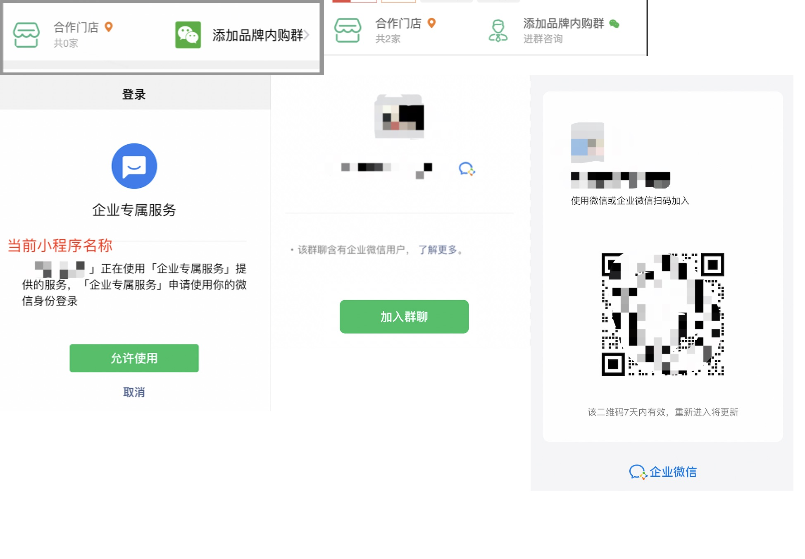

## 简介

- 此处微信开发包含微信公众号开发，公众号H5开发，微信小程序开发，微信支付等

## 小程序开发

- [微信小程序官方Github示例](https://github.com/wechat-miniprogram/miniprogram-demo)
- [申请小程序测试号](https://mp.weixin.qq.com/wxamp/sandbox) 测试账号只能本地开发，不能发布到演示版
- [小程序类目及相关资质](https://developers.weixin.qq.com/miniprogram/product/material/)
    - [商家自营](https://developers.weixin.qq.com/miniprogram/product/material/#%E5%95%86%E5%AE%B6%E8%87%AA%E8%90%A5)
    - [电商平台](https://developers.weixin.qq.com/miniprogram/product/material/#%E7%94%B5%E5%95%86%E5%B9%B3%E5%8F%B0)
    - [餐饮服务](https://developers.weixin.qq.com/miniprogram/product/material/#%E9%A4%90%E9%A5%AE%E6%9C%8D%E5%8A%A1)
    - [深度合成](https://developers.weixin.qq.com/miniprogram/product/material/#%E6%B7%B1%E5%BA%A6%E5%90%88%E6%88%90)
        - AI问答: 可到微信服务市场 - 接口和插件 - 购买深度合成相关API从而进行类目绑定(使用深度合成服务)
        - AI绘画: 同理
        - 小程序深度合成服务在用证明获取指引: https://developers.weixin.qq.com/community/minihome/article/doc/0000ec3fbdc988931cd0d46d66b413

### 小程序限制

#### 认证/审核/权限

- 小程序可直接复用同一主体的公众号认证(无需额外费用)
- 管理员可设置运营者/开发者；运营者可直接发布审核后的版本；开发者可添加体验人员(50人)，开发者可设置域名、发布体验版、提交审核版(但发布线上版则需管理审核)
- 审核
    - 发布小程序提交审核，不通过会通知发布人和管理员
    - 线上版本发布每次均需审核，官方称1-7天完成
        - 实际发现不涉及特殊业务时，快的时候1-2小时即可完成
        - 涉及如资质类如餐饮、红包等，一般2-7天
    - 审核人员工作时间
        - 周末也可提交审核
        - 小程序如若需要登录，需要提供正确的账号密码供审核人员使用
    - 加急机制
        - 最快2小时内完成
        - 加急时间段：企业是9:00-24:00，个人是9:00-21:00
        - 非个人主体一年3次机会，个人一年1次机会。如在审核前撤回申请，机会将不会被消耗
        - 选择了加急审核，但审核单被驳回了。开发者可以在12小时内重新整改并在驳回站内信内的【前往反馈页面】重新提交审核，即可获得相应加急的队列。否则将会直接浪费了一次加急机会

#### 域名限制

- API地址：**必须是https域名(可以是非443端口)**，且需在微信后台 - 开发管理 - 开发设置 - 服务器域名配置中设置(可配置API、ws、文件上传下载、打开网页域名等)
    - **开发环境**可在微信编辑器中设置成不校验此限制(可为ip地址)，体验版则需打开调试模式(在胶囊中设置)
- iframe(web-view)地址
    - 必须https域名，且需要在微信后台配置业务域名。开发环境同上
    - 个人小程序不支持业务域名设置
- 图片网络地址：必须是https域名，且需要在微信后台配置业务域名。开发环境同上
- downloadFile合法域名: 必须https，不验证域名所属权（支持跨域显示）

#### 视频播放限制

- 小程序中如果嵌入了视频播放则小程序必须添加文娱-其他视频相关类目，此类目需要资质文件(对应资质交贵)。参考: https://developers.weixin.qq.com/community/develop/doc/0002e84ce84dd81a6dfc92bdc5b400
- 可通过使用视频插件解决
    - [腾讯视频插件](https://developers.weixin.qq.com/community/develop/doc/000ece3c044210190ef61a4a954c09) 必须将视频上传到腾讯，且有广告(可付费去除)，此插件需要审核貌似很难审核通过
    - 其他收费类视频插件(可不上传视频)

#### 个人小程序限制

- 不支持web-view(企业)
- 无法获取用户手机号(企业认证)

#### 其他

- 调试体验版或者正式版：体验版调试直接打开小程序调试模式；正式版调试需要先打开体验版调试模式，再访问正式版
- 图片
    - (uniapp)需要增加 **`:show-menu-by-longpress="true"`** 此属性才能进行长按二维码图片识别(如是公众号/小程序/联系人二维码均可识别打开，**个人小程序也支持**)
    - **使用background-image属性时**，不支持url设置本地路径图片，需转成base64或使用网络地址(http/https，无需绑定域名)，否则演示和生产版不显示(仅开发版显示，开发版真机调试也不显示)
    - 使用`<image src="/static/robot.png">`(或相对路径) 则无此问题，会自动转成base64
    - 使用image图片比background-image快
- **小程序不支持多环境编译**，对于API地址完全取决于上传到微信平台时代码中的地址(只能为一个，无法获取环境)。因此通过uni-app开发时，需要点击发行才会对应到生产环境API，参考[uni-app.md#XBuilder](/_posts/web/uni-app.md#XBuilder)
- [web-view限制参考下文](#web-view开发)
- 开发版真机调试需手机wifi和API地址处于同一网络

### 审核与运营相关问题

- 运营规范：https://developers.weixin.qq.com/miniprogram/product/
    - 类目不符问题、多级分销经营行为、虚拟支付行为、用户产生内容规范
    - 交易类小程序运营规范：实物电商类小程序运营规范
        - 提供实物商品的在线销售及配送(含同城配送，应该也含用户自提)相关服务的小程序，均需接入平台[订单发货管理功能](https://developers.weixin.qq.com/miniprogram/product/jiaoyilei/fahuoguanligongneng.html)，从而
- 小程序审核时可以自动扫描到pages.json里面所有的页面
- 支付宝小程序
    - 不允许出现授权死循环，即用户拒绝授权时应该允许手动退出授权页面(登录页面)或返回到首页继续使用其他功能。可在用户取消授权后提示用户是否需要返回首页

### web-view开发

- [web-view官方文档](https://developers.weixin.qq.com/miniprogram/dev/component/web-view.html)组件(类似iframe，小程序本身是不能使用iframe标签的)
- web-view网页中支持部分JSSDK接口: 图像、音频、位置等信息，参考官方文档

#### web-view限制

- 限制
    - 域名限制
        - **个人类型的小程序暂不支持设置业务域名(即无法使用web-view)**
        - **打开的域名需要在小程序管理后台设置业务域名**
        - 打开的页面 302(临时重定向) 过去的地址也必须设置过业务域名，web-view嵌入的页面可以包含 iframe，但是 iframe 的地址必须为业务域名，且都需要是https
        - 如果是跳转的公众号文章地址，则此公众号和小程序必须绑定过的(不需要同一主体)；如果是未绑定的公众号文章，这种情况需要跳转可考虑通过绑定的域名进行nginx转发？
    - **web-view 中支持图像、音频、位置等JSSDK接口，但是不支持JSSDK的公众号支付接口**（相当于web-view中支付只能返回到小程序页面进行支付）
    - web-view 不支持推送服务通知(即小程序模板消息)，类似下单等页面需要发送通知则需改写成小程序页面
    - 小程序内嵌 web-view 跟微信内置浏览器是一套环境，即h5中引入JS-SDK即可使用wx对象，且Storage等也不共享
    - 规范：开发者通过微信小程序内嵌网页所提供的服务，必须与微信小程序填写的类目和标签一致
- 样式
    - web-view页面，用户下拉会出现"此网页由xxx提供"(如此说明均为web-view)；可通过css控制减少出现的情况
    - **会自动铺满整个小程序页面**(去除顶部导航栏，导航栏标题会自动变化；底部Tabbar也会覆盖)，**可通过redirectTo到web-view页从而实现操作闭环**（此时小程序导航栏会显示返回主页按钮）
    - navigationStyle: custom 对 web-view 组件无效 (客户端 6.7.2 版本开始)
- 当前小程序跳转第三方小程序，微信会做非生物识别
    - 小程序起始页(非web-view页)，点击按钮进入第三方小程序，会自动(提示框自动跳出来)提示"即将跳转至xxx小程序"需要用户确定(所有按钮点击的小程序跳转均有此确认)
        - 小程序起始页先点击按钮进入web-view(H5)页面，然后在web-view页面通过API直接跳转至第三方小程序，也会自动提示用户进行确认
    - 此时可让H5点击跳转一个中间页，在中间页上显示按钮，让用户手动点击跳转，点击后才会跳出提示确认框
        - 小程序起始页，直接嵌入整个H5页面，此时点击H5页面的按钮无法成功跳转第三方小程序？(也不会自动提示确认)
    - 对于在界面识别二维码跳转到第三方，因为识别二维码图片后，会从底部弹出一个确认框(对图片执行保存操作，还是跳转此二维码对应的小程序)，此时用户点击确认框后不会再出现"即将跳转至xxx小程序"的确认框

#### web-view和小程序通信

- 参考：
    - https://uniapp.dcloud.net.cn/component/web-view.html#postmessage
    - https://juejin.cn/post/6844903919710109703
- 可通过小程序web-view标签的url将小程序参数传递给H5页面，从而进行用户验证等操作
- H5传递消息给小程序需要使用 postMessage。不能直接调用windows.postMessage，而是需要使用微信JS-SDK提供的postMessage函数；如果是uni-app开发，可引入uni.webview库在中间做桥接，从而调用微信的postMessage函数
- 示例(小程序和H5都是基于uni-app开发). 参考：https://uniapp.dcloud.io/component/web-view

```html
<!-- 小程序 -->
<!-- 通过url向h5传递参数 -->
<web-view src="http://192.168.1.10:8080/#/?token=123" @message="onMessage"></web-view>
<script>
    methods: {
        onMessage(data) {
            // {"data": [{"action": "message..."}]}
            console.log(data);
        }
    }
</script>

<!-- 注意：
    1.******如果是h5也是用uni开发，则下文引入uni.webview库容易导致和默认uni对象冲突。******解决：修改下列js文件中的3处uni为uniWebview，再使用uniWebview调用。参考：https://github.com/oldinaction/smweb/blob/master/uni-app/uni.webview.1.5.2.js
    2.jweixin-1.4.0.js和uni.webview.1.5.2.js也支持直接import按需导入
    3.如果此处web-view所在项目非小程序，如uni-app写的H5项目需要通过web-view引入另外一个H5，则不需要引入jweixin，也可实现postMessag(通过window.postMessag)；如果是小程序中使用web-view，则在H5中引入jweixin库后，可直接使用wx.miniProgram.postMessage，不用额外引入uni-webview库
-->
<!-- H5-基于模板引入库，参考：https://uniapp.dcloud.io/collocation/manifest?id=h5-template。并在模板中引入下列js -->
<script type="text/javascript">
    // 判断环境是否为小程序，如果是则需要引入小程序的JS-SDK。其他类型小程序完整判断参考官方文档
    var userAgent = navigator.userAgent;
    if (/miniProgram/i.test(userAgent) && /micromessenger/i.test(userAgent)) {
        // 微信小程序 JS-SDK 如果不需要兼容微信小程序，则无需引用此 JS 文件。
        document.write('<script type="text/javascript" src="https://res.wx.qq.com/open/js/jweixin-1.4.0.js"><\/script>');
    }
</script>
<!-- uni 的 SDK，小程序可无需此库，但是需要使用 wx.miniProgram.postMessage 进行调用 -->
<script type="text/javascript" src="https://js.cdn.aliyun.dcloud.net.cn/dev/uni-app/uni.webview.1.5.2.js"></script>

<!-- H5-使用 -->
<script>
    // 注意:
    // 1.调试H5需要打开小程序编辑器，进入H5页面后右键，编辑器上方会出现一个调试按钮，点击后进入小程序(H5页面会再次刷新)
    // 2.***向小程序传递参数后，小程序端不会立即收到消息，需要在点击返回(到小程序页面)、分享、重定向(原页面被销毁)等情况才会真正发送给小程序***；当点击返回小程序原页面，或通过navigateTo跳转到小程序原始页面(可经过多次点击跳转亦可)，或redirectTo跳转到小程序页面(原页面销毁)也会收到消息
    // uniWebview.postMessag(uniWebview为上文修改过的uni.webview.js)最终是通过调用jweixin#miniProgram.postMessage，最终jweixin库通过调用WeixinJSBridge(由容器提供，如小程序编辑器或微信客户端)实现通信

    // 向小程序传递参数(uniWebview为上文修改过的uni.webview.js)
    uniWebview.postMessage({
        data: {
            action: 'message...'
        }
    });
    // 可直接在H5中跳转到小程序的page页面
    uniWebview.navigateTo({
        url: '/pages/product/list'  
    });
    // 切换到菜单页
    uniWebview.switchTab(...)
    // 重定向
    uniWebview.redirectTo(...)
</script>
```

### 开放能力

- 获取手机号(个人号也可以，注册赠送1000额度，之后收费)
    - 参考：https://developers.weixin.qq.com/miniprogram/dev/framework/open-ability/getPhoneNumber.html
    - `<button @tap="loginByPhone" :open-type="agree ? 'getPhoneNumber' : ''" @getphonenumber="getPhoneNumber" class="cu-btn bg-main lg">微信快捷登录</button>`
    - 在getPhoneNumber方法中可获取到 detail{code,encryptedData,errMsg,iv}字段，传到后台再调用微信接口获取用户手机号; 成功时 errMsg='getPhoneNumber:ok' (如errMsg='getPhoneNumber:fail user deny'表示用户拒绝了手机号获取)
- 获取手机号(实时验证，企业号才能；注册赠送1000额度，之后收费)
    - 参考：https://developers.weixin.qq.com/miniprogram/dev/framework/open-ability/getRealtimePhoneNumber.html
    
```html
<!-- 
    用户点击按钮 - 小程序底部弹框显示获取手机号确认框(类似普通手机号获取) - 用户点击手机号(或管理号码添加手机号，用户点击后就会进行调用扣费)
    -> (如果选择的是微信绑定手机号) - 则直接进入getrealtimephonenumber回调获取到数据(此时并不会收到验证码)
    -> (如果选择的是其他手机号) - 则底部弹框显示成验证码输入界面 - 输入收到的验证码 - 进入getrealtimephonenumber回调获取到数据
    - 将获取到的动态令牌调用后台 - 然后调用phonenumber.getPhoneNumber接口获取实际手机号
-->
<button class="bg-cyan shadow margin-top-lg" open-type="getRealtimePhoneNumber"
	    @getrealtimephonenumber="getrealtimephonenumber">获取手机验证码</button>

<script>
    getrealtimephonenumber(e) {
        console.log(e.detail.code)  // 动态令牌: 1c8e44a371484004da181bada6d0b86deddc962e91c6783aacfd5663583c5123
        console.log(e.detail.errMsg) // 回调信息（成功失败都会返回）: getPhoneNumber:ok
        console.log(e.detail.errno)  // 错误码（失败时返回）
    }
</script>
```
- 小程序消息
    - 小程序模板消息：支持一次性订阅和通知(用户点击订阅一次就通知一次)、多次通知(特殊类型政府结构才有)
    - 如果需要多次通知用户，可使用微信公众号模板消息(2311: 但是此权限微信有意收回，正在内测公众号订阅消息，类似小程序)
    - 参考文章
        - https://blog.csdn.net/weixin_43879445/article/details/124244344
        - https://blog.csdn.net/weixin_43879445/article/details/124196833
        - https://blog.csdn.net/q457201373/article/details/114127844
        - https://juejin.cn/post/7105313104258400269
- 蓝牙
    - 小程序用户隐私协议中设置蓝牙部分
    - 部分手机需要打开定位功能，且确认微信有权限访问蓝牙和定位
    - 小程序蓝牙授权需要确认允许

### 微信小程序短链接生成

- 参考[小程序链接](https://developers.weixin.qq.com/miniprogram/dev/framework/open-ability/url-scheme.html)
- 基于URL Link
  - (可选) 生成普通短链接，访问此短链接的时候，解析出长链接及相关参数
  - 再调用 `https://developers.weixin.qq.com/miniprogram/dev/OpenApiDoc/qrcode-link/url-link/generateUrlLink.html` 接口生成URL Link微信短链接。参考：`weixin-java-miniapp#WxMaLinkServiceImpl.generateUrlLink`
  - 并将用户重定向到此URL Link微信短链接
  - 此时会显示微信官方H5引导页面，点击按钮后，用户会跳转到小程序相应页面
  - 扩展
    - URL Link短链接：如 `https://wxaurl.cn/JlwDztaumga` 如果是非微信环境访问此链接会自动提示打开微信，打开后会自动跳转到小程序；如果是微信环境(微信浏览器)需要人工点击打开小程序按钮，然后弹框提示后点击允许即可跳转到小程序
    - Schema短链接：可将短链接改成 `weixin://dl/business/?t=JlwDztaumga` (参数保持不变)，此时微信环境打开可省略第一步点击按钮，会自动跳出弹框确认，点击允许即可跳转；但是不支持非微信环境打开
- 基于自定义H5静态页面跳转
  - 参考：https://developers.weixin.qq.com/miniprogram/dev/wxcloud/guide/staticstorage/jump-miniprogram.html

### 3D模型嵌入

- [platformize框架](https://github.com/deepkolos/platformize)
    - [集合three.js在小程序中展示3D模型](https://gitcode.com/mirrors/deepkolos/three-platformize)
- [uniapp微信小程序引入threeJs并导入模型](https://blog.csdn.net/hzqzzz/article/details/126428029)
- [原生微信小程序使用three.js 实现外部obj,fbx,gltf模型导入以及模型点击交互弹框](https://juejin.cn/post/7169425712267722766)

## 微信H5开发

- [微信公众号开发测试平台地址](https://mp.weixin.qq.com/debug/cgi-bin/sandbox?t=sandbox/login)
- [接口权限说明](https://developers.weixin.qq.com/doc/offiaccount/Getting_Started/Explanation_of_interface_privileges.html)
- 微信网页开发
    - 通过微信浏览器打开网页时的场景。此时可调用[JS-SDK](#JS-SDK)获取一些硬件能力
    - 通过使用微信JS-SDK，网页开发者可借助微信高效地使用拍照、选图、语音、位置等手机系统的能力，同时可以直接使用微信分享、扫一扫、卡券、支付等微信特有的能力，为微信用户提供更优质的网页体验
- **微信开发者工具可模拟微信内置浏览器进行微信H5页面调试**
    - 默认打开是小程序模式，可通过"微信开发者工具-更换模式-公众号网页调试"进行切换
    - 如果在微信内置浏览器打开，则js中可以拿到`wx`对象(只是一个声明)，但是还需引入JS-SDK(实现)。参考上文JSSDK使用步骤
- **微信公众号测试账号申请和使用**
    - 申请：开发者工具 - 公众平台测试帐号
    - 测试帐号接口权限基本都有；一个微信账号对应一个测试号，和登录的公众号无关
    - 设置登录验证时的重定向地址：体验接口权限表 - 网页授权获取用户基本信息 - 修改(只需填域名)
- 设置与开发 - 公众号设置 - 功能设置(每个月每个域名可改5次)
    - 业务域名：设置业务域名后，在微信内访问该域名下页面时，不会被重新排版。用户在该域名上进行输入时，不出现下图所示的安全提示。可填写3个域名或路径
    - JS安全域名：设置JS接口安全域名后，公众号开发者可在该域名下调用微信开放的JS接口。可填写5个域名或路径
    - 网页授权域名(用户获取用户openid)：用户在网页授权页同意授权给公众号后，微信会将授权数据传给一个回调页面，回调页面需在此域名下，以确保安全可靠。可填写2个域名或路径
        - **订阅号无法开通此接口，服务号必须通过微信认证**
- 微信内置浏览器清缓存最新方法
    - 以前的debugx5.qq.com不能用了
    - 微信 - 我 - 设置 - 通用 - 存储空间 - 缓存 - 取消全选 - 勾选其他 - 清理

### JS-SDK

- [官方Demo(使用微信打开进行测试)](https://www.weixinsxy.com/jssdk/)
- **JS-SDK使用步骤**，[参考](https://developers.weixin.qq.com/doc/offiaccount/OA_Web_Apps/JS-SDK.html#0)
    - 绑定域名(JS接口安全域名)。**注意是域名**(因此测试也需要使用域名)，不需要http协议头(否则报错：invalid url domain)
    - 引入JS文件(必须)
        - 直接引入`jweixin-1.6.0.js`，则可直接使用`wx`(等同于`jWeixin`)对象
        - 或者通过[npm install -S weixin-js-sdk](https://www.npmjs.com/package/weixin-js-sdk)，然后通过`import wx from 'weixin-js-sdk'`或`var wx = require('weixin-js-sdk');`导入。此包为开发人员将官方 js-sdk 发布到 npm，支持 CommonJS，便于 browserify, webpack 等直接使用
    - 通过config接口注入权限验证配置
        - 所有需要使用JS-SDK的页面必须先注入配置信息，否则将无法调用
        - 同一个url仅需调用一次，对于变化url的SPA的web app可在每次url变化时进行调用。即通过Vue Router进行跳转不需要重复注入配置，可在main.js中注入即可
        - 需要配合后台服务进行验签，后台主要需要获取微信公众号access_token和jsapi_ticket，然后将加密串返回到前台进行验证。参考：https://developers.weixin.qq.com/doc/offiaccount/OA_Web_Apps/JS-SDK.html#62
    - 通过ready接口处理成功验证，通过error接口处理失败验证
    - 通过wx对象调用相关接口
    - **关于测试**
        - 如果确定线上环境上述流程可正常进行，测试时可进行省略。先直接访问`http://demo.open.weixin.qq.com/jssdk`可获取所有接口权限，然后访问测试页面，即可进行接口调用。从而减少了测试时域名绑定等步骤
- 使用参考[微信登录](#微信登录)
- 原理
    - jweixin包含对象miniProgram(包含navigateTo、postMessage等功能)，uni-app提供的uni-webview桥接库和此对象功能对应，参考上文[web-view开发](#web-view开发)
    - jweixin库实际是通过调用`WeixinJSBridge`(由容器提供，如小程序编辑器或微信客户端，且需要一定的加载时间)实现相关

### 内网穿透

- 由于微信H5一般涉及到到用户授权信息获取，而此接口需要配置绑定域名用于授权后重定向到此域名上，因此开发环境地址必须是外网备案的域名地址(微信会对域名做可访问性验证)
- http://service.oray.com/question/5570.html

## 公众号开发

- 用户权限
    - 添加运营者(需管理员扫码)：设置与开发 - 人员设置 - 运营者管理 - 邀请人员 - 管理员扫码 - 被邀请人微信中进行同意
    - 添加普通开发(无需管理员扫码): 设置与开发 - 开发者工具 - web开发者工具 - 邀请人员(此人需关注"公众平台安全助手"，且消息免打扰必须处于关闭状态，接受文章推送必须处于打开状态) - 被邀请人微信中进行同意(无需管理员扫码)
- 菜单管理、用户管理、文章管理均通过自定义服务操作，此时需要配置服务器。配置了服务器之后则不能使用微信公众号后台的菜单管理等功能
    - 微信浏览器网页授权(登录)无需绑定此配置(参考下文微信登录)，此配置只是用来管理微信公众号
- 配置服务器地址
    - 配置服务器的URL必须以http://或https://开头，分别支持80端口和443端口
    - EncodingAESKey随机生成一个即可
    - 绑定时会调用后台服务进行验证域名有效性，Java的参考：https://www.cnblogs.com/zhouwen2017/p/10451427.html
    - 验证时提示 **"参数错误，请重新填写"**，可能由于域名被微信屏蔽了。可直接在微信上访问测试，如果屏蔽了会提示"已停止访问该网页"
- 微信公众号开发需要内网穿透
    - 花生壳等
    - https://juejin.cn/post/6922714815567773710

## 企业微信开发

> https://developer.work.weixin.qq.com/document/path/90556

### 客户联系

- 加客户方式
    - 使用`联系我`功能：客户通过扫描二维码、工卡或点击小程序上的按钮，即可获取成员联系方式，主动联系到成员。参考：https://developer.work.weixin.qq.com/document/path/93582
    - 使用`加入群聊`功能：客户通过扫描群二维码、立牌或点击小程序上的按钮，即可获取入群方式，进入企业的客户群。参考下文
    - 企业未认证仅可免费添加100位客户，认证后可免费添加2000位，超过则需要付费购买添加用户额度(如5000位¥500套餐)

**在小程序中加入企业微信群聊**(基于微信小程序插件, 基于uniapp说明)

- 参考: https://developer.work.weixin.qq.com/document/path/93884
- 生成企业微信群链接: 客户与上下游 - 加客户 - 加入群聊(设置)  - 新建加入群聊 - 在小程序中加入群聊
    - 此时企业微信主体和使用的小程序主体无需一致也可使用
    - 还可生成二维码、(二维码)立牌等方式加入群聊，此时生成的二维码永不过期(其他方式生成的二维码7天过期)
- 小程序后台添加插件: 第三方设置 - 插件管理 - 添加插件，搜索`wx4d2deeab3aed6e5a`添加即可（开发者也可操作添加）
- `manifest.json`

```json
// 参考：https://uniapp.dcloud.net.cn/tutorial/mp-weixin-plugin.html
"mp-weixin" : {
    "appid" : "wxa6c12712346f3222",
    "plugins": {
        // 申明插件名称(可自定义): 企业专属服务(如添加企业微信群)
        // 参考: https://developer.work.weixin.qq.com/document/path/93884
        "qywxServicePlugin": {
            "version": "1.0.5",
            "provider": "wx4d2deeab3aed6e5a"
        }
    }
}
```
- `pages.json`在需要使用的页面引入

```json
{
    "path": "pages/index/index",
    "style": {
        "mp-weixin": {
            "usingComponents": {
                // qywxServicePlugin和manifest.json对应，cell为插件内置的组件名称
                // qywx-service-plugin为声明的插件别名，可在页面中使用
                "qywx-service-plugin": "plugin://qywxServicePlugin/cell"
            }
        }
    }
}
```
- `index.vue`页面调用

```html
<!-- 样式较丑 -->
<!-- <qywx-service-plugin
    @startmessage="() => $squni.log('start')"
    @completemessage="data => $squni.log(data)"
    url='https://work.weixin.qq.com/gm/b40ad4301241053ad45722555988eg1b'
    iconUrl="https://example.com/static/weixin.png"
    contactText="添加品牌内购群"
    :contactTextBlod="false"/> -->
<!-- 美化样式 -->
<view class="plugin-container">
    <qywx-service-plugin class="plugin-box" :url='qywxqUrl'/>
    <view>
        <view>
            添加品牌内购群<text class='cuIcon-weixin text-green padding-left-xs'></text>
        </view>
        <view class="text-sm text-gray">
            进群咨询
        </view>
    </view>
</view>

<style>
.plugin-container {
	position: relative;
}
.plugin-box {
	position: absolute;
	opacity: 0;
	width: 100%;
	height: 100%;
}
</style>
```
- 使用步骤
    - 默认的按钮样式比较丑，右侧是使用透明层自定义的样式
    - 点击按钮后 - 会先显示授权微信身份界面(此时还不会调用startmessage事件) - 然后显示第二个加入群聊界面 - 最后再展示一张群聊二维码 - 用户识别后加入
    - 点击按钮后会自动显示加载中的loading状态，有时候可能会加载失败，此时微信会收到一条服务通知:邀请你加好友(邀请加群)



## 微信登录

### 微信浏览器中获取用户信息

- [微信浏览器中获取用户信息](https://developers.weixin.qq.com/doc/offiaccount/OA_Web_Apps/Wechat_webpage_authorization.html)。如微信公众号点击菜单H5连接进入网页时获取用户信息
    - 前提
        - **绑定网页授权域名**(和授权回调地址一致。微信公众号 - 开发 - 接口权限 - 网页服务 - 网页帐号 - 网页授权获取用户基本信息)
            - 230522: 必须绑定网页授权域名(因此开发环境地址必须是外网备案的域名地址，微信会对域名做可访问性验证，花生壳域名是备案了的)，**且限制了只有认证账号才能获取此权限**
            - **无需绑定微信公众号服务器配置**(该配置是用来管理微信公众号的)
            - **一定要是域名，不要加http://等协议头，也不要加子路径**
                - 假设网页运行在/abc目录，此时也要加example.com，而不能是example.com/abc，因此必须是http://example.com/MP_verify_cm2fJ4wmTLQpvkZr.txt来进行验证
                - 业务域名和JS安全域名是否需要加子路径未测试
        - **设置IP白名单**（测试账号无需）
            - 为了防止公众号appid和秘钥泄露，在向微信服务器获取access_token请求时，需要限制开发者服务器所在的外网IP（微信服务器获取的请求者IP）
    - 引导用户访问如`https://open.weixin.qq.com/connect/oauth2/authorize?appid=APPID&redirect_uri=REDIRECT_URI&response_type=code&scope=SCOPE&state=STATE#wechat_redirect`，如让用户打开网站主页，然后再主页加载后自动跳转到此地址。回调地址必须完整，如果动态协议头，可以使用如`window.location.protocol + '//aezo.cn/xxx'`

        ```js
        redirectWechatForCode(appid, redirectUrl, state) {
            // https://developers.weixin.qq.com/doc/offiaccount/OA_Web_Apps/Wechat_webpage_authorization.html
            let path = "https://open.weixin.qq.com/connect/oauth2/authorize?appid="
                    + appid
                    + "&redirect_uri="
                    + encodeURIComponent(redirectUrl)
                    + "&response_type=code&scope=snsapi_userinfo&state=" + state + "#wechat_redirect";
            window.location.href = path
        }
        ```
    - 访问上述连接，会进行用户授权验证，用户同意授权，获取code。此时code通过上述链接配置的回调地址会当做参数带回(还会原封不动的带回state参数)
    - 后台通过code换取openid、网页授权access_token(用户的access_token，有效期为2h；不同于公众号的access_token)、网页授权refresh_token(有效期为30天)。由于此接口调用次数不限制，可需要获取access_token时重新调用微信接口，也可存储下来
        - **由于后台此时需要调用微信接口，因此需要服务器能访问外网，或开放 api.weixin.qq.com 的白名单(此域名可能对应多个IP，且存在变化的问题)，或使用代理访问(程序中进行代理或nginx代理)**
    - 或者刷新access_token
    - 后台再基于网页授权access_token和openid拉取用户信息

## 微信支付

- 支付场景
    - 线下场所
    - 公众号
    - 小程序
    - App
    - PC网站: 需要ICP证书(一个公司只有一个，可以绑定多个域名)
    - 企业微信
- 支付流程
    - Native(网站段扫描二维码支付)
        - 基础参数: 商户号、AppID、秘钥、证书、证书序列化
        - 调用微信下单，传输总金额和费用明细
        - 前端界面显示二维码
        - 客户扫码支付
        - 支付成功，微信回调业务系统(**要求回调链接必须是https**)
- 微信支付费率和结算周期明细：https://kf.qq.com/faq/140225MveaUz1501077rEfqI.html
    - 一般费率为0.60%(千6)，结算周期T+1
    - 费率根据行业不同，在0.20%至1.00%之间。比如物流公司费率为0.30%，但是注册是需要提交一个"物流《道路运输许可证》"
- 普通商户、微信服务商、特约商户区别
    - **普通商户**支持所有形式收款，如果有开发能力建议使用这种商户
    - 服务商可提取特约商户的流水佣金，但是无收款功能
        - 服务商不能给自己（同主体）申请特约商户
        - 服务商只能新建特约商户，而不能绑定已存在的普通商户号或特约商户
    - 特约商户为服务商的下级商户，通过服务商支付费率一般低于0.6%(如0.2%, 0.54%)
        - 特殊商户也能调用普通商户接口(如果直接调用则服务商无法获取佣金): https://developers.weixin.qq.com/community/develop/doc/000ce8ae934a800a071dfa3bb50800
        - 特约商户最多绑定5个AppId
    - 参考
        - https://developers.weixin.qq.com/community/pay/doc/0004c29a09c71068e75a5728d5b800
        - https://developers.weixin.qq.com/community/pay/doc/000a806b86c4c8a7b08af45455bc00?fromCreate=1
- 注册
    - 参考 http://help.nicebox.cn/doc.php?IDDoc=1352
    - 企业注册资料
        - 营业执照：彩色扫描件或数码照片
        - 组织机构代码证：彩色扫描件或数码照片，若已三证合一，则无需提供
        - 对公银行账户：包含开户行省市信息，开户账号
        - 法人身份证：彩色扫描件或数码照片
- 微信支付商户后台
    - 产品中心
	    - 我的产品：查看开通产品，如Native支付
	    - 开发配置: 配置白名单域名
	    - AppID账户管理
            - 需要绑定微信服务号、小程序来获取AppID
- 关于支付宝支付
    - 微信小程序内不允许有支付宝支付（包括不允许通过复制链接到默认浏览器中进行支付）
    - 公众号内嵌H5可引导用户到默认浏览器进行支付宝支付：https://opendocs.alipay.com/support/01rfu4

### 开发

#### 普通商户所需材料

- 进入微信支付商户平台管理后台，根据菜单找到相关参数
- 账户中心 - 商户信息
    - 微信支付商户号：如1642097457
    - 商户类型：如普通商户(常用)、特约商户
- 账户中心 - API安全
    - API证书: 生成时需要管理员手机验证，生成的压缩包(如: 1642097457_20230701_cert.zip)
    - 证书序列号：点击申请API证书 - 管理证书 - 找到证书序列号(如: 5D5A5DF0CAEA798FDACB0728FB9EB12912AB5B43)。或者通过证书文件读取(建议, 参考下文)
    - APIv2密钥
    - APIv3密钥

#### 相关问题

- 提示`v3请求构造异常！`
    - JDK老版本(v1.8.0_161以前)需要修改两个jar包, 参考 https://gitee.com/egzosn/pay-java-parent/issues/I4EXXY 修改Jar参考 https://blog.csdn.net/dafeige8/article/details/76019911
    - ApiV3秘钥错误
- 提示`商户证书序列号有误。`
    - 可通过证书文件获取序列号`openssl x509 -in apiclient_cert.pem -noout -serial`
- 提示`签名错误`
    - 如小程序ID/商户号/证书文件不匹配等

## 微信云托管

- https://cloud.weixin.qq.com/cloudrun


---
