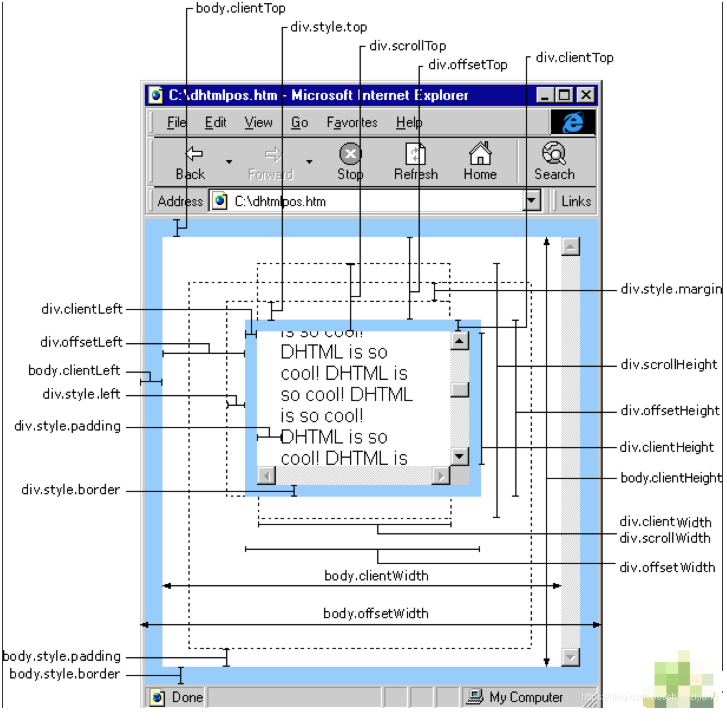

## 简介

- [MDN-JS文档](https://developer.mozilla.org/zh-CN/docs/Web/JavaScript/Reference/Global_Objects)
- [rollup的在线repl查看各种模块写法](https://rollupjs.org/repl/)

## JS语法规范

- CommonJS/AMD/CMD/UMD/ESModule区别
    - [JavaScript模块化说明](https://www.jianshu.com/p/da2ac9ad2960) [^8]
    - 对比图

    | 特性               | ESM (`"type": "module"`)          | CommonJS (package.json默认)       |
    |--------------------|-----------------------------------|----------------------------------|
    | **导入语法**       | `import`                          | `require`                        |
    | **导出语法**       | `export`                          | `exports` / `module.exports`     |
    | **路径解析**       | 必须写扩展名（如 `import './a.js'`） | 可省略扩展名（如 `require('./a')`） |
    | **动态导入**       | 支持 `await import()`             | 不支持（需使用 `async/await` 包装） |
    | **全局变量**       | 无 `__dirname`、`__filename`      | 有 `__dirname`、`__filename`     |
    | **JSON 导入**      | 默认禁止，需配置 `{ "type": "json" }` | 直接 `require('./data.json')` |
    - Node对ESModule的支持
        - Node.js 14.x+：支持 "type": "module"，但有部分限制
        - Node.js 16.x+：ESM 支持更完善（如 --experimental-json-modules 标志不再需要）
        - Node.js 18.x+：推荐版本，ESM 支持完全稳定
    - NodeJS 中 CommonJS 和 ESModule 混用说明：https://zhuanlan.zhihu.com/p/494658959
        - type=module模式下: 一般如果是Vue3 + TS项目，对于少量.js文件只要改后缀为.cjs即可兼容
- **`CommonJS`**
    - 定义的模块分为：module模块标识、exports模块定义、require模块引用。**Node里面的模块系统遵循的是CommonJS规范**
        - `exports` 返回的是模块函数，`module.exports` 返回的是模块对象本身，返回的是一个类。**注意不是export**
        - 在一个node执行一个文件时，会给这个文件内生成一个exports和module对象，而module又有一个exports属性。他们之间的关系如下图，都指向一块{}内存区域。`exports = module.exports = {};`
        - **多次引用同一个js不会导致重复引用，且优先执行最深层js文件中的代码**
    - 案例

        ```js
        // test1.js
        var app = {
            name: 'app',
            version: '1.0.0',
            sayName: function(name) {
                console.log(this.name)
            }
        }
        module.exports = app
        // test2.js
        var func = function() {
            console.log("func")
        }
        exports.func = func // exports = module.exports = {} => module.exports.func = func => {func: func}

        // 使用
        var test1 = require("./test1")
        test1.sayName('smalle') // smalle
        var test2 = require("./test2")
        test2.func() // func

        // 接受参数写法
        // 定义模块
        module.exports = (vm) => {
            // 如接受Vue的vm参数
        }
        // 使用模块. 此处传入参数vm可以为 `const vm = new Vue({})` 返回的
        require('./util/mod.js')(vm)
        ```
- `AMD/CMD`
    - AMD/CMD是CommonJS在浏览器端的解决方案。CommonJS是同步加载（代码在本地，加载时间基本等于硬盘读取时间）。AMD/CMD是异步加载（浏览器必须这么干，代码在服务端）
    - `AMD` 是 RequireJS 在推广过程中对模块定义的规范化产出。使用AMD，需要在html中引入RequireJS库
        - 定义模块 `define(id?, dependencies?, factory)`
        - 加载模块 `require([module], factory)`
    - `CMD` 是 SeaJS 在推广过程中对模块定义的规范化产出
        - 定义模块 `define(function(require, exports, module) {})`
    - AMD是提前执行（RequireJS2.0开始支持延迟执行，不过只是支持写法，实际上还是会提前执行），CMD是延迟执行
- **`UMD`** 叫做通用模块定义规范（Universal Module Definition）
    - 它可以通过运行时或者编译时让同一个代码模块在使用 CommonJs、AMD、全局(window/global) 的项目中运行。导出umd格式，可以支持import、require和script引入
    - UMD实现方式

        ```js
        ((root, factory) => {
            if (typeof exports === 'object' && typeof module === 'object') {
                // CommonJS(Node)
                var $ = requie('jquery');
                module.exports = factory($);
            } else if (typeof define === 'function' && define.amd) {
                // AMD
                define(['jquery'], factory);
            } else if (typeof exports === 'object') {
                var $ = requie('jquery');
                exports["jquery"] = factory($);
            } else {
                // window
                root.testModule = factory(root.jQuery);
            }
        })(this, ($) => {
            'use strict';
            //todo
        });
        ```
- **`ES Module`** [^6]
    - export 和 export default
        - export与export default均可用于导出常量、函数、文件、模块等
        - 在一个文件或模块中，export、import可以有多个，export default仅有一个
        - 通过export方式导出，在导入时要加{ }，export default则不需要
        - export能直接导出变量表达式，export default不行
    - 案例

        ```js
        // es6模块 导出
        export default { age: 1, a: 'hello', foo:function(){} }
        // 导入成功
        import foo from './foo'
        // 导入失败
        import { age } from './foo'


        // es6模块 导出
        export { age: 1, a: 'hello', foo:function(){} }
        // 导入失败
        import foo from './foo'
        // 导入成功
        import { age } from './foo'
        import * as foo from './foo' // foo.age
        ```

## ES6(ES2015)

### import/export 

- ES6特性，[参考文档](https://developer.mozilla.org/zh-CN/docs/Web/JavaScript/Reference/Statements/import)
- 案例

    ```js
    // myexp.js
    // 命名导出(不能写成 export {a: 1})
    export { myFunc1, myFunc2 }
    // 导出只能是const对象
    export const foo = Math.sqrt(2)

    // 默认导出，一个文件只能有一个默认导出
    export default {a: 1}
    export default function() {}
    export default class {}

    // defaultMod可随便取值，对应文件中的默认模块
    import defaultMod, * as allMod from 'myext.js'
    import { myFunc1 as func, myFunc2 } from 'myext'
    // 导出上文foo函数
    import { foo } from 'myext'
    // 导出默认对象的部分属性 a
    import myext from 'myext'
    const { a } = myext
    // 这将运行模块中的全局代码，但实际上不导入任何值
    import 'myext.js'
    var promise = import("module-name")
    ```
- 动态引入案例

```js
/* eslint-disable import/first */
const defaultComponents = 'ivew'
if (defaultComponents === 'ivew') {
  const ViewUI = require('view-design')
  import('view-design/dist/styles/iview.css')
  Vue.use(ViewUI, {
    size: 'small'
  })
}
```
- **多次引用同一个js不会导致重复引用，且优先执行最深层js文件中的代码** [^7]

    ```js
    // t1.js
    console.log("test1");
    // t2.js
    console.log("test2.0");
    import t from "./t1.js"
    console.log("test2.1");
    // t3.js
    console.log("test3.0");
    import t2_1 from "./t2.js"
    import t1 from "./t1.js"
    import t2_2 from "./t2.js"
    console.log("test3.1");

    // 执行t3.js的结果 ==> 多次引用同一个js不会导致重复引用，且优先执行最深层js文件中的代码
    test1
    test2.0
    test2.1
    test3.0
    test3.1
    ```
- export命令规定的是对外的接口，必须与模块内部的变量建立一一对应关系

    ```js
    // 这两种写法导出的全部是1，1只是一个值，不是接口
    export 1;
    var m = 1; export m;

    // 正确的三种写法
    export var m = 1;
    var m = 1; export {m};
    var n = 1; export {n as m};
    ```

### Promise/async/await

- uni-app使用场景参考：[uni-app.md#onLaunch等同步写法](/_posts/mobile/uni-app.md#onLaunch等同步写法)
- [async、await](https://developer.mozilla.org/zh-CN/docs/learn/JavaScript/%E5%BC%82%E6%AD%A5/Async_await)
    - 说明
        - `async`：把它放在函数声明之前，使其成为 async function。**可单独使用，被标识的函数成为异步函数，返回Promise对象**
        - `await`：只能在异步函数（async修饰）里面才起作用。**必须和async联用**
        - **在forEach/map/reduce等函数中不能直接使用await调用其他函数(for和for...of中可以)，尽管在回调函数的参数上加async也不行**，见下列
            - 原理应该是foreach内部封装了while，循环并行执行，而且并行执行数组的所有callback函数，不会等待里面的callback的返回
            - forEach回调函数是异步(并行)执行的，但是必须等所有的回调执行完才会执行forEach后面的代码
        - `return new Promise((resolve, reject) => {...})` 返回一个异步对象，此时await此对象时，不管内部是否为同步，只有当执行resolve函数后，await后面的代码才会执行。且resolve执行完成之后，此对象的函数体仍然会继续往后执行
- async简单使用

    ```js
    // 1.async
    async function hello() { return "Hello" }
    // **等同于**
    async function hello() { return new Promise((resolve, reject) => {resolve("Hello")}) }
    hello() // 返回一个 Promise

    // 2.async
    let hello = async () => { return "Hello" }
    hello().then((data) => console.log(data)).catch(err => console.log(err)) // 或者 hello().then(console.log)

    // 必须在forEach回调函数参数处加async才可正常使用，for和for...of中可直接使用await
    async test() {
        arr.forEach(async (item, index) => {
            await hello()
        })
    } 
    ```
- **async、await、Promise.all**

    ```js
    function timeoutPromise(interval) {
        return new Promise((resolve, reject) => {
            setTimeout(function(){
                resolve("done");
            }, interval);
        });
    };

    // 方式一：耗时9004。简单async、await，下面3个函数要依次等待执行，但是 timeTest1 仍然是一个异步函数(返回了 Promise 对象)
    async function timeTest1() {
        await timeoutPromise(3000);
        await timeoutPromise(3000);
        await timeoutPromise(3000);
    }

    // 方式二：耗时3002。通过将 Promise 对象存储在变量中来同时开始3个timeoutPromise，然后同步等待结果
    async function timeTest2() {
        const timeoutPromise1 = timeoutPromise(3000);
        const timeoutPromise2 = timeoutPromise(3000);
        const timeoutPromise3 = timeoutPromise(3000);

        await timeoutPromise1;
        await timeoutPromise2;
        await timeoutPromise3;
    }

    // **方式三**：耗时3002。Promise.all
    // 返回结果顺序和请求装入顺序一一对应。如可用于如字典翻译等场景，需要等业务数据和字典数据同时返回后进行数据处理
    async function timeTest3() {
        const timeoutPromise1 = timeoutPromise(3000);
        const timeoutPromise2 = timeoutPromise(3000);
        const timeoutPromise3 = timeoutPromise(3000);

        let values = await Promise.all([timeoutPromise1, timeoutPromise2, timeoutPromise3]);
        console.log(values) // ["done", "done", "done"]
    }

    let startTime = Date.now();
    timeTest1().then(() => {
        let finishTime = Date.now();
        let timeTaken = finishTime - startTime;
        alert("Time taken in milliseconds: " + timeTaken);
    })
    ```
- **async、forEach/map不建议联用**

    ```js
    var test = {
        main: () => {
            // 普通for，结果为顺序执行，耗时较长。start-1 -> return-1 -> end-1 -> ... -> over
            test.run()
        },
        main2: () => {
            // 存在异步，耗时较短。start-1 -> 顺序 -> start-10 -> return-1 -> end-1 -> 顺序 -> over
            test.run2()
        },
        main3: () => {
            // 存在异步，耗时较短。start-1 -> 顺序 -> start-10 -> return-1 -> end-1 -> 顺序 -> over
            test.run3()
        },
        run: async () => {
            for (let index = 0; index < 10; index++) {
                console.log('start-' + index)
                await test.timeoutPromise(index * 10).then(data => {
                    console.log('return-' + index)
                })
                console.log('end-' + index)
            }
            console.log('over')
        },
        run2: () => {
            [1, 2, 3, 4, 5, 6, 7, 8, 9, 10].forEach(async (index) => {
                console.log('start-' + index)
                await test.timeoutPromise(index * 10).then(data => {
                    console.log('return-' + index)
                })
                console.log('end-' + index)
            })
            console.log('over')
        },
        run3: async () => {
            // 此处去掉 Promise.all 或者换成 map 结果都一样
            await Promise.all([1, 2, 3, 4, 5, 6, 7, 8, 9, 10].forEach(async (index) => {
                console.log('start-' + index)
                await test.timeoutPromise(index * 10).then(data => {
                    console.log('return-' + index)
                })
                console.log('end-' + index)	
            }))
            console.log('over')
        },
        timeoutPromise: (interval) => {
            return new Promise((resolve, reject) => {
                setTimeout(function(){
                    resolve("done");
                }, interval);
            });
        }
    }
    ```
- axios返回Promise

```js
function res() {
    // 返回Promise
    return this.axios.post("http://localhost/test", {})
            .then(response => {
                const res = response.data
                const status = res.status

                // 返回数据
                return {status, res}
            });
}

function test() {
    res().then(data => {
        // data为上面返回的数据
        console.log(data.status)
        console.log(data.res)
    })
}
```
- **Promise案例**

```js
// ==============================基本用法1
/*
start new Promise...
set timeout to: 0.47801792947767785 seconds.
call resolve()...
还会继续执行...
1: OK
2: OK
31: OK
32: OK
4: OKK undefined
5: OK
------情况2
start new Promise...
set timeout to: 1.8082853973258812 seconds.
call resolve()...
Failed: timeout in 1.8082853973258812 seconds.
*/
let promiseRet = new Promise(function (resolve, reject) {
    console.log('start new Promise...');
    var timeOut = Math.random() * 2;
    console.log('set timeout to: ' + timeOut + ' seconds.');
    setTimeout(function () {
        if (timeOut < 1) {
            console.log('call resolve()...');
            resolve('OK'); // 相当于调用 then 传入函数
            console.log('还会继续执行...')
            // return resolve('OK');
        } else {
            console.log('call reject()...');
            reject('timeout in ' + timeOut + ' seconds.'); // 相当于调用catch传入函数
        }
    }, timeOut * 1000);
});
promiseRet.then(data => {
    console.log('1:', data);
    return data
}).then(async data => { // **此处加async不会影响后面的then**
    await new Promise((resolve, reject) => {
         setTimeout(function () {
            console.log('2:', data);
            resolve()
        }, 1000)
    });
    return data
}).then(function (r0) {
    // 此处不返回 Promise, 后面也可继续 then, 只是拿不到数据
    console.log('31:', r0);
    return new Promise((resolve, reject) => {
        setTimeout(function () {
            console.log('32:', r0);
            resolve(r0 + "K") // resolve只能接收一个参数
        }, 1000)
    });
}).then(function (r1, r2) {
    console.log('4:', r1, r2); // OKK undefined
    return promiseRet
}).then(data => {
    console.log('5:', data); // OK
}).catch(err => {
    console.log('Failed: ' + err);
});
// .catch(() => {}) // 不要有空catch, 否则报错了控制台不会打印, 难以跟踪问题

// ==============================基本用法2
Promise.resolve('foo') // 等价于 new Promise(resolve => resolve('foo'))
Promise.resolve() // 不带参数返回
Promise.reject('error')

// 如何判断一个对象是否为Promise？其实无需判断，全部用Promise.resolve包装一层。参考：https://juejin.cn/post/7103880642605088781
// 可在 Promise.resolve 的前面增加 await 来实现 then 优先执行完，再执行后面的代码
Promise.resolve(valueOrPromiseItDoesntMatter).then((value) => {
    console.log(value)
})

// 如果参数是 Promise 实例，那么Promise.resolve将不做任何修改、原封不动地返回这个实例
// 参数是一个thenable对象()，Promise.resolve方法会将这个对象转为 Promise 对象，然后就立即执行thenable对象的then方法
let thenable = {
  then: function(resolve, reject) {
    resolve(42);
  }
}
Promise.resolve(thenable)

// 需要注意的是，立即resolve的 Promise 对象，是在本轮“事件循环”（event loop）的结束时，而不是在下一轮“事件循环”的开始时
// 下面代码中，setTimeout(fn, 0)在下一轮“事件循环”开始时执行，Promise.resolve()在本轮“事件循环”结束时执行，console.log('one')则是立即执行，因此最先输出
setTimeout(function () {
  console.log('three')
}, 0)
Promise.resolve().then(function () {
  console.log('two')
})
console.log('one')
// one
// two
// three

// ajax模拟
// 111
// 221
// 222
// {count: 1}
let postRequest = () => {
    return new Promise((resolve, reject) => {
        resolve({count: 1})
    })
}
// 为了在浏览器执行添加function关键字，如vue函数中无需
async function fetch (type) {
    if(type == 3) {
        return
    }
    return await postRequest().then(res => {
        console.log(221)
        return res
    }).then(async res => {
        console.log(222)
        if (type == 1) {
            return res
        } else if (type == 2) {

        }
    })
    console.log(333)
}
// 调用
fetch(1).then(res => {
    console.log(res) // {count: 1}
})
console.log(111)
// 扩展说明
// 下面两种情况都不会报错，只是res为undefined
fetch(2).then(res => {
    console.log(res) // undefined
})
fetch(3).then(res => {
    console.log(res) // undefined
})
```

### 扩展运算符(...)

- ES7 有一个提案，将 Rest 解构赋值/扩展运算符(...)引入对象。Babel 转码器已经支持这项功能 [^1]
- Rest 解构赋值
    - 解构赋值必须是最后一个参数，否则会报错 (2)
    - Rest解构赋值的拷贝是浅拷贝。即如果一个键的值是复合类型的值（数组、对象、函数），那么 Rest 解构赋值拷贝的是这个值的引用，而不是这个值的副本 (3)

```js
// (1)
let { x, y, ...z } = { x: 1, y: 2, a: 3, b: 4 }; // 相当于 x=1; y=2; z={a: 3, b: 4}

// (2) Rest解构赋值必须是最后一个参数，否则会报错
let { x, y, ...z } = null; //  运行时错误
let { x, y, ...z } = undefined; //  运行时错误  
let { ...x, y, z } = obj; //  句法错误
let { x, ...y, ...z } = obj; //  句法错误  

// (3) x是 Rest 解构赋值所在的对象，拷贝了对象obj的a属性。a属性引用了一个对象，修改这个对象的值，会影响到 Rest 解构赋值对它的引用。同理修改 x.a.b 也会影响 obj
let obj = { a: { b: 1 } };
let { ...x } = obj;  
obj.a.b = 2;
console.log(x.a.b) // 2
```
- 扩展运算符
    - 等同于 Object.assign (2)
    - 如果用户自定义的属性，放在扩展运算符后面，则扩展运算符内部的同名属性会被覆盖掉 (3)
    - Rest 解构赋值不会拷贝继承自原型对象的属性 (4)
    - 扩展运算符的参数对象之中，如果有取值函数get，这个函数是会执行的 (5)

```js
// (1)
let z = { a: 3, b: 4 };
let n = { ...z };  
console.log(n) // { a: 3, b: 4 }

let emptyObject = { ...null, ...undefined }; // 不报错

// (2) 等同于 Object.assign
// 等同于
let aClone = { ...a };
let aClone = Object.assign({x: 1}, a); // ****** a中的值会覆盖第一个对象的属性值 *****

// 等同于
let ab = { ...a, ...b };
let ab = Object.assign({}, a, b);

// (3)
// 等同于。a对象的x属性和y属性，拷贝到新对象后会被覆盖掉
let aWithOverrides = { ...a, x: 1, y: 2 };  
let aWithOverrides = { ...a, ...{ x: 1, y: 2 } };  
let x = 1, y = 2, aWithOverrides = { ...a, x, y };  
let aWithOverrides = Object.assign({}, a, { x: 1, y: 2 });  

// 等同于。如果把自定义属性放在扩展运算符前面，就变成了设置新对象的默认属性值
let aWithDefaults = { x: 1, y: 2, ...a };  
let aWithDefaults = Object.assign({}, { x: 1, y: 2 }, a);
let aWithDefaults = Object.assign({ x: 1, y: 2 }, a);

// (4) Rest 解构赋值不会拷贝继承自原型对象的属性
let o1 = { a: 1 };
let o2 = { b: 2 };
o2.__proto__ = o1;
let o3 = { ...o2 };
console.log(o3) // { b: 2 }

// (5) 扩展运算符的参数对象之中，如果有取值函数get，这个函数是会执行的
// 并不会抛出错误，因为 x 属性只是被定义，但没执行。当执行 aWithXGetter.x 时抛出错误
let aWithXGetter = { 
    ...a,  
    get x() {
        throw new Error('not thrown yet');  
    }  
};  
// 会抛出错误，因为 x 属性被执行了
let runtimeError = {
    ...a,
    ...{
        get x() {
            throw new Error('thrown now');  
        }  
    }  
};
```

## ES5

### 介绍

- 历史
    - javaScript 前身是 liveScript(Netscape，网景公司), 执行标准 ECMAScript (规定核心语法)
- 关联
    - 前端三大语言：HTML、CSS、JS
    - W3C 推出 DOM 标准：专门操作 HTML 元素，CSS样式，事件的统一标准。（规定比较重要）
    - BOM标准：专门操作浏览器窗口的工具，无标准，由浏览器厂商自行实现
    - 最后Netscape倒闭，工程师成立 Mozilla 基金会，最后发布 FireFox（理念是符合标准）
- **完整的 javaScript 语言由三部分组成**
    - 核心（`ECMAScript`）
    - 文档对象模型（`DOM`，Document Object Model）
    - 浏览器对象模型（`BOM`，Browser Object Model）
- javaScript 特点
    - 纯文本
    - 解释执行（读一行执行一行，后面的覆盖前面的）
        - javaScript运行在javascript解释器中，如浏览器中包含的解释器，或node解释器
        - 浏览器包含排版引擎和解释引擎。根据html标签决定使用什么引擎，`<script>`则找解释引擎
    - 弱类型
    - 基于对象

### 基本知识

- 区分大小写
- 字符串必须用单双引号包裹，语句有无分号效果一样
- `//`单行注释，`/*  */`多行注释（注释也占网页流量，生产环境最好去掉）
- `console.log();` 可在控制台打印相关信息，对程序无影响（`alert();`弹框打印）

    ```js
    // 打印LOGO
    console.info(`%cSqBizPlugin %cV1.0.0 %chttps://www.baidu.com/`,
          "color:#409EFF;font-size: 22px;font-weight:bolder",
          "color:#999;font-size: 12px",
          "color:#333"
    )
    ```
- 利用`debugger;`调试，或者找到相应的源码再打断点
- `var input = prompt("请输入数据");` 用于收集用户输入数据的对话框（类似alert弹框）
- `<script>`脚本中的错误，仅影响当前脚本块中出错位置之后的代码(之前的代码照常执行)；function中的错误，只有调用方法时才触发
- 引入js文件时，`<script>`不支持单标签。必须使用 `<script src=""></script>`
- chrome 的控制台（F12），按 Shift+Enter 可换行
- nodejs 也可直接运行js文件，相当于解释器
- 事件：元素根据鼠标或者键盘的不同操作响应不同的交互行为。html的事件属性，如 ：onclick
- 网页的显示最好在7秒内，`<script>`一般放在body最后，为了使DOM先加载完
- `window`对象：是整个网页的全局作用域对象

#### 变量

- 使用`var`声明变量(一般驼峰)，**使用`const`定义常量** (一般大写)

    ```js
    let a = {a: 1}
    const b = a // 此时指向a的引用，当a被重新赋值时，会拷贝a的数据。类似Copy On Write机制
    b = {b: 1} // 报错：Uncaught TypeError: Assignment to constant variable.
    a.b = 2
    console.log(b) // {a: 1, b: 2}
    a = {}
    console.log(b) // {a: 1, b: 2}
    ```
- js中新同名变量的空间会替换旧变量的空间
- 程序都是在内存中运行的。变量声明-初始化-使用。声明是在内存中开辟一个空间，并起一个名字

#### 数据类型

- **`js是弱类型`** ：变量本身没有类型，只有变量中的值才有类型；一个变量可以反复保存不同类型的数据
- **`js数据类型`** ：包括原始数据类型和引用数据类型
    - 原始数据类型(数据保存在变量本地, 栈中)
        - 分类：number(数字)、string、boolean、null、undefined(未定义)
        - 原始类型大小，number：整数4字节，浮点8字节；string：Unicode每个字符占两字节，UTF-8字母数字占1字节，汉字占3字节
        - number
            - js中一切数字都用number保存，不分整型和浮点型
            - number类型值为不带引号的数字
            - 使用`toFixed(小数位数)`四舍五入解决舍入误差
        - string
            - Unicode是对所有语言文字中的字符编号（计算机只能处理数字，无法处理字符）
            - `字符串.charCodeAt(字符在字符串中的下标)`获取该字符的Unicode国际编码
            - js不严格区分字符串和字符
            - 转义字符，如`\n`
        - undefined
            - 标识变量仅声明过，但从未赋值；变量未赋值时，js默认赋值为undefined。undefined类型的值是"undefined"
    - 引用数据类型(数据保存在堆中)
        - 分类：Object、Function、Number、String、Boolean、Data、Error等
    - 利用 `typeof(X)` 可打印原始数据类型（返回string/number/boolean/object/function/undefined）
    - 使用 `arr instanceof Array` 用于判断一个变量是否为某个对象的实例
- **`js数据类型转换`** : 包括隐式转换(程序自动转换数据类型)和强制转换
    - **`+` 号的隐式转换** ：只要有字符串参与，一切类型都变为字符串(true为"true")；如果没有字符串参与，一切按数字计算(true转成1，false转成0)
    - **`-` 号的隐式转换**：任意数据类型做减法则先转成数值再运算，如果不能自动转成数字，则返回NaN，如果字符串为空则转成0
    - **强制转换** ：X.`toString()`、Number(X)、`parseInt(X)`、`parseFloat(X)`、Boolean(X)
    - 凡是从页面获取的数据都是字符串，必须先转换再计算
    - **js变量为数值类型且值为0时，转成字符串就会变成`''`**。因此`var i = 0; console.log(i == '');`打印结果为`true`
- `Number(X)`、`parseInt(X)` 和 `parseFloat(X)`区别
    - `Number()` 是将数据转成数值型，如果被转的对象还有其他字符则转换不了
    - `parseInt()` 从X字符串的第一个字符开始读取，如果遇到非数字的字符(包括小数点)则停止读取。如果第一个字符不是数字或为空的则返回`NaN`
        - `NaN` (Not a Number) : 是一个不是数字(内容)的数字(类型)；NaN和数字计算返回的还是NaN
        - `Infinity`(无穷大)：也是一个是一个不是数字(内容)的数字(类型)，如 10/0 时
    - `parseFloat()` 
        - 只识别第一个小数点，如果第一个小数点前无字符，则默认加零
        - 如果能将数据转成整数则不转成浮点（如parseFloat(2.0)的结果是2）
    - js字符串转数字与小数点保留：https://juejin.im/post/5cafdf075188251aee3a6071
    - 浮点数运算，参考：https://blog.csdn.net/u013347241/article/details/79210840
        - `console.log(0.1+0.2)` 返回 0.30000000000000004
        - 解决：如使用[bignumber](https://github.com/MikeMcl/bignumber.js)等类库

#### 运算符

- 算术运算符：`+ - * / % ++ --`
- 关系运算符：`> < == >= <= != ===`
    - **类型自动转换**（关系运算中）：字符串参与的比较则是比较每个字符的Unicode大小；空字符串会转为0；任何类型和数字进行比较都会转为数字再比较；布尔参与的会先变成数字
    - 严格相等：`===`（不带类型自动转换的比较，要求类型和值都相等；一般在不知道变量类型且不希望类型转换时使用）
    - `NaN` 和任何数字进行比较总返回 false
    - `isNaN(X)` 实际上是将X和NaN进行==比较。**isNaN采用的是Number(X)的隐式转换**。如果X是数字则返回false，否则返回true。
    - 普通数据先转换为相同数据类型再比较；如果结果可能是undefined则用严格比较；如果判读结果是否是数字，则用isNaN判断
- 逻辑运算：`|| && !`
- 位移：右移`>>` 左移`<<` （eg: 64>>3 实际是 64/(2*2*2)=8; 2<<2 实际是 2*(2*2)=8）
- 赋值运算：`= += -+ *= /= %=` **不建议使用连等赋值**
- 三目运算符：`? :`
- 扩展运算符：`...`
    - 参考[扩展运算符](#扩展运算符(...))，需要ES7或Babel转码
- 非空断言操作符：`!`
    - TypeScript定义的操作符，[参考](http://www.semlinker.com/ts-non-null-assertion-operator/)
    - 可以用于断言操作对象是非 null 和非undefined 类型，具体而言，x! 将从 x 值域中排除 null 和 undefined。使用后可防止编辑器告警
    - 使用如`node.next!.data = value`
- [ES2020、ES2021新加??/?./,/_ 等运算符](https://my.oschina.net/u/3704591/blog/4913157)
    - 可选链操作符：`?.`
        - node v14 才支持，TypeScript 3.7才支持
    - 空值合并运算符：`??`
        - 是一个逻辑操作符，当左侧的操作数为 null 或者 undefined 时，返回右侧操作数，否则返回左侧操作数
        - TypeScript 3.7才支持
    - 逗号运算符：`,`
        - 逗号操作符对它的每个操作数求值（从左到右），并返回最后一个操作数的值。如`expr1, expr2, expr3`会返回expr3的结果
    - 数值分割符：`_`
        - 如`console.log(100_0000_0000_0000) // 输出 100000000000000`

#### 流程语句

- `if`、`switch`、`while`、`for in`、`for of`、`forEach`
- 遍历对象(https://www.cnblogs.com/yuer20180726/p/11377897.html)

```js
// for in
var map = {a: 1, b: 2}
for (let key in map) {}

// Object.keys: 返回一个数组,包括对象自身的(不含继承的)所有可枚举属性(不含Symbol属性)
// Object.values(map)
Object.keys(map).forEach(key => {})

// Object.getOwnPropertyNames: 返回一个数组,包含对象自身的所有属性(不含Symbol属性,但是包括不可枚举属性)
// Vue可能会给对象附加一个__ob__属性，从而会出现此key
Object.getOwnPropertyNames(map).forEach(key => {})

// Reflect.ownKeys: 返回一个数组,包含对象自身的所有属性,不管属性名是Symbol或字符串,也不管是否可枚举
Object.ownKeys(map).forEach(key => {})
```
- 遍历数组

```js
var arr = ['a', 'b', 'c']
// forEach
arr.forEach((val, index) => {})

// for in 拿到的是下标
for(var i in arr) { // i 是下标
    console.log(i + "==>" + arr[i]) // 0==>a ...
}

// for of 拿到的是值
// 可以遍历数组、Map(不能是{}字面量类型)
for (let item of arr) {
    console.log(item)
}
```

### Object

- https://developer.mozilla.org/zh-CN/docs/Web/JavaScript/Reference/Global_Objects/Object
- 案例

```js
Object.keys({name: 'test'}) // ['name']
```
- 类数组对象，参考下文[伪数组](#伪数组)

#### 相关方法

- `Object.assign(target, ...sources)` 将所有属性值从源对象复制到目标对象，并返回目标对象(此时返回值和传入参数target一致，会被改变)
    - `let c = Object.assign({}, a, b)` 将b合并到a，再将a合并到target并返回，且不会改变a和b
    - **只能进行浅拷贝**。假如源对象的属性值是一个指向对象的引用（源对象和目标对象的该属性指向同一个地址，修改会互相影响），它也只拷贝那个引用值
    - **深拷贝解决方法**
        - `let obj2 = JSON.parse(JSON.stringify(obj1))` **存在如下弊端**
            - 对象原型会改变，拷贝后原型都会变成Object
            - 属性值为函数会丢失
            - 时间类型会变成字符串类型
            - 如果对象中存在循环引用的情况也无法正确实现深拷贝
            - JSON.stringify()只能序列化对象的可枚举的自有属性，如obj中的对象是有构造函数生成的，拷贝后会丢失constructor，如函数会丢失
            - 会去掉 undefined 的key (值为 null 的key会保留). JSON.stringify阶段，可以使用`JSON.stringify(testArr, (k, v) => new_value)`解决
            - 其他参考：https://blog.csdn.net/u013565133/article/details/102819929
        - 使用一些深拷贝函数
            - [XEUtils.clone](https://vxetable.cn/xe-utils)：如`target = XEUtils.clone(source, true)` 支持函数复制
- `Object.defineProperty(obj, prop, descriptor)` 增加或修改对象属性。vue 2.x基于此特性实现响应式
- `Object.keys(obj)` 返回对象的所有可枚举属性的字符串数组(属性名)
    - 返回属性的顺序与手动遍历该对象属性时的一致
- `Object.getOwnPropertyNames(obj)` 在给定对象上找到的自身属性对应的字符串数组
    - 包括可枚举和不可枚举的所有属性。其中可枚举属性的顺序同Object.keys返回的顺序，不可枚举属性的顺序未定义
    - 如类数组对象可通过此方法进行遍历
- `Object.create(proto[, propertiesObject])` 使用某对象作为原型__proto__来创建新对象
    - proto 新创建对象的原型对象
- `Object.freeze(obj)` 冻结对象。不能修改对象属性，但是可重新赋值。vue项目对data属性使用此特性可提高性能
- getter、setter、`__defineGetter__`、`__defineSetter__`方法参考下文案例

#### 示例

```js
var arr = ["a", "b", "c"];
console.log(Object.getOwnPropertyNames(arr).sort()); // ["0", "1", "2", "length"]

var obj = {
    0: "1",
    username: "init name",
    "hello": function() {
        return "hello"
    },
    // 在对象初始化时，自定义对象定义getter和setter方法
    // 在对象定义后通过Object的__defineGetter__、__defineSetter__方法来追加定义
    // Date.prototype.__defineSetter__('year', function(y) {this.setFullYear(y)}); 
    get name() {
        // 使用obj.name=test会报错
        return this.username
    },
    set changeName(name) {
        // 使用console.log(obj.changeName)会报错
        this.username = name
    }
};
obj.age = 18;
console.log(Object.getOwnPropertyNames(obj).sort()); // ['0', 'age', 'changeName', 'hello', 'name', 'username']
console.log(obj["0"]); // 1 // 通过obj.0会报错
console.log(obj.name); // get name
obj.changeName = 'change name'
console.log(obj.name); // change name
```

### Array

- https://developer.mozilla.org/zh-CN/docs/Web/JavaScript/Reference/Global_Objects/Array
- http://javascript.ruanyifeng.com/stdlib/array.html

#### 基本使用

- 案例

```js
var arr = [1, 'abc', true]; // 创建了一个数组对象，里面有3个元素
var str = arr[1]; // 取数组的值
arr.length // 获取的是数组的大小（元素的个数）

// 数组的其他创建方式（一般不用，因为不能创建只含有一个数值的数组，而 var arr = [3]; 可以）
var arr1 = new Array(3); // 创建一个数组，其中含有3个元素，其值为undefined，打印时是一个空字符
var arr2 = new Array(1, 'a', true); // 创建3个元素

// 数组去重并排序
let list = Array.from(new Set(['A', 'C', 'B', 'A'])).sort()
```
- **用`[]`标识的都是数组**
- js中的数组有两个不限制
    - 不限制元素个数（可随时增删元素）。js会根据程序需要自动扩容。也可以设置length大小来达到扩容和缩容的效果
    - 不限制元素数据类型（从数组中取数据时，最好强转后再使用）
- 数组是引用类型的对象
    - 原始数据类型(数据保存在变量本地, 栈中)，引用数据类型(数据保存在堆中，栈中的值(如0x4081)保存这个数据的地址，此地址指向实际数据)
    - 原始数据类型只能保存一个值，而现实生活中的对象一般都是由多个属性进行描述的（如一个名字不能真正代表某个人，重名的太多，此时需要加上地址等信息来唯一确定某个人），引用数据类型可保存多个值
    - 凡是存在堆中的都是对象

#### 相关方法

- 修改原数组
    - `pop` 从数组中删除最后一个元素，并返回该元素的值
    - `push` 将一个或多个元素添加到数组的末尾，并返回该数组的新长度。animals.push('chickens', 'cats', 'dogs');
    - `shift` 用于把数组的第一个元素从其中删除，并返回第一个元素的值
    - `unshift` 将一个或多个元素添加到数组的开头，并返回该数组的新长度(该方法修改原有数组)
    - `splice` 基于下标修改某个元素
        - `array.splice(start[, deleteCount[, item1[, item2[, ...]]]])` 通过删除或替换现有元素或者原地添加新的元素来修改数组，并以数组形式返回被修改的内容。此方法会改变原数组
    - `sort` 排序操作，修改的是原数组(返回值也是原数组)。默认排序顺序是根据字符串Unicode码点
- 返回新数组
    - `slice` 返回一个新的浅拷贝数组对象。原始数组不会被改变。`array.slice([begin[, end]])`
        - begin：提取起始处的索引（默认从 0 开始）。如果该参数为负数，则表示从原数组中的倒数第几个元素开始提取，slice(-2) 表示提取原数组中的倒数第二个元素到最后一个元素（包含最后一个元素）
        - end：默认从0开始，但截取的不包含此索引元素。必须大于start，否则返回[]，省略则表示到数组末尾
    - `map` 映射操作。对原数组每个元素进行处理，并回传新的数组
    - `filter` 过滤操作。筛选符合条件的所有元素，若为true则返回组成新数组
    - `reduce` 归并操作。总共两个参数，第一个是参数，可以理解为累加器，遍历数组累加回传的返回值，第二个是初始元素。如果没有提供初始元素，则将使用数组中的第一个元素
        - `array.reduce(callback(accumulator, currentValue[, index[, array]])[, initialValue])`，接受参数如下
            - Accumulator (acc) (累计器)
            - Current Value (cur) (当前值)
            - Current Index (idx) (当前索引)
            - Source Array (src) (源数组)
        - **`reduce((返回对象, 当前对象) => { retrun 返回对象 }, 返回对象默认值)`** 可将`List<Map>`转`Map`
- 其他方法
    - `some` 测试数组中是否至少有一个元素满足条件(传入的测试函数)
        - `[3, 4, 1].some(x => x > 2)` 返回true
    - `flat(Infinity)` 展开所有层级

#### 示例

```js
// 发明家：包含名、姓、出生日期以及死亡日期
const inventors = [
    { first: 'Albert', last: 'Einstein', year: 1879, passed: 1955 },
    ......
    { first: 'Hanna', last: 'Hammarström', year: 1829, passed: 1909 }
];
const people = ['Beck, Glenn', ...... , 'Blake, William'];

// 以数组形式，列出其名与姓 ['Albert Einstein', 'Hanna Hammarström', ...]；或返回list<map>: arr.map(o => {return {...}})
const fullnames = inventors.map(x => `${x.first} ${x.last}`)
// 筛选出生于16世纪的发明家
const fifteenObj = inventors.filter(x => (x.year >= 1500 && x.year < 1600))
// 计算所有的发明家加起来一共活了几岁。**reduce((返回对象, 当前对象) => { retrun 返回对象 }, 返回对象默认值)** 可将List<Map>转Map
const totalyears = inventors.reduce((total, x) => { return total + (x.passed - x.year) }, 0)
// 根据其出生日期，并从大到小排序
const birthdate = inventors.sort((x, y) => (y.year - x.year))

// === 语法
var newArray = arr.filter(callback(element[, index[, array]])[, thisArg])
var new_array = arr.map(function callback(currentValue[, index[, array]]) {
    // Return element for new_array 
}[, thisArg])

// === 其他
console.log([1, 2, 3, 4, 5].some((element) => element % 2 === 0)); // true

// splice
let arr = [1, 2, 3]
arr.splice(1) // [2, 3], arr=[1]. 从下标为1开始，移除所有元素。并返回删除的元素
arr.splice(-1) // [3], arr=[1, 2]. 从倒数第一位开始，移除所有元素(相当于移除最后一个元素)
arr.splice(1, 2) // 从第2个元素开始，移除两个元素(2和3)
arr.splice(0, 1, 'fir'); // [1], arr=['fir', 2, 3]. 替换第一个元素。并返回移除的元素
arr.splice(1, 0, 'sec'); // [], arr=[1, 'sec', 2, 3]. 在数组的第二个元素位置插入元素'sec'(原来的第二个元素还在)

// 数组去重
Array.from(new Set(['1', '2', '1'])); // ['1', '2']

// 展开所有层级: 空项会被移除, 非数组元素不处理
// flat(1)：（默认）仅展开一层嵌套
const mixedArr = [1, {a: 2}, [3, [4, , 6]]];
console.log(mixedArr.flat(Infinity)); // [1, {a: 2}, 3, 4, 6]
```

### Function

#### 基本

- 基本语法

```js
function 函数名(参数列表) {
    // ...
    return 返回值; // 函数可以不需要返回值
}
```
- 全局函数：ECMAScript定义了标准，由各浏览器实现的函数
    - `encodeURIComponent()` 对统一资源标识符中的部分单字节再次进行编码（也可对汉字进行编码，建议使用）
    - `decodeURIComponent()` 解码
        - `encodeURI()` 对统一资源标识符进行编码，将url中的非法字符转换为单字节字符(编码，utf-8格式)
        - `decodeURI()` 将encodeURI转换后的字符串转换为原文(解码)
        - 如果在URL中再次出现保留字则是非法，如 `/ ? $ : `等，在传输过程中会出错，使用encodeURI无法进行单字节编码，需要使用encodeURIComponent进行编码
    - `eval()` 执行纯字符串格式的代码(可以将服务器传回来的数据转成对象)

#### call/apply/bind

- call、apply、bind 都是为了改变某个函数运行时的上下文(context)而存在的，换句话说，就是为了改变函数体内部 this 的指向 [^2]
- call、apply、bind 参数
    - 三者第一个参数都是this要指向的对象，也就是想指定的上下
    - 三者都可以利用后续参数传参，call从第二个参数开始对应被调用函数参数，apply是通过数组传递被调用函数参数
- call、apply、bind 调用方式
    - call、apply 是立即调用
    - bind 是返回对应函数，便于稍后调用
- 示例

    ```js
    // 1.call、apply、bind 对比
    var obj = {name: 'smalle'}

    var foo = {
        name: 'foo',
        get: function(count, count2) {
            return this.name + '-' + count + '-' + count2; 
        },
        // 由于ES6箭头函数不会创建新的上下文，所以this指的是父语境(此时是Window，不是foo?)
        get2: count => {
            return this.name + '-' + count;
        },
        get3: function(count) {
            return this.name + '-' + count + '-' + foo.name + '-' + foo.get.call(this, 0, 1);
        }
    }
    
    console.log(foo.get.call(obj, 1, 2));   // smalle-1-2
    console.log(foo.get.apply(obj, [2]));   // smalle-2
    console.log(foo.get.bind(obj, 3)());    // smalle-3 也可写成 let func = foo.get.bind(obj); console.log(func(3));
    console.log(foo.get2.call(obj, 4));     // -4 由于ES6箭头函数不会创建新的上下文，所以this指的是父语境(此时是Window，不是foo?)
    console.log(foo.get3.call(obj, 5));     // smalle-4-foo-smalle-0-1

    // 2.自定义console.log方法. 一般不能写成 `log: () => {}`
    function log() {
        // arguments参数是个伪数组，通过 Array.prototype.slice.call 转化为标准数组(才可以使用unshift等方法)
        // ...([].slice.call(arguments, 2)) 传递给另外一个函数
        var args = Array.prototype.slice.call(arguments)
        args.unshift('[aezo] ')
        
        console.log.apply(console, args)
    }
    log("hello world") // [aezo] hello world
    ```

#### 函数当做类使用

- `vue/src/core/instance/index.js`

```js
function Vue (options) {
  if (process.env.NODE_ENV !== 'production' &&
    !(this instanceof Vue)
  ) {
    warn('Vue is a constructor and should be called with the `new` keyword')
  }
  // initMixin中将_init方法附加到Vue原型上的
  this._init(options)
}

// 也可写成
/*
Vue.prototype._init = function (options) {
    let vm = this
    // ...
}
*/
initMixin(Vue)
stateMixin(Vue)
eventsMixin(Vue)
lifecycleMixin(Vue)
renderMixin(Vue)

export default Vue
```
- 使用

```js
new Vue({})
```

#### 内置函数

- `setInterval` 周期执行函数，直到 clearInterval 被调用或窗口被关闭

```js
let int = setInterval(() => {
    if (this.flag) {
        console.log(this.flag)
        window.clearInterval(int)
    }
}, 50)
```

### 伪数组

- 又称类数组对象，特点 [^2]
    - 伪数组是一个 Object，而真实的数组是一个 Array
    - 具有length属性
    - 按索引方式存储数据
    - 不是真正的Array，所以无法使用 Array 的方法。如不具有数组的push()、pop()等方法
- 场景的伪数组
    - 函数内部的 arguments
    - DOM 对象列表，比如通过 document.getElementsByTagName 等得到的列表
    - jQuery 对象，比如 $("div") 
- 将伪数组转换成真正的数组
    
    ```js
    // 此处仅列举两种方法
    arr = [].slice.call(objs)
    arr = Array.prototype.slice.call(objs)
    ```
- 示例

    ```js
    // 得到一个伪数组，原型为 HTMLCollection
    var tables = document.getElementsByTagName('table')
    // 将伪数组转换成真正的数组
    var tableArr = Array.prototype.slice.call(tables)

    // 构造一个伪数组
    var obj = {
        "0": "abc",
        1: 123,
        "length": 2,
        "push": Array.prototype.push,
        "splice": Array.prototype.splice
    }
    // 这不是伪数组，无length属性
    var not = {
        "name": "test"
    }
    obj.push('hello') // 3
    ```

### Proxy

- 参考: https://developer.mozilla.org/zh-CN/docs/Web/JavaScript/Reference/Global_Objects/Proxy

```js
// 语法
let proxy = new Proxy(target, handler);

// 案例
let test = {
    name: "smalle"
};
test = new Proxy(test, {
    // handler对象还有其他属性如：set、apply、construct(new操作符的捕捉器)等
    get(target, key) {
        console.log('获取了getter属性'); // 获取了getter属性
        return target[key];
    }
});
console.log(test.name); // smalle
```

### Storage/Cookies

- `localStorage` 没有时间限制的持久的数据存储，只要你不主动删除可以想存多久存多久，最大存储5M数据
- `sessionStorage` 针对一个 session 的数据存储，这些数据只有在同一个会话中的页面才能访问，当会话结束后数据也随之销毁（例如你在网页上存储一些数据后关闭网页再重新打开，存储的数据就没有了）
- `cookie` 只有4kb容量

### Windows对象

- 获取子窗口的window对象
    - `window.frames['子窗口内联框架id值'].contentWindow`
    - `window.frames['子窗口内联框架name值']`
    - `window.frames[子窗口内联框架索引]`

### 执行环境与作用域

#### 执行环境

- 执行环境的特点 [^5]
    - 同步执行，单线程
    - 唯一的全局执行环境，局部执行环境个数没有限制
    - 每个函数调用，包括自身函数的多次调用，js都会创建一个新的局部执行环境
    - 每个执行环境都有一个与之关联的`变量对象`，环境中定义的所以有变量和函数都保存在这个对象中
- js中有三种执行环境
    - 全局执行环境
        - 在浏览器中，全局环境就是window对象，所以所有全局属性和函数都是作为window对象的属性和方法创建
    - 函数执行环境
    - Eval执行环境，参考[下文eval](#eval)

#### 作用域

- 作用域：是指变量的生命周期（一个变量在哪些范围内保持一定值） [^4]
- 作用域相关知识点
    - 全局作用域
        - 生命周期将存在于整个程序之内，能被程序中任何函数或者方法访问，在 JavaScript 内默认是可以被修改的
        - 显式声明：带有关键字 `var` 的声明(基于let、const对比描述，具体见下文)
        - **隐式声明**：不带有声明关键字的变量，JS 会默认帮你声明一个全局变量
    - 函数作用域
        - **立即执行函数**：`(function() { //... })()` 能够自动执行，且里面包裹的内容，能够很好地消除全局变量的影响
    - 块级作用域
        - 任何一对花括号（`{}`）中的语句集都属于一个块，在这之中定义的所有变量在代码块外都是不可见的，称之为块级作用域
        - JS在 ES6 之前，是没有块级作用域的概念的
        - ES6 使用 let 和 const 关键字代替 var，从而实现块级作用域。创建块级作用域的条件是必须有一个 `{}` 包裹
    - 词法作用域
        - 当要使用声明的变量时，JS引擎总会从最近的一个域，向外层域查找的方式即为此法作用域
        - 作用域嵌套：有词法作用域一样的特性，查找变量时，总是寻找最近的作用域（基于作用域链查找）
        - 作用域链：当代码在一个环境中执行时，会创建`变量对象`(参考执行环境)的一个作用域链。这个作用域链由执行环境的`变量对象`组成，从前到后依次为最近到最远作用域，因此最后一个永远是全局作用域
    - **动态作用域**
        - 动态作用域是基于调用栈的，而不是代码中的作用域嵌套(词法作用域)
        - 词法作用域是函数的作用域在函数定义的时候决定的，而动态作用域是在函数调用的时候决定的
        - JavaScript 除了 this 之外，其他都是根据词法作用域查找
        - **上下文和作用域**
            - 每个函数的调用都有与之相关的作用域和上下文。作用域是基于函数，而上下文时基于变量对象
            - [call/apply/bind](#call/apply/bind) 都是为了改变某个函数运行时的上下文(context)而存在的，换句话说，就是为了改变函数体内部 this 的指向
            - 参考下文案例
- 案例

```js
// ============ 全局作用域
// 1.全局变量会挂载到 window 对象上
var testValue = 123;
var testFunc = function () { console.log('just test') };
console.log(window.testFunc) // ƒ () { console.log('just test') }

// 2.隐式声明
function foo(value) {
    result = value + 1; // 没有用 var 修饰
    return result;
};
foo(123);
console.log(window.result); // 124

// ============ 块级作用域
// 1.使用 let 和 const 关键字代替 var，从而实现块级作用域
for(var i = 0; i < 5; i++) {}
console.log(i) // 5 ==> 说明此时没有块级作用域

for(let i = 0; i < 5; i++) {}
console.log(i) // 报错：ReferenceError: i is not defined

// 2.**常见考题**
for(var i = 0; i < 5; i++) {
  setTimeout(function() {
    console.log(i); // 5 5 5 5 5 ==> 这里的 i 是在全局作用域里面的，只存在 1 个值，等到回调函数执行时，用词法作用域捕获的 i 就只能是 5
  }, 200);
};
for(let i = 0; i < 5; i++) {
    setTimeout(function() {
      console.log(i); // 0 1 2 3 4 ==> 当然还可以使用函数包括setTimeout实现
    }, 200);
};

// ============ **上下文和作用域**
// 1.当调用一个函数，通过new操作符创建一个对象的实例，this指向新创建的实例
function test() {
    console.log(this);
}
test(); // Window {...}
new test(); // test {}

// 2.作用域和每次函数调用时变量的访问有关系，每次调用都是独立的；上下文总是关键字this的值，是调用当前可执行代码的对象的引用
var object = {
    test: function() {
        console.log(this === object);
    }
}
object.test(); // true
```

### 零散知识

#### eval和Function

- [eval函数](https://developer.mozilla.org/zh-CN/docs/Web/JavaScript/Reference/Global_Objects/eval)
- **eval函数存在漏洞，已不建议使用，可参考上述连接中的Function代替方案**
- **作用域**
    - 直接的调用 eval，作用域为局部作用域中
    - 间接调用 eval(比如通过引用)，作用域是全局
    - 严格模式下的eval的变量仅存在于eval内部，不外泄
- **eval内代码可以读取和使用所在作用域的变量，eval中声明的变量也可以在当前作用域中存在，eval以字符串中最后一个js语句的返回值作为最终返回**
- eval和new Function均可使用debugger调试，会进入到一个类似VM1308的代码块中。eslint默认对二者均报错
- 使用如下

    ````js
    // eval 使用
    function test() {
        var x = 2, y = 4;
        console.log(eval('debugger; x + y')); // 直接调用，使用本地作用域，结果是 6
        
        // 如果值为函数则必须在外面加括号，如 (function x() {console.log(this)})，否则返回undefined
        var geval = eval; // 通过引用间接调用，等价于在全局作用域调用
        console.log(geval('x + y')); // 间接调用，使用全局作用域，throws ReferenceError 因为`x`未定义
        console.log(window.eval('x + y')) // 间接调用
        (0, eval)('x + y'); // 另一个间接调用的例子
    ​}

    // Function使用1
    let func = new Function('a', 'b', 'debugger; return a+b') // 最后一个为函数体，前面的参数为函数的形参
    func(1, 2) // 3
    // Function使用2。下面示例打印 4
    console.log(
        // "return (function(a){return a(3)})" 中的 a 为 Function 第三个括号传递的参数(一个处理函数)
        Function('"use strict"; return (function(a){return a(3)})')()(
            function(index){ return [1, 2, 3, 4, 5][index % 5] }
        )
    );
    ```

#### 模板字符串

- [模板字符串](https://developer.mozilla.org/zh-CN/docs/Web/JavaScript/Reference/template_strings)
- 模板字面量，在ES2015(ES6)规范的先前版本中被称为模板字符串。ES6用反引号进行标识
- 使用

    ```js
    // 使用模板字符串
    var name = 'smalle'
    console.log(`hello ${name}`) // hello smalle

    let str = `hello${obj.name} ${t()} , ${7 + 9} , ${'ok'},
    这是个换行
    `;

    // 自定义模板字符串解析方法，解析 {{xxx}} 格式
    String.prototype.render = function (context) {
        return this.replace(/\{\{([^}]+)\}\}/g, (match, key) => (context[key] || match));
    };
    "hi, {{name}}, {{{{name}}}}".render({name: 'smalle', smalle: 'test'}) // hi, smalle, {{{{name}}}}
    ```

### 易错点

```js
// 1.数据类型
[1].indexOf(1) // 0
[1].indexOf("1") // -1

// 2.空值判断
let flag = null // undefined、null、''、0、false 在直接if判断时都认为是false，但是 []、{} 认为是 true
if(flag) console.log(1) // 无输出
if('') console.log(1) // 无输出 (false)
if(0) console.log(1) // 无输出 (false)
if(!0) console.log(1) // 1 (true)
if([]) console.log(1) // 1 (true)
if({}) console.log(1) // 1 (true)
if(0 == null) console.log(1) // 无输出 (false)
if(undefined == null) console.log(1) // 1 (true)
if(undefined === null) console.log(1) // 无输出 (false)

// JSON
JSON.stringify(true) // 'true'
JSON.stringify(1) // '1'
JSON.parse('true') // true
JSON.parse('1.0') // 1
```

## DOM

### 操作样式

- 修改样式的方法

```js
// 单独修改
var divObj = document.getElementById("divTest");
divObj.style.backgroundColor = "blue";
divObj.style.border = "solid 1px red";

// 批量修改(会合并到原样式)
document.getElementById("app").style.cssText = 'font-size:18px;color:blue;'

// 使用style标签
const style = document.createElement('style')
style.innerText = cssText
// style.id = 'my-style'
document.head.appendChild(style)
// 移除
style.remove()
// 或使用ID移除
document.getElementById('my-style').remove()
```

### 动态创建iframe(异步加载，加快主站响应速度)

```js
function createIframe() {
    var i = document.createElement("iframe");
    i.id="iframe"
    i.src = "http://localhost/test";
    i.frameborder = "0";
    i.width = "100%";
    i.height = "100%";
    i.onload=myOnloadFunc;
    document.getElementById("iframeDiv").appendChild(i);
};

if (window.addEventListener) window.addEventListener("load", createIframe, false);
else if (window.attachEvent) window.attachEvent("onload", createIframe);
else window.onload = createIframe;
```

### onblur与onclick事件冲突(弹框穿透) 

- 场景：百度的搜索框，输入检索字后下拉会有对应的列表出来，要求点击搜索框外的区域下拉列表消失，点击下拉列表的某个记录后跳转。实现方式为 input 的onchange+onblur 与列表的onclik 。这样就会存在一个问题，当点击列表时 input 的onblur就先发挥作用，导致列表的onclik无效（js的单线程限制了只允许一个事件触发，onblur的优先性高于onclick） [^3]
- 解决办法：用`onMouseDown`代替`onClick`(onmousedown需要根据event区分鼠标左右键点击)
- 说明
    - onClick:是鼠标点击弹起后触发的的事件，即一次完整的鼠标点击过程。
    - onMouseDown:是指鼠标按下的瞬间触发的。
    - onMouseUp：在松开鼠标的时候触发，只要弹起的时候在你所要执行的区域上，就会触发。
    - 即onClick的作用=onMouseDown（按下触发）+onMouseUp（弹起触发）

### clientHeight/offsetHeight/scrollHeight区别



- 整个窗口大小
    - window.innerHeight 是DOM视口的大小，包括滚动条
        - 如果页面被嵌入到iframe中，则拿到的高度是0
    - window.outerHeight 是整个浏览器窗口的大小，包括窗口标题、工具栏、状态栏等
- innerHeight问题
    - 在不支持window.innerHeight的浏览器中，可以读取documentElement和body的高度，它们的大小和window.innerHeight大小非常接近
    - 如果页面被嵌入到iframe中，上面的都拿不到高度，可使用`window.screen.heigh`拿到高度
    - `const height = window.innerHeight || document.documentElement.clientHeight || document.body.clientHeight || window.screen.heigh;`
- [滚动高度](https://blog.csdn.net/shibazijiang/article/details/103894498)
    - clientHeight 内部可视区域大小，不含滚动条的高度
    - offsetHeight 整个可视区域大小，包括border和scrollbar在内
    - scrollHeight 元素内容的高度，包括溢出部分
    - scrollTop 元素内容向上滚动了多少像素，如果没有滚动则为0
    - 对应的横向属性为: clientWidth, offsetWidth, scrollWidth, scrollLeft
    - 判断滚动条是否见底: scrollHeight === clientHeight + scrollTop
- https://www.jianshu.com/p/e874ae203a60

## 兼容性

- `replaceAll` Chrome v85才支持
    
    ```js
    // 替换方案
    'abab'.replace(/[a]/g, '')   //bb
    'xaabbyaabbz'.replace(/(aabb)/g, '') //xyz
    '   aaa bbb'.replace(/\s/g, '') //aaabbb
    ```

## 常用函数

```js
/**
 * 日期格式化
 * 
 * 月(M)、日(d)、小时(h)、分(m)、秒(s)、季度(q) 可以用 1-2 个占位符，
 * 年(y)可以用 1-4 个占位符，毫秒(S)只能用 1 个占位符(是 1-3 位的数字)
 * 例子：
 * (new Date()).Format("yyyy-MM-dd h:m:s.S") ==> 2006-07-02 8:9:4.423
 * (new Date()).Format("yyyy-M-d hh:mm:ss") ==> 2006-7-2 08:09:04.18
 * (new Date()).Format("yyyy年MM月dd日 hh:mm") ==> 2006年7月2日 08:09
 * (new Date()).Format("hh:mm") ==> 08:09
 */
export const dateFormat = (date, fmt) => {
	let o = {
		"M+": date.getMonth() + 1, // 月份
		"d+": date.getDate(), // 日
		"h+": date.getHours(), // 小时
		"m+": date.getMinutes(), // 分
		"s+": date.getSeconds(), // 秒
		"q+": Math.floor((date.getMonth() + 3) / 3), // 季度
		"S": date.getMilliseconds() // 毫秒
	};
	if (/(y+)/.test(fmt))
		fmt = fmt.replace(RegExp.$1, (date.getFullYear() + "").substr(4 - RegExp.$1.length));
	for (let k in o)
		if (new RegExp("(" + k + ")").test(fmt)) fmt = fmt.replace(RegExp.$1, (RegExp.$1.length == 1) ? (o[k]) : ((
			"00" + o[k]).substr(("" + o[k]).length)));
	return fmt;
}

/**
 * 获取url参数. uni-app可参考squni.js中的 getCurQuery
 */
export const getUrlQuery = (name, href) => {
	// return (
	// 	decodeURIComponent(
	// 		(new RegExp('[?|&]' + name + '=' + '([^&;]+?)(&|#|;|$)').exec(href) || [, ''])[1].replace(
	// 			/\+/g, '%20')
	// 	) || null
	// )
	href = href || window.location.href
	let urlStr = href.split('?')[1]
	const urlSearchParams = new URLSearchParams(urlStr)
	const params = Object.fromEntries(urlSearchParams.entries())
	Object.keys(params).forEach(key => params[key] = decodeURIComponent(params[key]))
	return name ? params[name] : params
}

/**
 * Map转成url参数: k1=v1&k2=v2
 */
export const objToUrlQuery = (obj, ignoreFields) => {
	if (!ignoreFields) {
		ignoreFields = []
	}
    return Object.keys(obj)
        .filter(key => obj[key] != null && ignoreFields.indexOf(key) === -1)
        .map(key => key + '=' + encodeURIComponent(obj[key])).join('&')
}

// dc91b3f3-cb2c-401a-85a6-7da3a2faf36f
function uuid () {
    return ('xxxxxxxx-xxxx-4xxx-yxxx-xxxxxxxxxxxx'.replace(/[xy]/g, function (t) {
        let e = 16 * Math.random() | 0
        return (t === 'x' ? e : 3 & e | 8).toString(16)
    }))
    // .replaceAll('-', '')
}
```

## 常见业务

- js实现简单验证码
    - https://www.cnblogs.com/xielong/p/8191957.html
    - https://www.cnblogs.com/zxwDont/p/11276858.html
- js验证密码复杂度
    - https://www.cnblogs.com/goding/p/10224084.html

## 《前端小课》

- `《前端小课》` (2018-07)

<embed width="1000" height="800" src="/data/pdf/前端小课2018.pdf" internalinstanceid="7">


---

参考文章

[^1]: https://blog.csdn.net/qq_30100043/article/details/53424750 (javascript对象的扩展运算符)
[^2]: https://www.cnblogs.com/zt123123/p/8287725.html
[^3]: https://blog.csdn.net/yelangshisan/article/details/78936220
[^4]: https://juejin.cn/post/6844903584891420679
[^5]: https://juejin.cn/post/6844904065776910344
[^6]: https://blog.csdn.net/qq_31967569/article/details/82461499
[^7]: https://blog.csdn.net/snans/article/details/123808010
[^8]: https://blog.csdn.net/freeking101/article/details/116761828
